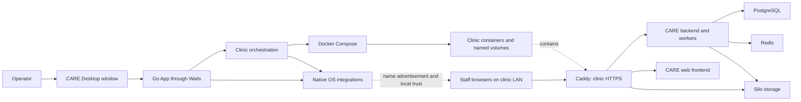
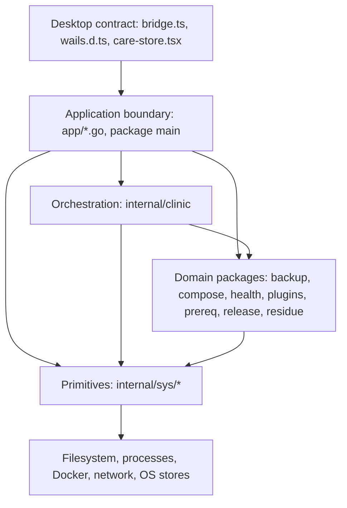

# Architecture and design choices

[Documentation index](README.md)

## The problem the backend solves

CARE Desktop runs a clinic's CARE installation on one computer without requiring the operator to administer a server. Staff use a browser to access the clinic on the local network. The desktop application is the installation and operations console, not the medical record server.

The first-run Server/Client choice is persisted, not an ordinary role switch.
Server mode owns the stack and advertises the clinic's `.local` name. Client
mode connects to the address shown on the server, installs certificate trust
through native OS approval, verifies HTTPS, and opens the clinical browser
application. It does not provision Docker/Git or advertise mDNS. See
[native bootstrap and its trust-on-first-use limitation](native-integrations.md#native-client-setup-and-trust-on-first-use).
Multiple separately named servers are valid; this is not a network-wide
single-clinic enforcement system.

The application coordinates existing tools rather than replacing them:

| Responsibility | Implementation |
| --- | --- |
| Native window and Go-to-JavaScript calls | Wails. |
| Clinic services and persistent volumes | Docker Compose. |
| Clinical API and background work | The separately built CARE backend and workers. |
| Clinical browser interface | The separately built CARE frontend. |
| Relational data | PostgreSQL. |
| Cache and task broker | Redis. |
| Uploaded files | Silo, retaining the Compose service name `minio`. |
| HTTPS and reverse proxy | Caddy with the Coraza WAF module. |
| Local name discovery | An mDNS advertiser in the server desktop process. |
| Scheduled backups | A shell program in the backup container, not a Go timer. |

Initial provisioning and image construction need external downloads. An already prepared clinic can operate locally, but missing images, uncached build dependencies, and optional services such as outbound email can still require internet access.

## System boundary

The browser used by a member of staff does not call `window.go.main.App`. That object exists in the desktop webview. The clinic's HTTP API and the local desktop bridge are different interfaces with different purposes.

## Layers and dependency direction

### Application boundary: `package main`

The [application files](wails-application.md) own Wails callbacks, native dialogs, events, cached configuration, administrative authorization, and the operation gate. They translate a desktop request into a library call and translate its outcome back into something the operator can use.

This is where an operation is allowed or denied. Hiding a button or unlocking an accordion in JavaScript is not the backend authorization boundary.

### Orchestration: `internal/clinic`

`Clinic` combines lower-level operations into setup, start, stop, rebuild, backup, and removal flows. It knows the installation directory, clinic name, backup destination, image pins, and process runner.

The `App.engine()` method constructs a `Clinic` from a configuration snapshot. The engine is not a separately running service or a second global application state store.

The UI seam is deliberately small: `Log func(string)` and `Confirm func(title, message string) bool`. Wails-specific behavior is supplied by `App`; the engine does not need to know how a dialog is displayed.

### Domain packages

| Package | Question it answers |
| --- | --- |
| `backup` | Which backups and keys exist, and how can data be safely restored? |
| `compose` | Which images need building, and from which exact inputs? |
| `health` | Is the clinic HTTP endpoint responding, and is the HTTPS port usable? |
| `plugins` | What plugin configuration is stored in `backend.env`? |
| `prereq` | Are Docker and Git usable, and how can the user obtain or start them? Supplies the Docker engine through Rancher Desktop on macOS/Windows and native Docker Engine on Linux. |
| `release` | Which version, sources, and image references does this executable ship? |
| `residue` | What resources from an earlier installation remain? |

### OS primitives: `internal/sys`

These packages isolate process execution, atomic writes, logging, privileged commands, hosts entries, trust stores, Windows networking, mDNS, reboot detection, and login startup. The [native guide](native-integrations.md) explains the platform-specific behavior.

The dependency rule is enforced in [CI](../.github/workflows/ci.yml): `internal/` must not import `wailsapp/wails`. This keeps the engine and native helpers usable in tests without constructing a desktop window.

## Three kinds of state

### In-process state

The [`App`](../app/app.go) owns:

| Field group | Purpose and protection |
| --- | --- |
| `ctx`, `installFS`, `pins`, `log` | Wails runtime context, embedded kit, parsed release identity, and diagnostic sink. |
| `cfg`, `configFile`, `cfgMu` | Cached persisted configuration. Reads take a shared lock; writes take an exclusive lock. |
| `jobMu`, `closing` | Coordination of conflicting operations and the closing transition. |
| `adv`, `advMu`, `advStop` | mDNS advertiser ownership and watcher shutdown. |

These locks solve different problems. Protecting the `Config` struct does not make a Docker operation safe to overlap with uninstall. Conversely, serializing destructive jobs does not eliminate concurrent status checks or advertiser activity.

### Durable local state

The local configuration records setup completion, an incomplete-removal checkpoint, the clinic hostname, the backup directory, and the desktop administrator's bcrypt hash. Installed files include the deployment kit, editable environments, keys, and build material.

The operating-system keyring stores the backup password separately. Restore also has its own durable journal and staging resources. These are different records with different recovery purposes; `config.json` is not a complete inventory of everything the application owns.

See [configuration](configuration-and-settings.md) for locations and [restore](backups-and-restore.md) for its journal.

### External state

Containers, images, networks, named volumes, hosts entries, trusted certificates, firewall rules, and login-startup records live outside the Go process. The application must inspect them rather than infer their existence from an in-memory flag.

For example, `setup_done=true` does not imply that Docker is currently running, that the HTTPS certificate is trusted, or that a phone can resolve the clinic name.

## Lifecycle state is not service health

```mermaid
stateDiagram-v2
    [*] --> NotConfigured
    NotConfigured --> Preparing: RunSetup saves configuration and installs kit
    Preparing --> Installed: Setup and Start succeed; persist SetupDone
    Preparing --> PartialSetup: Setup or Start fails
    PartialSetup --> Removing: CleanupFailedInstall
    Installed --> Removing: RunUninstall
    Removing --> NotConfigured: Cleanup completes; forget configuration
    Removing --> Removing: Cleanup fails; retain checkpoint for retry
    Installed --> Installed: Start, Stop, Restart, backup, settings
```

`Removing` is persisted before destructive work. While it is set, normal startup and configuration mutation are rejected; the application must finish cleanup rather than accidentally create a new empty clinic over a partial removal.

A pending restore is an additional condition, not another meaning of `SetupDone`. Start is the recovery entry point; most other mutations require no pending restore. Read-only environment/plugin inspection may still be used after the restore job has ended with an unfinished journal.

## Concurrency is a safety boundary

`jobMu` is a `sync.RWMutex`:

| Operation class | Mechanism | Behavior |
| --- | --- | --- |
| Long-running clinic mutation | `run()` with an exclusive lock | Accepted immediately, executed in a goroutine, completion reported by event. |
| Synchronous protected mutation | `withJob()` with an exclusive lock | Caller waits for that method's result. |
| Environment/plugin read | `withReadJob()` with a shared lock | Multiple readers can coexist, but not with a protected mutation. |
| Status queries | Usually no job lock | Can inspect state while the application remains responsive. |

Acquisition uses `TryLock` or `TryRLock`: there is no job queue. A conflict produces an explicit busy error. The JavaScript `busy` state improves the interface but cannot replace these backend checks.

Shared reads are important because the settings editor requests `backend.env` and `frontend.env` with `Promise.all`, and plugin reads can occur at the same time. Treating each read as a separate exclusive job would create a false busy error on an idle clinic.

See [the job protocol](wails-application.md#concurrency-and-job-protocol) for completion and error semantics.

## Design choices and their consequences

| Choice | Why it exists | Consequence for changes |
| --- | --- | --- |
| Wrap Docker Compose rather than implement a service manager | The stack already defines dependencies, containers, and persistent storage. | Keep orchestration consistent with the deployment kit; do not invent a competing resource model. |
| Fixed installation location | Avoid unsupported file-sharing, removable-drive, cloud-sync, and path-layout combinations. | Moving the executable or kit is not a way to move Docker's patient-data volumes. |
| Separate release pins from clinic settings | Reproducibility and operator customization have different owners. | Change `deployments/.env` for shipped versions; use installed environment files for clinic configuration. |
| Preserve editable environments during kit refresh | App upgrades must not erase operator settings. | New defaults in a template are not automatically merged into an existing clinic's preserved file. |
| Full source commits for releases | A moving branch must not silently change an installed clinic. | Development refs require a `-dev` version; release packaging has stricter checks. |
| Local image freshness fingerprints | Decide whether a build is necessary from explicit inputs and local images. | New build inputs must participate in the freshness contract. |
| Named Docker volumes and stable project identity | Data ownership must survive working-directory changes. | Renaming services or volumes is a data migration decision, not cosmetic cleanup. |
| Atomic file replacement | A partially written configuration can turn a recoverable failure into an unbootable app. | Use the shared primitive; retain its error handling and platform-specific replacement. |
| Staged restore plus durable journal | Replacing live data has failure points across Docker, PostgreSQL, and filesystem operations. | Preserve ordering and recovery metadata; do not reduce restore to a destructive command sequence. |
| Exported recovery key separate from password | Encryption uses a random key that cannot be regenerated from the password. | Cleanup and backup-folder changes must preserve the matching key before removing its source. |
| Batch privileged steps, then inspect results | An elevation prompt or command exit status is not proof of the requested native change. | Retain verification and actionable warnings when the operator declines or the OS rejects a change. |
| Fail closed in error-returning cleanup inspectors | "Could not inspect" is not the same as "nothing remains." | Propagate inspection errors and retain retry information; some older boolean helpers have narrower guarantees, detailed in the native guide. |
| Small injected seams | Real OS and Docker calls should not be required for every regression. | Reuse runners and callbacks instead of adding a second execution path for tests. |

## Error handling across boundaries

A synchronous Go method returning an error rejects its Wails promise. An asynchronous job can fail after its initial promise has resolved, so its error is logged, may produce a native dialog, and ends with `care-done` code `1`.

The backend generally prefers an explicit error to a success-shaped empty result. Deliberate exceptions are part of individual contracts: a missing configuration is first run; a canceled file picker returns an empty string; an absent installed compose file makes the backup list empty.

A successful subprocess exit is only one observation. Native changes and destructive cleanup also inspect the resulting state. Likewise, a healthy HTTP response is not a certificate-trust test, and a local hosts entry is not proof of LAN mDNS resolution.

## Where to go deeper

Follow [clinic lifecycle](clinic-lifecycle.md) for the orchestration order, [backups and restore](backups-and-restore.md) for data-replacement safety, and [cleanup](cleanup-and-uninstall.md) for ownership and deletion boundaries. The [file map](repository-map.md) ties each of those mechanisms back to its implementation.
