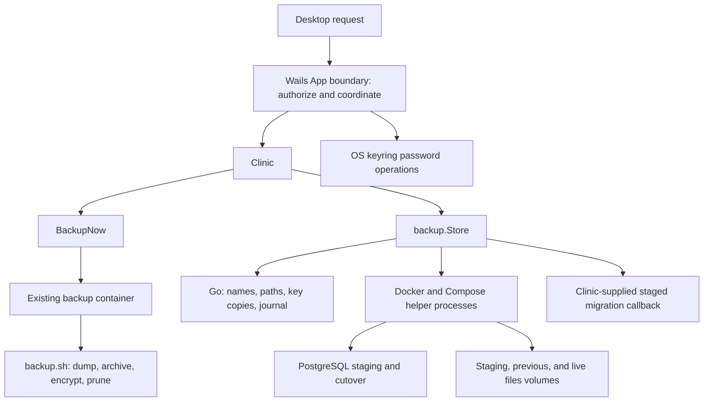
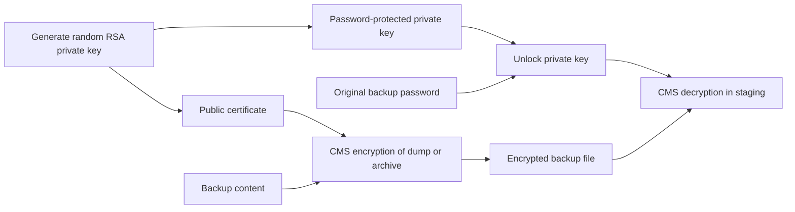
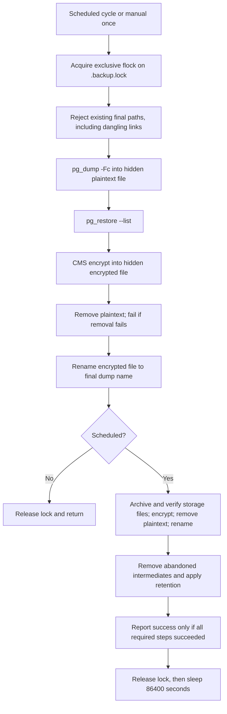
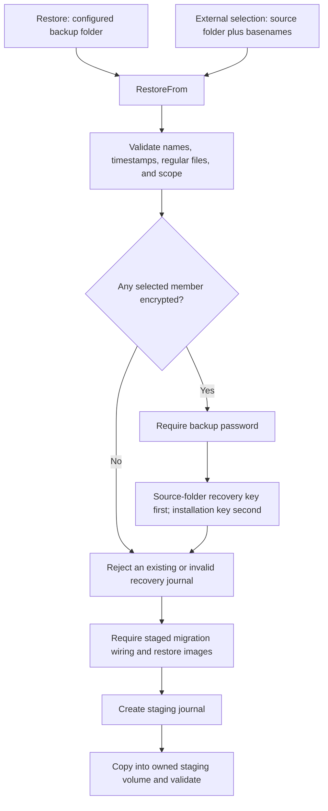

[Documentation index](README.md)

# Backups and restore

This guide explains the backup and restore part of the Wails backend: what is
saved, how encryption works, how a replacement clinic is prepared, and how the
application decides what to do after an interrupted restore.

The main implementation is
[`app/internal/backup/`](../app/internal/backup), wired into the clinic by
[`backupstore.go`](../app/internal/clinic/backupstore.go). Backup creation runs
through [`deployments/scripts/backup.sh`](../deployments/scripts/backup.sh).
The source-file map at the end includes every Go file in this guide's scope,
including tests.

This is an explanation of the current code, not evidence of a completed disaster
recovery exercise. All example paths, dates, identifiers, and data below are
synthetic. Do not experiment against the only copy of a clinic.

Related guides:

- [Architecture](architecture.md) and [repository map](repository-map.md):
  where this subsystem fits.
- [Wails application](wails-application.md): desktop calls, authorization, jobs,
  events, and the shared-read/exclusive-write application gate.
- [Configuration and settings](configuration-and-settings.md): effective paths,
  passwords, retention settings, and changing the backup destination.
- [Clinic lifecycle](clinic-lifecycle.md): starting services, live migrations,
  worker sequencing, and deployment services.
- [Cleanup and uninstall](cleanup-and-uninstall.md): explicit deletion choices
  and preservation of recovery material.
- [Native integrations](native-integrations.md): the process runner, operating
  system credential storage, and native file behavior.
- [Development and release](development-and-release.md): images, pins, builds,
  and interpreting test results.

## 1. The mental model

A clinic has two different kinds of clinical data:

1. **The database** stores structured records in PostgreSQL.
2. **Uploaded files** live in the storage service's Docker volume. A database
   reference to an uploaded object is not the object's contents.

The storage implementation is now **Silo**, but its Compose service is still
named `minio`, and its normal data volume is still
`care-desktop_minio-data`. Backup and recovery intentionally use those existing
names. They are not instructions to rename a service or migrate a volume.

| Term | Meaning in this implementation |
| --- | --- |
| Manual backup / "Backup now" | An encrypted PostgreSQL custom-format dump only. It does **not** include uploaded files. |
| Scheduled backup | The sidecar attempts a database dump and a files archive with the same timestamp. Both must publish, and cleanup must succeed, before the cycle reports success. |
| Backup set | A database dump plus an optional matching files archive. Matching names do not prove application-level consistency. |
| Restore source | The folder containing the selected dump, optional files archive, and preferably their recovery key. It can differ from the current backup destination. |
| Staging | Preparing replacement data separately from the current database and uploaded files. |
| Cutover | Stopping writers, replacing the live files when requested, and renaming databases so the staged database takes the live name. |
| Activation | Bringing the Compose stack up after a committed cutover and waiting for health. |
| Recovery journal | Local metadata describing an unfinished restore. It is not another copy of the clinical data. |
| Retained originals | The previous database and, for a DB + files restore, a separate copy of the pre-cutover uploaded files. |

A database-only restore leaves the contents of the uploaded-files volume alone.
That can still produce a mismatch between restored database references and the
files currently present. Choose the restore scope deliberately.

### Who performs which work?



The Go package does not implement a PostgreSQL server, storage server, encryption
engine, or scheduling service. It validates inputs, records local state, and
orchestrates external commands. Docker, PostgreSQL tools, OpenSSL, Python, and
the shell do the corresponding external work.

The desktop's application gate is separate from these mechanisms. It now allows
authenticated read operations under a shared `RWMutex` read gate and reserves
protected writes for the exclusive gate. `backup.Store` does not contain that
gate or independently serialize every possible caller. Likewise, the shell
backup lock described below is not a global lock for every restore, settings
change, or deletion.

## 2. Files, names, and locations

### Backup artifacts

The examples use the synthetic timestamp `20260102-030405`.

| Name | Contents |
| --- | --- |
| `care-20260102-030405.dump.enc` | Scheduled PostgreSQL custom-format dump, encrypted as an OpenSSL CMS envelope. |
| `files-20260102-030405.tar.gz.enc` | Matching encrypted gzip-compressed tar archive of the storage volume. |
| `care-manual-20260102-030405.dump.enc` | Manual database-only dump. |
| `care-20260102-030405.dump` | Recognized unencrypted database dump, supported as restore input. Current backup writers do not create this final form. |
| `files-20260102-030405.tar.gz` | Recognized unencrypted files archive, also supported as restore input. |
| `backup-key.pem.enc` | Password-protected private recovery key. This is not a database dump or a files archive. |
| `.backup.lock` | Lock file shared by scheduled and manual writers in this folder. Its existence does not itself mean a writer is running. |
| `.care-20260102-030405.dump.tmp` | Intermediate plaintext database dump during backup creation. |
| `.care-20260102-030405.dump.tmp.enc` | Intermediate encrypted dump, before publication under its final name. |
| `.files-20260102-030405.tar.gz.tmp` and its `.enc` counterpart | Equivalent intermediate files for the files archive. |

The timestamp format is `YYYYMMDD-HHMMSS`. The filenames contain no timezone.
Manual timestamps come from the Go process; scheduled timestamps come from the
sidecar's `date`. The list sorts by the timestamp embedded in the filename, not
by filesystem modification time.

The suffix `.enc` has two different uses here:

- A dump/archive with `.enc` is encrypted backup content.
- `backup-key.pem.enc` is an encrypted PEM private-key file generated by
  OpenSSL, not a CMS-encrypted dump.

### Host folders versus container paths

`Store.Dir` is the installation directory. `Store.BackupDir` is the selected
backup destination. With no configured override, the clinic's fallback is
`<user home>/Desktop/care-db-backups`, from
[`Clinic.backupDir`](../app/internal/clinic/clinic.go).
Use the application's reported effective path rather than assuming that the
executable directory or current shell directory contains the backups.

```text
<installation>/
|-- backend.env
|-- keys/
|   |-- backup-cert.pem
|   `-- backup-key.pem.enc
`-- restore-state.json       # exists while a restore needs recovery/finalization

<separate backup folder>/
|-- backup-key.pem.enc       # independent recovery copy
|-- care-20260102-030405.dump.enc
|-- files-20260102-030405.tar.gz.enc
`-- care-manual-20260103-101112.dump.enc
```

The backup service's mounts in
[`docker-compose.yml`](../deployments/docker-compose.yml) provide:

| Container path | Purpose |
| --- | --- |
| `/backup.sh` | Read-only mounted backup script. |
| `/backups` | Writable backup destination supplied through `BACKUP_DIR`. |
| `/keys` | Read-only installation keys directory. The writer uses the certificate, not the private key or its password. |
| `/minio-data` | Read-only mount of the storage data volume for archiving. |

The Compose file also has a raw relative backup-path fallback. Running Compose
outside the desktop's configured environment is not equivalent to using the
application's effective backup destination.

[`backup.Dockerfile`](../deployments/backup.Dockerfile) is deliberately small:
it inherits the pinned `POSTGRES_IMAGE` and adds OpenSSL with `apk`. It does not
contain a Go scheduler or bake the mounted script into the image. The runtime
image must also supply the PostgreSQL and shell utilities the script uses,
including `tar`, `find`, and `flock`; the Dockerfile explicitly adds only
OpenSSL.

## 3. Encryption, passwords, and recovery keys

### These are not interchangeable

| Item | What it does | What it cannot replace |
| --- | --- | --- |
| `keys/backup-cert.pem` | Public encryption certificate used to create backups unattended. | The private key and password required to decrypt backups. It is not the clinic's HTTPS trust certificate. |
| `keys/backup-key.pem.enc` | Installation's password-protected private key. | The password needed to unlock that key. |
| Backup-folder `backup-key.pem.enc` | Exported copy of the same protected private-key bytes, retained alongside backups. | The original password, or a private key for a different installation. |
| Backup password | Unlocks the private key during validation or restore. | A missing private key. |
| Saved OS keyring entry | Convenience storage for the backup password on the current operating system account. | An exported recovery key or a portable recovery package. |
| Database password | Authenticates PostgreSQL commands. | The backup password. |
| Desktop administrator password | Authorizes protected desktop operations, as explained in the Wails guide. | Either of the other passwords. |

### A random key, not a password-derived identity

[`GenBackupKeypair`](../app/internal/backup/crypto.go) asks OpenSSL for a new
RSA-4096 key and a self-signed SHA-256 certificate with subject
`CN=care-backup` and a requested validity of 36,500 days. The private key is
password-protected when written.

The private key is randomly generated. Entering the same password into a fresh
installation does **not** reproduce it. For encrypted restores, retain both:

1. The correct `backup-key.pem.enc`.
2. The password that unlocks that key.

For each backup file, OpenSSL CMS encrypts binary input with AES-256-CBC and
emits a streaming DER envelope addressed to the certificate. The content
encryption key is handled by OpenSSL; the backup password is not supplied to
the unattended writer.



Encryption is not a signed manifest or a guarantee that two files describe the
same application instant. The code does not add a separate signed backup
catalog, cross-file checksum manifest, or authenticity policy. Only restore
backups from a trusted source.

### Setup protects existing key material

Key setup deliberately avoids silently rotating a key:

- An empty backup password is rejected.
- A certificate without its installation private key is an error. The code
  does not invent a new key to match an existing certificate.
- When no installation key exists, recognized encrypted backups or an existing
  recovery key in the destination make fresh setup refuse that folder.
- With an existing key, OpenSSL must unlock it using the supplied password.
  If a certificate also exists, their public keys must match.
- A wrong password or a failed Docker command does not replace existing key
  material.
- If the private key exists but the certificate is missing, setup can reissue a
  certificate using that same key after validating the password.
- Successful setup exports the protected recovery key to the backup folder.
  Export failure is an operation failure, not permission to continue as though
  recovery material were safely retained.

`BackupEncryptionOn()` is a much weaker check: it tests whether `os.Stat` can
find the certificate path. It does not decrypt a sample backup, check keyring
availability, validate the certificate/key relationship, or prove that an
exported recovery copy exists.

### Export and Linux permissions

`CopyRecoveryKey()` reads the installation key and writes an independent copy
to the configured backup folder. The copy helper:

- Creates new files exclusively, with requested mode `0600`.
- Writes and syncs the file, and removes its incomplete output on a write,
  sync, or close failure.
- Accepts an existing regular file only if its bytes are identical.
- Rejects an existing symbolic link, directory, or different key/certificate
  rather than overwriting it.

This is an exclusive-create/idempotent-copy protocol, not the journal's
atomic-replacement protocol. Existing identical copies are not automatically
chmodded. The containing keys/backup directories are generally created with
requested mode `0755`; those directory modes do not make the private-key file
world-readable.

Key generation passes the host user's numeric UID and GID into its container
on non-Windows platforms. Older Linux installations can nevertheless have a
root-owned private key that the desktop cannot read. On Linux specifically,
`readKey()` falls back, **only for a permission error**, to a read-only Docker
mount and a captured `cat` of the protected key. It then writes the host-side
recovery copy through the same `0600` helper. Docker and the backup image must
be usable for that fallback; it does not relax the source file's permissions.

POSIX mode bits are not a complete description of Windows ACL protection.
See [native integrations](native-integrations.md) for platform boundaries.

### The keyring is separate bookkeeping

[`keychain.go`](../app/internal/backup/keychain.go) uses `go-keyring` with
service `care-desktop` and account `backup-password`.

| Operation | Contract |
| --- | --- |
| `StorePassword(pw)` | Store the supplied password; propagate credential-store errors. |
| `LoadPassword()` | Return the password, or `""` with no error when the entry is absent. Other errors remain errors. |
| `HasPassword()` | Report whether the entry exists, not whether it unlocks the selected backup. |
| `ForgetPassword()` | Delete that entry; an already absent entry is successful. |

These functions do not change a private key, rotate encryption, or test an
external backup. The entry is not indexed by backup folder or restore ID.
A saved password for the current installation may not unlock an older imported
backup.

### Secrets travel in environment variables, not argument values

The relevant process calls use environment-variable **names** in arguments:

| Work | Environment values supplied to the child process |
| --- | --- |
| Generate or check the protected key | `PASS`; OpenSSL uses `env:PASS`. |
| Decrypt a staged backup | `BACKUP_PASS`; OpenSSL uses `env:BACKUP_PASS`. |
| Database dump and restore helpers | `PGPASSWORD`, derived from `POSTGRES_PASSWORD`. |
| Staged migrations | `POSTGRES_DB`, `DATABASE_URL`, and `PGAPPNAME`. A URL containing credentials stays in the process environment. |

For example, the Docker argument is `-e BACKUP_PASS`, not
`-e BACKUP_PASS=<password value>`. The Go runner supplies the actual value in
the child process environment.

This reduces exposure through command-line arguments. It does **not** make
environment values invisible to privileged users, Docker administrators, or
process/container inspection. Do not publish environment dumps or assume all
external command output is automatically secret-free.

## 4. Creating backups and applying retention

### Manual backup

[`Clinic.BackupNow()`](../app/internal/clinic/backup.go):

1. Refuses to run if the certificate-presence check says encryption is absent.
2. Generates a timestamp in Go.
3. Runs `sh /backup.sh once manual-<timestamp>` using `docker compose exec -T`
   in the already running `backup` service.
4. Logs the resulting `care-manual-<timestamp>.dump.enc` path, explicitly
   describing it as database-only.

It does not start a stopped clinic or create a files archive. An execution
failure reports that CARE must be running to take the backup.

Manual and scheduled backup creation share the same script implementation,
including its certificate/database-password guards and locking. There is no
second inline dump/encryption implementation in the Wails backend.

### The schedule lives in the sidecar

In its normal mode, the script attempts a complete set immediately, then sleeps
for `86400` seconds after the attempt. It repeats while the container runs.

This is not a midnight cron job, a Wails timer, a missed-run catch-up mechanism,
or a cloud backup service. Cycle duration is additional to the sleep interval.
After a failed cycle it logs the failure and still sleeps before its next
attempt.

The script refuses to start without `/keys/backup-cert.pem` or a nonempty
`POSTGRES_PASSWORD`. It defaults other database connection values to host `db`,
port `5432`, user `postgres`, and database `care`.

### Locking and publication



`flock -x` on file descriptor 9 serializes cooperating manual and scheduled
writers in the same backup folder. A waiting manual backup does not prune an
active scheduled backup's intermediate files. The scheduled loop releases the
lock before sleeping. The lock is advisory: unrelated programs that ignore it
can still modify the folder.

Before a scheduled set starts, **both** final output paths must be unused.
Manual mode checks its final dump path. Existing files, directories, and even
dangling symbolic links at those final names cause refusal rather than
intentional replacement.

Each individual file follows this order:

1. Write plaintext under a hidden intermediate name.
2. Verify its format.
3. Encrypt to another intermediate name.
4. Remove plaintext and check that removal succeeded.
5. Rename the encrypted intermediate file to its final name in the same folder.

For the database, capture-time verification is `pg_restore --list`. For files,
`tar -czf` must succeed, the archive must be nonempty, and `tar -tzf` must
succeed. A failed archive operation is not excused merely because it left a
readable-looking output file.

The files command archives `.` from the storage volume root, including its
hidden contents. It is a filesystem archive of that volume's layout, not an
object-by-object export through the storage API.

The final-name rename gives **per-file atomic publication** under normal
same-filesystem rename semantics. It does not atomically publish the two files
as one set. A database dump may remain published if the later files step fails.
The script also does not explicitly fsync its published backup files and
directory as the restore journal writer does. Do not turn atomic publication
into a blanket power-loss durability claim.

### Retention `0` really means keep published backups

The script reads `DB_BACKUP_RETENTION_PERIOD`, defaulting an absent/empty value
to `0`. The settings editor's validation and persistence of the literal zero
are described in [configuration and settings](configuration-and-settings.md).

After both members of a scheduled set publish, `prune()`:

1. Deletes top-level **regular files** matching `.care-*.tmp*` or
   `.files-*.tmp*`.
2. With retention `0`, keeps published backups and returns.
3. Otherwise deletes top-level regular files matching `care-*.dump*` or
   `files-*.tar.gz*` using `find -mtime +<days>`.

Consequences:

- Zero does not mean "disable backups" or "delete everything".
- Zero still permits removal of abandoned intermediate files after a successful
  scheduled set.
- Age is based on filesystem modification time and `find`'s whole-day
  calculation, not the filename's timestamp or a count of retained sets.
- Manual dumps match the retention glob too, although manual mode itself never
  calls `prune()`.
- Directories, nested contents, and symbolic links are not recursively pruned.
- The recovery key and `.backup.lock` are not retention targets.
- The shell globs are broader than the Go restore filename expressions. Keep
  unrelated files with backup-like names out of this directory.

The log says it is deleting old "sets", but deletion is actually file-by-file.
There is no database/files transaction for pruning.

### Failures are not all equivalent

| Failure point | What can already exist | Reported behavior |
| --- | --- | --- |
| Certificate/password guard or lock acquisition | Existing backups remain; no new set is intentionally written. | Refuse startup/attempt. |
| Final-name collision | The colliding entry is retained. | Refuse overwrite before the relevant work; scheduled mode checks both names before dumping. |
| Dump, verification, encryption, or publication | An intermediate file can remain if cleanup also fails. | Fail the step; skip retention. |
| Files step after dump publication | A new database-only dump may already be visible. | Fail the set; skip retention, rather than claiming a complete set. |
| Plaintext removal | Plaintext may remain in the folder. | Refuse to publish that member as though cleanup succeeded. |
| Temporary-file or retention pruning | Both new members are published; some cleanup deletions may already have happened. | Report "published, but cleanup FAILED", not success and not "every old backup retained". |

An interrupted process or failed deletion can therefore leave plaintext
intermediates. A later successful scheduled cycle attempts abandoned-file
cleanup, but that is not a guarantee of immediate removal or secure erasure.

## 5. Discovering and selecting a restore

[`ListBackups()`](../app/internal/backup/restore.go) reads only the configured
backup folder. A missing folder returns no entries without an error.

It recognizes regular dump files with valid timestamps and constructs one
`Backup` value per dump:

| Field / JSON name | Meaning |
| --- | --- |
| `DBDump` / `db_dump` | Dump basename, not an arbitrary path. |
| `FilesArchive` / `files_archive` | Selected matching archive basename, or empty for database-only. |
| `Label` / `label` | Human-readable time, `daily` or `manual`, `DB only` or `DB + files`, and an encryption suffix when applicable. |
| `Manual` / `manual` | Whether the dump name starts with `care-manual-`. |
| `Encrypted` / `encrypted` | Whether the dump **or its selected archive** has `.enc`. |
| `SizeBytes` / `size_bytes` | Size of the dump alone, not the combined set size. |

For scheduled-looking dumps, pairing uses the same timestamp. It prefers an
archive with the same encrypted/plain form as the dump, then accepts the other
form if that is the available match. Manual dumps are never paired with an
archive, even when a scheduled archive has the same timestamp. Orphan files
archives do not create list entries.

The label `daily` comes from the filename convention; it is not proof that a
scheduled cycle succeeded. Listing is discovery, not decryption or a successful
restore rehearsal. It does not fully inspect dump/archive contents, and the
stricter restore path rejects empty files even if their names appeared in a
list.

### Configured folder and external import use the same pipeline



- `Restore(dbDump, filesArchive, passphrase)` delegates to `RestoreFrom` using
  `Store.BackupDir`.
- `RestoreFrom(srcDir, dbDump, filesArchive, passphrase)` uses the supplied
  folder, or the configured folder when `srcDir` is empty, and converts it to
  an absolute path.
- The dump and optional archive must be in that same source folder, with the
  required basenames. This is not a remote URL fetch or a files-only restore.
- An encrypted member requires a nonempty password and a usable private-key
  file.
- Key lookup prefers `backup-key.pem.enc` beside the selected backup over the
  installation key. It does not try every key on the machine or fall back to
  another key after a decryption failure with the first selected key.
- Neither source-folder restore nor staging relocates the original backups into
  the configured destination. The input is mounted read-only and copied into
  a Docker staging volume for this operation.

The desktop picker, job handling, and password entry belong to the
[Wails application guide](wails-application.md). At the package boundary, import
is simply a different source folder, not a separate destructive restore
algorithm.

### Filename and filesystem checks

Restore refuses:

- A dump name outside the `care-[manual-]YYYYMMDD-HHMMSS.dump[.enc]` convention.
- A calendar-invalid timestamp.
- A files archive with another timestamp.
- Any files archive supplied with a manual dump.
- Path separators, traversal, or arbitrary shell text in the basenames.
- A selected backup that `Lstat` identifies as a directory, symbolic link,
  non-regular file, or empty file.
- A chosen recovery key that is not a nonempty regular file.

During the container copy step, each source backup is checked again with
`-f` and `! -L`. Docker `--mount` arguments are assembled using CSV escaping,
so a comma in a host path is not simply concatenated as a new mount option.

These are deliberate entry/path checks, not a claim to eliminate every
filesystem race. The code does not freeze an externally writable source folder
or forbid all symlinked ancestor directories. Use stable, trusted source
folders.

## 6. Preparing the replacement without replacing live data

### The `Store` and callback boundary

[`Store`](../app/internal/backup/store.go) is a dependency container, not an
independent running service:

| Field or constructor | Contract |
| --- | --- |
| `Dir`, `BackupDir` | Installation and backup folders. The journal and connection settings are installation-local. |
| `Image`, `BackendImage` | Backup-tools image and CARE backend image. The backend image supplies Python for archive validation and is needed for staged migrations. |
| `Host` | Clinic hostname used in the completion message; not the PostgreSQL host. |
| `Project` | Docker project/network/resource prefix; the clinic wiring uses `care-desktop`. |
| `Log` | Optional log callback. |
| `EnsureImage` | Callback to ensure the backup image, used by key setup and prepared recovery. |
| `EnsureRestoreImages` | Callback ensuring the images needed for staged restore. |
| `Migrate(database, restoreID)` | Callback that must migrate the named staging database, not the current live database. |
| `New(run, s)` | Attach the supplied `proc.Runner` to the supplied store and return that same store. It does not create keys or launch work. |

[`Clinic.Backups()`](../app/internal/clinic/backupstore.go) fills these fields
and attaches the clinic runner, which supplies the working directory,
environment, and command logging. It wires:

- `EnsureImage` to `Builder().EnsureBackupImage`.
- `EnsureRestoreImages` to ensuring the backend image, then the backup image.
- `Migrate` to `Clinic.migrateStaged`.

Restore explicitly refuses missing `EnsureRestoreImages`, missing `Migrate`, or
an empty backend image before creating its journal. Key generation also
expects a properly wired `EnsureImage`. Constructing a bare `Store` is not a
substitute for these contracts.

### Resource identities

Each restore gets a random 12-byte identifier rendered as 24 lowercase
hexadecimal characters. For a synthetic ID such as
`0123456789abcdef01234567`:

| Resource | Naming / ownership |
| --- | --- |
| Staged database | `care_restore_<id>` |
| Previous database | `care_previous_<id>` |
| Staging Docker volume | `<project>_restore_<id>_stage` |
| Previous-files Docker volume | `<project>_restore_<id>_previous` |
| Helper container | `<project>-restore-<id>-<step>` |
| Restore label | Exported `RestoreLabel` constant: `org.care-desktop.restore=<id>` |
| Project label | `com.docker.compose.project=<project>` |
| PostgreSQL ownership/application tag | `<project>:restore:<id>` |

The stage volume exists for database-only restores too. It holds copied dump
input and the decrypted `database.dump`; a DB + files restore also holds
`files.tar.gz` and its extracted `files/` directory. For encrypted inputs, the
copied encrypted inputs remain there as well.

The previous-files volume is only needed when files are being restored. The
previous database is preserved by renaming, not by making a second database
dump at cutover.

### Preflight is more than checking an archive's table of contents

The preparation order in
[`prepareRestore`](../app/internal/backup/restore.go) is:

1. Create and verify ownership of the staging volume.
2. Run a backup-image helper with **no network**, read-only source/key mounts,
   a writable stage volume, and `umask 077`.
3. Copy the selected inputs into staging. Decrypt encrypted members there,
   using the selected protected key and `BACKUP_PASS`.
4. Fully read the dump with
   `pg_restore --exit-on-error --file=/dev/null /restore/database.dump`,
   then sync.
5. If files were requested, validate and extract the archive into staging.
6. Start/wait for only the database service without recreating it:
   Compose uses `--no-recreate`, `--wait`, and a 300-second wait timeout.
   A separate `pg_isready` command must also succeed.
7. Inspect the existing database identities, record the original database's
   OID in the journal, and require that no staged/previous name is already in
   use.
8. Create the tagged staging database from `template0` and load the dump into
   it with `--exit-on-error --single-transaction --no-owner --no-privileges`.
9. Run migrations against that staging database.
10. Recheck that the live database still has its original OID, the staged
    database has the correct restore tag, and the previous name is still
    unused. Record the staged database's OID.

An **OID** is PostgreSQL's object identifier. Renaming a database changes its
name, not its OID, so recovery can distinguish the original from the replacement
even when one of them now uses the ordinary live name.

Capture-time `pg_restore --list` can succeed for a dump whose later payload is
corrupt. Restore's full read catches more than that listing, and the actual
transactional load checks whether the SQL can be applied to the staging
database. These are separate checks, neither of which proves clinical data
correctness.

`--single-transaction` applies to loading the dump. It is not a transaction
covering database creation, all migrations, files, and activation together.
If the load fails, an empty tagged staging database can still need cleanup.

### Archive validation and extraction safety

[`validateRestoreFiles`](../app/internal/backup/restore_data.go) runs Python
from the backend image with:

- `--network none`.
- A read-only container root filesystem.
- A writable staging-volume mount.
- Explicit `--entrypoint python`, `-B`, and user `0:0`.

It does not boot the backend application to extract an archive.

The Python code first drains the gzip stream completely, then reads the tar
members. Before extracting any member, it requires every entry to:

- Have a nonempty, relative POSIX path.
- Contain no `..` component.
- Be a regular file or directory.

Symbolic links, hard links, devices, FIFOs, and other non-file/non-directory
entries are rejected. Only after checking the member list does it create the
staging `files/` directory, extract with numeric ownership, and sync.

This protects the live volume from malformed or path-escaping archive contents.
It does not impose an archive expansion limit, member-count limit, or free-space
budget. It also does not make untrusted database SQL safe. Disk exhaustion,
incompatible data, and malicious content remain reasons to use trusted backups
and an isolated recovery exercise.

### Why staged migrations are not live migrations

The callback receives both `care_restore_<id>` and the restore ID.
[`Clinic.migrateStaged`](../app/internal/clinic/migrate.go) validates that
relationship, then runs a one-off backend service command:

```text
docker compose run --rm --no-deps
    ... --entrypoint python
    -e POSTGRES_DB -e DATABASE_URL -e PGAPPNAME
    backend manage.py migrate --noinput
```

This is a schematic excerpt, not a command to run against a clinic.

The callback overrides **both** `POSTGRES_DB` and `DATABASE_URL`. Merely changing
one would be insufficient if the backend preferred the other. Its URL helper
changes the database path and removes competing `dbname`/`database` query
parameters. The restore tag is placed in `PGAPPNAME` and the URL's
`application_name` so interrupted database sessions can be identified.

`--no-deps` prevents this helper from starting ordinary dependencies as a side
effect, and the Python entrypoint bypasses the backend's usual service startup.
During this preparation, existing CARE services have not yet been stopped.
The intended database target is the isolated replacement, not the live schema
used by current workers.

That is why this hook must not be replaced with the normal startup/live
migration routine. The [clinic lifecycle guide](clinic-lifecycle.md) separately
explains worker pausing around ordinary live migrations.

The restore code's SQL helpers use the `POSTGRES_*` connection settings in
`backend.env`. A configured `DATABASE_URL` used for migrations still needs to
describe the intended PostgreSQL server. The source does not prove arbitrary,
conflicting connection configurations equivalent, nor can it guarantee that
every upstream/plugin migration lacks external side effects.

## 7. Cutover, durable state, and activation

### Stopping writers is a checked operation

After successful staging and migrations, restore stops these Compose services:

```text
backend  celery-worker  celery-beat  minio  backup  caddy
```

It then obtains their container IDs and inspects each status. Every returned
container must be `exited` or `created`; a failed stop, incomplete inspection,
or still-running service prevents cutover.

This stops normal application, worker, scheduler, upload, backup, and ingress
activity before replacing data. It is not a universal lock on unrelated
PostgreSQL clients or administrator commands. It also means restore is **not
zero-downtime**. Even a database-only restore stops this service list, although
it does not replace the uploaded-files volume's contents.

For a DB + files restore, the stopped live files are copied with `cp -a` into
the owned previous-files volume and synced before the cutover phase is
recorded. During this initial snapshot, the code can create the normally
labelled live volume if it is absent. That can represent an empty source;
it is not proof that missing historical uploads have been recovered.
Later prepared recovery requires the existing recovery/live volumes and
does not manufacture an empty replacement for a missing recovery copy.

### The journal is local and durable by design

[`restore_journal.go`](../app/internal/backup/restore_journal.go) records
`<installation>/restore-state.json`. Its JSON fields are:

| Field | Purpose |
| --- | --- |
| `id`, `project` | Identify this restore and this installation's resource namespace. |
| `phase` | One of the four exact states below. |
| `database`, `host`, `port`, `user` | Original database connection identity. These are distinct from the clinic's web hostname. |
| `original_oid`, `staged_oid` | Original/replacement identities, populated as staging progresses. |
| `with_files` | Whether uploaded files participate in cutover/recovery. |

It does not store the backup password, database password, private-key contents,
source folder, or selected backup filenames. Passwords are not needed to replay
rollback from the already prepared resources.

The journal reader requires a regular non-symlink file no larger than 16 KiB,
valid JSON, a valid restore/project identity matching the current store, valid
connection fields, and recognized phases. Prepared/committed journals require
two distinct valid OIDs. Protected PostgreSQL database names such as `postgres`,
`template0`, and `template1` are rejected.

Writes use
[`atomicfile.Write`](../app/internal/sys/atomicfile/atomicfile.go) with mode
`0600`: write a sibling file, sync and close it, then replace the journal.
Unix replacement syncs the containing directory; Windows uses replacement
with write-through semantics. This is the durability mechanism used to order
recovery decisions. It is not a promise that a failed disk, filesystem, Docker
engine, or power-loss scenario has been exhaustively tested.

Before each SQL helper, current database name/host/port/user settings are
compared with the journal. A mismatch stops recovery with a request to restore
the original connection settings. The database password is reread from
`backend.env`; it is not frozen in the journal.

### The four exact phases

| On-disk phase | When it is written | What the next recovery does |
| --- | --- | --- |
| `staging` | Before helper resources are created; rewritten as original/staged OIDs become known. | Stop this restore's helper containers, leave live data alone, then mark `rolled-back`. Staging is abandoned, not automatically resumed. |
| `prepared` | After replacement validation/migrations, checked writer shutdown, and the previous-files snapshot when applicable. Before modifying live files or renaming databases. | Stop/verify writers and helpers, check ownership, restore the original database/files, then mark `rolled-back`. |
| `committed` | After files replacement when applicable and a successful database swap, **before** starting the normal stack. | Keep the replacement as live. Never automatically replay the old snapshot over potentially newer writes. |
| `rolled-back` | After staging abandonment or successful prepared rollback. | Do not replay rollback again. Keep current data and leave final cleanup for a successful start. |

There is no separate persisted `activating`, `healthy`, or `finished` phase.
A removed journal means no restore is pending in this protocol; malformed
metadata is an error, not permission to treat it as absent.

```mermaid
stateDiagram-v2
    [*] --> staging: Inputs and image preparation accepted; write journal
    staging --> prepared: Stage and migrate; stop writers; preserve files if needed
    staging --> rolled_back: Recover by abandoning staging
    prepared --> committed: Replace files; swap databases; persist commitment
    prepared --> rolled_back: Recover original data before activation
    committed --> committed: Recover without reverting new writes
    rolled_back --> rolled_back: Recover without repeating rollback
    committed --> [*]: Successful activation then FinishRestore
    rolled_back --> [*]: Successful normal start then FinishRestore
    state "rolled-back" as rolled_back
```



### Database and file cutover are different mechanisms

Files are replaced **in the existing live volume**:

1. Verify the source staging volume's labels and the live volume's Compose
   project/volume labels.
2. Remove current top-level entries, including hidden entries.
3. Copy the staged `files/` tree into the live volume.
4. Sync the live volume.

This is a stopped-writer, journal-recoverable copy, not an atomic volume rename.
Interruption can leave the live files partly replaced; the separately retained
previous-files volume is what makes prepared recovery possible.

The database swap uses both Go-side inspection and SQL assertions:

1. Require the live OID to be the original, the staged OID/tag to be the
   replacement, and the previous name to be unused.
2. Disable new connections to the live and staged databases.
3. Terminate their sessions and assert no sessions remain.
4. In one SQL transaction, rename live to `care_previous_<id>` and staged to
   the original live name.
5. Re-enable connections to the newly live database.

The two renames are transactional; the entire restore is not. In particular,
connection disabling occurs outside that rename transaction. If interruption
leaves the original database in place but connections disabled, recovery
explicitly reconnects it.

```mermaid
sequenceDiagram
    participant S as backup.Store
    participant J as Local journal
    participant H as Staging helpers and migration callback
    participant W as CARE writers
    participant D as PostgreSQL and files volumes
    S->>J: Persist staging
    S->>H: Copy, decrypt, fully validate, load separate DB, migrate it
    H-->>S: Replacement ready; original and staged identities checked
    S->>W: Stop and inspect all listed writers
    S->>D: Preserve previous files when included
    S->>J: Persist prepared
    S->>D: Replace live files when included
    S->>D: Transactionally swap database names
    S->>J: Persist committed
    S->>W: Compose up with wait
    S->>S: Wait for CARE health
    S->>D: FinishRestore removes owned previous/staging resources
    S->>J: Remove journal last
```

After committing, restore calls Compose `up -d --wait --wait-timeout 300`,
then `health.Wait` with a three-minute timeout. Only after these checks does
this path call `FinishRestore()` and log completion.

## 8. Recovery after interruption

### Start through the application

Errors after journal creation generally identify the restore and say that
recovery data was retained. They direct the operator to start CARE to recover
safely and not start containers manually.

That instruction matters:
[`Clinic.Start`](../app/internal/clinic/start.go) calls `RecoverRestore()`
before ordinary startup and `FinishRestore()` after successful health.
Starting writers outside that lifecycle can introduce new data before the
recorded recovery decision has been applied.

Keep the installation's journal and the owned staging/previous Docker resources
intact while investigating. Do not "fix" an error by deleting
`restore-state.json`, editing OIDs/phases, renaming databases, or replacing a
missing recovery volume with an empty one.

### Recovery decisions by interruption point

| Interruption or error | Durable phase normally left behind | Intended next action |
| --- | --- | --- |
| Input rejection or image preparation failure before the journal | None | Report the error; no restore resources have been intentionally created by this pipeline. |
| Copy, decrypt, full dump read, archive validation, staged load, or staged migration | `staging` | Abandon staging on recovery; originals were not intentionally replaced. |
| Writer stop/inspection or previous-files snapshot failure | `staging` | Preserve originals, but recognize that services may already be stopped. Recover and use normal startup. |
| After preparation, during files replacement, before/during/after database swap but before commitment | `prepared` | Roll back to the original database/files before normal writers start. |
| After commitment but before or during Compose activation | `committed` | Resume with the replacement. Some services may already have accepted writes. Do not automatically roll back. |
| Health failure after activation | `committed` | Preserve current replacement data and retained originals; retry normal startup/recovery, then finalize only after success. |
| Cleanup failure after successful start | `committed` or `rolled-back` | Retry finalization; some owned cleanup may already have completed. |

An error message alone does not establish which metadata write reached storage.
The validated journal read on the next attempt is the recovery authority.

### What `RecoverRestore()` actually does

With no journal it returns without starting Docker work. With a journal it
first finds only containers bearing **both** this project's label and this
restore's label, force-removes those helpers, and rechecks that none remain.
This also covers an interrupted migration helper.

For `prepared` recovery it additionally:

1. Stops and verifies the normal writers again.
2. Ensures the backup image when the callback is supplied.
3. For a files restore, requires the labelled previous-files volume and the
   correct existing live volume before attempting database recovery.
4. Starts/checks PostgreSQL and terminates remaining database sessions tagged
   with this restore's application name.
5. Inspects the database identities.
6. Either reconnects the still-original database, or transactionally renames
   the original back to live and the replacement back to staged.
7. Copies the previous files back into the live files volume when applicable.
8. Persists `rolled-back`.

Only two database arrangements are accepted for prepared rollback:

| Arrangement | Required identities | Recovery |
| --- | --- | --- |
| Swap did not happen | Live = original OID; staged = recorded replacement OID with this tag; no previous database. | Re-enable original connections. |
| Swap happened | Live = replacement OID with this tag; previous = original OID; no staged database. | Reverse the database-name swap and reconnect the original. |

Anything else is an error rather than a guessed rename. Missing/unowned
recovery volumes, an unremovable helper, changed settings, and unexpected OIDs
likewise stop the operation and retain metadata.

For `staging`, no files/database rollback is necessary: normal preparation
did not intentionally replace them. After stopping helper containers, recovery
marks the operation `rolled-back`; temporary resources remain for later
cleanup.

For `committed` and already `rolled-back`, recovery does not replay a
snapshot. This is essential: data written after an earlier successful
activation or rollback must not be overwritten on every later start.

`RecoverRestore()` by itself does not activate the whole clinic or declare it
healthy. It establishes which data normal startup may use.

### Why originals remain until `FinishRestore()`

[`FinishRestore()`](../app/internal/backup/restore_journal.go) only accepts
`committed` or `rolled-back`. It:

1. Stops lingering owned helper containers and tagged database sessions.
2. Rechecks live/previous/staged identities and staged ownership.
3. For a committed restore, drops the previous database if still present and
   still the recorded original.
4. For a rolled-back restore, drops the tagged staged database if present.
5. Removes the owned stage volume, plus the previous-files volume for a
   files restore.
6. Removes the journal **last**.

The normal live files volume is not a cleanup target. Previously published
backup files and recovery-key exports are not deleted by `FinishRestore`.

Missing resources that were already cleaned up can be accepted, allowing
partial cleanup to resume. A resource that exists under an unexpected identity
or label is not blindly removed. Cleanup is not one all-or-nothing transaction,
so a failure can leave only some of the recovery copies.

**Caller contract:** `FinishRestore()` does not run its own health check.
The restore and clinic-start callers arrange successful startup/health before
calling it. Calling this public method directly is not a safe health test and
would bypass that sequencing.

Retained originals are temporary recovery resources, not a user-selectable
second backup history. They occupy disk space until finalization succeeds.
After commitment, automatic recovery intentionally will not choose them over
possibly newer replacement data.

### Other public recovery operations

| Operation | Contract |
| --- | --- |
| `PendingRestore()` | Return whether a valid journal exists. Propagate unreadable/corrupt/foreign metadata as an error; do not interpret an error as "safe to start another restore". |
| `RecoverRestore()` | Resolve an interrupted restore before ordinary writers start; retain copies for successful-start finalization. |
| `FinishRestore()` | Finalize only a committed/rolled-back restore after the caller has established successful startup. |
| `Clinic.RestartBackupSidecar()` | Run recovery first, then force-recreate only the `backup` service. It is not whole-clinic activation or finalization. |
| `Clinic.BackupDirPath()` | Return the effective backup path; no disk backup is created. |

Starting another restore while any valid journal remains is refused, including
a committed restore whose cleanup still needs finishing.

## 9. Moving folders, preserving keys, and deleting backups

### Moving a folder does not recreate a key

Keep the protected recovery key with backups when copying them to another
folder or computer, and retain the original password separately through an
appropriate secure process. An encrypted dump, a public certificate, and a
remembered password are insufficient when the random private key has been
lost.

External restore first checks for the key beside the imported backup. This is
why retaining the source folder's original key matters when the current
installation has a different key. No cloud account or OS keyring sync is
implemented here.

When the desktop changes its configured destination, it arranges key export
before using the new destination and recreates a running backup sidecar to
update mounts. Existing backups and their key remain in the old folder; it is
not an automatic migration of old archives. The settings guide describes that
operation's configuration-save and rollback ordering.

### Key/location operations

| Operation | Contract |
| --- | --- |
| `EnsureKeysDir()` | Create the installation keys directory. It does not establish a valid keypair. |
| `GenBackupKeypair(passphrase)` | Validate/reuse or create protected key material, then export the recovery copy; refuse unsafe replacement conditions. |
| `BackupEncryptionOn()` | Certificate-path presence check only. |
| `CopyRecoveryKey()` | Copy the installation's protected key to the current backup destination without overwriting different material. |
| `CheckLocation(dir, protected)` | Require absolute paths, resolve existing symlink ancestors even for not-yet-created descendants, and reject a backup directory equal to or inside the supplied protected directory. |
| `PreserveRecoveryKey()` | Check separation from the installation directory and export an existing installation key before removing installation files. A missing installation key is a no-op, not proof that recovery is possible. |
| `ForeignRecoveryData()` | Detect recognized encrypted filenames without a matching export, or a recovery-copy mismatch with the installation key. This is a conservative filename/key-byte check, not decryption of every backup. |
| `DiscardUnusedRecoveryKey()` | Remove a backup-folder key copy only when no recognized encrypted backups exist, an installation key can be matched, and both key copies have identical bytes. |
| `DeleteBackups()` | Explicitly delete recognized top-level backup-owned entries from the configured folder, keeping unrelated entries. |

The location check is about the protected directory supplied by its caller.
It is not a universal check of disk health, writability, every symlink race,
or every possible cleanup target.

Normal uninstall and purge preserve recovery keys when keeping backups.
The `RemoveUnusedRecoveryKey` option in
[`uninstall.go`](../app/internal/clinic/uninstall.go) exists for **failed-install
cleanup**, not routine uninstall/purge. Do not apply its narrow "provably unused
and ours" exception to keys protecting retained backups. Full lifecycle choices
belong in [cleanup and uninstall](cleanup-and-uninstall.md).

### Deletion has a different policy from retention

`DeleteBackups()` enumerates the selected folder's immediate entries:

- It recognizes the recovery key, `.backup.lock`, supported dump/archive
  basenames, and corresponding intermediate names after removing an initial
  dot and one `.tmp` component.
- It never recursively deletes directories.
- It leaves unrecognized entries in place and logs that they were kept.
- It removes the containing folder only when no unrelated entries were kept
  and the recognized removals succeeded.
- It aggregates removal errors; successful earlier deletions are not rolled
  back.

A recognized symbolic link can be unlinked by explicit deletion, but its
target is not recursively deleted. This differs from scheduled retention's
`find -type f` behavior, which excludes symbolic links.

Ownership here is a naming convention within the selected backup folder, not
proof of who created the data. A personal file deliberately given a recognized
backup name can be a deletion target. The exported recovery key is intentionally
a target when backups are explicitly removed.

This method does not acquire the shell's `flock`, stop services, or perform
authorization on its own. Those are caller/lifecycle responsibilities. Do not
invoke it concurrently with an independently running writer or treat it as
secure disk erasure.

## 10. Limits and operational expectations

The code supports guarded backup creation and staged restore, but several
boundaries are important:

1. **A local backup is still local.** This subsystem does not upload offsite,
   replicate to cloud storage, or protect against losing both the machine and
   its backup drive.
2. **A scheduled pair is not an application-wide snapshot.** PostgreSQL is
   dumped, then the storage volume is archived while ordinary services can
   still run. No cross-database/files snapshot transaction or quiescing step
   is implemented during backup capture.
3. **Listing and encryption are not restore verification.** Names, `.enc`,
   format checks, and a successful scheduled log do not prove usable clinical
   data on a replacement machine.
4. **Restore requires working infrastructure.** Docker/Compose, compatible
   images, required command-line tools, readable connection settings, and
   sufficient privileges must be available. Prepared recovery cannot succeed
   by guessing around missing infrastructure.
5. **Capacity is not pre-reserved.** Staging can retain encrypted and decrypted
   inputs, extracted files, a restored database, the original database, and
   previous uploaded files simultaneously. There is no explicit free-space
   preflight or expansion quota.
6. **Plaintext exists during operations.** Backup intermediates and
   restore-stage volumes can contain unencrypted clinical data. Failure
   deliberately retains some recovery resources. Removal is not secure erasure.
7. **Restore is not zero-downtime.** Writers are stopped for cutover and remain
   stopped on some failures until the normal recovery/start sequence succeeds.
8. **Commitment changes the recovery choice.** Failure after commitment does
   not trigger automatic rollback, because the replacement may already contain
   new writes.
9. **The journal is not the data.** Deleting Docker recovery volumes/databases
   or losing the installation directory can remove what automated recovery
   needs. Keep both metadata and recovery resources while investigating.
10. **Compatibility has limits.** A dump plus uploaded files does not include
    all installation configuration, TLS trust state, image pins, plugins, or
    the OS keyring. This code does not prove arbitrary PostgreSQL-version,
    upstream-schema, plugin, or storage-format transitions safe.
11. **Native access remains powerful.** Process environments, Docker access,
    and filesystem access can expose recovery material. The UI gate and
    resource labels are coordination/ownership mechanisms, not protection
    against a hostile machine administrator.

For an operator, the practical recovery checklist is: identify the intended
database-only or DB + files scope; preserve the source files, matching key, and
password; use the application-mediated restore/start path; read the actual
error and pending-state behavior; and do not delete originals or metadata to
make a warning disappear. A separate, controlled restore exercise is still
needed to establish a site's recovery procedure.

## 11. What the existing tests demonstrate

No clinic commands, live data access, or tests were run to write this guide.
The following describes the checked-in test source, not observed results on
this machine or proof of real-world disaster recovery.

| Test file | What it exercises | Boundaries and skips |
| --- | --- | --- |
| [`crypto_test.go`](../app/internal/backup/crypto_test.go) | Recovery-copy idempotence/non-overwrite; link rejection; fresh setup refusing preserved recovery data; wrong-password non-rotation; fail-closed preservation; deletion ownership; symlinked location checks; certificate reissue; unused/foreign key handling. | Mostly synthetic local files and a command fixture. The certificate test invokes local OpenSSL when available, using smaller synthetic test key settings rather than a production Docker setup. Some cases skip on Windows; OpenSSL absence skips that case. |
| [`restore_test.go`](../app/internal/backup/restore_test.go) | Unsafe input rejection before Docker; preparation failures preserving live data; rollback before commitment; committed recovery preserving new writes; missing/foreign-resource refusal; journal validation; environment-only secret values; manual scope; pairing rules; resumable cleanup. | Docker is a test double implemented by rerunning the Go test binary. Database IDs, file contents, and container states are synthetic. It does not exercise a real Docker activation/health sequence. POSIX fixture cases skip on Windows. |
| [`restore_archive_test.go`](../app/internal/backup/restore_archive_test.go) | Real Python validation of synthetic regular/corrupt/truncated/path-escaping/link archives. An isolated PostgreSQL fixture tests full-payload validation, transactional load, quoted database names, tagged-session termination, transactional rename failure, swap, and rollback. | Python case skips without `python3`. PostgreSQL case skips on Windows, as root, or without its local PostgreSQL tools. It starts its own local fixture with TCP listening disabled, not a live clinic. No Docker-volume or power-loss disaster is reproduced. |
| [`backup_script_test.go`](../app/internal/clinic/backup_script_test.go) | Scheduled/manual failure reporting; plaintext and publication cleanup; partial prune failures; zero/positive retention; top-level-only deletion; collision refusal; writer serialization and lock release before sleep. | Uses isolated folders and command wrappers. Dump, encryption, and archive commands are simulated, so it does not prove real encryption/compression or capture consistency. POSIX shell required; serialization cases skip without native `flock`. |

Two particularly useful regression distinctions are:

- The PostgreSQL fixture demonstrates a corrupt dump whose table of contents
  can still be listed, while full payload validation fails. This explains why
  restore must do more than reuse capture-time `--list`.
- The interruption fixtures distinguish `prepared` from `committed` and simulate
  writes after activation/rollback. They test that repeated recovery does not
  overwrite those newer writes.

`CARE_RESTORE_DOCKER_STATE` in `restore_test.go` is internal test-double
plumbing, not a switch granting permission to exercise real Docker.
The tests owned by this guide mainly use fixtures and prerequisite-based skips;
they do not expose a single opt-in "disaster test" mode.

Native and integration tests also have platform, tool, and fixture
prerequisites. Consult their source and
[development and release](development-and-release.md) before running them.
A skipped case is not a pass for that behavior, and exercising a fixture is
not evidence of a complete clinic backup/restore rehearsal. Documentation-only
changes do not require a live restore or a broad test run.

## 12. Current source file map

This is the complete Go-file inventory owned by this guide.

| Source file | Current role |
| --- | --- |
| [`app/internal/backup/store.go`](../app/internal/backup/store.go) | `Store` dependency fields, runner attachment through `New`, optional logging, and the Compose command helper. |
| [`app/internal/backup/crypto.go`](../app/internal/backup/crypto.go) | Key/certificate creation and validation, protected key export/preservation, Linux read fallback, backup-location checks, foreign/unused recovery-key checks, and owned-entry backup deletion. |
| [`app/internal/backup/keychain.go`](../app/internal/backup/keychain.go) | OS keyring store/load/existence/delete operations for the saved backup password. |
| [`app/internal/backup/restore.go`](../app/internal/backup/restore.go) | `Backup` list shape, filename recognition/pairing, configured/external source validation, key selection, staging orchestration, cutover orchestration, activation, and finalization call. |
| [`app/internal/backup/restore_data.go`](../app/internal/backup/restore_data.go) | Database readiness/settings/identity helpers, SQL load/swap/rollback/cleanup scripts, file snapshot/replacement helpers, and Python archive validation. |
| [`app/internal/backup/restore_journal.go`](../app/internal/backup/restore_journal.go) | Restore IDs/tags, journal schema/validation/durable writes, helper/writer shutdown, Docker-volume ownership, pending detection, recovery, and final cleanup. |
| [`app/internal/backup/crypto_test.go`](../app/internal/backup/crypto_test.go) | Key preservation, non-overwrite, foreign data, safe location/deletion, and certificate recovery regressions. |
| [`app/internal/backup/restore_test.go`](../app/internal/backup/restore_test.go) | Synthetic Docker/state fixture and restore input, interruption, commitment, cleanup, ownership, secret-transport, and listing regressions. |
| [`app/internal/backup/restore_archive_test.go`](../app/internal/backup/restore_archive_test.go) | Synthetic archive tests through Python plus tool-gated, isolated PostgreSQL payload/transaction/session/swap regressions. |
| [`app/internal/clinic/backup.go`](../app/internal/clinic/backup.go) | `Clinic.BackupNow`: encryption-presence guard, timestamp generation, existing-sidecar one-shot execution, and database-only completion logging. |
| [`app/internal/clinic/backupstore.go`](../app/internal/clinic/backupstore.go) | Compose project constant, clinic-to-store dependency/callback wiring, effective backup path, and recovery-before-sidecar-restart. |
| [`app/internal/clinic/backup_script_test.go`](../app/internal/clinic/backup_script_test.go) | Isolated shell-script fixtures for success/failure reporting, retention, publication, collision checks, manual scope, and locking. |

The two runtime deployment sources in scope are:

| Source file | Current role |
| --- | --- |
| [`deployments/scripts/backup.sh`](../deployments/scripts/backup.sh) | Unattended loop and manual one-shot mode; encrypted database/files publication, advisory locking, temporary cleanup, and retention. |
| [`deployments/backup.Dockerfile`](../deployments/backup.Dockerfile) | PostgreSQL-image-derived tool image with OpenSSL added. |

### Older design notes versus current implementation

The backup sections of [`design.md`](../design.md) explain the original
dependency direction and certificate-based unattended encryption, but their
restore file map and drop/create/load flow predate staged restore.

The current implementation has `restore_data.go` and `restore_journal.go`,
`BackendImage` and `EnsureRestoreImages` dependencies, and a
`Migrate(database, restoreID)` callback. It stages and migrates a separate
database, retains originals, records the four phases, and finalizes after
successful startup. There is no current `restoreDB`/`restoreFiles` live
drop-and-load path or old `waitForDB` helper in this package.

Where those older diagrams or MinIO terminology differ, follow the current
sources and this guide's staged protocol. Silo continues to use the existing
`minio` service and volume names; no migration or renaming is implied.
