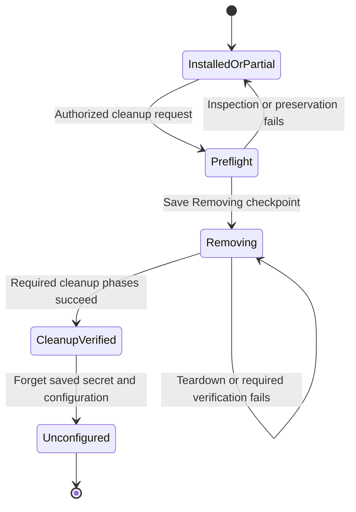
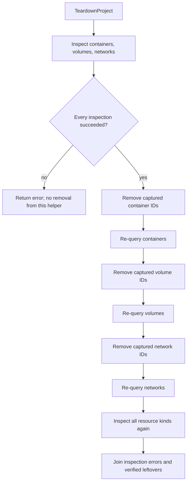
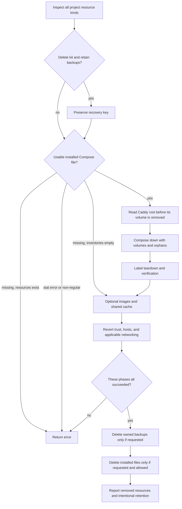
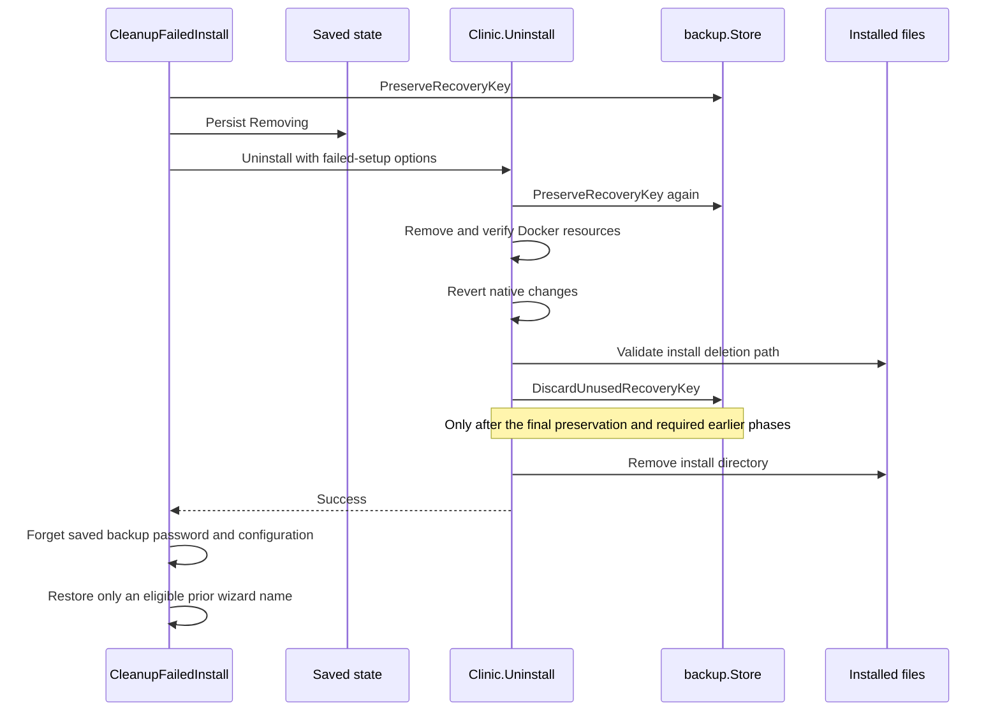

[Documentation index](README.md)

# Cleanup, uninstall, and retained recovery data

Stopping a clinic and uninstalling it are fundamentally different operations.
**Uninstall and residue purge delete the live database and object-storage
volumes. Stop does not.** Keeping the backup directory is not the same as
keeping the running clinic's data volumes.

For a former server now used as a browser client, see
[client recovery](client-recovery.md): it distinguishes a hosts-only repair from
the destructive standalone cleanup scripts used when the app is unavailable.

This guide explains the current Wails backend and engine cleanup paths. It is
not a collection of destructive terminal recipes. Resource and command names
are included to make source code and logs understandable, not to encourage
bypassing the protected desktop workflows.

The engine is intentionally separate from desktop authorization and durable
state. It can inspect and remove resources; the App decides whether a request
is authorized, records that removal is underway, and controls when saved
settings may be forgotten.

## Reading map

| Guide | Related responsibility |
| --- | --- |
| [Architecture](architecture.md) | Layer boundaries and installation/removal states. |
| [Repository map](repository-map.md) | Complete repository navigation. |
| [Wails application](wails-application.md) | Bound method authorization, mutation gate, native confirmation, and UI events. |
| [Configuration and settings](configuration-and-settings.md) | `Config.Removing`, atomic persistence, installed paths, and keychain/config separation. |
| [Clinic lifecycle](clinic-lifecycle.md) | What setup/start create and why Stop preserves data. |
| [Backups and restore](backups-and-restore.md) | Recovery-key preservation, backup-file ownership, deletion rules, and pending restores. |
| [Native integrations](native-integrations.md) | Hosts, certificate trust, networking, autostart, logs, and their verification. |
| [Development and release](development-and-release.md) | Pinned image identity and safe validation of source changes. |

## Contents

- [Choosing an operation](#1-choose-the-correct-operation)
- [Source file roles](#2-source-file-roles)
- [Resource inventory and ownership](#3-resource-inventory-and-ownership)
- [The durable Removing checkpoint](#4-the-durable-removing-checkpoint-belongs-to-the-app)
- [Inspection and verified Docker teardown](#5-inspect-first-delete-second-verify-afterward)
- [Normal Uninstall](#6-normal-uninstall-phase-by-phase)
- [Failed setup and unused keys](#7-failed-setup-cleanup-and-the-unused-key-exception)
- [PurgeEverything and the App boundary](#8-purgeeverything-what-remove-everything-actually-means)
- [File deletion guards](#9-file-deletion-guards-and-their-limits)
- [Images and shared caches](#10-docker-images-and-caches-are-a-different-class-of-resource)
- [Residue scanning](#11-residue-scanning-absent-present-and-unknown-are-different)
- [Reporting and retries](#12-reporting-and-retry-behavior)
- [Test seams](#13-test-seams-and-verification-boundaries)
- [Operational invariants](#14-operational-invariants-to-preserve)

## 1. Choose the correct operation

| Intent | App entry point and engine call | Removed or changed | Intentionally retained |
| --- | --- | --- | --- |
| Pause the clinic | `ClinicAction("stop", ...)` delegates to `Clinic.Stop()`. | Compose stops services. | Containers, all volumes, images/cache, installed files, backups, keys, saved settings, and native configuration. |
| Remove an installed clinic | `RunUninstall(...)` delegates to `Clinic.Uninstall(options)`. | Live project containers, volumes, and networks; native changes; installed files. Optional known images/cache and owned backup files. App also handles autostart and saved state. | Backups when not selected for removal; images/cache when not selected; normal diagnostic logs. |
| Recover from failed first setup | `CleanupFailedInstall()` delegates to a specific `Clinic.Uninstall` option set. | Partial project resources, native changes, installed files, saved secret/config. A matching exported key is removed only if it is unused and the final file-deletion phase is reached. | Downloaded images/cache and backup data. Required recovery keys remain. |
| Clean old installation residue | The UI's "Remove everything" path is `PurgeResidue()`, delegating to `Clinic.Purge()`. | Owned project resources even without a kit, known images/cache, native changes, installed kit. App additionally removes old logs and saved state. | Backups and their recovery key. The desktop executable, Docker/Git installations, and unrelated user files are not an OS-package uninstall target. |

`PurgeEverything` is a useful informal description of the last UI choice, but
it is **not the current Go method name**. The current boundary is
`App.PurgeResidue()` versus `Clinic.Purge()`. Neither means "erase every piece
of CARE-related data everywhere."

`TeardownProject()` is a lower-level engine helper, not the safe equivalent of
any complete App flow. It has no password prompt, installation-state guard,
recovery-key export, native cleanup, or configuration deletion.

## 2. Source file roles

The following table covers all cleanup/residue Go files. Lifecycle and builder
files, including their tests, have their own complete table in
[clinic lifecycle](clinic-lifecycle.md#go-files-covered-here).

| Source | Responsibility |
| --- | --- |
| [`clinic/uninstall.go`](../app/internal/clinic/uninstall.go) | `UninstallOptions`, ordered normal teardown, guarded install-file deletion, and shared native reversion. |
| [`clinic/purge.go`](../app/internal/clinic/purge.go) | Broader residue-oriented engine purge; exports `Project()` and `Images()` for consistent scanning. |
| [`clinic/teardown.go`](../app/internal/clinic/teardown.go) | Inventory by Compose project label, verified removal of containers/volumes/networks, source-checkout detection, and directory-existence helper. |
| [`clinic/teardown_test.go`](../app/internal/clinic/teardown_test.go) | No deletion after incomplete inspection, rejection of unowned install directories, and final-stage unused-key handling for failed setup versus normal uninstall. |
| [`clinic/images.go`](../app/internal/clinic/images.go) | Current pinned-image inventory, non-forced tag removal, and explicitly shared Docker build-cache pruning. |
| [`clinic/leftovers.go`](../app/internal/clinic/leftovers.go) | End-of-engine logging that distinguishes removed resources from deliberately kept backups/images/cache. |
| [`residue/residue.go`](../app/internal/residue/residue.go) | `Options`, `Trace`, `Report`, production `Scan`, private injectable `scan`, native `systemTraces`, earlier-install discovery, and image-presence classification. |
| [`residue/residue_test.go`](../app/internal/residue/residue_test.go) | Fail-closed Docker/system inspection, nonblocking image caches and firewall rules, and the correct Docker working-directory template context. |

Neighboring App entry points are linked only to explain their public contract:
[`app_actions.go`](../app/app_actions.go),
[`app_uninstall.go`](../app/app_uninstall.go), and
[`app_residue.go`](../app/app_residue.go). Their full authorization and
persistence behavior is documented in the App and configuration guides.

## 3. Resource inventory and ownership

An installation spans Docker, ordinary files, and operating-system settings.
A successful removal cannot be inferred from just an absent container.

| Resource | How the code recognizes it | Why ownership matters |
| --- | --- | --- |
| Compose project | Constant project name `care-desktop`; resource label `com.docker.compose.project=care-desktop`. | The label applies across directories on the selected Docker engine/context. It is not a per-install-directory namespace. |
| Containers | Docker lists all containers, including stopped ones, with that project label. | Orphans and stopped containers can keep volumes attached even after an ordinary stop. |
| Volumes | Docker volume inventory filtered by the project label. | These contain live database, object-storage, Redis, and Caddy state, not merely caches. |
| Networks | Docker network inventory filtered by the project label. | An unused-looking project network still counts as old installation state. |
| Known images | Exact repository/tag strings derived from the current release pins. | A matching tag is not proof of exclusive ownership; another project may use it. Older or differently named images are not exhaustively discovered. |
| Docker build cache | Docker builder's eligible unused cache, not a clinic-labeled inventory. | Removing it affects build performance for other projects using that builder. |
| Installed kit | App-selected absolute directory ending in `care-desktop/install`, with additional deletion guards. | Contains runtime files, source checkouts, keys, and potentially restore working material. It is not interchangeable with a repository checkout. |
| Local backup key | `keys/backup-key.pem.enc` in the installed kit. | Deleting the kit can otherwise remove the key needed to decrypt retained or offsite backups. |
| Exported recovery key | `backup-key.pem.enc` in the effective backup directory. | This is durable recovery material, not a stray cache file just because no local dump is visible. |
| Backup files | The backup package's validated inventory in the configured backup location. | Selecting backup removal must not mean recursively deleting arbitrary neighboring files. |
| Saved configuration | App-provided config path, when it represents installation state rather than only a selected wizard name. | Keeps enough state, including `Removing`, to prevent an unsafe fresh start after partial deletion. |
| Saved backup password | Presence reported through the backup keychain API and passed into residue options. | Forgetting a password is separate from removing the encrypted recovery key. The operator still needs the passphrase for retained backups. |
| Hosts mapping | CARE's owned hosts-file marker, `# care-desktop`. | Native cleanup must avoid unrelated host mappings. |
| Trusted certificate | CARE certificate fingerprints and the stable `CARE Desktop Local CA` identity. | Reinstalling generates new certificates; cleanup must also recognize an older trusted CARE root. |
| Windows network changes | Firewall rules with owned `CARE Desktop ` display-name prefix, recognized by `netfix`. | Shared network profiles are not owned cleanup artifacts; removal does not restore them to Public. |
| Start-at-login entry | Platform `autostart` integration. | Engine normal uninstall and engine purge handle this at different layers. |
| Diagnostic logs | The App logger's folder. | Normal uninstall keeps diagnostics; residue purge explicitly removes that folder after other verification. |

The Compose file declares five named volumes:

| Compose key | Normal Docker name | Data lost when removed |
| --- | --- | --- |
| `postgres-data` | `care-desktop_postgres-data` | The live PostgreSQL database. |
| `redis-data` | `care-desktop_redis-data` | Redis persistence. |
| `minio-data` | `care-desktop_minio-data` | Uploaded objects and storage-server state. The Silo replacement intentionally retains this identity. |
| `caddy-data` | `care-desktop_caddy-data` | Caddy state, including the local certificate authority. |
| `caddy-config` | `care-desktop_caddy-config` | Caddy configuration state. |

These expected names help explain the deployment. Actual teardown selects
**all resources carrying the project label**, not only a hard-coded list of
these five volume names. That handles extra project resources but makes the
shared project identity important.

### What is not an automatic cleanup target

The engine does not uninstall Rancher Desktop, Docker Engine, Git, the desktop binary, or
unrelated packages. It does not search every folder for copied backups,
remove certificates from other devices, or prove that no clinical data
exists elsewhere. It also does not own arbitrary volumes/networks merely
because their names contain `care`.

Purge retaining a recovery key while removing the saved password is deliberate:
the encrypted key remains usable with the correct passphrase. A retained
encrypted key without a known passphrase is not a recovery plan.

## 4. The durable `Removing` checkpoint belongs to the App

[`beginRemoval()`](../app/app_actions.go) loads the saved configuration, sets
`Removing=true`, saves it, and updates name advertising. If saving fails, the
App does not proceed into destructive engine teardown.



This checkpoint is not stored by `Clinic.Uninstall`, `Clinic.Purge`, or
`TeardownProject`. A direct engine caller is responsible for its own policy
and persistence. Through the App, normal start/configuration mutations reject
removing state, and ordinary kit refresh does not silently recreate an
installation halfway through deletion.

Recovery-key preservation is attempted before `beginRemoval` in the public
flows that retain backups. Preservation can create an exported key, but
destructive teardown has not yet begun. The engine repeats the relevant
preservation check before it removes Docker state. That repetition is
intentional protection at two boundaries.

Saved configuration is normally retained until the cleanup phases and the
required post-engine checks have passed. This is not rollback: containers or
volumes already removed are not restored when a later phase fails. A late
error after configuration has actually been forgotten, such as a final purge
rescan or saving a retained wizard name, also cannot resurrect the old
checkpoint.

See [configuration and settings](configuration-and-settings.md) for the
atomic save/delete implementation, and [Wails application](wails-application.md)
for the exact gates and authentication requirements.

## 5. Inspect first, delete second, verify afterward

[`inspectProject`](../app/internal/clinic/teardown.go) inventories three
resource kinds using the Compose project label:

1. All containers, through Docker's `ps -aq` query.
2. All volumes, through the volume-list query.
3. All networks, through the network-list query.

It attempts all three inspections and joins errors. Docker being unavailable
is an error, not a clean result. Both Uninstall and Purge call this before
their engine-level destructive work.

`TeardownProject()` then uses its own complete snapshot:



Empty snapshot entries are skipped. Removal order is containers, then volumes,
then networks, because containers can hold the latter resources in use.
Container removal is forced; volume/network removal uses their normal removal
commands.

After each attempted nonempty removal, the helper checks reality again:

- A removal command reporting failure is not necessarily failure if the
  subsequent query proves the resource kind empty.
- A successful command is not necessarily success if IDs remain.
- An error while re-querying makes the outcome unknown and therefore failed.
- Failure of one resource kind is accumulated; the helper still attempts the
  later kinds and a final full inspection.

Resources that appear after the initial snapshot are detected by the
re-queries/final scan, but the helper is not an endless loop that deletes new
objects until the daemon stops changing. Remaining resources cause an error
and require a retry after the cause is resolved.

### Normal uninstall requires the installed Compose anchor

For normal Uninstall:

- An existing `InstallDir/docker-compose.yml` must be a regular file according
  to `os.Stat`.
- With that anchor, the engine can run Compose down and then the label-based
  teardown fallback.
- If the file is missing and the initial project inventory contains resources,
  Uninstall refuses to remove them. It does not assume that an arbitrary
  missing-directory engine instance owns all machine-wide labeled data.
- If the file is missing and all three inventories were successfully empty,
  later cleanup phases can proceed.
- Other stat errors or a non-regular Compose path are errors.

Purge has a different mandate: after successful inspection, it calls
`TeardownProject` even when the Compose file is absent. It is specifically the
old-residue removal path, not a second normal uninstaller.

### Finding an earlier installation directory

[`residue.InstallDirFrom`](../app/internal/residue/residue.go) is discovery,
not deletion authorization:

1. Prefer the configured directory if it has a regular Compose file.
2. Otherwise query all project containers, including stopped containers, for
   their recorded working directories.
3. Use Docker's listing-template method
   `{{.Label "com.docker.compose.project.working_dir"}}`, not a container-inspect
   object's field shape.
4. Return the first discovered directory with a regular Compose file.
5. If none qualifies, return the original configured path. Propagate
   inspection, stat, and non-regular-file errors instead of declaring success.

Volumes alone cannot supply a container working-directory label. Discovery
can therefore fail to locate files even while labeled volumes remain, which
is one reason purge does not depend on having a complete kit.

## 6. Normal Uninstall, phase by phase

[`UninstallOptions`](../app/internal/clinic/uninstall.go) has four fields:

| Option | Default and engine effect |
| --- | --- |
| `RemoveImages` | False. When true, remove recognized current image tags and prune eligible shared build cache. |
| `RemoveInstallDir` | False. When true, delete the guarded installed-kit path at the end of successful teardown. The public normal App uninstall sets it true. |
| `RemoveBackups` | False. When true, call the backup package's `DeleteBackups` after Docker/native phases succeed and before deleting the installed kit. |
| `RemoveUnusedRecoveryKey` | False. Only meaningful at the final install-file deletion step. The App sets it true only for failed-install cleanup, never normal uninstall or purge. |

### Engine sequence



Detailed ordering in [`Uninstall`](../app/internal/clinic/uninstall.go):

1. Inspect the project. Any inspection error stops the engine.
2. If the kit will be deleted and backups retained, call
   `PreserveRecoveryKey`. A preservation error stops before Docker teardown.
3. Check the Compose anchor. When present and regular, obtain Caddy's root
   certificate **before** deleting its data volume.
4. Attempt Compose down with volume and orphan removal. If it reports an
   error, log that cleanup is continuing; the verified label-based fallback,
   not that log line, decides whether project removal is complete.
5. Run `TeardownProject`. Failure stops later phases.
6. If requested, remove known images and eligible build cache.
7. Attempt all shared native reversion operations, accumulating their failure
   details alongside image/cache errors.
8. If any accumulated error remains, return it **before** deleting backups or
   installed files.
9. If requested, call `Backups().DeleteBackups()`. Propagate any error.
10. If requested, call `removeInstallFiles(RemoveUnusedRecoveryKey)`.
11. On success, log the engine's intentional leftovers.

`DeleteBackups` is delegated to the backup package; this engine path does not
recursively remove `backupDir` with `os.RemoveAll`. Explicit deletion visits
only immediate entries, recognizes backup/key/lock and supported intermediate
names, and keeps unrelated entries and directories. A recognized symbolic
link can be unlinked, but its target is not recursively removed. This is
different from scheduled retention, which selects regular files.

The folder itself is removed only if no unrelated entries were kept and
recognized removals succeeded. Naming is the ownership convention: a
non-backup deliberately given a recognized backup filename can be selected.
Errors are aggregated, earlier deletions are not rolled back, and no secure
disk erasure is promised. The helper does not acquire the sidecar's lock or
stop services on its own; the enclosing verified teardown has already removed
the normal writers. See [backups and restore](backups-and-restore.md) for the
exact filename and location rules.

### Native reversion and certificate timing

[`revertSystemChanges`](../app/internal/clinic/uninstall.go) does the shared
native sequence:

1. Ask `trust.Untrust` to remove the CARE root, using the captured PEM when
   available and the native integration's persistent identity checks.
2. Ask `hosts.Remove` to remove CARE-marked mappings, including older names,
   while leaving unmarked mappings alone.
3. Inspect owned network rules; if present, invoke `netfix.Undo`.

Trust/hosts helpers return human-readable failure details; network inspection
or undo failures are also collected. A canceled privilege request is not
automatically reported as successful cleanup. These native APIs and their
verification limits are documented in [native integrations](native-integrations.md).

The Caddy-root read is best-effort and can return an empty string. Native
cleanup still needs to recognize old CARE roots, which is why a stable CA
Common Name matters when the original volume or certificate is already gone.

Windows network removal drops rules with the owned `CARE Desktop ` prefix
and verifies their absence. It does not return network profiles to Public:
the previous category is not recorded, and profiles are shared machine state.
On non-Windows systems this network-repair integration is not a general
firewall manager.

Normal **engine** Uninstall does not remove autostart. The **App** handles that
after the engine returns. Engine Purge includes autostart itself.

### The App's completion boundary

The public [`RunUninstall`](../app/app_uninstall.go) flow adds these
responsibilities around the engine:

1. Enter the protected App job and check administrator authorization.
2. Run a residue preflight; inspection errors block removal.
3. Preserve the recovery key when backups are being retained.
4. Persist `Removing`.
5. Invoke engine Uninstall with `RemoveInstallDir=true` and the user's
   image/backup choices.
6. Disable autostart if enabled.
7. Re-scan through `reportUninstall(removeImages)`.
8. Only after required resource checks succeed, forget the saved backup
   password and remove saved configuration.
9. Log completion and emit the `uninstalled` event.

The intermediate report intentionally excludes config and saved-secret
traces: those still need to exist until verification succeeds. It also
excludes images when the operator chose to keep them. All other reported
traces make cleanup incomplete.

This means an autostart or verification error can happen **after** the kit and
live Docker data are already gone. The retained removal state supports a
cleanup retry; it is not evidence that those deleted data are still present.
Normal uninstall does not purge diagnostic logs.

## 7. Failed-setup cleanup and the unused-key exception

[`CleanupFailedInstall`](../app/app_actions.go) is for an incomplete setup.
It refuses a saved `SetupDone=true` clinic rather than turning a failed-setup
button into an unauthenticated replacement for normal uninstall.

Its engine option set is:

```text
RemoveInstallDir        = true
RemoveUnusedRecoveryKey = true
RemoveImages            = false
RemoveBackups           = false
```

This keeps expensive downloaded images/cache for another setup attempt and
does not erase backup data. It still removes the partial live project and
native changes through the normal engine sequence.

### Why the unused-key handling must be last

Key generation can succeed before a later image build or startup fails. At
that point there may be a protected local key but no encrypted backup that
uses it. Cleanup initially preserves that key, because it must not assume
there are no recoverable backups.

However, blindly keeping an unused exported key after deleting its incomplete
installation can make the next setup recognize foreign recovery material.
The narrowly scoped exception discards a **matching, unused exported key**,
not arbitrary key files or actual backups.



The placement in
[`removeInstallFiles(removeUnusedKey bool)`](../app/internal/clinic/uninstall.go)
is the important contract:

1. Reject a source checkout or unrecognized install path.
2. If this is the failed-setup exception, call
   `Backups().DiscardUnusedRecoveryKey()`.
3. Only then delete the installed directory.

It runs **after the engine's last `PreserveRecoveryKey` call**, immediately
before directory deletion. Discarding earlier would allow a later
preservation call to recreate the exported key that cleanup intended to
remove.

The backup package checks whether encrypted backups require the key and
whether the exported key is the matching unused one. Required recovery
material is retained. Inspection or deletion failure returns an error rather
than authorizing directory deletion. See the backup guide for the exact
regular-file and key-matching guards.

If installed-directory deletion subsequently fails, cleanup can be partial.
A retry still goes through preservation and validation again; there is no
promise that every filesystem operation happened atomically together.

### Why normal uninstall and purge pass false

No local encrypted dump does **not** prove a recovery key is unused. Backups
may have been copied offsite. Normal removal of an established installation
must therefore retain the key even when the selected local backup directory
contains no encrypted dumps.

The current option wiring is deliberate:

| Path | `removeInstallFiles` key-discard argument |
| --- | --- |
| Failed-install cleanup through its specific Uninstall options | `true`. |
| Normal App uninstall | `false`, through the zero value. |
| Engine Purge | Explicit `false`. |

Do not generalize this exception into "remove the recovery key whenever no
local backup is listed."

After engine success, failed-install cleanup forgets the password/config and
may keep a previously chosen wizard name. Unlike normal uninstall and purge,
this App path does **not** call the same final `reportUninstall` residue
verification or separately disable autostart. Its engine-level checks remain
important, and any later wizard residue scan can still report surviving
state. This is a current behavioral difference, not a claim that a failed
setup can never have native leftovers.

## 8. PurgeEverything: what "Remove everything" actually means

The two layers have different scopes:

| Phase | `Clinic.Purge()` | `App.PurgeResidue()` |
| --- | --- | --- |
| Decide whether residue cleanup is allowed | Does not authenticate or check `SetupDone`. | Refuses a normally installed clinic; a removal-in-progress state can use cleanup. |
| Obtain destructive confirmation | Only native helper confirmations as needed. | Presents the explicit "Remove everything" confirmation for detected residue. |
| Discover an earlier install location | Uses the supplied `InstallDir`. | Resolves the earlier kit through residue discovery. |
| Persist removal state | No config ownership. | Saves `Removing` before destructive delegation. |
| Remove project resources | Yes, including by label when the kit is missing. | Delegates. |
| Remove known images/cache | Always attempts it. | Treats retained known images as a required leftover during the post-engine removal report. |
| Revert native changes and autostart | Yes. | Verifies afterward. |
| Delete installed kit | Yes, with path guards and `removeUnusedKey=false`. | Delegates. |
| Delete backup data or its retained recovery key | No. | No. Checks backup/log location safety before purging logs. |
| Remove old logs and saved password/config | No. | Yes, after the required engine/resource phases. |
| Final residue report | No complete App scan. | Re-scans and reports success or incomplete cleanup. |

### Engine Purge sequence

[`purge.go`](../app/internal/clinic/purge.go) runs:

1. A complete project inspection. Fail closed on errors.
2. `PreserveRecoveryKey`, unconditionally for this backup-retaining path.
3. If the installed Compose file exists and is regular, capture Caddy's root
   and attempt Compose down. Log a down error and continue toward verified
   fallback cleanup. Other stat/non-regular errors still fail.
4. `TeardownProject`, **regardless of whether the Compose file existed**.
5. Known-image removal and shared build-cache pruning.
6. Shared trust/hosts/network reversion.
7. Autostart removal, when enabled.
8. Join image, native, and autostart failures; return before file deletion if
   any remain.
9. `removeInstallFiles(false)`.

It never calls `DeleteBackups`, and it does not delete saved configuration,
the password-store item, or logs by itself.

### App Purge sequence and important early returns

The public [`PurgeResidue`](../app/app_residue.go) flow:

1. Acquires the App's mutation gate and rejects a normal installed clinic.
2. Scans residue. If inspection fails, return the error.
3. If the report is already `Clean`, return without purging. Images and firewall
   rules alone are nonblocking: **this UI path does not remove cached images or
   undo network repair when no blocking residue exists**.
4. Require a live desktop context and explicit destructive confirmation.
   Canceling is a normal no-op.
5. Discover the earlier install directory. Check that the retained backup
   location is safe relative to the log folder that will be deleted.
6. Preserve the recovery key and persist `Removing`.
7. Call engine Purge.
8. Run `reportUninstall(true)`, requiring removal of reported non-config,
   non-secret resources, including the known image tags.
9. Purge the old log folder, forget the saved backup password, and forget
   saved configuration.
10. Preserve only an eligible previously chosen wizard name, then scan again
    and display the final report. A non-clean or failed scan is not success.

The early images-only return and the strict post-purge image check are not
contradictory: cached images do not prevent a new installation, but once a
destructive purge is actually selected for other residue, the chosen image
removal must complete.

The confirmation's broad wording must be understood with its explicit
retention promise: backups and their recovery key remain. Users must know the
backup password before its saved copy is forgotten.

## 9. File deletion guards and their limits

[`removeInstallFiles`](../app/internal/clinic/uninstall.go) has two primary
guards before it can remove an installed directory:

1. `looksLikeSourceRepo` checks for `.git`, `app`, or `docs` entries. If any is
   found, the directory is kept and an error explains that a source checkout
   must not be deleted automatically.
2. After `filepath.Clean`, the path must be absolute, its final component must
   equal `install`, and its parent component must equal `care-desktop`.
   Component comparisons are case-insensitive.

For illustration, an App-controlled path ending in
`care-desktop/install` has the required shape; a folder merely selected by an
operator as a generic working directory does not.

These checks are intentionally conservative but should not be overstated:

- The naming check is not a cryptographic ownership marker.
- This helper does not resolve every ancestor symlink with `EvalSymlinks`.
- The Compose anchor check uses `os.Stat`, which checks the resolved file
  type; it is not a comprehensive symlink-security policy.
- Source-marker existence checks are not a general filesystem audit.
- Most importantly, this helper runs **late**, after Docker removal and native
  cleanup. A refused file deletion means the files were protected, not that
  earlier live-data deletion was rolled back.

The intended caller supplies the App's known install directory. Do not treat
these guards as permission to aim the engine at arbitrary user folders.

The ordinary installed-key deletion is part of removing the kit. Exporting
the recovery key first protects retained backups. Backup-directory validation
and recognized-backup deletion use separate backup-package guards; see
[backups and restore](backups-and-restore.md).

Removal methods do not call Start's `RecoverRestore` hook. Uninstall/purge
are destructive choices, not alternate ways to finish a restore. The
installed kit can contain a pending restore's journal or working material;
consult the restore guide before choosing removal instead of recovery.

## 10. Docker images and caches are a different class of resource

[`uninstallImages`](../app/internal/clinic/images.go) enumerates nine current
pin-derived tags:

| Group | Tags represented by fields |
| --- | --- |
| Built application/tooling images | `BackendImage`, `FrontendImage`, `CaddyWafImage`, `BackupImage`. |
| Runtime third-party images | `PostgresImage`, `RedisImage`, `MinioImage` (currently Silo). |
| Caddy build bases | `CaddyImage` and the constructed `CaddyImage + "-builder"`. |

`removeImages()` first obtains the complete local repository/tag listing.
Failure to list is an error; it does not proceed as if nothing exists. It
then attempts to remove each matching known tag, collecting failures.

Image removal is **not forced**. If another application or container still
uses an image, removal can fail with advice to keep shared images. Removing
one tag also does not necessarily mean Docker discarded every underlying
layer; other tags or references can keep data.

After processing available tags, the helper attempts a builder-cache prune
and joins any error with tag-removal errors. Its log explicitly warns that
the cache is shared with other projects on the computer. The operation is not
filtered by the clinic project label and is not an exhaustive removal of all
historical images.

This differs from the builder's best-effort dangling-image prune after a
stale image rebuild:

| Operation | Scope | Error policy |
| --- | --- | --- |
| Lifecycle rebuild's dangling-image prune | Eligible dangling images on the selected Docker engine, not clinic-filtered. | Best effort; failure does not fail the successful image build. |
| Uninstall/purge known-image removal | Exact current pin-derived tags found locally. | Failures propagate and can block later cleanup. |
| Uninstall/purge build-cache prune | Eligible unused cache for the selected builder, shared with other projects. | Failure propagates. |

Residue scanning can report current known images, but it does not inventory
the builder cache or every old tag. A clean residue report therefore cannot
prove that every Docker byte attributable to any historical CARE build was
erased.

## 11. Residue scanning: absent, present, and unknown are different

[`residue.Options`](../app/internal/residue/residue.go) supplies a runner,
project identity, install/config paths, known image tags, and a stored-secret
boolean. `Report` contains `Clean` and a list of
`Trace{ID, Label, Detail}` values.

The scanner attempts multiple independent inspections and returns both the
traces it could establish and an aggregate error for inspections it could
not complete.

| Trace ID | Evidence | Blocks a clean first-run report? |
| --- | --- | --- |
| `containers` | Labeled containers exist, including stopped ones. | Yes. |
| `volumes` | Labeled data volumes exist, even without containers. | Yes. |
| `networks` | Labeled networks exist. | Yes. |
| `images` | At least one of the supplied exact image tags is present. | **No**, but it remains visible in `Traces`. |
| `install-dir` | The supplied installed path exists. | Yes. |
| `config` | A nonempty supplied configuration path exists. | Yes. |
| `hosts` | Native hosts inspection finds CARE's mapping. | Yes. |
| `certificate` | Native trust inspection finds a CARE root. | Yes. |
| `firewall` | Native networking inspection finds owned firewall rules. | **No**; network repair creates these before setup. They remain in `Traces`. |
| `autostart` | Platform autostart reports enabled. | Yes. |
| `secret` | The caller reports a saved backup password. | Yes. |

Conceptually:

```text
Clean = no traces except possibly "images" and "firewall"
        AND no inspection errors
```

Firewall rules must not make the cleanup and network checks invalidate each
other: network repair creates them before setup. The separate network check
still validates their configuration. Uninstall and an actual residue purge
still remove and verify owned firewall rules; only the first-run blocker changes.

A failed Docker query, inaccessible install/config path, or failed native
inspection makes `Clean=false` even when no positive trace could be produced.
An empty list plus an error is **unknown**, not clean.

The App obtains password-store presence before calling this package; keychain
inspection errors propagate at that boundary. It also decides whether saved
configuration represents installation state. A config containing only an
eligible chosen wizard name is intentionally not treated like an old
installed clinic.

The retained backup directory and offsite copies are not part of this
blocking residue inventory. The backup package's separate foreign-recovery
checks can still reject reusing a backup location for a new setup. "Clean
enough for first-run residue" is not permission to overwrite retained
recovery data.

### Real native inspection remains enabled in production

The public implementation is:

```text
Scan(options) -> scan(options, systemTraces)
```

`systemTraces` performs real native observations:

- `hosts.Inspect()`.
- `trust.Inspect()`.
- `netfix.InspectRules(runner)`.
- `autostart.Enabled()`.

It accumulates host/trust/network inspection errors rather than converting
them to absence. Autostart currently has a boolean interface rather than the
same error-returning inspection signature; the scanner cannot propagate an
error that this interface does not expose.

The private `scan(options, inspectSystem)` seam exists so tests can inject
known system traces or an inspection error. It is **not** a production switch
that disables native checks, and changing `HOME` in a test is not sufficient
isolation for real machine-wide hosts or trust stores.

The native guide explains the platform-specific ownership markers, elevation
behavior, trust stores, and network reversion limits behind these calls.

## 12. Reporting and retry behavior

There are three distinct kinds of "leftover":

1. **Kept by policy**, such as backups or image caches explicitly retained.
2. **Known failure**, such as an owned network or certificate that remains.
3. **Unknown outcome**, such as an inspection error after a removal attempt.

[`reportLeftovers`](../app/internal/clinic/leftovers.go) logs the engine's
deliberate retention. On the current Uninstall path it is reached only after
successful phases and is called with no failure list. If backups are kept
and their directory exists, the path is logged. If images are kept, the log
also names downloaded images and build cache.

That engine log is not the App's final receipt. Normal uninstall's
`reportUninstall` re-scans resources before deleting saved state. Purge adds
its final report/dialog after the remaining App cleanup. Failed-install
cleanup has the narrower completion path described above.

### Failure and retry matrix

| Failure point | What may already have happened | Safe interpretation and next step |
| --- | --- | --- |
| Initial Docker/system inspection | Reads and perhaps earlier App preparation, but no destructive engine phase. | Make the required inspector available and retry through the desktop. Do not equate an unavailable daemon with no resources. |
| Recovery-key preservation | A backup directory or export may have been prepared; Docker teardown has not started in the engine. | Resolve file/location/key conflicts before trying again. Do not discard the key to get past the guard. |
| Missing Compose file with labeled resources in normal uninstall | A key may have been exported and `Removing` saved. | The engine intentionally refused unanchored normal teardown. Use the App's appropriate authorized recovery/residue path. |
| Compose down reports an error | Some containers or volumes may already be removed. | The verified label fallback still runs. The warning alone is not the final result. |
| Label removal or re-inspection fails | Some resource kinds may be gone and others may remain. | Fix the reported dependency/daemon issue; retry performs new inventories. |
| Image/shared-cache removal fails | Live project data can already be gone. Native reversion is still attempted in that phase. | Decide whether shared images should have been kept, then retry the protected operation with appropriate policy. |
| Native trust/hosts/network removal fails | Docker resources and possibly selected images can already be gone. | Finish the required native cleanup/approval. Engine backup/install-file deletion is blocked by these errors. |
| Install path rejected | Earlier destructive phases can already have succeeded. | The file guard protected that path only. Correct the ownership/path issue; never bypass it with a generic recursive deletion. |
| Backup or installed-file deletion fails | Earlier phases succeeded; file deletion may be partial. | Preserve remaining recovery material and retry after resolving permissions or ownership issues. |
| Normal App autostart removal or post-scan fails | Engine removal, including installed files, can already be complete. | Saved removal state remains available for required cleanup, not restoration of deleted data. |
| Saved-password/config removal fails | Required resource cleanup may already be complete. | Retry local-state cleanup rather than setting up a second clinic over uncertain state. |
| Final purge scan fails after state removal | Earlier deletion and local-state cleanup can already be complete. | Re-inspect the reported unknown/remaining state. Cleanup is not transactional and cannot roll back. |

Absent resources are generally tolerated on retry because the code
inventories what remains rather than insisting on the original resource
count. New/unremoved resources still fail verification. Source-file/path
guards and preservation rules continue to apply on every attempt.

### A current missing-kit caveat

Normal engine Uninstall's missing-compose error suggests reopening CARE
Desktop to restore the installed files. The App also correctly suppresses
ordinary kit refresh while `Removing=true`. Therefore **reopening alone is
not guaranteed to repair that particular removal-in-progress state**.

Do not erase `Removing` merely to force a normal Start or fresh setup.
Residue cleanup has an explicit, broader destructive scope and can operate
without the Compose file after its confirmation/inspection checks. Refer to
the App guide for the available protected path, and remember that its image
and log policy differs from normal uninstall.

## 13. Test seams and verification boundaries

The existing tests protect several easily lost safety properties:

| Test source | Important evidence |
| --- | --- |
| [`teardown_test.go`](../app/internal/clinic/teardown_test.go) | A fake Docker volume-inspection failure prevents any removal call, even if container/network inspections returned IDs. |
| [`teardown_test.go`](../app/internal/clinic/teardown_test.go) | An unowned directory and its unrelated file survive rejected install deletion. |
| [`teardown_test.go`](../app/internal/clinic/teardown_test.go) | A failed setup with no encrypted backups removes a matching unused exported key only at final file deletion; an encrypted backup keeps the key; normal uninstall retains it even without a local encrypted backup. |
| [`residue_test.go`](../app/internal/residue/residue_test.go) | Unavailable Docker cannot become a clean report or successful install discovery. |
| [`residue_test.go`](../app/internal/residue/residue_test.go) | Images alone are visible but nonblocking; installed files still block. |
| [`residue_test.go`](../app/internal/residue/residue_test.go) | The `.Label` working-directory template matches Docker's listing context. |
| [`residue_test.go`](../app/internal/residue/residue_test.go) | An injected hosts-inspection error or a positive native trace cannot produce a false-clean report. |

POSIX fake-command tests are skipped on Windows where indicated. Their
filesystem fixtures contain synthetic material, not a clinic's real keys or
patient data.

The private system-inspection seam is especially important: a unit test
checking image classification should not inspect or modify the developer's
actual trust store, hosts file, or login settings. Production `Scan` still
uses the real `systemTraces` and retains fail-closed error behavior.

These tests are not proof of live Docker teardown, every platform's privilege
prompts, data recovery after a real restore, or complete removal of all
historical artifacts. Documentation-only changes do not require a live
clinic, a teardown run, dependency installation, or a broad test suite.

## 14. Operational invariants to preserve

1. Never delete project resources after incomplete initial inspection.
2. Treat failed verification as unknown/incomplete, not as clean.
3. Keep the normal uninstall Compose-anchor rule distinct from purge's
   label-based residue mandate.
4. Export required recovery material before deleting local keys or data
   volumes.
5. Scope unused-key removal to failed setup, after the final preservation and
   immediately before installed-directory deletion.
6. Retain recovery keys for normal uninstall/purge even when backups may exist
   only offsite.
7. Persist removal intent before destructive App delegation, and do not
   confuse that checkpoint with rollback.
8. Report intentional retention separately from failures and unknown state.
9. Keep image/cache policy separate from live volume deletion and acknowledge
   shared Docker cache effects.
10. Preserve production native inspection while isolating unit tests from
    real host state.
