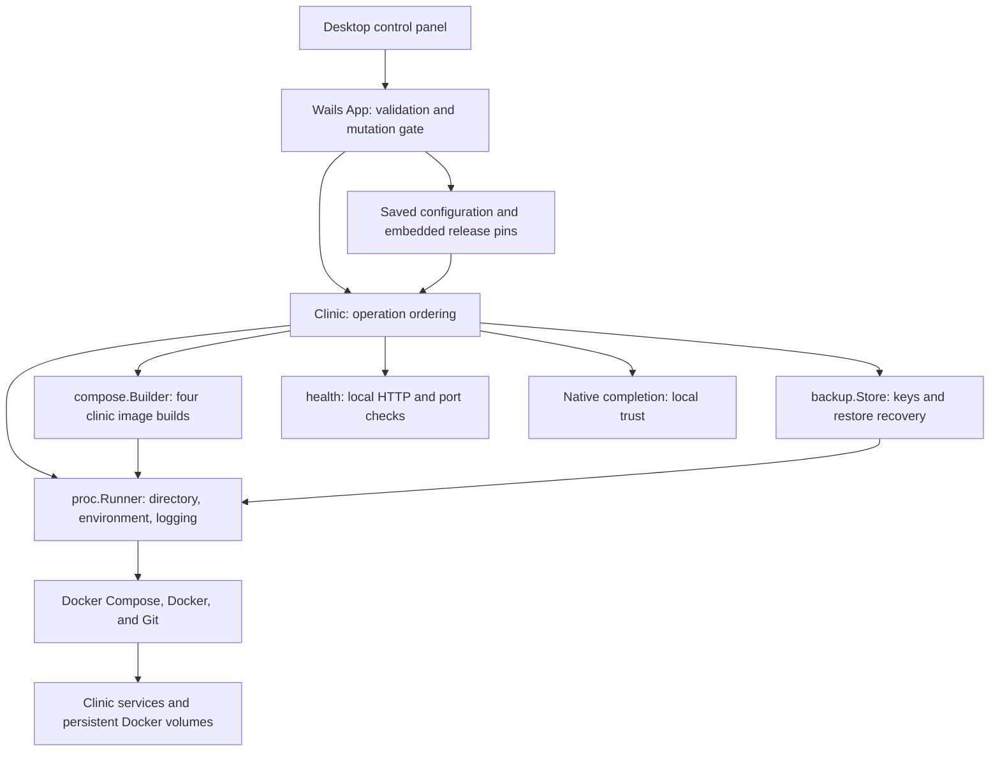
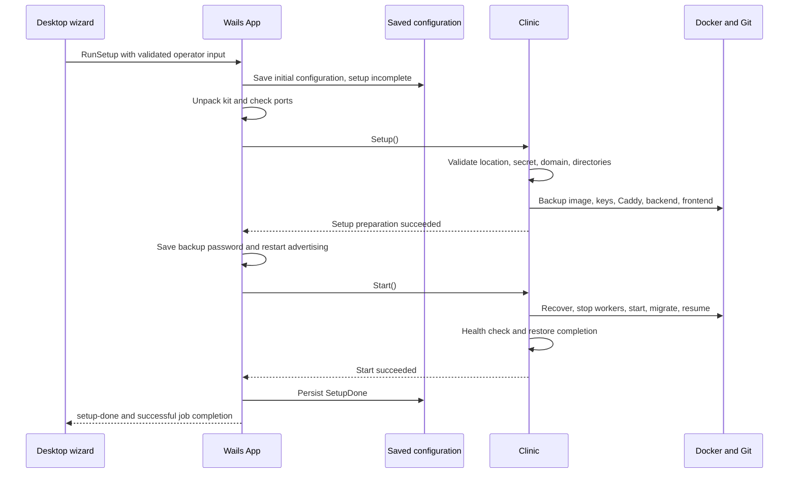
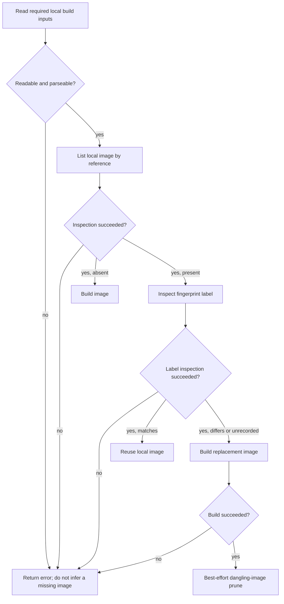
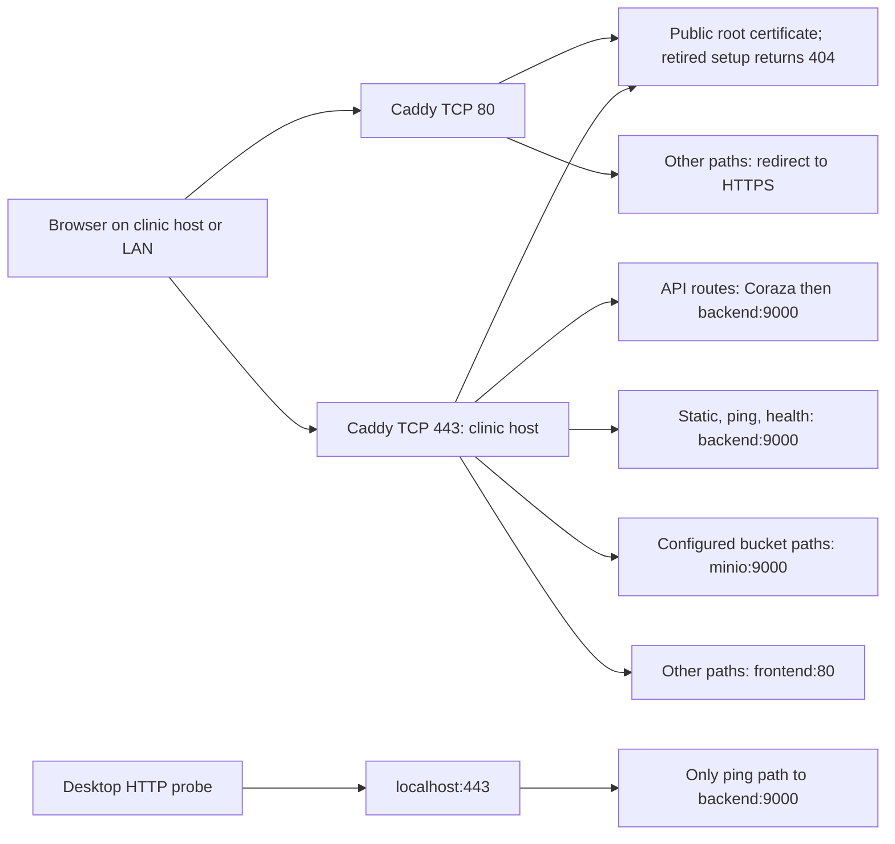
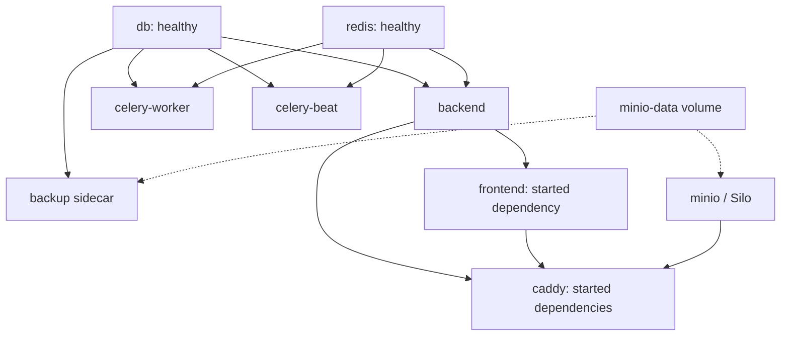
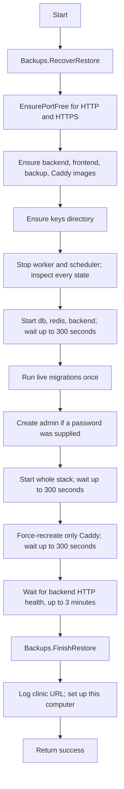

[Documentation index](README.md)

# Clinic lifecycle, images, and deployment

This guide follows the Wails backend from an installed deployment kit to a
running clinic. "Backend" has two meanings here:

- The **desktop Go backend** validates requests and runs local tools.
- The **CARE backend** is the separate Python application inside Docker. It
  serves clinical API requests and shares its image with the task workers.

The Go engine does not implement clinical business logic, run an embedded
database, or replace Docker Compose. Its important work is ordering operations,
carrying consistent configuration into subprocesses, and refusing unsafe
continuation after a failed check.

This describes the current implementation, including verified worker stops,
staged-restore recovery hooks, atomic domain-file replacement, and the Silo
storage replacement. Historical descriptions in `design.md` are not an
alternative specification.

## Reading map

| Guide | Use it for |
| --- | --- |
| [Architecture](architecture.md) | The whole application and its dependency boundaries. |
| [Repository map](repository-map.md) | Finding files outside the engine and deployment kit. |
| [Wails application](wails-application.md) | Bound methods, authorization, job serialization, and completion events. |
| [Configuration and settings](configuration-and-settings.md) | Saved configuration, installed paths, and environment editing. |
| [Backups and restore](backups-and-restore.md) | Encryption, recovery keys, backup scheduling, and the restore state machine. |
| [Native integrations](native-integrations.md) | Process execution, health probes, mDNS, certificates, hosts, and OS changes. |
| [Development and release](development-and-release.md) | Building the desktop executable and selecting release pins. |
| [Cleanup and uninstall](cleanup-and-uninstall.md) | Destructive removal, ownership checks, and retryable partial cleanup. |

The command fragments below describe what the implementation invokes. They are
not a second installation procedure or evidence of a separately installed
`care` command-line program.

## Contents

- [Engine boundaries and file roles](#1-engine-boundaries-and-file-roles)
- [Embedded versus installed material](#2-three-different-copies-of-application-material)
- [Subprocess environment](#3-one-subprocess-environment-for-the-clinic)
- [Setup checkpoints](#4-setup-ordered-preparation-not-a-transaction)
- [Image freshness and source caches](#5-image-builder-freshness-is-local-evidence)
- [Hostname, buckets, and proxy routes](#6-hostname-buckets-and-proxy-routing-form-one-configuration)
- [Deployment inventory](#7-deployment-inventory-and-dependency-graph)
- [Start, migrations, and readiness](#8-start-recovery-migration-safety-then-readiness)
- [Stop, Restart, and rebuilds](#9-stop-restart-and-explicit-rebuilds)
- [Invariants and test boundaries](#10-invariants-diagnostic-clues-and-test-boundaries)

## 1. Engine boundaries and file roles

[`Clinic`](../app/internal/clinic/clinic.go) is a concrete Go struct with methods
such as `Setup`, `Start`, and `Uninstall`. It has no Wails imports, durable
configuration store, or internal job scheduler. The App layer constructs it for
an operation and supplies its dependencies.



Dependency injection here is deliberately concrete: fields, function callbacks,
and a small runner value, rather than a framework or a container registry.

| Injected input | Meaning and limits |
| --- | --- |
| `InstallDir` | The unpacked runtime kit and local source/build workspace, not this repository's checkout. |
| `MDNSName` | The saved clinic name. An empty engine value defaults to `care`. `Host()` normalizes the label and appends `.local`; `Label()` exposes the configured name or default. |
| `AdminPassword` | Used by administrator creation when nonempty. It is not the desktop administrator hash. |
| `BackupPassword` | Input to setup's protected backup-key generation. Saving it in an OS password store is an App responsibility. |
| `BackupDir` | Effective backup destination. Empty means the engine default, `Desktop/care-db-backups` under the user's home directory. |
| `Pins` | A non-nil, validated `release.Pins` supplied by the App. The engine dereferences it; it is not an optional discovery mechanism. |
| `Log` | A nil-safe callback. The App can forward the same line to its persistent log and the desktop. |
| `Confirm` | Native confirmation callback used by OS integrations. It is not a substitute for the App's operation authorization. |

The App owns concurrent-operation guards. Calling a `Clinic` method directly
does not acquire the Wails mutation gate or persist installation state.

### Go files covered here

These are the lifecycle-side files. The companion
[cleanup file table](cleanup-and-uninstall.md#2-source-file-roles) covers the
remaining teardown files and the residue package.

| Source | Responsibility |
| --- | --- |
| [`clinic.go`](../app/internal/clinic/clinic.go) | `Clinic`, nil-safe logging, effective paths/name, runtime environment, runner helpers, and builder construction. |
| [`setup.go`](../app/internal/clinic/setup.go) | Ordered first-time preparation: location check, secret, domain, directories, encryption keys, and images. |
| [`secret.go`](../app/internal/clinic/secret.go) | One-time replacement of the Django secret placeholder. |
| [`domain.go`](../app/internal/clinic/domain.go) | Discover managed hostnames, update selected settings and kit files, and construct the clinic host. |
| [`domain_test.go`](../app/internal/clinic/domain_test.go) | Unmanaged-setting preservation, multiline dotenv handling, mode preservation, idempotence, incomplete setups, and validation before writes. |
| [`start.go`](../app/internal/clinic/start.go) | Restore recovery, prerequisites for startup, worker safety, phased Compose startup, migrations, health, and native completion. |
| [`migrate.go`](../app/internal/clinic/migrate.go) | Verified worker stopping, live and staged migrations, staged PostgreSQL URL construction, and initial administrator creation. |
| [`migrate_test.go`](../app/internal/clinic/migrate_test.go) | Fake-command tests for startup/rebuild ordering, migration/admin failures, stopped-worker verification, and credentials passed through environment rather than command arguments. |
| [`status.go`](../app/internal/clinic/status.go) | Service/state text from Compose, distinct from HTTP health. |
| [`stop.go`](../app/internal/clinic/stop.go) | Data-preserving stop and restart implemented as Stop followed by Start. |
| [`rebuild.go`](../app/internal/clinic/rebuild.go) | Explicit backend and frontend rebuild-and-restart paths. |
| [`compose/build.go`](../app/internal/compose/build.go) | Source checkout cache, image fingerprints, four image builds, local freshness checks, and post-rebuild dangling-image cleanup. |
| [`compose/build_test.go`](../app/internal/compose/build_test.go) | Build-input invalidation, local Git fixtures, source-stamp failures, image inspection failures, consumed build inputs, and empty-context cleanup. |
| [`compose/deployment_test.go`](../app/internal/compose/deployment_test.go) | Silo bootstrap arguments, configurable Caddy bucket routes, and Compose storage-environment wiring. |

Backup-facing `clinic/backup.go`, `backupstore.go`, and
`backup_script_test.go` are documented in [backups and restore](backups-and-restore.md).
The certificate and this-computer files, including
`thiscomputer_test.go`, are documented in [native integrations](native-integrations.md).

## 2. Three different copies of application material

Do not confuse these locations:

1. **Repository deployment sources**, under [`deployments/`](../deployments).
   Developers edit the Compose file, Dockerfiles, environment templates, and
   bootstrap assets here.
2. **The embedded install kit**, staged as `app/install/` when building the
   desktop application. The executable carries it in `installFS`, alongside a
   separate embedded filesystem for the desktop control panel.
3. **The installed kit**, in the App-selected `care-desktop/install` directory.
   Docker bind mounts, environment edits, generated keys, and downloaded CARE
   sources refer to this runtime copy.

[`ensureInstallDir`](../app/app_installdir.go) belongs to the App layer, not
`Clinic.Setup`. It copies the embedded kit to the installed location. Existing
`backend.env` and `frontend.env` are user-maintained files and are preserved;
other embedded kit files can be refreshed. Placeholder `.gitkeep` files are not
installation payloads. The App reapplies the saved domain after normal kit
refresh. It deliberately suppresses that refresh while removal or a pending
restore makes replacement unsafe; see [Wails application](wails-application.md).

`Setup()` therefore assumes its input kit has already been unpacked. It does
not compile the desktop UI, copy the executable, save `SetupDone`, or store the
backup password in the keychain.

### Desktop build versus clinic-image build

| Build | Input and output | When it matters |
| --- | --- | --- |
| Desktop control panel | `app/frontend/` becomes embedded Wails web assets. | Development or desktop release packaging. The panel must work without a running clinic. |
| Desktop Go executable | `app/` plus embedded assets and install kit become the native application. | Development or release packaging. |
| CARE backend image | Pinned CARE backend repository/ref, its production Dockerfile, and optional backend plugins. | Setup, startup freshness checks, or explicit backend rebuild. |
| CARE frontend image | Pinned CARE frontend repository/ref plus installed `frontend.env`, copied into `.env.local`. | Setup, startup freshness checks, or explicit frontend rebuild. This is the clinical browser application. |
| Caddy and backup images | Installed Dockerfiles and pinned base/module inputs. | Setup or startup freshness checks. |

Rebuilding the desktop control panel does not rebuild the CARE frontend
container. Editing `frontend.env` does not change the already embedded desktop
interface.

## 3. One subprocess environment for the clinic

Each call to [`Runner()`](../app/internal/clinic/clinic.go) creates a
`proc.Runner{Dir, Env, Log}`:

- `Dir` is `InstallDir` if it currently exists as a directory, otherwise empty.
  The latter lets label-based inspection run even when installation files are
  absent. It does not make a missing Compose file usable.
- `Env` starts with `os.Environ()` and appends the engine's explicit settings.
  Other host environment values still matter, but not the Docker engine
  selection: see the next two points.
- `PATH` uses `proc.AugmentedPath()` so GUI-launched processes can find Docker
  and Git in their normal installation locations.
- On macOS and Windows, `DOCKER_HOST` is pinned to Rancher Desktop's endpoint
  from `proc.DockerHost()` (`unix://$HOME/.rd/docker.sock`, or
  `npipe:////./pipe/docker_engine`) and `DOCKER_CONTEXT` is set to `default`,
  so the CLI ignores `currentContext` in `~/.docker/config.json` and any
  inherited `DOCKER_HOST`/`DOCKER_CONTEXT`. Docker Desktop rewrites
  `currentContext` to `desktop-linux` every time it starts; without the pin a
  computer with both applications installed silently switched engines, and an
  uninstall then reported success after cleaning the wrong engine while the
  clinic kept running in Rancher Desktop. Every engine, check, residue,
  backup and restore command goes through this runner, so the pin covers all
  of them. Linux keeps the inherited engine (native Docker Engine).
- `Log` is the same callback supplied to the engine.

`dc(args...)` means a runner invocation of `docker compose` with those
arguments. `run` supports per-call environment additions; `capture` returns
trimmed stdout without streaming stderr into the returned string;
`captureLines` returns nonempty trimmed stdout lines. `Run` streams stdout and
stderr through the callback, potentially concurrently. These runner methods
do not automatically impose a timeout on a Git fetch, image build, or
migration.

Executable lookup uses the desktop process's PATH when Go constructs a
command. The App's process-level PATH repair is therefore important as well
as the PATH passed into children; a runner environment alone is not a new
executable-lookup policy. Native process behavior and diagnostics are detailed
in [native integrations](native-integrations.md).

| Environment supplied by the engine | Source |
| --- | --- |
| `COMPOSE_PROJECT_NAME` | Always `care-desktop`. |
| `COMPOSE_FILE` | `InstallDir/docker-compose.yml`. |
| `BACKEND_IMAGE`, `FRONTEND_IMAGE`, `POSTGRES_IMAGE`, `REDIS_IMAGE`, `MINIO_IMAGE`, `CADDY_IMAGE`, `CADDY_WAF_IMAGE`, `BACKUP_IMAGE` | The injected release pins, not arbitrary caller-selected tags. |
| `MINIO_ACCESS_KEY`, `MINIO_SECRET_KEY` | Trimmed `BUCKET_KEY` and `BUCKET_SECRET` from installed `backend.env`. |
| `FILE_UPLOAD_BUCKET`, `FACILITY_S3_BUCKET` | Trimmed values from the same installed backend environment. |
| `CORAZA_MODE` | Normalized backend setting: `On`, `DetectionOnly`, or `Off`. |
| `BACKUP_DIR` | The effective engine backup directory. |

Compose translates the storage credentials to the container variables
`MINIO_ROOT_USER` and `MINIO_ROOT_PASSWORD`. If a backend storage credential is
missing or blank, the engine falls back to the implementation's `minioadmin`
default. That is a default to recognize, not a recommendation or a generated
secret. Empty bucket values fall back in Compose to `patient-bucket` and
`facility-bucket`.

`backendEnv()` returns no parsed settings on a read or dotenv-parse failure;
it does not itself return an error. Thus its callers can fall back to defaults.
Other entry points, including the builder's plugin input read and the
environment editor, have stricter error handling. Do not generalize the
forgiving environment helper into a promise that every configuration error is
ignored.

WAF mode parsing is case-insensitive after trimming. Invalid nonempty input
logs a warning and becomes `Off`; it does not block startup. PostgreSQL and
most other backend settings are read by Compose through `env_file`, rather than
being copied individually into `baseEnv`.

The environment is reconstructed for subprocess calls, not frozen for the
entire lifetime of a `Clinic`. The App's write serialization keeps normal UI
edits from overlapping a job; an external file editor is outside that gate.

## 4. Setup: ordered preparation, not a transaction

The outer App flow validates input, persists initial configuration with setup
still incomplete, installs the kit, and checks port availability. It then
calls `Setup`, stores the backup password, starts advertising, and calls
`Start`. Only after the entire callback succeeds does the App persist
`SetupDone=true`. See [configuration and settings](configuration-and-settings.md)
for that boundary.



### Exact `Clinic.Setup()` checkpoints

[`setup.go`](../app/internal/clinic/setup.go) returns immediately on the first
error. There is no implicit rollback of earlier successful steps.

| Order | Operation | Durable or operational effect |
| --- | --- | --- |
| 1 | `backup.CheckLocation(backupDir, InstallDir)` | Reject an unsafe backup location before setup changes the kit. The backup guide explains the path rules. |
| 2 | `genSecret()` | Replace the Django secret placeholder in installed `backend.env`, if present. |
| 3 | `ApplyDomain()` | Apply the clinic host to managed settings and deployment assets. |
| 4 | Create the backup directory with `MkdirAll(..., 0755)` | The destination may now exist even if later setup fails; its location is logged. |
| 5 | `Backups().EnsureKeysDir()` | Prepare the keys directory before a Docker bind mount can create a root-owned source directory. |
| 6 | `Builder().EnsureBackupImage()` | Make the cryptographic tooling image available. |
| 7 | `Backups().GenBackupKeypair(BackupPassword)` | Generate or validate protected backup-key material and export the recovery copy according to the backup package's rules. |
| 8 | `Builder().EnsureCaddyImage()` | Build Caddy with the configured Coraza module if needed. |
| 9 | `Builder().EnsureBackendImage()` | Ensure the backend image matches source/plugin inputs. |
| 10 | `Builder().EnsureFrontendImage()` | Ensure the clinical frontend matches source/environment inputs. |
| 11 | Log `Setup done.` | Preparation is complete, not proof that the clinic has started or that `SetupDone` was saved. |

The backup image precedes key generation because cryptographic tooling runs
inside that image; the desktop does not assume a suitable host OpenSSL.
Database, Redis, and Silo containers do not start in this method. Docker builds
may still download base images, modules, and packages.

If a later step fails, an earlier secret, key, source checkout, image, or
directory can remain. A safe retry depends on the relevant component's reuse
and ownership checks. A partial setup is not an empty machine; the protected
[failed-install cleanup path](cleanup-and-uninstall.md#7-failed-setup-cleanup-and-the-unused-key-exception)
exists for that reason.

### What secret generation actually does

[`genSecret`](../app/internal/clinic/secret.go) reads `backend.env` and looks for
the literal text `DJANGO_SECRET_KEY=CHANGE_ME`. Only the first occurrence is
replaced. It obtains 40 cryptographically random bytes and encodes them with
unpadded URL-safe Base64, producing about 54 characters.

If the literal placeholder is absent, the file is left alone; this is not a
general secret validator or rotation mechanism. Read, randomness, and write
errors propagate. The generated key remains in the local environment file.
This helper currently uses `os.WriteFile`, not the atomic replacement helper
used by domain/environment editing. It must not be described as part of an
all-or-nothing setup transaction.

This function does not generate PostgreSQL passwords, storage credentials, a
new password for an existing CARE administrator, or a replacement backup
passphrase. The backup keypair and Caddy's local CA are separate key systems
with different owners and lifetimes.

## 5. Image builder: freshness is local evidence

[`compose.Builder`](../app/internal/compose/build.go) owns four built images.
For each, `Ensure...Image` checks whether a local tag exists and carries the
expected input fingerprint. If it is absent or stale, the builder builds the
image locally; it does not merely pull a prebuilt CARE image with the same tag.



An image-listing or image-inspection error is not treated as "image absent."
It returns an error such as `inspect local images` or `inspect image ...`.
An existing image without the expected label, including Docker's `<no value>`
response, is treated as unrecorded and rebuilt.

### Fingerprints and consumed inputs

The fingerprint is stored in the Docker image label
`org.opencontainers.image.base.name`. In this project that label contains the
builder's freshness key; do not interpret it as only the name of a base image.

Let `H(bytes)` mean the first 12 lowercase hexadecimal characters of SHA-256,
and let:

```text
sourceKey(repo, ref) = AppVersion + "+" + ref + "+repo@" + H(repo)
```

| Image | Exact fingerprint components | Build behavior |
| --- | --- | --- |
| Backend | `sourceKey(BeRepo, BeRef)`, plus `+plugs@H(AdditionalPlugs)` only when the plugin string is nonempty. | Build `src/backend/docker/prod.Dockerfile`, tag `BackendImage`, and pass nonempty `ADDITIONAL_PLUGS` as a build argument. |
| Frontend | `sourceKey(FeRepo, FeRef) + "+env@" + H(frontend.env bytes)`. | Copy the entire environment file to `src/frontend/.env.local`, then build that repository with tag `FrontendImage`. |
| Backup | `PostgresImage + "+dockerfile@" + H(backup.Dockerfile bytes)`. | Pass `POSTGRES_IMAGE`, tag `BackupImage`, and use an empty context. |
| Caddy/WAF | `CaddyImage + "+coraza@" + CorazaVersion + "+dockerfile@" + H(caddy.Dockerfile bytes)`. | Pass `CADDY_IMAGE` and `CORAZA_VERSION`, tag `CaddyWafImage`, and use an empty context. |

Consequences worth knowing:

- Changing the desktop app version invalidates the backend and frontend
  fingerprints, but not automatically the backup and Caddy fingerprints.
- Changing a source repository invalidates its source and image, even if the
  ref text is unchanged. Legacy source stamps without the repository hash do
  not count as fresh.
- Changing backend plugins invalidates the backend image. Most other
  `backend.env` values are runtime settings and do not.
- Any byte change to `frontend.env`, including formatting, changes its hash.
  Frontend configuration is compiled into browser-delivered assets.
- `Caddyfile`, `scripts/backup.sh`, and `minio/entrypoint.sh` are runtime mounts,
  not build-fingerprint inputs. Their processes must use the refreshed mounts;
  rebuilding an unrelated image is not how their contents are delivered.
- These are cache keys, not signatures or an audit of every source file.
  The builder does not checksum a reused checkout against its stamped commit.

### Source checkout cache

The builder keeps source in `InstallDir/src/backend` and
`InstallDir/src/frontend`. A `.care-source` file holds the expected source key.

1. If the readable stamp matches after trimming, return the existing directory
   without contacting the repository.
2. If reading the stamp fails for a reason other than absence, return that
   error and preserve the checkout.
3. For a missing or stale stamp, remove the previous component checkout and
   create its parent.
4. Initialize a Git repository, add the configured origin, fetch the requested
   ref with depth 1, and detach at `FETCH_HEAD`.
5. If `release.IsCommitRef(ref)` recognizes a pinned commit, check that
   `rev-parse HEAD` equals the requested commit, case-insensitively.
6. Write the stamp only after successful checkout and verification. A failed
   attempt triggers best-effort removal of the incomplete directory.

A cached development branch is not fetched again merely because the branch
moved upstream. Even explicit `BuildBackend` or `BuildFrontend` can reuse the
matching source stamp. Release ref validation and immutable release
requirements belong to [development and release](development-and-release.md).

There is no `--no-cache` or `--pull` added to these builds. "Rebuild" means run
the build path; Docker may reuse layers, and the source checkout may also be
reused. A changed ref/repository/version can require a new download. Because a
stale checkout is removed before fetching, a failed replacement fetch need not
leave the old checkout available.

### Dockerfile contexts and cache side effects

[`caddy.Dockerfile`](../deployments/caddy.Dockerfile) uses
`${CADDY_IMAGE}-builder` to run `xcaddy build` with the pinned
`github.com/corazawaf/coraza-caddy/v2` module, then copies the resulting binary
into `${CADDY_IMAGE}`. Caddy's runtime configuration is not baked into it.

The Caddy and backup builders create an empty `.care-buildctx-*` directory
under the installed kit and remove it on return. Their Dockerfiles need no
application context, so the full install directory, including keys and
environment files, is not uploaded as their build context. Backend and
frontend builds instead use their respective source directories.

After a successful stale-image replacement through `ensure`, the builder
attempts Docker's dangling-image prune. It does not run that prune for a
matching image, the initial missing-image path, or a direct explicit build.
Prune failure is nonfatal. The prune is **not filtered to this clinic**;
eligible dangling images from other work on the selected Docker engine can
also be removed.

Uninstall's build-cache prune is a different operation and also has shared
scope; see [cleanup and uninstall](cleanup-and-uninstall.md).

### Offline does not mean every cache is complete

Freshness comparison itself uses local inputs and Docker metadata. A matching
source stamp can support a build without another Git fetch. Neither fact
guarantees the whole operation is offline:

- Missing or invalidated CARE source requires access to its repository.
- Missing build bases, build packages, or Coraza module dependencies may need
  downloads.
- Even when all four built images are present, Compose can still need the
  pinned PostgreSQL, Redis, or Silo image.
- Image tags and dependency downloads have their own availability and
  mutability constraints.

Do not promise no internet after a partial setup, a cache prune, or the removal
of just one required image.

## 6. Hostname, buckets, and proxy routing form one configuration

[`ApplyDomain`](../app/internal/clinic/domain.go) manages exactly three files:

| Installed file | Managed content |
| --- | --- |
| `backend.env` | Values assigned to `CSRF_TRUSTED_ORIGINS` and `BUCKET_EXTERNAL_ENDPOINT`. |
| `frontend.env` | Values assigned to `REACT_CARE_API_URL`. |
| `Caddyfile` | Tokens for recognized managed hosts, including the clinic TLS site. |

It validates the clinic label, reads all available files, and parses the
environment files before writing any changes. Missing files are allowed, so a
partial installation can have its available files updated. Other read errors
and dotenv parse errors stop the operation before the write phase.

The managed-host set begins with the template's `example.local`. The code also
recognizes previous `.local` hosts from parseable managed URL values, the
expected Caddy site-block shape. It then replaces **whole matching host tokens**, not every occurrence
of `.local`:

- An unrelated device such as `scanner.local` is not automatically renamed.
- A larger hostname such as `example.local.other` is not a match for the
  template hostname.
- Only the named dotenv assignments are edited. Plugin configuration and other
  settings are preserved even if their values mention the old clinic host.
- The dotenv-aware line handling preserves comments and unrelated multiline
  quoted values rather than rewriting the entire file from a parsed map.

Each changed file is atomically replaced with its existing permission bits.
This is **per-file atomicity**, not a transaction across all three files: a write
failure partway through can leave some files updated. Idempotence and discovery
of previous managed hosts make retries possible. Custom Caddy block shapes or
URL values outside the recognized forms are not a generic configuration
migration API.

Changing the domain has several downstream effects: backend runtime URLs must
change, the frontend's baked environment must be rebuilt when stale, the proxy
must load its current configuration, and the App must handle name advertising.
`ApplyDomain` itself neither starts mDNS nor restarts a container.

### Shared storage settings and the Silo replacement

The deployment pin now selects the published **Silo** storage image, and
[`minio/entrypoint.sh`](../deployments/minio/entrypoint.sh) launches `silo`.
Compatibility names intentionally remain:

- Compose service: `minio`.
- Pin and interpolation names: `MINIO_IMAGE`, `MINIO_ACCESS_KEY`,
  `MINIO_SECRET_KEY`.
- Container credentials: `MINIO_ROOT_USER`, `MINIO_ROOT_PASSWORD`.
- Persistent volume: `minio-data`.
- Internal S3 endpoint and Caddy target: `minio:9000`.
- Readiness endpoint: `/minio/health/ready`.
- Administrative client: `mc`.

Those names carry service discovery, configuration, backup mounts, and storage
ownership. Renaming them as cosmetic cleanup could disconnect the existing
data volume. Keeping names is a wiring-compatibility decision, not an
implementation of an on-disk format migration.

`FILE_UPLOAD_BUCKET` and `FACILITY_S3_BUCKET` flow from the same installed
backend environment into **both** the storage bootstrap and Caddy's path
matchers. The engine also derives storage root credentials from the backend's
bucket credentials. Independent hard-coded copies would allow the API, object
store, and browser proxy to disagree.

The Silo entrypoint:

1. Applies the default patient/facility bucket names if values are empty.
2. Starts `silo server /data --console-address ":9001"` as a child and records
   its PID.
3. Forwards TERM/INT to that child.
4. Polls the compatibility readiness endpoint every two seconds.
5. Configures the local `mc` alias using **container** `MINIO_ROOT_*` values,
   with quoted arguments so literal spaces or shell punctuation remain data.
6. Creates both configured buckets with `mc mb -p`.
7. Enables anonymous download for the facility bucket.
8. Waits for the Silo process.

The script uses `set -e`, so failing alias, bucket, or policy commands fail
bootstrap. Its initial readiness loop has no independent time limit; the
outer Compose startup wait is bounded separately. The readiness healthcheck
can become healthy before the later `mc` bucket/policy steps finish.

The patient bucket is private by default when newly created. The script does
not explicitly revoke an existing public policy on that bucket. Changing a
bucket name creates/uses the newly configured bucket; this script does not
rename old buckets, migrate their objects, or delete the old data.

### Caddy routes

[`Caddyfile`](../deployments/Caddyfile) exposes a same-origin clinic address,
illustrated here as `https://training.local`. No real clinic or credentials are
represented by that example.



| Listener/matcher | Behavior |
| --- | --- |
| HTTP `:80` | Serve the bootstrap routes without requiring prior CA trust; redirect other requests to HTTPS. The redirect is explicit, because automatic HTTPS redirects are disabled globally. |
| Clinic host `:443` | Use Caddy's internal CA, then import bootstrap and normal site routing. |
| `/setup*` | Return 404; no retired setup page or installer is served, including through the frontend fallback. |
| `/root.crt` | Serve only `/data/caddy/pki/authorities/local/root.crt`, the public local CA certificate, without query or referer restrictions. The native client sends `?ok=1` for older-server compatibility. |
| `/api/*` | Run the Coraza WAF, then proxy to `backend:9000`. |
| `/static/*`, `/ping/*`, `/health/*` | Proxy to the backend without the API-specific WAF block. |
| Configured patient/facility bucket path prefixes | Proxy to `minio:9000` without exposing an object-storage host port. |
| Remaining clinic site paths | Proxy to `frontend:80`. |
| `localhost:443` | Dedicated internal-TLS site that proxies `/ping/*` to the backend for desktop health checks, not a second full clinical frontend. |

The normal site enables gzip and removes the `Strict-Transport-Security`
response header. Server protocols are restricted to HTTP/1 and HTTP/2; the kit
does not expose a UDP HTTP/3 listener.

Caddy's container writes `SecRuleEngine <mode>` into
`/etc/caddy/waf-mode.conf` at startup, then executes Caddy. `Off` is the default;
`DetectionOnly` evaluates without the blocking behavior of `On`. The image
still contains Coraza in all modes. WAF coverage in this configuration is the
API route, not every asset or object download.

The CA names include `CARE Desktop Local CA` for the root and
`CARE Desktop Local CA - Intermediate` for the intermediate. These are also
native cleanup identifiers, not arbitrary display text to rename casually.

### Why Start force-recreates Caddy

The full-stack `up` is followed by a separate Caddy operation using
`--no-deps --force-recreate`. A runtime environment change can require fresh
bucket matchers or a new WAF mode. An atomically replaced bind-mounted
`Caddyfile` can also leave an existing container attached to the old file
inode. Merely finding the image current, or having Compose leave an unchanged
container running, is not sufficient evidence that Caddy is using the current
kit.

The explicit recreation refreshes the proxy with current mounts and
environment before the HTTP health wait. It does not rebuild the Caddy image
or force-recreate all other services, and it can briefly interrupt proxy
connections.

## 7. Deployment inventory and dependency graph

[`docker-compose.yml`](../deployments/docker-compose.yml) declares the
`care-desktop` project and a default network explicitly named `care-desktop`.
All services join that network. Only Caddy publishes host ports. All nine
services use `restart: unless-stopped`.

In this table, `healthy` means a Compose `service_healthy` dependency;
`started` means the short-form dependency, not verified application readiness.
Ports shown as internal are not host-published by this kit.

| Service | Image pin and process | Dependencies | Persistent/bind-mounted material | Ports |
| --- | --- | --- | --- | --- |
| `db` | `POSTGRES_IMAGE`; image default process, `backend.env`. | None. | `postgres-data` at `/var/lib/postgresql/data`. | PostgreSQL internally, normally 5432; no host mapping. |
| `redis` | `REDIS_IMAGE`; image default process. | None. | `redis-data` at `/data`. | Redis internally, normally 6379; no host mapping. |
| `minio` | `MINIO_IMAGE` now selecting Silo; `/bin/sh /entrypoint.sh`. | None. | `minio-data` at `/data`; `minio/entrypoint.sh` read-only. | S3 9000 and console 9001 internally; neither published. |
| `backend` | `BACKEND_IMAGE`; `bash start.sh`, `backend.env`. | `db` and `redis` healthy. | No application-data volume declared here. | API 9000 internally. |
| `celery-worker` | `BACKEND_IMAGE`; `bash celery_worker.sh`, `backend.env`. | `db` and `redis` healthy. | No dedicated volume declared here. | No published port. |
| `celery-beat` | `BACKEND_IMAGE`; `bash celery_beat.sh`, `backend.env`. | `db` and `redis` healthy. | No dedicated volume declared here. | No published port. |
| `frontend` | `FRONTEND_IMAGE`; image default process, with configuration baked at build time. | `backend` started. | No host environment-file mount. | Web server 80 internally. |
| `caddy` | `CADDY_WAF_IMAGE`; generate WAF mode file and execute Caddy. | `backend`, `frontend`, `minio` started. | `Caddyfile` read-only; `caddy-data` at `/data`; `caddy-config` at `/config`. | Host TCP 80 to 80 and TCP 443 to 443. |
| `backup` | `BACKUP_IMAGE`; `/bin/sh /backup.sh`, `backend.env`. | `db` healthy. | Backup script read-only; selected backup directory writable at `/backups`; `keys/` read-only; `minio-data` read-only at `/minio-data`. | No published port. |



The dependency file alone does **not** enforce "migrations before workers."
That invariant is implemented by `Clinic.Start` and `RebuildBackend`.

| Named volume | Normal Compose name | Why it survives Stop |
| --- | --- | --- |
| `postgres-data` | `care-desktop_postgres-data` | Holds the live relational database. |
| `redis-data` | `care-desktop_redis-data` | Holds Redis persistence. |
| `minio-data` | `care-desktop_minio-data` | Holds uploaded objects and storage-server data; also mounted read-only by backup. |
| `caddy-data` | `care-desktop_caddy-data` | Holds Caddy state, including the clinic CA. |
| `caddy-config` | `care-desktop_caddy-config` | Holds Caddy configuration state. |

These are Docker volumes, not subdirectories of the repository or ordinary
exported backups. Deleting them during uninstall is destructive even when the
separate backup directory is retained.

The Go engine always supplies `BACKUP_DIR`. Compose's own fallback
`${BACKUP_DIR:-./db-backups}` is relevant to direct Compose use, not the
engine's default `Desktop/care-db-backups` location.

### Deployment file roles

| Source | Role |
| --- | --- |
| [`docker-compose.yml`](../deployments/docker-compose.yml) | Service definitions, dependency conditions, shared settings, network, volumes, ports, and healthchecks. |
| [`Caddyfile`](../deployments/Caddyfile) | TLS sites, public certificate bootstrap, API/WAF routing, bucket paths, and localhost health routing. |
| [`caddy.Dockerfile`](../deployments/caddy.Dockerfile) | Compile Caddy with the pinned Coraza module and copy it into the runtime base. |
| [`minio/entrypoint.sh`](../deployments/minio/entrypoint.sh) | Run Silo, wait for readiness, establish buckets and facility download policy, and forward shutdown signals. |

Client onboarding is native CARE Desktop functionality, described in
[native integrations](native-integrations.md#native-client-setup-and-trust-on-first-use).
The public root bootstrap is not the CA's private key. Existing unused setup
files need not be deleted from installed kits: current routes and mounts no
longer expose them.

The backup Dockerfile and backup script are described in
[backups and restore](backups-and-restore.md).

## 8. Start: recovery, migration safety, then readiness

[`Start()`](../app/internal/clinic/start.go) is more than a Compose `up`.
Its ordering is also used by `Restart`, and it is the entry point for an
unfinished restore to recover safely.



Every error-returning step above aborts subsequent steps. The final two native
helpers have no error return; they provide their own diagnostics instead of
turning an otherwise healthy stack into a failed Start.

Device-script refresh needs an extractable Caddy public root and an existing
setup directory. If those are unavailable it can skip writing; older scripts
are not automatically removed. This-computer setup can try unprivileged hosts
and trust changes before asking once for any remaining privileged steps.
Positive local-browser readiness requires both a rechecked hosts mapping and
a verified TLS handshake. Declining that optional work leaves the clinic
running but does not prove that this computer or every other device can open
it.

### Exact phase boundaries

| Phase | Engine behavior | Failure meaning |
| --- | --- | --- |
| Restore recovery | `Backups().RecoverRestore()` runs first. | An uncertain restore must not be bypassed by an ordinary start. No later startup work runs on error. |
| Ports | `health.EnsurePortFree(Runner(), host)` checks for conflicts on 80/443 while recognizing an already-running clinic proxy. | A conflicting listener blocks startup instead of failing later with only a port-bind error. |
| Images | Ensure backend, frontend, backup, then Caddy. | Input/inspection/build errors propagate. Existing workers have not yet been deliberately stopped by this Start path. |
| Keys | Ensure the bind-mount source exists. | Do not allow Compose to create the missing key directory with unintended ownership. |
| Worker guard | Stop and verify worker/scheduler state. | No migration is attempted without verified quiescence of these processes. |
| Core startup | Compose `up -d --wait --wait-timeout 300 db redis backend`. | Return an explicit backend-startup error; verified-stopped workers remain stopped. |
| Live migration | Execute `python manage.py migrate --noinput` in the running backend. | Return an actionable migration error; do not resume workers. |
| Administrator | Create the initial administrator when requested. | Unexpected creation failure also prevents worker resumption. |
| Full stack | Compose `up -d --wait --wait-timeout 300` with no service selector. | Some services, including workers, may already have started before an error. There is no automatic rollback. |
| Proxy refresh | Compose `up` for Caddy only, with `--no-deps --force-recreate` and the same wait settings. | Return `the proxy could not be refreshed with the current configuration`. |
| HTTP readiness | `health.Wait(Log, 3*time.Minute)`. | An apparently running Compose stack is not enough; failure leaves the started resources for diagnosis. |
| Restore completion | `Backups().FinishRestore()`. | A cleanup/finalization error is still a Start error, even if the HTTP probe succeeded. |
| Local usability | Log the clinic URL, then set up this computer. | Missing trust or declined elevation is reported through native diagnostics with advice to retry starting CARE or ask an administrator; see the native guide. |

There is no total five-minute startup deadline. Each Compose wait has its own
300-second allowance, image builds precede them, and the HTTP wait has a
separate three-minute allowance.

### Verified worker stop

[`stopWorkers`](../app/internal/clinic/migrate.go) does not trust a successful
stop command alone:

1. Stop `celery-worker` and `celery-beat`.
2. Query all their Compose container IDs, including stopped containers.
3. If there are no IDs, there is nothing to verify.
4. Inspect `.State.Status` for every returned ID.
5. Require the number of returned states to match the number of IDs.
6. Accept only `exited` or `created`. Running, restarting, paused, dead, or
   otherwise unexpected states block migration.

Stop failure and Compose inspection failure explicitly say no migrations were
attempted. Docker state-inspection errors also propagate; a missing or
incomplete answer is never permission to continue.

`migrate()` invokes the migration command **once**. It does not perform a
20-attempt retry loop. After a migration failure, the operator must resolve
the cause and use Start again; automatically restarting workers against an
uncertain schema would defeat the guard.

This guard stops the worker and scheduler, not every possible database writer.
It is not a global maintenance mode: an already-running proxy, API clients, or
other services are not all quiesced by `stopWorkers`. The staged restore path
has separate coordination described in the backup guide.

### Administrator creation is narrow and explicit

[`createAdmin`](../app/internal/clinic/migrate.go) is skipped when
`AdminPassword` is empty. When supplied, it executes Django's noninteractive
`createsuperuser` in the running backend with:

- Username `admin`.
- The fixed identifier `admin@care.local`, not an address derived from the
  current mDNS hostname.
- The password supplied as `DJANGO_SUPERUSER_PASSWORD` in the child
  environment. The command arguments contain only the environment variable
  name, not its value.

Success logs creation. Only these exact final output lines are accepted as
the harmless "already exists" outcome:

```text
CommandError: Error: That username is already taken.
CommandError: That username is already taken.
```

That outcome leaves the existing user and password unchanged. A connection
failure, an unrelated "already taken" phrase, or any other failed command is
an error containing the process error and trimmed command output. Treat logs
as potentially sensitive; passing a password outside the argument list is
not a guarantee that every dependency's diagnostic output is secret-free.

The App generally supplies this password for first setup, not every normal
Start. The local desktop administrator hash and CARE's database user are
separate; this code does not synchronize later password changes.

### Pending restores and the staged migration callback

The backup package owns the restore journal, staging, rollback/recovery
decisions, and final cleanup. The engine delegates rather than duplicating
that state machine:

- `Clinic.Backups()` constructs a store with the clinic runner, directories,
  image pins, host, project, and log. Its `EnsureImage` callback ensures the
  backup image; `EnsureRestoreImages` ensures backend then backup;
  `Migrate(database, restoreID)` points to `migrateStaged`, not live `migrate`.
- `Start`, `RebuildBackend`, and `RebuildFrontend` call `RecoverRestore` before
  their normal work.
- A successful full Start calls `FinishRestore` only after the HTTP health
  wait.
- Ordinary `Stop` does not finalize a restore.
- The App allows Start as a recovery route while restricting other mutations
  when a restore is pending. Those App guards remain distinct from the engine
  hooks.

With no journal, recovery and finalization are ordinary no-ops. With a journal,
recovery removes and verifies only helpers belonging to that project and
restore identity.
`prepared` recovery can reverse an interrupted data cutover after checking
resource identities; `staging` recovery can mark the unfinished preparation
rolled back. An already `committed` or `rolled-back` restore does not replay
older data over later writes. `RecoverRestore` establishes which data ordinary
startup may use; it does not independently activate the full clinic or prove
health.

When a journal exists, `FinishRestore` accepts only committed/rolled-back
outcomes, cleans up identity-checked previous/staging resources, and removes
the journal last.
It does not run its own HTTP check. This is why the caller's ordering matters,
and why a finalization failure is still reported even after successful HTTP
readiness.

[`migrateStaged(database, restoreID)`](../app/internal/clinic/migrate.go)
supplies migrations for a staged database without redirecting the live
backend:

1. Require a 24-character hexadecimal restore ID and the exact database name
   `care_restore_<restoreID>`.
2. Read and parse installed `backend.env`; unlike the forgiving runtime helper,
   errors here fail the operation.
3. Use a valid `postgres`/`postgresql` `DATABASE_URL`, or construct one from
   `POSTGRES_USER`, `POSTGRES_PASSWORD`, `POSTGRES_HOST`, and `POSTGRES_PORT`
   with defaults for user/host/port.
4. Preserve connection details, escaped credentials, IPv6 addressing, and
   other URL options, but replace the database path and remove conflicting
   `dbname` and `database` query options.
5. Set PostgreSQL's application identity to
   `care-desktop:restore:<restoreID>`.
6. Run a one-off backend container with `--rm --no-deps`, entrypoint `python`,
   and the migration command. Its name is
   `care-desktop-restore-<restoreID>-migrate`, and its restore label is
   `org.care-desktop.restore=<restoreID>`.

`POSTGRES_DB`, `DATABASE_URL`, and `PGAPPNAME` are conveyed through the child
environment and `-e` variable names. Database credentials are not embedded in
command arguments. The container name, label, and database application
identity give recovery code a bounded identity for its own work.

This callback is not itself a restore transaction or an independent operator
entry point. Restore calls it on the staged database before stopping live
writers for cutover; it is not the live-startup migration path guarded by
`stopWorkers`. See [backups and restore](backups-and-restore.md) for when it is
safe to call and how staged data becomes live.

### What "ready" means at each layer

| Signal | What it proves | What it does not prove |
| --- | --- | --- |
| Docker/Compose tool checks | Required tool and daemon capabilities are available. | Images exist or the clinic answers requests. |
| `db` healthcheck | `pg_isready -U postgres` succeeds. Declared interval 10 seconds, five retries, 10-second start period. | All CARE migrations completed. |
| `redis` healthcheck | `redis-cli ping` succeeds. Declared interval 10 seconds, five retries. | Worker/scheduler processing is safe for the current schema. |
| `minio` healthcheck | HTTP readiness endpoint on internal port 9000 responds successfully to `curl -f`. Declared interval 10 seconds, five retries. | Bucket and policy bootstrap has necessarily finished. |
| Compose `--wait` | Selected services satisfy Compose's running/healthy criteria. | Every clinical request or frontend asset has been tested. Other services have no healthcheck declared in this kit, though their images can supply one. |
| Desktop HTTP health | A GET to Caddy's dedicated `https://localhost/ping/` route returns HTTP 200, with a three-second request timeout and TLS certificate verification disabled for this local probe. | LAN mDNS resolution, CA trust, authenticated server identity, response-body correctness, or full clinical functionality. |
| Successful `Start` | Ordered startup, migration/admin guards, HTTP wait, and restore completion returned successfully. | Every optional native convenience was approved or every client device trusts the CA. |
| `Status()` | Compose service/state text from `{{.Service}} {{.State}}`. | The richer HTTP readiness or native reachability verdict. |

Using localhost for the HTTP probe separates server health from a broken
`.local` lookup. Native trust and LAN discovery must be checked separately.
`Ping` reports request errors as inactive with code 0 and a detail such as
`nothing answering on :443`; non-200 responses report the received status.
It closes the response body but does not validate a CARE-specific body marker.
Its certificate-verification bypass is limited to this readiness purpose,
not the separate trust check.

`Wait` logs failed attempts and sleeps three seconds between probes. It checks
its deadline after a probe, so elapsed time can exceed the nominal
three-minute allowance by polling/request time.

The port check is also a preflight heuristic, not a socket reservation or an
identity guarantee. It skips probes if Compose lists a running `caddy`;
otherwise it tries IPv4 loopback connections to 80 and 443 with
700-millisecond timeouts. On macOS/Linux, an optional `lsof` lookup can add the
listener's process name. It does not find every IPv6-only or LAN-only listener
or prevent a later bind race. Further transport details are in
[native integrations](native-integrations.md).

## 9. Stop, Restart, and explicit rebuilds

| Method | Ordered path | Important limitation |
| --- | --- | --- |
| `Stop()` | Log `Stopping CARE (data kept)...`, then Compose `stop`. | Does not remove containers, volumes, images, keys, settings, or native trust. A stop error propagates. |
| `Restart()` | Call `Stop`; if successful, call the full `Start`. | This is not Compose `restart`: it includes recovery, freshness checks, migrations, Caddy recreation, and health. Stop failure prevents Start. |
| `RebuildBackend()` | Recover pending restore work; explicitly build backend; stop/verify workers; start/wait backend; migrate once; start/wait worker and scheduler. | No administrator creation, whole-stack HTTP wait, Caddy refresh, native setup, or `FinishRestore` call in this method. |
| `RebuildFrontend()` | Recover pending restore work; explicitly build frontend; start/wait frontend. | Does not run migrations, stop workers, perform the full health wait, or refresh Caddy. |

Both rebuild methods use Compose waits of 300 seconds per selected startup
phase. Short-form and healthy dependencies can also cause required dependency
services to start; neither method requests `--no-deps` for its application
service.

Backend building happens **before** stopping workers, so a build failure does
not unnecessarily pause a healthy worker fleet. Once the worker guard has
succeeded, backend-startup or migration failure leaves workers deliberately
stopped. If worker resumption itself fails, the method returns that error and
does not pretend the rebuild is complete.

An explicit frontend build reads the current `frontend.env` and rewrites the
source checkout's `.env.local`. It may still reuse both the source stamp and
Docker build layers; explicit rebuild is not an upstream-update or cache-wipe
operation.

## 10. Invariants, diagnostic clues, and test boundaries

### Invariants grounded in the current code

1. Every engine Compose call carries the same project name, installed Compose
   path, image pins, backup destination, and derived storage settings.
2. Preparing the kit, starting services, and saving `SetupDone` are different
   checkpoints owned by different layers.
3. An image inspection failure is not evidence of an absent image; a source
   stamp read failure is not permission to delete a checkout.
4. Backend migrations require a verified worker/scheduler stop, and failed
   migration or administrator creation must not resume them.
5. The full-stack startup phase is followed by a forced Caddy refresh and a
   separate backend HTTP health wait.
6. A pending restore has its own recovery protocol; ordinary startup calls its
   recovery and completion hooks rather than discarding its journal.
7. Silo retains the `minio` identity across Compose, environment, routing,
   health, and volume mounts.
8. Docker data volumes, exported backups, and source/image caches are different
   resources with different retention rules.

### Common failure interpretation

| Symptom | Read it as |
| --- | --- |
| `Setup done.` followed by failure | Preparation finished; Start or final App persistence still failed. Investigate partial setup, not only the last image build. |
| Backend input or fingerprint error | Installed inputs, source selection, or Docker inspection is unavailable; do not delete a cache just because inspection failed. |
| Worker still running or state count mismatch | The migration guard intentionally refused to proceed. Fix process/daemon state before retrying. |
| Migration/admin startup error | Core services may be up, but workers are intentionally held stopped. Avoid bypassing the engine with a raw all-services startup. |
| Caddy refresh error | Current mounts/environment could not be applied to the proxy. A prior container/image is not proof that the configuration took effect. |
| Compose succeeds but HTTP wait fails | Container readiness and application response are separate checks. Routing, backend behavior, or delayed readiness still needs diagnosis. |
| HTTP healthy but `.local` does not open | Check mDNS, local hosts mapping, firewall, and certificate trust separately. |
| Error after HTTP success during restore completion | The clinic can answer while restore finalization still needs recovery. Preserve the pending state and follow the backup guide. |

### What the existing tests validate

The lifecycle tests use fixture files and fake executables to inspect exact
arguments, environment propagation, and ordering without a real clinic.
Builder tests also create local Git repositories to exercise shallow fetches,
commit verification, and reuse after the fixture origin becomes unavailable.
POSIX shell fixtures are skipped on Windows where noted in the source.

Deployment tests distinguish three levels: a fake Silo/`mc` bootstrap,
a static Caddy matcher assertion, and a Compose-configuration test that needs
the Docker Compose executable but does not start services. These are not live
container, migration, Silo-format, TLS, or clinical acceptance tests.

This documentation work does not require running Docker, starting a clinic, or
running a broad test suite. When changing behavior later, preserve these seams
and choose the smallest existing tests that cover that behavior.
