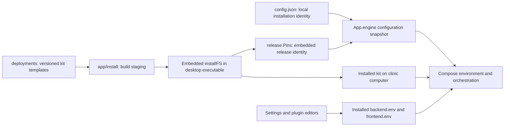
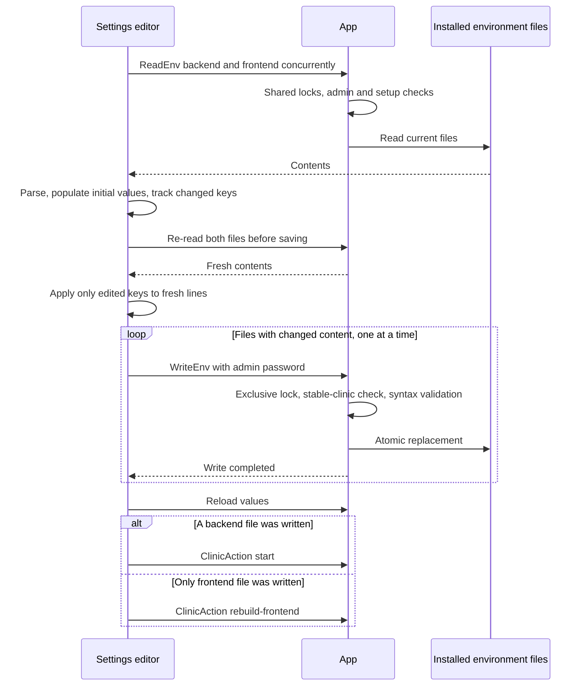

# Configuration and settings

[Documentation index](README.md)

The backend has several configuration layers. Understanding their ownership prevents a common mistake: changing a source template while expecting an already installed clinic to read it.

## Configuration layers



| Layer | Owner | Purpose |
| --- | --- | --- |
| `deployments/.env` | Maintainer | Desktop version, upstream repositories/commits, and image pins. |
| Other `deployments/` files | Maintainer | The Compose stack, initial environment templates, proxy and helper programs. |
| `app/install/` | Build process | Staging for Go embedding; not the place for source edits. |
| Embedded `installFS` | Desktop executable | Immutable copy of the kit used by that build. |
| Installed kit | Application | Runtime files used by Docker Compose. |
| Installed `backend.env` / `frontend.env` | Clinic operator and application-managed fields | Clinic-specific settings preserved during kit refresh. |
| `config.json` | `App` | Local setup/removal state, name, backup path, and desktop administrator hash. |
| OS keyring | Backup package | Saved backup password; separate from `config.json`. |

## Local paths

[`configPath()`](../app/app_config.go) starts with Go's `os.UserConfigDir()`, falls back to `os.UserHomeDir()` on failure, requires an absolute result, and appends `care-desktop/config.json`.

[`installDir()`](../app/app_installdir.go) normally places `install` beside that configuration file. On Windows, when an absolute home directory is available, the installed kit instead lives under the user's home directory. This avoids making the potentially roaming application-configuration directory the normal home for source checkouts and Docker bind mounts.

| Platform | Typical configuration file | Typical installed kit |
| --- | --- | --- |
| macOS | `~/Library/Application Support/care-desktop/config.json` | `~/Library/Application Support/care-desktop/install/` |
| Windows | `%AppData%\care-desktop\config.json` | `%UserProfile%\care-desktop\install\` |
| Linux | `$XDG_CONFIG_HOME/care-desktop/config.json`, normally `~/.config/care-desktop/config.json` | `install/` beside `config.json`. |

These are conventions, not hard-coded assumptions about every user's home or environment. The actual paths come from the functions above.

The effective backup destination comes from `GetBackupDir()` / `Clinic.BackupDirPath()`, not by appending a directory to the executable's location. Without a configured override, it is `<user home>/Desktop/care-db-backups`. Its data layout is described in [backups and restore](backups-and-restore.md). The diagnostic log has its own OS-specific location, described in [native integrations](native-integrations.md).

The installed kit contains the following recognizable parts:

```text
install/
|-- .env
|-- docker-compose.yml
|-- backend.env
|-- frontend.env
|-- Caddyfile
|-- backup.Dockerfile
|-- caddy.Dockerfile
|-- scripts/
|   `-- backup.sh
|-- minio/
|   `-- entrypoint.sh
|-- setup/
|   `-- device-setup page and generated public trust material
`-- keys/
    |-- backup-cert.pem
    `-- backup-key.pem.enc
```

Image building and restore add their own working material. See the relevant guides for source-checkout and restore-staging paths. Patient database and object-storage data live in Docker volumes, not in this source/configuration tree. Keys and configuration are nevertheless sensitive and must not be treated as disposable cache.

## Persisted `Config`

[`app_config.go`](../app/app_config.go) defines a small JSON object:

| JSON field | Go field | Meaning |
| --- | --- | --- |
| `setup_done` | `SetupDone` | The full setup callback, including starting CARE, succeeded and that result was saved. |
| `removing` | `Removing` | Destructive cleanup began but may not have completed. Omitted when false. |
| `mdns_name` | `MDNSName` | Saved clinic name, normally such as `care.local`. |
| `backup_dir` | `BackupDir` | Effective selected backup directory, not just the picker parent. Empty means use the engine default. |
| `admin_pw_hash` | `AdminPwHash` | Bcrypt hash for local desktop administrative authorization. |

The plaintext administrator and backup passwords are not fields in this object. Setup passes the administrator password into CARE administrator creation, but subsequent desktop authorization compares against this local hash. The code does not continuously synchronize that hash with later password changes inside the clinical web application.

### Load rules

A missing file is the only ordinary first-run fallback. Other read errors propagate. Invalid JSON, JSON `null`, a non-object value, a non-absolute saved backup path, and an invalid saved hostname stop initialization with a descriptive error.

There is no versioned configuration migration framework. JSON decoding uses the current struct and tolerates unknown object fields; it does not make missing fields evidence that external clinic resources are absent.

`App` loads the file once into a cache guarded by `cfgMu`. `App.loadConfig()` returns a struct copy. Editing `config.json` externally does not update the running cache; it is not a watched configuration file.

### Write and forget rules

`saveConfig()` serializes indented JSON and uses `atomicfile.Write` with mode `0600`. It updates the in-memory copy only after the write succeeds. The atomic helper uses a temporary file in the destination directory, syncing and replacing it through platform-specific code.

`forgetConfig()` removes the saved file, tolerates it already being absent, and clears the cache only when removal succeeds. Cleanup must not forget this state before it has finished the resource-removal steps that may need retry information.

Atomic replacement protects a single file. It is not a transaction across Docker resources, the keyring, two environment files, and `config.json`.

## Setup configuration order

[`RunSetup()`](../app/app_actions.go) validates the two passwords before accepting the asynchronous job. It normalizes the name, defaults an empty name to `care`, and validates the label.

Inside the protected job, it rejects an installed or removing clinic, creates the administrator's bcrypt hash, computes and validates the backup destination, and persists the initial configuration. `SetupDone` is still false at this point.

It then unpacks the kit, checks port availability, runs `Clinic.Setup()`, saves the backup password in the OS keyring, restarts name advertising, and runs `Clinic.Start()`. Only the job runner's successful completion path persists `SetupDone=true`.

A failure after configuration or files were created is therefore a partial setup, not proof that nothing was installed. The retry path is [failed-install cleanup](cleanup-and-uninstall.md).

## Embedded-kit refresh

`ensureInstallDir()` walks the embedded `install` tree. It skips the placeholder, creates directories, writes shell scripts as executable, and copies other kit files with ordinary file modes.

Its preservation allow-list contains exactly `backend.env` and `frontend.env`: existing copies are not overwritten. Other kit files are refreshed from the executable. This includes `.env`, so the shipped pins do not become an independently editable runtime release mechanism.

Refresh copies the current kit but is not a general recursive deletion or a migration framework for all generated files. Similarly, preserving environments means a new template key is not automatically merged into an existing environment.

The startup refresh is skipped for incomplete setup, incomplete removal, and pending restore. A pending restore must keep the configuration its recovery metadata expects.

## Environment-file API

[`envPath()`](../app/app_env.go) accepts only `backend` and `frontend`, mapping them to fixed filenames under the installed kit. It is not an arbitrary file-reading or file-writing API.

`ReadEnv` checks the desktop administrator password and setup state under a shared read lock, then reads the entire installed file. File errors are returned; there is no fallback to the repository template or an empty settings object.

`WriteEnv` checks the administrator password and stable-clinic state under the exclusive lock. It validates syntax using `compose-go/dotenv`, then atomically writes the selected file as `0600`.

This syntax check is not full application-specific validation. The friendly editor adds field-level constraints; a direct caller can submit settings the dotenv parser accepts but CARE later rejects. The backend also uses this same syntax parser for the frontend file, although the CARE frontend ultimately consumes its environment through its own build tooling.

## Applying settings

The desktop's settings integration consists of four files:

| File | Role |
| --- | --- |
| [`env-editor.tsx`](../app/frontend/src/screens/panel/env-editor.tsx) | Loads both files, tracks changed fields, validates the draft, writes changes, and requests apply/rebuild. |
| [`env-file.ts`](../app/frontend/src/lib/env-file.ts) | Parses line records, reads values, quotes changes, and serializes the result. |
| [`env-schema.ts`](../app/frontend/src/screens/panel/env-schema.ts) | Maps user-facing fields to keys, files, control types, defaults, bounds, and managed-key notes. |
| [`env-controls.tsx`](../app/frontend/src/screens/panel/env-controls.tsx) | Converts the raw string/undefined draft into a suitable control without replacing explicit zero with an empty value. |



A backend change uses Start to reapply configuration; Start also accounts for a changed CARE frontend environment through image freshness. A frontend-only change uses the narrower frontend rebuild action.

`WriteEnv` alone does not restart a container or rebuild an image. Saving a file and applying it are two operations. The editor only requests the apply action after its write loop and reload.

Re-reading before writing avoids deliberately applying an old full-file snapshot over newer plugin edits. It is not a multi-file transaction or compare-and-swap protocol. If a later file write fails, earlier successful writes remain; if an apply action fails, the saved settings are still saved.

### Retention as an example

The shipped [`backend.env`](../deployments/backend.env) sets:

```dotenv
DB_BACKUP_RETENTION_PERIOD=14
```

The editor reads this value from the installed file. Its schema puts it in the backend, gives it an integer control, requires a value, and allows 0 through 3650 days. The control has no hard-coded retention fallback.

`0` is an explicit value meaning keep all backups. It must remain the string `"0"` through parsing, draft state, saving, and reloading; absence and zero have different meanings. The scheduled writer implements the actual pruning rules described in the [backup guide](backups-and-restore.md).

Both files must load before the editor accepts a draft. A failed frontend read can therefore also leave a backend field such as retention unloaded. The shared read gate is essential: parallel file reads must not produce an exclusive-job conflict on an idle application.

### Parsing and customization boundaries

The editor retains a list of comments, blank lines, and `KEY=value` records rather than regenerating a file from a plain object. Duplicate recognized keys use the last value when reading; changes update all recognized occurrences so an older duplicate cannot silently win.

The line parser is deliberately smaller than a full dotenv implementation: recognized assignments use plain `KEY=value` syntax. Hand-edited `export KEY=value`, spacing around the key/equals sign, and complex multiline or quoted-inline-comment forms should not be assumed to have the same interpretation in the editor as in Compose. For friendly controls, use ordinary assignment lines.

Serialization preserves line order and unrelated recognized values, but normalizes line endings to LF and blank-line whitespace. It is structure-preserving, not byte-for-byte preservation of every possible hand-formatted file.

The schema covers backups, staff sign-in, patient sign-in/SMS, email, branding, region, visits, registration, billing/pharmacy, and form behavior. Defaults are display/application defaults, not instructions to insert every absent key on save.

Undescribed non-hidden keys appear in "Other settings." New `REACT_` keys are directed to the frontend; other new keys go to the backend. Explicit custom overrides are applied after the described controls, so they win for the same key.

Hidden keys are an interface policy, not a security boundary. Some can be added manually, but fields owned by the engine may be rewritten later.

## Managed values

The engine manages the clinic's domain wiring, including trusted origins, the external bucket endpoint, and the CARE frontend API address. It also provisions the Django secret during setup and passes selected bucket/WAF settings into the proxy configuration.

Do not change these values independently and expect the engine to stop managing them. Read the [domain and deployment flow](clinic-lifecycle.md) before changing how the hostname or public bucket URLs are derived.

The storage configuration retains `MINIO_IMAGE`, `MINIO_ROOT_*`, the service name `minio`, and its existing data volume even though the server executable is Silo. Those identifiers are compatibility and ownership contracts, not evidence that the old executable should be launched.

Treat both environment files as sensitive. The backend file contains service credentials; frontend values can be incorporated into browser-delivered assets and must not be used to hide a secret from staff browsers.

## Backend plugins

[`internal/plugins`](../app/internal/plugins/plugins.go) owns `ADDITIONAL_PLUGS` in `backend.env`. Each plugin has `name`, `package_name`, optional `version`, and optional `configs`.

The read path first parses dotenv, then parses the selected variable as JSON. An absent/empty variable or JSON `null` becomes an empty plugin list. A missing environment file or malformed JSON is an error, not "no plugins."

The write path serializes the plugin list, removes duplicate assignments including recognized `export` forms, preserves unrelated lines, validates the resulting dotenv, and atomically replaces the file. An empty list removes the variable. Quoting protects literal configuration values from accidental expansion.

The Go API supports JSON-compatible configuration values. The current desktop table presents configuration as flat key/value rows and infers primitive booleans and numbers from text; it is not a general nested-JSON editor.

`SavePlugins` only persists. [`plugin-table.tsx`](../app/frontend/src/screens/panel/plugin-table.tsx) follows it with `ClinicAction("rebuild-backend", adminPassword)` because backend plugins are incorporated into the backend image. Frontend plugins are not managed through this table.

## Changing the backup destination

`SetBackupDir` takes a selected parent and appends `care-db-backups`. It validates placement and writability, checks for another installation's recovery data, and inspects whether the backup sidecar is running.

Before saving the new path it copies the installation's recovery key to the destination without overwriting a different key. After saving, it recreates the backup sidecar only if it was running. If that restart fails, it attempts to restore the previous configuration and sidecar, reporting rollback errors as well.

Earlier backups and their key are left in the previous directory; changing the destination is not a file migration. This ordering prevents a seemingly successful folder change from leaving the new backups without their decryption material.

## Relevant regression coverage

[`app_env_test.go`](../app/app_env_test.go) covers concurrent environment/plugin reads, mutation exclusion, closing, administrator/lifecycle guards, and retention save/read values including zero. [`plugins_test.go`](../app/internal/plugins/plugins_test.go) covers literal plugin configuration round trips and duplicate removal.

The underlying atomic-file behavior and the clinic's domain rewriting have their own tests, indexed in [the repository map](repository-map.md). Those layers matter independently of how a friendly control is rendered.
