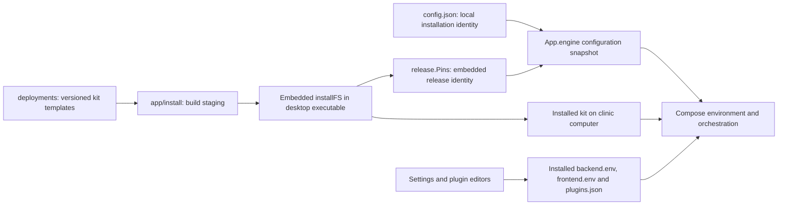
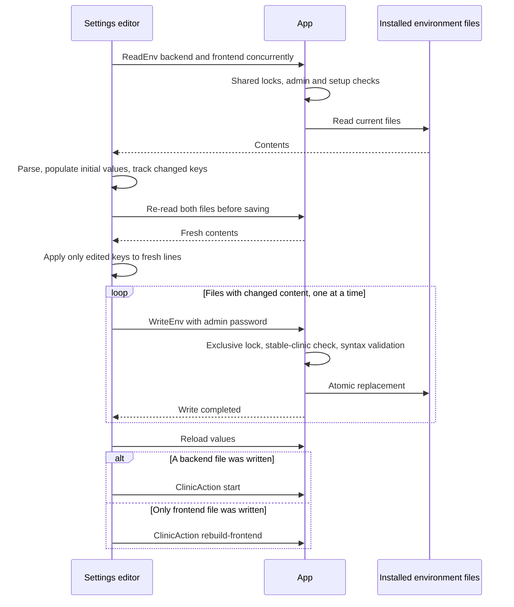

# Configuration and settings

[Documentation index](README.md)

The backend has several configuration layers. Understanding their ownership prevents a common mistake: changing a source template while expecting an already installed clinic to read it.

## Configuration layers


```mermaid
flowchart LR
    Source["deployments: versioned kit templates"] --> Stage["app/install: build staging"]
    Stage --> Binary["Embedded installFS in desktop executable"]
    Binary --> Installed["Installed kit on clinic computer"]
    Config["config.json: local installation identity"] --> Engine["App.engine configuration snapshot"]
    Binary --> Pins["release.Pins: embedded release identity"]
    Pins --> Engine
    Engine --> Compose["Compose environment and orchestration"]
    Installed --> Compose
    Editor["Settings and plugin editors"] --> RuntimeEnv["Installed backend.env, frontend.env and plugins.json"]
    RuntimeEnv --> Compose
```

| Layer | Owner | Purpose |
| --- | --- | --- |
| `deployments/.env` | Maintainer | Desktop version, upstream repositories/commits, and image pins. |
| Other `deployments/` files | Maintainer | The Compose stack, initial environment templates, proxy and helper programs. |
| `app/install/` | Build process | Staging for Go embedding; not the place for source edits. |
| Embedded `installFS` | Desktop executable | Immutable copy of the kit used by that build. |
| Installed kit | Application | Runtime files used by Docker Compose. |
| Installed `backend.env` / `frontend.env` | Clinic operator and application-managed fields | Clinic-specific settings preserved during kit refresh. |
| `config.json` | `App` | Local setup/removal state, name, backup path, and desktop administrator hash. |
| Exported recovery materials | Clinic manager | Private backup recovery file and printable Desktop admin recovery codes, kept outside the installation and backup folder. |

## Local paths

[`configPath()`](../app/app_config.go) starts with Go's `os.UserConfigDir()`, falls back to `os.UserHomeDir()` on failure, requires an absolute result, and appends `care-desktop/config.json`.

[`installDir()`](../app/app_installdir.go) normally places `install` beside that configuration file. On Windows, when an absolute home directory is available, the installed kit instead lives under the user's home directory. This avoids making the potentially roaming application-configuration directory the normal home for source checkouts and Docker bind mounts.

| Platform | Typical configuration file | Typical installed kit |
| --- | --- | --- |
| macOS | `~/Library/Application Support/care-desktop/config.json` | `~/Library/Application Support/care-desktop/install/` |
| Windows | `%AppData%\care-desktop\config.json` | `%UserProfile%\care-desktop\install\` |
| Linux | `$XDG_CONFIG_HOME/care-desktop/config.json`, normally `~/.config/care-desktop/config.json` | `install/` beside `config.json`. |

These are conventions, not hard-coded assumptions about every user's home or environment. The actual paths come from the functions above.

The effective backup destination comes from `GetBackupDir()` / `Clinic.BackupDirPath()`, not by appending a directory to the executable's location. Without a configured override, Windows uses `care-db-backups` inside its Desktop known folder (including OneDrive redirection); other platforms use `<user home>/Desktop/care-db-backups`. A failed Windows known-folder lookup logs a warning before using the legacy home-relative Desktop path. Saved overrides remain unchanged. Its data layout is described in [backups and restore](backups-and-restore.md). The diagnostic log has its own OS-specific location, described in [native integrations](native-integrations.md).

The installed kit contains the following recognizable parts:

```text
install/
|-- .env
|-- channel.lock
|-- docker-compose.yml
|-- backend.env
|-- frontend.env
|-- plugins.json
|-- plugins-pending.json       # inactive draft, until apply consumes it
|-- plugin-recovery.json      # only while apply or recovery is unfinished
|-- Caddyfile
|-- backup.Dockerfile
|-- caddy.Dockerfile
|-- scripts/
|   `-- backup.sh
|-- minio/
|   `-- entrypoint.sh
`-- keys/
    `-- backup-cert.pem
```

Image building and restore add their own working material. See the relevant guides for source-checkout and restore-staging paths. Patient database and object-storage data live in Docker volumes, not in this source/configuration tree. Keys and configuration are nevertheless sensitive and must not be treated as disposable cache.

## Persisted `Config`

Entering actual setup persists the choice to host a clinic (**Server**); attempting
a connection persists the choice to use a clinic (**Client**). The Start screen
itself only navigates and does not save a role. Clients retain the clinic address and use native certificate
bootstrap, without provisioning Docker/Git or advertising mDNS. Role selection
is not an ordinary settings toggle; it remains locked until successful uninstall.
Failed-install cleanup/retry preserves it. The one exception is the **Back**
button on the setup and client screens, which undoes a choice nothing has been
built on yet (see `ClearRole` below). The server-specific fields below still govern hosted clinics.

Client connection state includes the saved clinic URL, the public pinned
certificate (`client_certificate`), and whether this client installed it
(`client_certificate_owned`). Certificate ownership is used for exact-certificate
cleanup, not broad removal of every CARE root. Neither the PEM nor ownership
flag is exposed in `AppState`; its client fields are `role` and `client_url`.
The pin and ownership state are
persisted before OS elevation to preserve retry and cleanup information.
Subsequent connects use the saved pin rather than silently accepting a new
HTTP certificate. **Disconnect** clears
the connection, certificate state and role after successful removal;
failures keep retry state. It does not uninstall the executable.
Certificates not installed by this client remain trusted and may still permit
browser access. Uninstall the setup before removing the executable through the OS.
See [client removal](native-integrations.md#removing-client-access).

[`app_config.go`](../app/app_config.go) defines a small JSON object:

| JSON field | Go field | Meaning |
| --- | --- | --- |
| `role` | `Role` (`string`) | Persisted `server` or `client`; empty before setup/connection begins and after successful uninstall. Failed-install cleanup does not reset it. |
| `client_url` | `ClientURL` (`string`) | Normalized HTTPS clinic address for a client, empty when disconnected. |
| `client_certificate` | `ClientCertificate` (`string`) | Pinned public root PEM; omitted when empty. |
| `client_certificate_owned` | `ClientCertificateOwned` (`bool`) | Whether this client owns certificate installation/cleanup; omitted when false. |
| `setup_done` | `SetupDone` | The full setup callback, including starting CARE, succeeded and that result was saved. |
| `removing` | `Removing` | Destructive cleanup began but may not have completed. Omitted when false. |
| `mdns_name` | `MDNSName` | Saved clinic name, normally such as `care.local`. |
| `backup_dir` | `BackupDir` | Effective selected backup directory, not just the picker parent. Empty means use the engine default. |
| `admin_pw_hash` | `AdminPwHash` | Bcrypt hash for local desktop administrative authorization. |
| `admin_recovery_hashes` | `AdminRecoveryHashes` | Six SHA-256 code-hash slots; a used slot is cleared. No plaintext codes. |
| `admin_recovery_path` | `AdminRecoveryPath` | Exported Desktop recovery-code sheet location. Setup checks that a regular, readable file still contains the six distinct saved codes; symlinks and oversized sheets are rejected. |
| `recovery_failures` / `recovery_retry_after` | `RecoveryFailures` / `RecoveryRetryAfter` | Persisted failed-attempt count and Unix timestamp for offline recovery throttling. |
| `backup_certificate` | `BackupCertificate` | Public encryption certificate prepared before installation. Never the private key. |
| `backup_recovery_path` / `backup_recovery_verified` | `BackupRecoveryPath` / `BackupRecoveryVerified` | Export location and successful setup verification; not used as an automatic restore-key fallback. |

The plaintext administrator password and private recovery file are not stored in this object. There is no backup password. Setup passes the administrator password into CARE administrator creation, but subsequent Desktop changes and recovery affect only the local bcrypt hash, not the CARE web login.

### Load rules

A missing file is the only ordinary first-run fallback. Other read errors propagate. Invalid JSON, JSON `null`, a non-object value, a non-absolute saved backup path, and an invalid saved hostname stop initialization with a descriptive error.

There is no versioned configuration migration framework. JSON decoding uses the current struct and tolerates unknown object fields; it does not make missing fields evidence that external clinic resources are absent.

Existing server settings or a partial installation infer the Server role.
The first-run question itself writes nothing: `BeginServerSetup() error`
persists the Server role when the operator enters setup, and `ConnectClient`
persists the Client role when a connection is attempted. `SelectRole(role
string) error` remains for an interface that still announces the choice up
front; it delegates to the same work. Either way the role is rejected once it is
set and a different one is asked for. `ClearRole() error` is the escape hatch
for a misclick: it writes an empty `Config` and returns to the role choice, but
only while the file holds nothing beyond `role`, `mdns_name` and preparatory
recovery-kit fields and the install directory is empty. The `mdns_name` allowance exists because the setup form
pushes the default clinic address as soon as it opens, so a server choice that
was never installed still carries one. Any other field — an admin hash, backup
directory, `setup_done`, `removing`, a client URL, pinned certificate or
certificate ownership — or a populated install directory means the role is in
use and `ClearRole` refuses with the uninstall-first message. A client that has
connected therefore has no Back button; **Disconnect** is its way
out. Client and unchosen state queries avoid Docker and backup inspection.

`App` loads the file once into a cache guarded by `cfgMu`. `App.loadConfig()` returns a struct copy. Editing `config.json` externally does not update the running cache; it is not a watched configuration file.

### Write and forget rules

`saveConfig()` serializes indented JSON and uses `atomicfile.Write` with mode `0600`. It updates the in-memory copy only after the write succeeds. The atomic helper uses a temporary file in the destination directory, syncing and replacing it through platform-specific code.

`forgetConfig()` retains the role: for a server it writes a role-only
configuration after cleanup; for a client it preserves the current
configuration. Client connection/certificate cleanup belongs to
`DisconnectClient()`. Successful client/server uninstall calls
`resetConfigAfterUninstall()` to atomically clear all configuration, including the
role. Retained backups do not re-infer a server role. Cleanup must not discard
state needed to retry incomplete resource removal.

Atomic replacement protects a single file. It is not a transaction across Docker resources, exported recovery files, two environment files, and `config.json`.

## Setup configuration order

[`ValidateSetup()`](../app/app_setup_check.go) returns actionable issues against
their wizard steps. [`RunSetup()`](../app/app_actions.go) repeats the complete
preflight under the exclusive job lock before accepting asynchronous work. It
checks disk space, platform prerequisites, residue, the network profile, the
clinic address, the backup destination, both recovery exports, and the Desktop
password. Export paths must remain outside CARE's own folders. Validation
rejection leaves the operator on Review rather than starting an installation
that is already known to fail.

The wizard checks the entered name without advertising it, and advertising
performs another conflict check after setup. Keep other clinic servers awake
during setup: an offline or multicast-isolated device cannot be detected.

Inside the protected job, it rejects an installed or removing clinic, creates the administrator's bcrypt hash, computes and validates the backup destination, and persists the initial configuration. `SetupDone` is still false at this point.

It then unpacks the kit, checks port availability, runs `Clinic.Setup()` with the public backup certificate, restarts name advertising, and runs `Clinic.Start()`. Only the job runner's successful completion path persists `SetupDone=true`.

A failure after configuration or files were created is therefore a partial setup,
not proof that nothing was installed. While the original process retains the
attempt, `RetrySetup()` preserves its choices and recovery materials, revalidates
their availability, and skips preparation if it already completed. It does not
accept replacement settings. After a full app restart, or when that attempt is
no longer available, the UI explains the destructive
[failed-install cleanup](cleanup-and-uninstall.md) fallback before retrying.

## Embedded-kit refresh

`ensureInstallDir()` walks the embedded `install` tree. It skips the placeholder, creates directories, writes shell scripts as executable, and copies other kit files with ordinary file modes.

Its preservation allow-list contains exactly `backend.env` and `frontend.env`: existing copies are not overwritten. Other kit files are refreshed from the executable. This includes `.env`, so the shipped pins do not become an independently editable runtime release mechanism.

This is why the commit a clinic currently runs is kept in `channel.lock` rather than in `.env`. `channel.lock` is not part of the embedded tree, so the refresh neither creates nor overwrites it; it is removed with the installed kit during uninstall. A corrupt or missing lock is treated as "nothing known yet" rather than an error: the clinic resolves the branch again. So is a lock naming something that is not a commit, which is the one case where "nothing known yet" is a guess worth making rather than a value worth trusting.

Writes go through a process-wide mutex and a temporary file renamed into place, because the background check and an operator pressing "Install now" can reach the lock at the same time, and a half-written lock would lose the record of what the clinic is running.

Facility setup lives in the [CARE Onboarding frontend plugin](onboarding.md); its assets are not bundled into the kit. Existing `plugins.json` choices are preserved and catalog defaults are initialized only during new-clinic setup.

Refresh copies the current kit but is not a general recursive deletion or a migration framework for all generated files. Similarly, preserving environments means a new template key is not automatically merged into an existing environment.

The startup refresh is skipped for incomplete setup, incomplete removal, and pending restore. A pending restore must keep the configuration its recovery metadata expects.

## Advanced access and authorization

[`advanced-tab.tsx`](../app/frontend/src/screens/panel/advanced-tab.tsx) starts a
fixed `15 * 60 * 1000` millisecond timer after a successful password unlock.
Typing, navigation within settings groups and other activity do not extend it.
Leaving Advanced, leaving the panel or using Lock clears the unlock sooner.
A successful password change starts a fresh unlock with the new password.

Expiry clears the retained password, selected settings group and mounted
sensitive/unsaved form state. The page reports that Advanced has locked.
Already written files and accepted native jobs are not rolled back; saved
settings that still need applying remain distinguishable from an unsaved draft.

This timer exists in React. Go does not issue a 15-minute session token or
remember a globally unlocked administrator. `ReadEnv`, `WriteEnv`, protected
rebuilds, recovery administration and uninstall validate the supplied Desktop
password through their native guards. Ordinary clinic controls, Updates and
Plugins have their own lifecycle rules and do not acquire this Advanced unlock.

The Desktop password is distinct from the operating-system password used for
privilege prompts and from the CARE web login after initial setup. See
[recovery materials](backups-and-restore.md#3-backup-recovery-file-and-desktop-admin-recovery).

## Environment-file API

[`envPath()`](../app/app_env.go) accepts only `backend` and `frontend`, mapping them to fixed filenames under the installed kit. It is not an arbitrary file-reading or file-writing API.

`ReadEnv` checks the desktop administrator password and setup state under a shared read lock, then reads the entire installed file. File errors are returned; there is no fallback to the repository template or an empty settings object.

`WriteEnv` checks the administrator password and stable-clinic state under the exclusive lock. It validates syntax using `compose-go/dotenv`, then atomically writes the selected file as `0600`.

This syntax check is not full application-specific validation. The friendly editor adds field-level constraints; a direct caller can submit settings the dotenv parser accepts but CARE later rejects. The backend also uses this same syntax parser for the frontend file, although the CARE frontend ultimately consumes its environment through its own build tooling.

## Applying settings

The desktop's settings integration uses these modules:

| File | Role |
| --- | --- |
| [`env-editor.tsx`](../app/frontend/src/screens/panel/env-editor.tsx) | Loads both files, tracks changed fields, validates the draft, writes changes, and requests apply/rebuild. |
| [`env-file.ts`](../app/frontend/src/lib/env-file.ts) | Parses line records, reads values, quotes changes, and serializes the result. |
| [`advanced-env.ts`](../app/frontend/src/screens/panel/advanced-env.ts) | Validates values, summarizes groups, and merges only changed keys into freshly read files while preserving unrelated bytes. |
| [`env-schema.ts`](../app/frontend/src/screens/panel/env-schema.ts) | Maps user-facing fields to keys, files, control types, defaults, bounds, and managed-key notes. |
| [`env-controls.tsx`](../app/frontend/src/screens/panel/env-controls.tsx) | Converts the raw string/undefined draft into a suitable control without replacing explicit zero with an empty value. |


```mermaid
sequenceDiagram
    participant E as Settings editor
    participant A as App
    participant F as Installed environment files
    E->>A: ReadEnv backend and frontend concurrently
    A->>A: Shared locks, admin and setup checks
    A->>F: Read current files
    F-->>E: Contents
    E->>E: Parse, populate initial values, track changed keys
    E->>A: Re-read both files before saving
    A-->>E: Fresh contents
    E->>E: Apply only edited keys to fresh lines
    loop Files with changed content, one at a time
        E->>A: WriteEnv with admin password
        A->>A: Exclusive lock, stable-clinic check, syntax validation
        A->>F: Atomic replacement
        A-->>E: Write completed
    end
    E->>A: Reload values
    alt A backend file was written
        E->>A: ClinicAction start
    else Only frontend file was written
        E->>A: ClinicAction rebuild-frontend
    end
```

A backend change uses Start to reapply configuration; Start also accounts for a changed CARE frontend environment through image freshness. A frontend-only change uses the narrower frontend rebuild action.

`WriteEnv` alone does not restart a container or rebuild an image. Saving a file and applying it are two operations. The editor only requests the apply action after its write loop and reload.

Re-reading before writing avoids deliberately applying an old full-file snapshot over newer plugin edits. This Advanced environment-editor flow is not a multi-file transaction or compare-and-swap protocol. If a later file write fails, earlier successful writes remain; if an apply action fails, the saved settings are still saved. The separate Plugins editor uses the [rollback transaction](plugins.md#save-and-apply) instead.

### Retention as an example

The shipped [`backend.env`](../deployments/backend.env) sets:

```dotenv
DB_BACKUP_RETENTION_PERIOD=14
```

The editor reads this value from the installed file. Its schema puts it in the backend, gives it an integer control, requires a value, and allows 0 through 3650 days. The control has no hard-coded retention fallback.

`0` is an explicit value meaning keep all backups. It must remain the string `"0"` through parsing, draft state, saving, and reloading; absence and zero have different meanings. The scheduled writer implements the actual pruning rules described in the [backup guide](backups-and-restore.md).

Both files must load before the editor accepts a draft. A failed frontend read can therefore also leave a backend field such as retention unloaded. The shared read gate is essential: parallel file reads must not produce an exclusive-job conflict on an idle application.

### Parsing and customization boundaries

The editor retains a list of comments, blank lines, and `KEY=value` records rather than regenerating a file from a plain object. Duplicate recognized keys use the last value when reading; changes update all recognized occurrences so an older duplicate cannot silently win.

The Advanced merge layer recognizes ordinary and `export` assignments, spacing
around the equals sign, and quoted multiline values. Unedited comments, blank
lines, line endings and secret values remain byte-for-byte unchanged. Edited
assignments are quoted and normalized individually; new values use the file's
existing line-ending convention. Friendly controls and new custom edits require
single-line values. This is still not a replacement for the native dotenv parser.

The normal clinic editor exposes ten everyday choices:

| Group | Settings |
| --- | --- |
| Clinic details | Clinic display name and languages for staff. |
| Patients and visits | Usual visit type and a shorter registration form. |
| Billing | Usual payment method, payment instructions, tax-inclusive prices and opening a bill after dispensing. |
| Backups | How long to keep backups. |
| Staff access | How long inactive staff stay signed in. |

Less-used local options, such as logos, country defaults, enabled visit types,
form preferences and queue refresh timing, are not part of these groups. They
keep their existing values or CARE's defaults and can be overridden in
**Extra settings (for support)**. Saving an everyday choice does not reset or
insert those options. The usual visit selector still checks the clinic's saved
enabled visit types before accepting a new choice.

Email and patient sign-in/SMS controls are not offered. Their environment keys,
along with SMTP, OTP, MFA/TOTP and reCAPTCHA configuration, are hidden from
"Extra settings (for support)" and cannot be added there. Existing values,
including backend placeholders needed at startup, remain untouched when other
settings are saved.
This is an editor restriction, not a change to CARE's authentication or existing
MFA configuration. Local password rate limiting, idle sign-out, request
protection and offline Desktop recovery remain available. Branding URLs can
point to assets hosted on the clinic's local network.

Undescribed non-hidden keys appear in "Extra settings (for support)." New
`REACT_` keys are directed to the frontend; other new keys go to the backend.
The editor rejects duplicate names, names already owned by a described control,
and protected keys.

Protected keys cannot be changed through this editor, including
`ADDITIONAL_PLUGS`, service credentials and generated connection settings.
The editor preserves their latest file contents when saving other changes.
This is an interface policy, not a new native security boundary: authenticated
`WriteEnv` still validates syntax rather than an application-specific key
allow-list, and engine-owned values may be rewritten by the engine.

### Defaults and manual overrides

Explicit values in the installed environment files override CARE's corresponding
defaults. The settings panel edits those same files; it is not a separate
configuration layer. Friendly controls replace their own keys, and the support
editor can add or change other permitted keys. Before saving, both paths read
the latest files and merge only the operator's edits.

Frontend values are copied into CARE's `.env.local` when its image is built.
They take effect after applying the changes and rebuilding the frontend.
Clearing an optional friendly control removes its assignment and lets CARE's
default apply. In the support editor, an explicitly blank `KEY=` stays blank;
blank and missing values can behave differently depending on the CARE setting.
The editor's fallback hints do not write defaults into the file.

The new-install frontend template includes these visit/address settings:

| Key | Shipped value | Meaning |
| --- | --- | --- |
| `REACT_DEFAULT_ENCOUNTER_TYPE` | Empty | No explicit preset. A single enabled visit type is selected automatically; otherwise staff choose. Set `hh` for Home health. |
| `REACT_PATIENT_REG_MIN_GEO_ORG_LEVELS_REQUIRED` | `0` | The currently configured CARE frontend clamps this to **1 required address level**, not an optional address. |
| `REACT_PATIENT_REGISTRATION_DEFAULT_GEO_ORG` | Unset (commented example) | No prefilled area. A support override must use the UUID of an existing CARE geographic organization, not its name. |

The address settings are support-only. CARE's current behavior is defined in
[`care.config.ts`](https://github.com/ohcnetwork/care_fe/blob/90d9a412e179584d5534d354bd4c7c61f42452da/care.config.ts#L283-L303).
Unlike generic extra settings, the default area cannot have a blank assignment:
CARE's [build validator](https://github.com/ohcnetwork/care_fe/blob/90d9a412e179584d5534d354bd4c7c61f42452da/scripts/validate-env.ts)
requires a UUID when this key is present. The editor rejects blank or malformed
area IDs; remove the setting to clear the default area.
Existing installations preserve their `frontend.env`, so template changes do
not replace an existing clinic's choices or migrate missing keys automatically.

## Managed values

The engine manages the clinic's domain wiring, including trusted origins, the external bucket endpoint, and the CARE frontend API address. It also provisions the Django secret during setup and passes selected bucket/WAF settings into the proxy configuration.

Do not change these values independently and expect the engine to stop managing them. Read the [domain and deployment flow](clinic-lifecycle.md) before changing how the hostname or public bucket URLs are derived.

The storage configuration retains `MINIO_IMAGE`, `MINIO_ROOT_*`, the service name `minio`, and its existing data volume even though the server executable is Silo. Those identifiers are compatibility and ownership contracts, not evidence that the old executable should be launched.

Treat both environment files as sensitive. The backend file contains service credentials; frontend values can be incorporated into browser-delivered assets and must not be used to hide a secret from staff browsers.

## Updates

The **Updates** tab shows both update mechanisms without a Desktop admin password prompt. The **Plugins** tab also allows viewing, saving and applying plugins without that prompt. Advanced retains password-protected environment settings and administration; its red rebuild card sits immediately above uninstall at the bottom.

| Card | Shows | Actions |
| --- | --- | --- |
| CARE | The tracked branch, the commits in use, and checking, up-to-date, staged-update or failed-check state. | Check now; retry a failed check; install a staged update now. |
| CARE Desktop | The installed version against the newest published GitHub release, with its notes. | Download the verified installer for this platform and launch it. |

CARE Desktop's shared controller remains guarded after native completion while
an installer/restart handoff is unresolved. Only a completed external-installer
handoff can be acknowledged with Done in Updates (OK before installation or on
clients). A restarting phase waits for reopening. Acknowledgement does not
update the running version or claim the external installer succeeded.
Interrupted picker/preflight work is invalidated rather than resumed when the
guard is released; see [the update protocol](wails-application.md).

The panel also raises a banner when a CARE update finishes building, so operators need not keep the Updates tab open. Declining the banner is not declining the update: it stops the prompt for that commit, and the staged build is applied at the next start, when no clinic is running and applying it costs a retag instead of a restart.

The app checks hourly, but only while the clinic is actually serving. Until then it re-examines every thirty seconds and checks nothing, because a check competing with the start it is racing helps nobody. A clinic that later stops serving drops back to that thirty-second wait, so a check is never made against a clinic that is down. The loop ends only when the app closes, the desktop is switched to a client, or the clinic is being removed. These desktops stay on for weeks, so a check that only ran at launch would leave a verified fix unreachable until somebody restarted the app.

"Check now" does not start a second check when one is already running; it joins
the one in flight. The card follows the `care-check` event, so it reports
automatic and requested checks. "Checking" lasts until any found commit has
finished building, not only until the branch head is resolved. Checks are
skipped without a working network, during setup/removal, and while another job
holds the clinic. Reported failures carry `care-check.error` and appear with a
friendly retry action; they never become a false "Up to date" result. An offline
clinic can continue working without updating.

## Plugins

The active plugin list is stored in `plugins.json` beside `backend.env`. Its backend parts are written to `ADDITIONAL_PLUGS` in `backend.env`, and the settings editor refuses to edit that variable directly. Desktop saves edits as a separate `plugins-pending.json` draft; applying preserves the previous configuration and backend image in a durable rollback transaction until clinic health is verified. Failed recovery is retried through Start, and `GetState.plugin_recovery_pending` exposes the recovery controls. The catalog format, storage, and apply flow are documented in [Plugins](plugins.md).

## Changing the backup destination

`SetBackupDir` takes a selected parent and appends `care-db-backups`. It validates placement and writability, checks for another installation's recovery data, and inspects whether the backup sidecar is running.

Before saving the new path it copies the public backup certificate to the destination without overwriting a different certificate. The private recovery file is never copied into the backup folder. After saving, it recreates the backup sidecar only if it was running. If that restart fails, it attempts to restore the previous configuration and sidecar, reporting rollback errors as well.

Earlier backups and their public certificate are left in the previous directory;
changing the destination is not a file migration. The private recovery file
stays wherever the manager exported it. The ordering prevents a new backup
destination from being activated without its matching public certificate.

## Relevant regression coverage

[`app_env_test.go`](../app/app_env_test.go) covers concurrent environment/plugin reads, mutation exclusion, closing, administrator/lifecycle guards, and retention save/read values including zero. [`plugins_test.go`](../app/internal/plugins/plugins_test.go) covers literal plugin configuration round trips and duplicate removal.

The underlying atomic-file behavior and the clinic's domain rewriting have their own tests, indexed in [the repository map](repository-map.md). Those layers matter independently of how a friendly control is rendered.

[`advanced.spec.ts`](../app/frontend/tests/advanced.spec.ts) covers the exact
15-minute unlock boundary, tab-leave clearing, recovery/password flows, sensitive
field handling, latest-file merging and failed apply behavior.
[`backups.spec.ts`](../app/frontend/tests/backups.spec.ts) covers destination
changes, restore consent and stale async work across a Desktop update.
