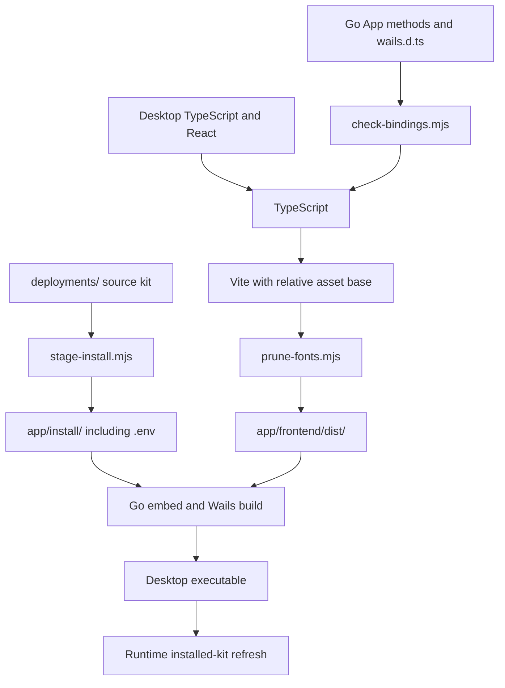

# Development and release

[Documentation index](README.md)

This guide explains how backend source becomes a desktop application and how that desktop application later builds the clinic. Those are separate build systems.

## The different builds

| Build | Inputs | Output | When it happens |
| --- | --- | --- | --- |
| Desktop frontend | `app/frontend/src/`, package lock, Vite configuration | `app/frontend/dist/` | Developer or release build. |
| Desktop executable | `app/*.go`, `app/internal/`, Go dependencies, both embedded trees | Wails application under `app/build/bin/` | Developer or release build. |
| Installer/package | Wails application, platform metadata, optional signing configuration | macOS `.dmg` or Windows NSIS setup executable | Release workflow. |
| Clinic infrastructure images | Deployment Dockerfiles and base-image/module pins | Backup and Caddy/Coraza images | Clinic setup or when their inputs change. |
| CARE backend/frontend images | Pinned upstream source, generated build inputs, clinic settings/plugins | Images tagged for this clinic installation | Setup, required refresh, or explicit rebuild. |

Changing Go code, such as the settings read lock, requires rebuilding and relaunching the desktop executable. It does not require reinstalling the clinic or rebuilding every Docker image.

The control panel's "rebuild frontend" action builds the **CARE web application**, not the React interface embedded in the desktop executable.

## Source layout and tools

The Go module is [`app/go.mod`](../app/go.mod), not the repository root. It currently declares Go 1.26 and Wails v2.12.0. The desktop frontend uses npm and its checked-in [`package-lock.json`](../app/frontend/package-lock.json).

Use Node 22 for local development, matching the root README and frontend CI. The release workflow currently selects Node 20; that is an existing workflow difference, not an instruction to treat both jobs as identical environments.

The direct Go dependencies have narrow jobs:

| Module | Why the backend uses it |
| --- | --- |
| `github.com/wailsapp/wails/v2` | Native application runtime, webview binding, events and dialogs at the application boundary. |
| `github.com/compose-spec/compose-go/v2` | Dotenv parsing. Stack control still goes through the Docker Compose executable, not a programmatic Compose service API. |
| `github.com/hashicorp/mdns` | The local mDNS responder infrastructure. |
| `github.com/zalando/go-keyring` | Platform credential-store access for the saved backup password. |
| `golang.org/x/crypto` | Bcrypt hashing and comparison for desktop administrator authorization. |
| `golang.org/x/sys` | Low-level platform operations, including Windows durable file replacement. |

The desktop's build prerequisites are Go, Node/npm, the Wails CLI, and the native tools required by Wails on the build OS. macOS packaging uses Apple's developer tools; Windows installer creation needs NSIS (`makensis`). Docker and Git are needed for actually setting up and operating a clinic, not merely for every small Go unit test.

For a CLI version matching the current Go dependency:

```sh
go install github.com/wailsapp/wails/v2/cmd/wails@v2.12.0
```

Use the version in `go.mod` when that dependency changes. The checked-in release workflow currently installs the Wails CLI with `@latest`; the runtime library version is still controlled by the module.

## Prepare a fresh checkout

From the repository root:

```sh
cd app/frontend
npm ci
npm run build
cd ..
wails dev
```

The explicit frontend build prepares both embedded trees before development starts. [`wails.json`](../app/wails.json) configures `npm run dev` as the development watcher, which starts Vite; that watcher alone is not the deployment-staging script.

For a normal native production build, run from the repository root:

```sh
cd app
wails build
```

Wails invokes the configured frontend install/build commands as part of its build workflow. Outputs go under `app/build/bin/`; platform packaging details are covered below.

### A running development app has real effects

`wails dev` is not a fake bridge. It can find the current user's saved clinic configuration, refresh installed files, advertise the name, and ask the backend to start the stack. Use an isolated machine/user and Docker environment for destructive end-to-end work.

Changing the repository directory does not create a separate clinic: installation paths and the Compose project identity are deliberately stable. Do not experiment with restore or uninstall against a production clinic just because the desktop executable is a development build.

## Embedding pipeline

The frontend's current `build` script is:

```text
stage-install.mjs
    -> check-bindings.mjs
    -> TypeScript
    -> Vite production build
    -> prune-fonts.mjs
```



### `stage-install.mjs`

The script enumerates `deployments/`, including `.env`, rather than keeping a second manual file list. It skips `.DS_Store`, `Thumbs.db`, and `.gitkeep`, clears previous staging entries while retaining the tracked placeholder, and copies the kit recursively.

This is **build staging**, not runtime installation. Clearing `app/install/` does not remove the user's installed directory.

Always edit `deployments/` for a kit change. Editing `app/install/` would be overwritten by the next build and would not be the versioned source of truth.

### Placeholders and `go build`

`app/install/.gitkeep` and `app/frontend/dist/.gitkeep` keep the Go embed patterns valid in a clean checkout. Their presence allows compilation; it does not create a usable deployment kit or desktop UI.

`NewApp` explicitly rejects a build whose embedded kit lacks `.env`. A plain Go compilation of placeholders is therefore a useful compile check, not a substitute for the complete Wails/frontend build.

### Desktop assets

[`vite.config.ts`](../app/frontend/vite.config.ts) uses `base: "./"` so the asset URLs work under the Wails asset server. Its small `keep-dist` plugin restores the tracked placeholder after Vite clears the output directory.

[`prune-fonts.mjs`](../app/frontend/scripts/prune-fonts.mjs) removes emitted `.woff`, `.ttf`, and `.svg` files from `dist/assets`, retaining WOFF2. The script works by extension, so changes to emitted asset types should account for that behavior rather than assume it parses font manifests.

## Wails contract maintenance

The active desktop declarations are [`wails.d.ts`](../app/frontend/src/wails.d.ts), with data shapes in [`types.ts`](../app/frontend/src/types.ts). The runtime access layer is [`bridge.ts`](../app/frontend/src/lib/bridge.ts).

Wails-generated `frontend/wailsjs/` files are ignored and regenerated. They are not a replacement for keeping the declarations actually used by this desktop interface synchronized.

[`check-bindings.mjs`](../app/frontend/scripts/check-bindings.mjs) reads the declared `App` block and exported Go receiver methods. It checks that each declared method exists and accepts the same number of parameters. It does not prove argument types, return shapes, authorization, or event semantics.

For a contract-only change, the existing focused checks are:

```sh
cd app/frontend
./node_modules/.bin/tsc --noEmit
node scripts/check-bindings.mjs
```

These checks do not stage the kit or build a release.

## Release identity and pins

[`deployments/.env`](../deployments/.env) is the common release manifest consumed by Compose, Go, and packaging. [`release.Load()`](../app/internal/release/pins.go) parses it using dotenv and requires the following non-empty values:

| Group | Required keys |
| --- | --- |
| Desktop identity | `CARE_DESKTOP_VERSION`. |
| Third-party bases | `POSTGRES_IMAGE`, `REDIS_IMAGE`, `MINIO_IMAGE`, `CADDY_IMAGE`, `CORAZA_VERSION`. |
| Built-image names | `BACKUP_IMAGE`, `CADDY_WAF_IMAGE`, `BACKEND_IMAGE`, `FRONTEND_IMAGE`. |
| CARE sources | `CARE_BE_REPO`, `CARE_FE_REPO`, `CARE_BE_REF`, `CARE_FE_REF`. |

The version format is `X.Y.Z` or `X.Y.Z-dev`. A non-development version requires both CARE refs to be full 40-character hexadecimal commit IDs. A `-dev` version permits moving refs for intentional development.

At runtime, `GetState().version` comes from these embedded pins. The `version = "dev"` variable declared in `main.go` is not the active source of the displayed release identity.

Release packaging requires agreement among:

| Source | Expected value |
| --- | --- |
| `CARE_DESKTOP_VERSION` | Numeric `X.Y.Z`, without `-dev`. |
| `app/wails.json` -> `info.productVersion` | The same `X.Y.Z`. |
| Pushed tag, when present | `vX.Y.Z`. |
| CARE backend and frontend refs | Full commit hashes. |

The workflow rejects missing/duplicate manifest identity values and mismatches before building installers. Untagged manual packaging still needs a coherent numeric release identity, but publishes workflow artifacts instead of attaching to a tag.

### Reproducibility boundaries

Full source commits prevent a branch update from silently changing the requested CARE code. Image fingerprints also include build inputs, as explained in [clinic lifecycle](clinic-lifecycle.md).

An image tag is not an immutable registry digest, however, and build-time package downloads can have their own availability and reproducibility constraints. "Pinned source" should not be expanded into a claim that every external dependency is content-addressed forever.

The current storage image pin points to Silo while the key remains `MINIO_IMAGE`. Do not rename the Compose service or data volume as a routine pin update.

## CI

[`ci.yml`](../.github/workflows/ci.yml) has independent Go and frontend jobs.

| Job/check | What it does |
| --- | --- |
| Go setup | Reads the required Go version from `app/go.mod`. |
| Host build | Builds `./...` from `app/` without inventing missing embed placeholders. |
| Wails boundary | Fails if `internal/` contains a Wails import/reference matching the check. |
| Cross-compile | Compiles Windows/amd64 and Darwin/arm64 in addition to the host. |
| Vet | Runs Go vet. |
| Tests | Runs `go test -race ./...`. |
| Formatting | Rejects files reported by `gofmt -l`. |
| Lint | Uses the checked-in golangci-lint configuration. |
| Frontend | Uses Node 22, `npm ci`, and the full frontend build script. |

[`app/.golangci.yml`](../app/.golangci.yml) enables focused correctness/resource/style checks including `errcheck`, `govet`, `ineffassign`, `staticcheck`, `unused`, `bodyclose`, and `misspell`. Its Staticcheck configuration exempts ST1005 because errors are shown directly to operators with sentence-style capitalization.

Compilation on an OS target does not execute native trust, firewall, dialog, or installer behavior on that OS.

## Regression-test organization

Tests sit beside their packages. They use Go's standard test runner and existing runtime tools, rather than a separate end-to-end testing framework.

| Area | Representative coverage |
| --- | --- |
| App/settings | Shared authenticated reads, write exclusion, lifecycle guards, and retention persistence. |
| Clinic | Domain rewriting, worker-stop/migration ordering, native-access outcomes, cleanup ownership, and backup script behavior. |
| Backup | Encryption/key handling, staged restore control flow, archive validation, and interruption recovery. |
| Compose | Build freshness, image inputs, deployment routing, and storage bootstrap contracts. |
| Native helpers | Process handling, atomic replacement, elevation quoting, hosts/trust parsing, mDNS, and Windows networking. |
| Prerequisites/residue | Bounded provisioning paths and truthful resource inspection with isolated fixtures. |
| Release | Manifest validation, immutable source refs, installer-version agreement, and the workflow's identity validator. |

Some integration tests require external executables or have platform/user restrictions; a skipped case is not a successful production restore. Read the package test and the subsystem guide before running those fixtures.

For the shared settings behavior, a targeted invocation is:

```sh
cd app
go test -mod=readonly -race . ./internal/plugins
```

For another change, select the package/test covering that behavior first. The full CI suite exists, but is not necessary for every documentation or single-package edit. Avoid running native-changing integration tests on a machine that holds the only copy of clinic data.

## Packaging and publication

The release workflow is triggered by `v*` tags or `workflow_dispatch`. Its current matrix builds:

| Platform | Wails target | Artifact |
| --- | --- | --- |
| macOS | `darwin/universal` | `CARE-Desktop-X.Y.Z-macos.dmg`. |
| Windows | `windows/amd64` with `-nsis` | `CARE-Desktop-X.Y.Z-windows-amd64-setup.exe`. |

Linux has backend/native helper implementations and compile coverage, but this workflow does not currently publish a Linux installer.

Before building, the workflow stages the kit and confirms critical files exist. Wails' frontend build hook also stages from source. On Windows, the workflow installs NSIS if needed and explicitly rejects a build that did not produce an installer.

### macOS signing

Signing is optional. Without a signing certificate, packaging uses ad-hoc signing; this is not equivalent to a trusted Developer ID/notarized release.

With signing configured, the workflow imports the certificate into a temporary keychain, signs the application with the hardened runtime, submits it for notarization, polls and verifies the final status, staples the ticket, creates and signs the DMG, notarizes/staples it, and validates the final artifacts. It removes the signing keychain in an always-run cleanup step.

The relevant secret names are `MACOS_CERT_P12`, `MACOS_CERT_PASSWORD`, `MACOS_SIGN_IDENTITY`, `APPSTORE_PRIVATE_KEY`, `APPSTORE_KEY_ID`, and `APPSTORE_ISSUER_ID`. Their values belong in the release environment's secret store, not in this repository or documentation.

The checked-in workflow does not have a corresponding Windows code-signing step.

### Release versus manual artifacts

Tagged runs attach the installers to a **draft** GitHub Release. Untagged manual runs upload workflow artifacts and fail if no files were produced. Packaging a build is not the same as publishing a final non-draft release.

## Maintainer change map

| Change | Surfaces to update together |
| --- | --- |
| Wails method or result shape | Go method/JSON tags, `wails.d.ts`, `types.ts`, call sites, API guide. |
| Long-running job behavior | `run()` contract, lifecycle guards, event consumers, progress-message expectations. |
| Environment setting | Installed-file semantics, schema if exposed, appropriate apply/rebuild path, configuration guide. |
| Image/build input | Release pin or builder input, freshness calculation, deployment contract and relevant tests. |
| Restore sequence | Journal/state recovery, staging cleanup, worker callbacks, interruption cases, restore diagrams. |
| Native resource identity | Creation, inspection, cleanup, residue classification, platform-specific tests. |
| Kit file | `deployments/` source, readers/mounts, staging/runtime preservation assumptions, file map. |
| Release version | `deployments/.env`, `wails.json`, tag identity, release documentation if behavior changes. |

Keep code and diagrams synchronized. A documentation-only change does not require rebuilding CARE Desktop.
