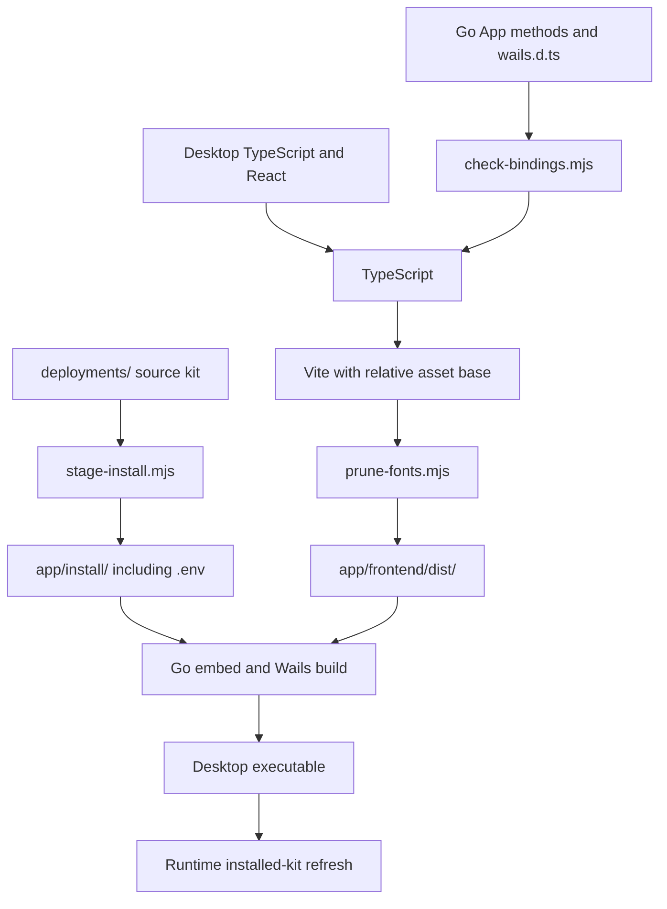

# Development and release

[Documentation index](README.md)

This guide explains how backend source becomes a desktop application and how that desktop application later builds the clinic. Those are separate build systems.

## The different builds

| Build | Inputs | Output | When it happens |
| --- | --- | --- | --- |
| Desktop frontend | `app/frontend/src/`, package lock, Vite configuration | `app/frontend/dist/` | Developer or release build. |
| Desktop executable | `app/*.go`, `app/internal/`, Go dependencies, both embedded trees | Wails application under `app/build/bin/` | Developer or release build. |
| Installer/package | Wails application, platform metadata, optional signing configuration | macOS `.dmg` or Windows NSIS setup executable | Release workflow. |
| Clinic infrastructure images | Deployment Dockerfiles and base-image/module pins | Backup and Caddy/Coraza images | Clinic setup or when their inputs change. |
| CARE backend/frontend images | Pinned upstream source, generated build inputs, clinic settings/plugins | Images tagged for this clinic installation | Setup, required refresh, or explicit rebuild. |

Changing Go code, such as the settings read lock, requires rebuilding and relaunching the desktop executable. It does not require reinstalling the clinic or rebuilding every Docker image.

The control panel's "rebuild frontend" action builds the **CARE web application**, not the React interface embedded in the desktop executable.

## Source layout and tools

The Go module is [`app/go.mod`](../app/go.mod), not the repository root. It currently declares Go 1.26 and Wails v2.12.0. The desktop frontend uses npm and its checked-in [`package-lock.json`](../app/frontend/package-lock.json).

Use Node 22 for local development, matching CI and release packaging.

The direct Go dependencies have narrow jobs:

| Module | Why the backend uses it |
| --- | --- |
| `github.com/wailsapp/wails/v2` | Native application runtime, webview binding, events and dialogs at the application boundary. |
| `github.com/compose-spec/compose-go/v2` | Dotenv parsing. Stack control still goes through the Docker Compose executable, not a programmatic Compose service API. |
| `github.com/hashicorp/mdns` | DNS-SD record construction; CARE owns the interface-bound responder transport. |
| `github.com/miekg/dns` | DNS packet encoding/decoding for the responder and direct hostname probes. |
| `golang.org/x/net` | Interface-bound IPv4/IPv6 multicast sockets. |
| `github.com/zalando/go-keyring` | Platform credential-store access for the saved backup password. |
| `golang.org/x/crypto` | Bcrypt hashing and comparison for desktop administrator authorization. |
| `golang.org/x/sys` | Low-level platform operations, including Windows durable file replacement. |

The desktop's build prerequisites are Go, Node/npm, the Wails CLI, and the native tools required by Wails on the build OS. macOS packaging uses Apple's developer tools; Windows installer creation needs NSIS (`makensis`). Docker and Git are needed for actually setting up and operating a clinic, not merely for every small Go unit test.

For a CLI version matching the current Go dependency:

```sh
go install github.com/wailsapp/wails/v2/cmd/wails@v2.12.0
```

Use the version in `go.mod` when that dependency changes. Both CI and release
builds resolve the Wails CLI version from that module instead of installing
`@latest`.

## Prepare a fresh checkout

From the repository root:

```sh
cd app/frontend
npm ci
cd ..
wails dev
```

[`wails.json`](../app/wails.json) runs `stage-install.mjs` through its cross-platform
pre-build hook before generating bindings or compiling Go, including during
`wails dev` and development rebuilds. Missing or deleted `app/install/` is
recreated automatically, including `.env`; no manual frontend rebuild is needed.
The `npm run dev` watcher starts Vite separately.

For a normal native production build, run from the repository root:

```sh
cd app
node frontend/scripts/stage-install.mjs
wails build
```

Wails invokes the configured frontend install/build commands as part of its build workflow. Outputs go under `app/build/bin/`; platform packaging details are covered below.

### A running development app has real effects

`wails dev` is not a fake bridge. It can find the current user's saved clinic configuration, refresh installed files, advertise the name, and ask the backend to start the stack. Use an isolated machine/user and Docker environment for destructive end-to-end work.

Changing the repository directory does not create a separate clinic: installation paths and the Compose project identity are deliberately stable. Do not experiment with restore or uninstall against a production clinic just because the desktop executable is a development build.

## Embedding pipeline

The frontend's current `build` script is:

```text
stage-install.mjs
    -> check-bindings.mjs
    -> TypeScript
    -> Vite production build
    -> prune-fonts.mjs
```



### `stage-install.mjs`

The script derives `app/wails.json`'s numeric installer version from
`CARE_DESKTOP_VERSION` in `deployments/.env` (stripping `-dev` for local builds).
Run it before invoking Wails for production builds, as Wails reads its metadata
before its pre-build hook. CI does this explicitly.

It then enumerates `deployments/`, including `.env`, rather than keeping a second manual file list. It skips `.DS_Store`, `Thumbs.db`, and `.gitkeep`, clears previous staging entries while retaining the tracked placeholder, and copies the kit recursively.

Wails runs pre-build hooks from `app/build/bin/`, so its hook invokes
`node ../../frontend/scripts/stage-install.mjs`. The script resolves source and
destination paths relative to itself, not the working directory. The standalone
`npm run build` command also stages the kit.

This is **build staging**, not runtime installation. Clearing `app/install/` does not remove the user's installed directory.

Always edit `deployments/` for a kit change. Editing `app/install/` would be overwritten by the next build and would not be the versioned source of truth.

### Placeholders and `go build`

`app/install/.gitkeep` and `app/frontend/dist/.gitkeep` keep the Go embed patterns valid in a clean checkout. Their presence allows compilation; it does not create a usable deployment kit or desktop UI.

`NewApp` explicitly rejects a build whose embedded kit lacks `.env`. A plain Go compilation of placeholders is therefore a useful compile check, not a substitute for the complete Wails/frontend build.

### Desktop assets

[`vite.config.ts`](../app/frontend/vite.config.ts) uses `base: "./"` so the asset URLs work under the Wails asset server. Its small `keep-dist` plugin restores the tracked placeholder after Vite clears the output directory.

[`prune-fonts.mjs`](../app/frontend/scripts/prune-fonts.mjs) removes emitted `.woff`, `.ttf`, and `.svg` files from `dist/assets`, retaining WOFF2. The script works by extension, so changes to emitted asset types should account for that behavior rather than assume it parses font manifests.

## Wails contract maintenance

The active desktop declarations are [`wails.d.ts`](../app/frontend/src/wails.d.ts), with data shapes in [`types.ts`](../app/frontend/src/types.ts). The runtime access layer is [`bridge.ts`](../app/frontend/src/lib/bridge.ts).

Wails-generated `frontend/wailsjs/` files are ignored and regenerated. They are not a replacement for keeping the declarations actually used by this desktop interface synchronized.

[`check-bindings.mjs`](../app/frontend/scripts/check-bindings.mjs) reads the declared `App` block and exported Go receiver methods. It checks that each declared method exists and accepts the same number of parameters. It does not prove argument types, return shapes, authorization, or event semantics.

For a contract-only change, the existing focused checks are:

```sh
cd app/frontend
./node_modules/.bin/tsc --noEmit
node scripts/check-bindings.mjs
```

These checks do not stage the kit or build a release.

## Release identity and pins

[`deployments/.env`](../deployments/.env) is the common release manifest consumed by Compose, Go, and packaging. [`release.Load()`](../app/internal/release/pins.go) parses it using dotenv and requires the following non-empty values:

| Group | Required keys |
| --- | --- |
| Desktop identity | `CARE_DESKTOP_VERSION`. |
| Third-party bases | `POSTGRES_IMAGE`, `REDIS_IMAGE`, `MINIO_IMAGE`, `CADDY_IMAGE`, `CORAZA_VERSION`. |
| Built-image names | `BACKUP_IMAGE`, `CADDY_WAF_IMAGE`, `BACKEND_IMAGE`, `FRONTEND_IMAGE`. |
| CARE sources | `CARE_BE_REPO`, `CARE_FE_REPO`, `CARE_BE_REF`, `CARE_FE_REF`. |

The version format is `X.Y.Z` or `X.Y.Z-dev`.

`CARE_BE_REF` and `CARE_FE_REF` name the **branch** a release follows, not a
commit. Releases currently track `develop`: a branch of verified commits, so
bug fixes reach installed clinics without a desktop release. An installed
clinic resolves that branch to a commit once, records it, and only moves
forward when a background check has already built the newer commit. A full
40-character commit ID is still accepted and opts that service out of
following the branch. A tag is not accepted, and a ref that resolves to
nothing fails the build rather than being passed along as if it were a commit.
See [clinic lifecycle](clinic-lifecycle.md) for how a
resolved commit is chosen, staged, and applied.

At runtime, `GetState().version` comes from these embedded pins, not a separate
linker-injected version variable.

Manual releases derive their identity from the selected commit:

| Source | Expected value |
| --- | --- |
| `CARE_DESKTOP_VERSION` | Numeric `X.Y.Z`, without `-dev`. |
| `app/wails.json` -> `info.productVersion` | Derived as `X.Y.Z` before building. |
| Automatically created tag | `vX.Y.Z`, pointing to the workflow's source commit. |
| CARE backend and frontend refs | A branch name to follow, or a full commit hash to pin. |

The workflow rejects missing/duplicate manifest identity values and an existing
release version before building installers. Maintainers do not need to edit
Wails metadata or create tags. See the [release runbook](releases.md) for preparing,
building, reviewing, publishing, and recovering a release.

### Testing the updater

A `-dev` build compares as older than the published release of the same `X.Y.Z`, so a development install can exercise the desktop updater against a real release rather than a fixture.

Build tests use local Git fixtures rather than the real CARE repository URLs. Resolving a branch runs `git ls-remote`, and a unit test that reaches GitHub is slow, flaky, and on a machine with a credential helper installed will ask the developer for a password.

For the same reason no test may elevate. Privileged work goes through [`sys/elevate`](../app/internal/sys/elevate/elevate.go), which runs `osascript` on macOS and `pkexec` elsewhere, so a test that calls it puts a real password dialog in front of whoever ran `go test` and fails on CI, where no one can answer it. Faking the command on `PATH` is not enough, because `elevate` picks the command by platform and the Windows path is the one those tests describe. `netfix` therefore exposes its elevation as a package variable that tests replace, and asserts on the script it was handed; the elevated wrapper around that script is covered separately in `elevate`'s own tests, where it is only a string.

### Reproducibility boundaries

A release no longer fixes which CARE commit a clinic runs; the tracked branch does, and installed clinics move forward with it. What a given clinic is running is recorded in its `channel.lock` and stamped into each image's `built-from` label, so an install can always be asked rather than assumed. Image fingerprints also include build inputs, as explained in [clinic lifecycle](clinic-lifecycle.md).

This is a deliberate trade: branch tracking is what lets a verified fix reach clinics that nobody will manually update, and it is only safe because the branch admits verified commits only. Pinning a commit in `deployments/.env` remains available for a release that must not move.

An image tag is not an immutable registry digest, however, and build-time package downloads can have their own availability and reproducibility constraints. "Pinned source" should not be expanded into a claim that every external dependency is content-addressed forever.

The current storage image pin points to Silo while the key remains `MINIO_IMAGE`. Do not rename the Compose service or data volume as a routine pin update.

## CI

[`ci.yml`](../.github/workflows/ci.yml) runs on pull requests, pushes to `main`,
merge-queue groups, manual dispatch, and reusable calls from the release workflow.
A newer run cancels the previous run
for the same PR/ref. There are no path filters that could leave a required check
missing, and a PR branch push does not trigger a duplicate push workflow.

| Job/check | What it does |
| --- | --- |
| Lint | Formatting, the Wails/internal boundary, pinned Actionlint workflow validation, and golangci-lint v2.13.2 through its v9 action. |
| Go tests | Clean-checkout `go build ./...` and the full race-enabled test suite, including the release identity/CI gate contracts. Node, PostgreSQL fixture tools, OpenSSL, Python, Git, and Compose must be available rather than silently skipping their tests. |
| Frontend | Node 22, `npm ci`, binding checks, TypeScript, and the Vite production build. Uploads the built frontend for native builds. |
| Native builds | After the first three jobs pass: actual Wails macOS universal and Windows/amd64 builds for CARE Desktop. Windows must produce an NSIS installer with NSIS 3.12 from [`install-nsis`](../.github/actions/install-nsis/action.yml), and its version metadata must match `wails.json` and `.env`; the bare application and the generated installer inputs are uploaded separately so a release can sign the application before rebuilding the installer. |
| CI | Stable aggregate check; fails if any required job failed, was cancelled, or was skipped. Configure this check in branch protection. |

Go comes from `app/go.mod`, and module writes are disallowed. Native jobs reuse
the frontend artifact rather than running npm for each platform. They use the
Wails CLI version from `go.mod`, production build flags, and real platform
dependencies. The Desktop pre-build hook still
stages the deployment kit before embedding it.

[`app/.golangci.yml`](../app/.golangci.yml) keeps `errcheck`, `govet`,
`ineffassign`, `staticcheck`, `unused`, `bodyclose`, and `misspell`. Staticcheck
exempts public API documentation rules for these internal application packages
and ST1005 for operator-facing sentence-style errors. Correctness checks are
not disabled to make CI pass.

CI has read-only repository permissions, no signing secrets, explicit timeouts,
and seven-day **unsigned** build artifacts. macOS bundles are zipped with
`ditto` to retain executable bits and symlinks. These are maintainer preview
builds, not clinic-ready signed releases. The intermediate frontend artifact is
kept for one day.

The Go suite runs on Linux. Native builds prove compilation and packaging on the
other platforms, not successful administrator prompts, certificate installation,
browser trust, or real clinic Wi-Fi behavior. Network mDNS tests remain opt-in.
PostgreSQL tests create an isolated fixture; CI does not start the clinic's
Compose stack, build upstream CARE images, or contact a production database.

Local equivalents for the portable checks:

```sh
actionlint -shellcheck="" -pyflakes=""
cd app
golangci-lint run --timeout=5m
go test -mod=readonly -race -count=1 -timeout=15m ./...
cd frontend
npm ci
npm run build
```

Use Actionlint v1.7.12 and golangci-lint v2.13.2, matching CI. Actionlint checks
workflow syntax and expressions; it does not invoke ShellCheck or Pyflakes.
Database/Compose tests need the same local prerequisites as the Go job.

### Pre-commit fixes

The repository includes [pre-commit](https://pre-commit.com/) hooks for the
auto-fixable checks: trailing whitespace, final newlines, YAML syntax, Go
formatting, and golangci-lint fixes. They use the same golangci-lint version
and configuration as CI; package-wide linting runs from `app/`, not just on
the staged Go files.

Install pre-commit with your preferred package manager (for example,
`uv tool install pre-commit` or `brew install pre-commit`), then install the
hooks and the CI-matching Go linter once from the repository root:

```sh
go install github.com/golangci/golangci-lint/v2/cmd/golangci-lint@v2.13.2
pre-commit install --install-hooks
```

Run `pre-commit run --all-files` after installing it, or rerun `git commit`
after a hook changes files and stage those changes. The hooks intentionally do
not replace CI's race tests, frontend production build, Actionlint validation,
or native application builds.

## Regression-test organization

Tests sit beside their packages. They use Go's standard test runner and existing runtime tools, rather than a separate end-to-end testing framework.

| Area | Representative coverage |
| --- | --- |
| App/settings | Shared authenticated reads, write exclusion, lifecycle guards, and retention persistence. |
| Clinic | Domain rewriting, worker-stop/migration ordering, native-access outcomes, cleanup ownership, and backup script behavior. |
| Backup | Encryption/key handling, staged restore control flow, archive validation, and interruption recovery. |
| Compose | Build freshness, image inputs, deployment routing, and storage bootstrap contracts. |
| Native helpers | Process handling, atomic replacement, elevation quoting, hosts/trust parsing, mDNS, and Windows networking. |
| Prerequisites/residue | Bounded provisioning paths and truthful resource inspection with isolated fixtures. |
| Release | Manifest validation, source ref syntax, installer-version agreement, and the workflow's identity validator. |

Some integration tests require external executables or have platform/user restrictions; a skipped case is not a successful production restore. Read the package test and the subsystem guide before running those fixtures.

For the shared settings behavior, a targeted invocation is:

```sh
cd app
go test -mod=readonly -race . ./internal/plugins
```

For another change, select the package/test covering that behavior first. The full CI suite exists, but is not necessary for every documentation or single-package edit. Avoid running native-changing integration tests on a machine that holds the only copy of clinic data.

## Packaging and publication

The release workflow is **manual-only** and reuses the native artifacts built by
CI in the same workflow run:

| Platform | Wails target | Artifact |
| --- | --- | --- |
| macOS | `darwin/universal` | `CARE-Desktop-X.Y.Z-macos.dmg`. |
| Windows | `windows/amd64` with `-nsis` | `CARE-Desktop-X.Y.Z-windows-amd64-setup.exe`. |

Linux has backend/native helper implementations but no published desktop installer.

The workflow packages a DMG and the Windows NSIS installer, adds the exact
configuration, build identity, and checksums, creates `vX.Y.Z` at the selected
source commit, and creates a **draft prerelease**. Published assets are never
replaced. Only the draft job has write permission.

macOS preserves the existing optional Developer ID signing/notarization flow and
secret names; without credentials it retains Wails' ad-hoc signature. Windows
application and installer are signed through SignPath when its configuration is
present, otherwise left unsigned. The release manifest records each platform's
actual status; these remain preview releases.

The Windows installer definition lives in `app/build/windows/` (`info.json`,
`wails.exe.manifest`, `installer/project.nsi`). Wails regenerates `icon.ico`,
`installer/wails_tools.nsh` and the WebView2 bootstrapper from `wails.json` and
its own module on every build, so those are ignored.

Follow [Releasing CARE Desktop](releases.md) for the complete maintainer procedure
and safe retry rules.

## Maintainer change map

| Change | Surfaces to update together |
| --- | --- |
| Wails method or result shape | Go method/JSON tags, `wails.d.ts`, `types.ts`, call sites, API guide. |
| Long-running job behavior | `run()` contract, lifecycle guards, event consumers, progress-message expectations. |
| Environment setting | Installed-file semantics, schema if exposed, appropriate apply/rebuild path, configuration guide. |
| Image/build input | Release pin or builder input, freshness calculation, deployment contract and relevant tests. |
| Restore sequence | Journal/state recovery, staging cleanup, worker callbacks, interruption cases, restore diagrams. |
| Native resource identity | Creation, inspection, cleanup, residue classification, platform-specific tests. |
| Kit file | `deployments/` source, readers/mounts, staging/runtime preservation assumptions, file map. |
| Release version | `deployments/.env`; build metadata and tags are derived. Update release documentation if behavior changes. |

Keep code and diagrams synchronized. A documentation-only change does not require rebuilding CARE Desktop.
