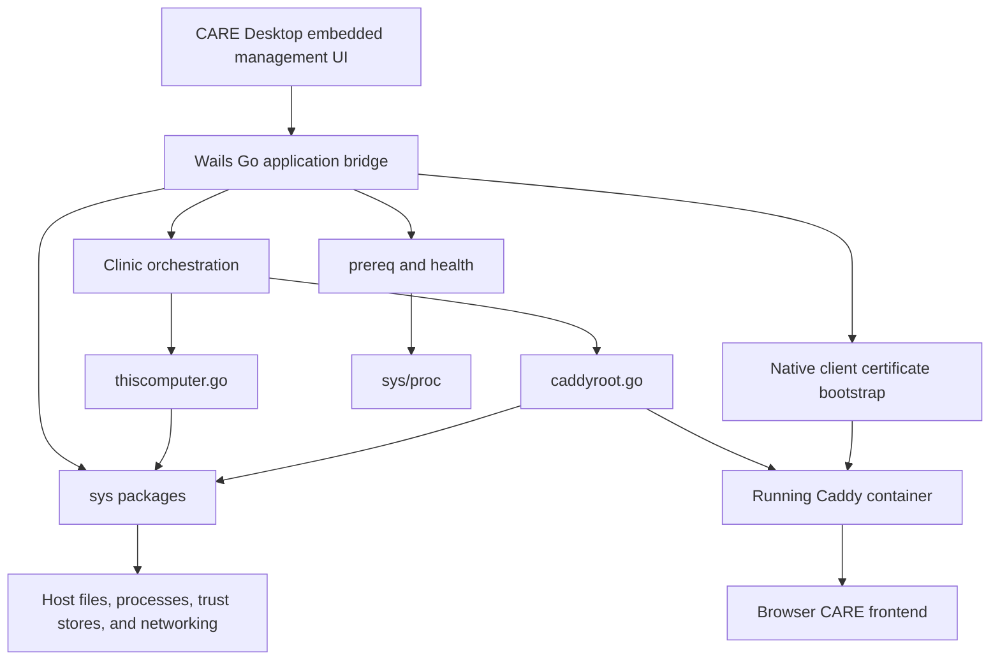
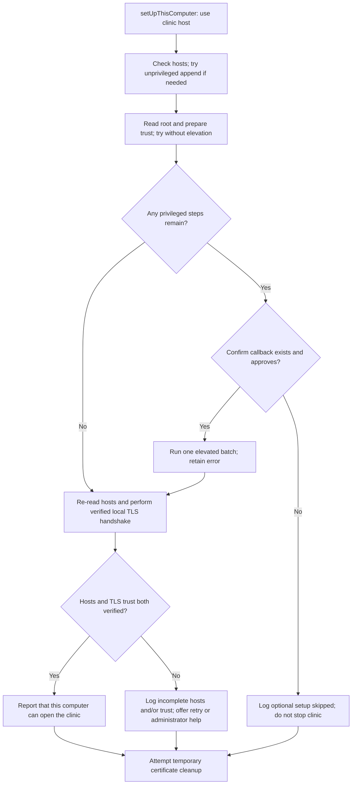
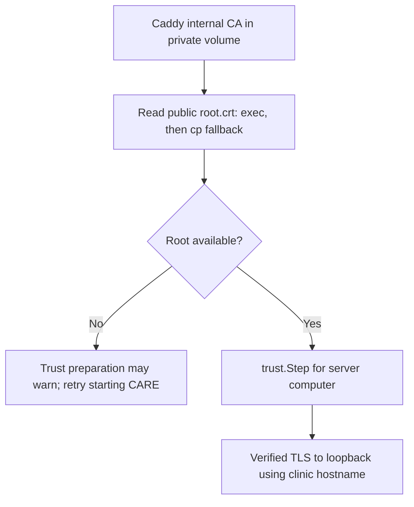
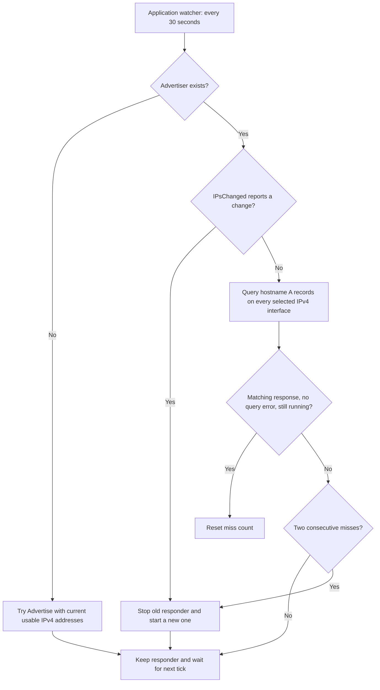
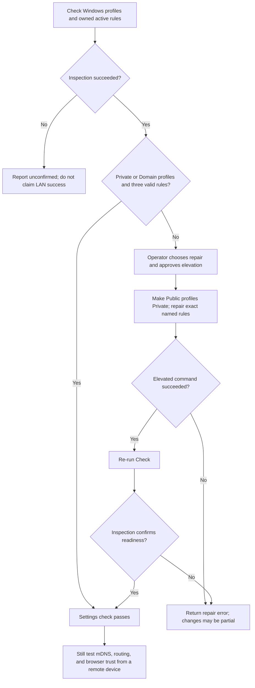
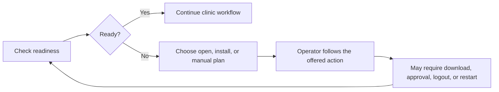

[Documentation index](README.md)

# Native integrations and machine readiness

This guide explains how CARE Desktop interacts with the computer running the
clinic: child processes, files, logs, administrator approval, local name
resolution, certificates, LAN discovery, Windows networking, prerequisite tools,
login startup, and restart detection. It also explains what the health checks
actually prove.

**CARE Desktop is the native Wails application.** First run persists a Server
or Client role, without an ordinary role-switching control. Server mode
installs and manages the clinic; Client mode connects to an existing clinic and
performs native certificate setup without Docker, Git, or mDNS advertising.
The **CARE frontend** is the clinical web application served through Caddy and
opened in a browser, including browsers on other devices. Trusting a certificate
or adding a hosts entry on the server computer does not configure every browser
or every remote device.

Read [Architecture](architecture.md) for the overall boundaries and
[The Wails application](wails-application.md) for bridge methods, dialogs,
events, and application lifetime. See [Clinic lifecycle](clinic-lifecycle.md)
for when installation and start operations call these helpers, and
[Cleanup and uninstall](cleanup-and-uninstall.md) for teardown orchestration.
This guide describes the current source, not the older behavior recorded in
`design.md`.

## Contents

- [Architecture and ownership](#architecture-and-ownership)
- [Operating-system behavior matrix](#operating-system-behavior-matrix)
- [Running programs with proc](#running-programs-with-proc)
- [Replacing files with atomicfile](#replacing-files-with-atomicfile)
- [Diagnostic logging with applog](#diagnostic-logging-with-applog)
- [Administrator approval and local hosts setup](#administrator-approval-and-local-hosts-setup)
- [Certificate trust and device bootstrap](#certificate-trust-and-device-bootstrap)
- [LAN names and mDNS](#lan-names-and-mdns)
- [Windows network repair](#windows-network-repair)
- [Docker and Git prerequisites](#docker-and-git-prerequisites)
- [Health and port checks](#health-and-port-checks)
- [Login startup and restart detection](#login-startup-and-restart-detection)
- [Error handling and ownership rules](#error-handling-and-ownership-rules)
- [Source-file role inventory](#source-file-role-inventory)
- [Verification boundaries and historical differences](#verification-boundaries-and-historical-differences)

## Architecture and ownership

The native layer exists so clinic orchestration does not need to contain
platform-specific shell quoting, registry commands, certificate-store layouts,
or network-interface filtering.



There are three different kinds of ownership:

1. **Application lifetime:** the Wails layer owns the in-memory mDNS advertiser,
   its renewal loop, log delivery to the desktop, and second-instance behavior.
2. **Clinic data and generated files:** the clinic layer owns the installation
   directory and chooses when to extract Caddy's root certificate for local
   trust. It passes ordinary logging and confirmation callbacks to
   native helpers rather than making those helpers depend on Wails.
3. **Host integration artifacts:** each native package identifies the files,
   certificate names, registry values, or firewall names it can change. Removal
   must use those ownership identifiers, not a broad assumption that everything
   on the machine belongs to CARE.

`proc.Runner` is a shared process-execution context, not a job scheduler.
`elevate.Step` is a description of a privileged action, not a transaction.
`health.Health`, `prereq.Status`, `netfix.Status`, `mdns.NameStatus`, and
`reboot.Plan` are small result types that the application can expose through its
bridge. Their boolean fields have different meanings; one green result does not
replace the other checks.

## Operating-system behavior matrix

These are implemented branches, not a claim that every distribution, desktop
environment, browser, or architecture is supported or has been integration-tested.

| Concern | macOS | Windows | Linux |
| --- | --- | --- | --- |
| Child process windows | Console-hiding helper is a no-op. | `HideWindow` and `CREATE_NO_WINDOW` prevent ordinary child-console flashes. OS approval dialogs still appear. | Console-hiding helper is a no-op. |
| GUI PATH repair | Login-shell PATH, then Homebrew and standard executable directories. | Docker and Git installation directories, then inherited PATH; no login-shell probe. | Login-shell PATH, then the same Unix directory list, including Homebrew paths even if absent. |
| Batched administrator approval | AppleScript `do shell script ... with administrator privileges`. | One elevated PowerShell child through `Start-Process -Verb RunAs`. | `pkexec sh -c`; requires the relevant policy/desktop support. |
| Server hosts file | `/etc/hosts`. | `%WINDIR%\System32\drivers\etc\hosts`; path helper falls back to `C:\Windows`. | `/etc/hosts`. |
| Local certificate installation | Try login keychain first, then offer System keychain installation. | Try machine `Root` through `certutil`, then offer elevation. | Try system anchors/bundle update first, then offer elevation. |
| mDNS | Shared IPv4 address-selection and response-probing implementation. | Same implementation; firewall/profile repair is separate. | Same implementation; no Linux firewall manager is configured here. |
| Network repair | `netfix` reports not applicable; no repair. | Public profiles can become Private; three owned inbound rules cover HTTP, HTTPS, and mDNS on Private and Domain profiles. | `netfix` reports not applicable; no repair. |
| Atomic replacement | Rename within the destination directory, then sync that directory. | `MoveFileEx` with replacement and write-through flags. | Same Unix replacement implementation as macOS. |
| Login startup | Per-user LaunchAgent plist. | Per-user `HKCU` Run value. | Per-user `.desktop` autostart file under `~/.config`. |
| Restart detection/action | No pending-restart detection; `Now` returns an unsupported error. | Two registry-key probes; restart action schedules `shutdown /r` after five seconds. | No pending-restart detection; `Now` returns an unsupported error. |
| Automated Docker setup | Download architecture-selected Rancher Desktop DMG. | Prefer `winget`, otherwise download and run the Rancher Desktop MSI. | Package-manager commands plus `systemctl` and `usermod`. |
| Automated Git setup | Launch Command Line Tools installer with `xcode-select --install`. | `winget`, otherwise a manual-download plan. | Supported package manager, otherwise a manual plan. |

Other `GOOS` values are not a general supported-platform promise. For example,
some helpers have default branches, but `atomicfile` only supplies replacement
files for Darwin, Linux, and Windows.

## Running programs with proc

Source: [proc.go](../app/internal/sys/proc/proc.go),
[console_windows.go](../app/internal/sys/proc/console_windows.go), and
[console_other.go](../app/internal/sys/proc/console_other.go).

### Why one process wrapper exists

Docker, Git, platform utilities, and installers need a predictable working
directory and environment when launched from a GUI. They also need to avoid
flashing console windows on Windows. The wrapper centralizes these mechanics
without deciding whether a particular command is an installation, a diagnostic,
or a teardown.

| API or field | Actual contract |
| --- | --- |
| `Runner.Dir` | Assigned to the command's working directory. Empty means inherit the current process directory. Compose callers must provide the intended project context; the runner does not discover it. |
| `Runner.Env` | Assigned to the child environment. `nil` inherits the process environment; a non-nil slice supplies an explicit environment rather than automatically merging with the parent. |
| `Runner.Log` | Optional `func(string)` sink. `Run` can call it concurrently from stdout and stderr reader goroutines. |
| `Command` | Constructs `exec.Command` and applies the platform console settings. It does not start the command. |
| `CommandContext` | Same wrapper around `exec.CommandContext`; the caller supplies cancellation and deadlines. |
| `Run` / `RunWith` | Start the command, stream stdout and stderr, wait for both readers and process completion, and return an error on failure. |
| `RunWith(extraEnv, ...)` | Starts from `cmd.Environ()` and appends the additional entries, preserving inherited environment when `Runner.Env` is nil. Later duplicate environment keys take precedence in the child. |
| `Capture` | Returns trimmed stdout plus the command error, without live streaming. Stderr is not part of the returned string. |
| `Lines` | Returns non-empty, trimmed stdout lines. A failed command is an error, not an empty successful list; the error includes command context. Successful empty output returns no lines and no error. |
| `Exists` / `FileExists` | Executable lookup on PATH, or a successful `os.Stat`, respectively. `FileExists` does not establish that a path is a regular file. |

Executable lookup is performed when Go constructs the command, using the
application's process PATH. Putting a different PATH only in `Runner.Env` is not
a replacement for repairing the application's own PATH before command lookup.

`RunWith` drains stdout and stderr separately, so their relative ordering is not
guaranteed. Empty lines are not logged. Its buffer size is `64 * 1024` bytes:
for an overlong line it logs the first chunk and a truncation notice, discarding
the remaining chunks of that line. Reader errors themselves are not exposed as
a separate API result; the final process result comes from `Wait`.

Neither `Runner.Run` nor `Runner.Capture` has a context argument or an automatic
timeout. Use the bounded `CommandContext` pattern where cancellation is required.
Go's default command cancellation targets the child process; this wrapper adds
no process-group or descendant-tree cancellation guarantee.

### GUI PATH repair

`FixPath` widens the **current process** PATH. The application invokes it during
construction; see the integration point in [app.go](../app/app.go).

- On Unix, a login-shell probe runs `$SHELL -lc`, falling back to `/bin/zsh` when
  `SHELL` is unset. It has a three-second context deadline. The command emits a
  line prefixed with `__care_path__`, so unrelated shell startup output is not
  mistaken for PATH. Failure simply omits this part.
- `AugmentedPath` prepends `$HOME/.rd/bin` (Rancher Desktop's CLI directory),
  `/opt/homebrew/bin`, `/opt/homebrew/sbin`, `/usr/local/bin`, `/usr/bin`,
  `/bin`, `/usr/sbin`, and `/sbin` on Unix.
- On Windows it prepends
  `%LOCALAPPDATA%\Programs\Rancher Desktop\resources\resources\win32\bin`,
  `C:\Program Files\Rancher Desktop\resources\resources\win32\bin`,
  `C:\Program Files\Git\bin`, and `C:\Program Files\Git\cmd`.
- The existing PATH is appended. The login-shell result, when available, precedes
  the augmented path. There is no directory-existence check or deduplication.

This addresses GUI launches that cannot find installed tools. It does not install
them, prove that Docker is running, or validate a minimum tool version.

The Windows console helper preserves existing `SysProcAttr` settings and adds
`HideWindow = true` plus creation flag `0x08000000`. It is not a request to hide
UAC or to suppress an installer application's intentional UI.

## Replacing files with atomicfile

Source: [atomicfile.go](../app/internal/sys/atomicfile/atomicfile.go) and its
[Darwin](../app/internal/sys/atomicfile/replace_darwin.go),
[Linux](../app/internal/sys/atomicfile/replace_linux.go), and
[Windows](../app/internal/sys/atomicfile/replace_windows.go) replacement helpers.

`Write(path, data, mode)` exists to avoid truncating a live state file before its
replacement is ready. It:

1. Creates missing parent directories with mode `0700`.
2. Creates a uniquely named sibling file, using `.` plus the destination base
   name as its prefix.
3. Applies the requested file mode, writes the bytes, syncs the file, and closes
   it, checking each of those errors.
4. Replaces the destination using the platform implementation.
5. Attempts to remove the staging file on every return path.

Staging beside the destination avoids a cross-filesystem move from an unrelated
temporary directory. It also means a pre-replacement write or sync failure does
not require first deleting the old destination.

The limits matter:

- On Darwin and Linux, replacement is `os.Rename`, followed by opening, syncing,
  and closing the destination directory. Directory sync/close errors are joined.
  **An error at this final stage can occur after the new file is already visible.**
  An error is not a promise that the old bytes remain installed.
- On Windows, the implementation converts both paths to UTF-16 and calls
  `MoveFileEx` with `MOVEFILE_REPLACE_EXISTING | MOVEFILE_WRITE_THROUGH`.
  It does not delete the destination first or retry sharing violations. Another
  process holding an incompatible open handle can prevent replacement.
- This is a single-file replacement helper, not a multi-file transaction,
  inter-process lock, compare-and-swap operation, or universal crash-proof storage
  guarantee. Actual filesystem and OS behavior still applies.
- Existing parent-directory permissions are not rewritten. Replacement creates
  the destination from the staged file; it does not preserve arbitrary metadata,
  ownership, or ACLs from an older destination.
- Staging cleanup is best effort: the deferred `os.Remove` result is ignored.

Do not infer that every native file write uses `atomicfile`. In this scope,
autostart registrations use `os.WriteFile`, logs are
appended, and Unix hosts removal deliberately rewrites the existing hosts inode.
See [Configuration and settings](configuration-and-settings.md) and
[Backups and restore](backups-and-restore.md) for higher-level persistence users.

## Diagnostic logging with applog

Source: [applog.go](../app/internal/sys/applog/applog.go),
[dir.go](../app/internal/sys/applog/dir.go), and
[rotate.go](../app/internal/sys/applog/rotate.go).

The file log makes a GUI application's operation trace available after the
window closes. `Logger` serializes access with a mutex and also provides the
method shape Wails expects from its logger.

### Location, format, and limits

| Platform | Default folder |
| --- | --- |
| macOS | `~/Library/Logs/care-desktop` |
| Windows | `%LOCALAPPDATA%\care-desktop\logs`; if unset, `~/AppData/Local/care-desktop/logs` |
| Linux/default branch | `$XDG_STATE_HOME/care-desktop`; if unset, `~/.local/state/care-desktop` |

The active filename is `care-log.log`. The code first needs `os.UserHomeDir` to
succeed, even before checking the Windows or XDG overrides. A failed home lookup
produces an empty log directory.

- Opening creates the directory with mode `0755` and the file with mode `0644`,
  subject to platform permissions and umask.
- Each write removes trailing CR/LF, adds a millisecond timestamp with a timezone
  offset, and appends a newline.
- Input longer than `8 << 10` bytes is cut to 8 KiB plus a truncation marker.
  The timestamp and marker are additional bytes; this is not a strict 8 KiB
  on-disk record limit.
- Rotation is triggered when the current size plus the next record would exceed
  `10 << 20` bytes, or 10 MiB.
- `maxFiles = 5` means the active log plus normally four numbered archives,
  `care-log.1.log` through `care-log.4.log`. Rotation briefly uses slot 5 before
  removing it. Treat approximately 50 MiB as an intended normal bound, not an
  enforced quota when renames or deletes fail.

`Open` appends a session separator. `Header(version, installDir, clinicName)`
records version, OS/architecture, Go version, install directory, clinic name, and
log path. Its placeholder helper displays `(none yet)` and `(unset)` for empty
values. **This helper does not itself enumerate release pins.** Pin handling
belongs to the release/application layer.

### Failure behavior and the Wails boundary

`Open` returns `*Logger`, not `(*Logger, error)`. An empty directory, failed
directory creation, or failed file open leaves an inert logger whose `Path()` is
empty. Writes become no-ops. There is no alternate temporary log or automatic
stderr fallback in this package.

Ordinary write errors are deliberately not propagated. Rotation rename, close,
and removal errors are also ignored, and a failed reopen leaves the file sink
unavailable. A previously assigned path can remain non-empty even after a later
write or rotation problem. `Close` closes the file without an explicit `Sync`
and ignores the close error.

The application boundaries are distinct:

- [main.go](../app/main.go) opens the file logger, passes it to Wails, and supplies
  `OnFatal` so a Wails fatal can use the application's fatal-reporting path.
- Wails `Print`, `Trace`, `Debug`, `Info`, `Warning`, `Error`, and `Fatal` messages
  get a `wails ` prefix and, where applicable, a level tag.
- [app.go](../app/app.go) sends application log messages to the file and emits
  the separate `care-log` desktop event when a Wails context exists. The file
  logger itself knows nothing about that event.
- [app_ui.go](../app/app_ui.go) returns an explicit error if `OpenLogFolder`
  finds no log path. Otherwise it starts `open -R`, `explorer.exe /select,`, or
  `xdg-open` as appropriate. A launch failure is returned; later opener exit
  status is ignored.

`Logger.Fatal` is exceptional: it writes a fatal line and invokes `OnFatal` when
set. Without that hook it closes the logger and calls `os.Exit(1)`. Do not confuse
this with ordinary `Error`, which only records a line.

`PurgeFolder` closes the sink, removes the **whole log folder**, and opens a new
session log there. It is not limited to deleting numbered files, and successful
purge does not mean the folder stays absent. `RemoveAll` errors are returned;
failure to reopen the fresh log is not. Do not store unrelated files in this
application-owned directory.

The logger and process runner do not provide automatic secret redaction.
Environment-variable names in this guide are not credential examples. Never
log, paste, or attach real secrets merely to diagnose a PATH or readiness issue.

## Administrator approval and local hosts setup

Sources: [elevate.go](../app/internal/sys/elevate/elevate.go),
[hosts.go](../app/internal/sys/hosts/hosts.go), and
[thiscomputer.go](../app/internal/clinic/thiscomputer.go).

### Approval is a boundary, not evidence of success

`elevate.Step` contains a human description (`What`), a Unix shell form (`Sh`),
and a PowerShell form (`PS`). Callers can collect only the remaining actions and
explain them in one confirmation dialog before requesting native elevation.

`ShQuote`, `PSQuote`, and `OSAQuote` escape different interpreter syntaxes. They
are not interchangeable. `elevate.Run(sh, false)` executes `sh -c`; its elevated
Unix routes are AppleScript on macOS and `pkexec` otherwise. Windows batched work
uses `Steps` and its PowerShell path, not a Windows-aware version of `Run(sh, ...)`.

Current batching preserves failures:

- Empty step lists return without elevation.
- Unix steps are independently grouped in subshells and joined with `&&`, so a
  failing step prevents subsequent steps from running.
- Windows sets `$ErrorActionPreference = 'Stop'`, runs each step in a script
  block, and checks `$?` after each block.
- The elevated Windows child is started with `-Wait -PassThru`; the parent exits
  using the child's `ExitCode`.

This is not rollback. If hosts modification succeeds and trust installation
fails, the hosts change remains. Moreover, generated installer wrappers elsewhere
still use their own PowerShell launch form. Do not extend the `Steps` exit-code
guarantee to every `Start-Process` in the repository.

### One approval per operation, not per item

Each elevation is a separate consent prompt, and an operator who approves the
first and misses the second leaves the second item installed. Because the
post-operation scan then still reports residue, a removal that asked three times
and was approved once is indistinguishable from one that failed outright.

Teardown therefore plans before it elevates. `trust.RemoveStepWindows`,
`hosts.RemoveStepWindows`, and `netfix.UndoStepWindows` each inspect current
state and return an `elevate.Step` plus a `need` flag **without** elevating.
`revertSystemChangesWindows` collects the steps that are needed, elevates once,
and only then re-inspects each item to decide what is still present. This
mirrors `setUpThisComputer`'s one-prompt install path in the opposite direction.

The standalone `trust.Untrust`, `hosts.Remove`, and `netfix.Undo` entry points
keep elevating on their own for callers that remove a single item, and remain
the only path on macOS and Linux.

The elevated Windows child is launched with `-WindowStyle Hidden`, passed both
to `Start-Process` and to the child `powershell` itself. That suppresses the
console window the child would otherwise flash; it does not hide, suppress, or
pre-answer the UAC consent prompt, which is drawn on the secure desktop and is
outside application control.

### Finishing setup on the server computer

`setUpThisComputer` is an optional, local-browser finish operation. It obtains the
clinic host, tries hosts setup, reads the Caddy root, and prepares trust setup.
Both helpers can attempt an unprivileged change **before** the combined
confirmation. The one-prompt design applies to the remaining privileged hosts
and trust steps, not every prerequisite installation or Windows network repair.



Important result rules:

- A missing or declining confirmation callback skips the privileged work and
  returns normally with a log message.
- When work is attempted, the function checks `hosts.HasEntry(host)` and
  `trust.HostTrusts(host)` afterwards, even if there were no queued steps.
- Both checks must pass for the positive message. Verified state wins even if an
  earlier command reported an error.
- Otherwise it names the unconfirmed hosts entry, certificate trust, or both,
  includes an elevation error when available, and recommends starting CARE
  again to retry or asking an administrator for help.
- This method returns no error to stop clinic startup. Its warning that other
  devices are unaffected means these **local changes** do not configure or
  disable them; it is not proof that LAN access or remote trust already works.

### Hosts entries and their ownership marker

The owned line has the form:

```text
127.0.0.1 <clinic-label>.local # care-desktop
```

The fixed marker is `# care-desktop`. It is the cleanup handle, including after
a clinic-name change. The host in examples such as `care.local` is illustrative;
these helpers receive the configured host rather than establishing a universal
default name.

`HasEntry` parses actual address/hostname fields, ignoring comments and matching
the hostname case-insensitively. A loopback mapping, including `::1`, counts even
if it has no CARE marker. Any matching non-loopback mapping makes the result
false, including when a correct loopback line also exists. A hostname mentioned
only in a comment does not count.

`Step` first checks this state, tries an ordinary append if necessary, and
re-reads before deciding to request elevation. It does not rewrite unowned
conflicting mappings. Repeated appends cannot repair an existing non-loopback
conflict by themselves; the final verification remains incomplete.

The entry makes the clinic name point back to the server for that computer's own
browser. It does **not** advertise a DNS record, answer mDNS for the LAN, modify
another device, or prove that the `.local` name works beyond this machine.

Removal is intentionally marker-based:

- It removes every line containing the marker, not just the hostname passed to
  `Remove`. Unmarked user-managed lines are not claimed.
- Unix removal filters into a scratch file and uses `cat` back into the original
  file, preserving its inode and associated ownership/mode rather than renaming
  a replacement over it. This is not an atomic replacement.
- A `grep` status of 1 is allowed: all lines might have been owned, leaving an
  empty result. Other filter errors and the final write failure remain failures.
  A trap attempts scratch-file cleanup.
- Unix removal tries without elevation first, then re-reads. If a line remains,
  it can ask for elevation; this removal helper permits elevation when the
  confirmation callback is nil, unlike `setUpThisComputer`.
- Windows uses an elevated PowerShell read/filter/write operation. Its wrapper
  does not use the batching helper's `-PassThru` contract; remaining state is
  checked afterwards.

`Leftover` returns either an empty string, an explanation that a marked line
remains, or an explicit inspection-error sentence. A missing file is absence;
an unreadable file is not successful removal. `Inspect` exposes `(bool, error)`,
while `Present` conservatively returns true when inspection errors.

## Certificate trust and device bootstrap

Sources: [trust.go](../app/internal/sys/trust/trust.go),
[client.go](../app/internal/sys/trust/client.go), and
[caddyroot.go](../app/internal/clinic/caddyroot.go). The adjacent serving
contract is in [Caddyfile](../deployments/Caddyfile) and the Caddy service in
[docker-compose.yml](../deployments/docker-compose.yml).

### Public root versus private CA material

Caddy's internal PKI creates the certificate authority used for clinic HTTPS.
The configured identities are:

| Identity or path | Meaning |
| --- | --- |
| `CARE Desktop Local CA` | Root Common Name, also `trust.CommonName`. |
| `CARE Desktop Local CA - Intermediate` | Intermediate Common Name in the Caddyfile. |
| `/data/caddy/pki/authorities/local/root.crt` | Public root certificate read by `caddyRootPEM`. |
| Caddy `/data` | Backed by the Compose `caddy-data` volume; contains Caddy state, including private PKI material. |

A root certificate is public material, not its private signing key. Remote
devices need the public root to verify the clinic's certificate chain. They do
not need Caddy's private keys or a copy of the full `/data` volume.

The bootstrap Caddy routes expose only the exact `/root.crt` resource from the
private PKI directory. HTTP requests need neither a referer nor a query flag.
`/setup` and `/setup/` serve a mobile-only page from the read-only setup-directory mount.
The server panel's **Connect phone or tablet** button opens its HTTP address,
which staff can enter on their phone. iOS instructions cover profile installation
and full trust in Safari; Android instructions cover CA installation in Settings.
The matching device instructions expand automatically. Desktop clients use the
native app; no generated script installers are served.
Old files may remain unused in an installed kit; refreshing routes and mounts
does not require deleting that directory.

### Native client setup and trust on first use

On a staff computer, install CARE Desktop, select **Client** at first run, and
enter the clinic's `.local` address shown on the server. The saved role is not a
routine toggle between hosting and connecting. Clients do not provision Docker
or Git, run the server stack, or advertise a clinic over mDNS; their operating
system still needs to resolve the server's address.

The address field accepts a bare clinic label, `name.local`, or an HTTP/HTTPS
URL with only its root path. It normalizes these to the clinic's HTTPS address.
IP addresses, custom ports, and URLs containing application paths are not
accepted.

The client downloads `http://<host>/root.crt?ok=1`. The query flag keeps this
native flow compatible with older servers; new servers do not require it.
The HTTP request is bounded by timeouts and follows neither redirects nor a
configured proxy. CARE requires a single self-signed CARE CA certificate within
its validity dates, then verifies the actual clinic's TLS chain and hostname
against that root **before installing it**. Remote verification targets that
host, not the server's loopback-only `HostTrusts` check.

CARE persists the pinned public root and ownership state before requesting OS
elevation so interrupted or failed installation can be retried and cleaned up.
Subsequent connections use that pinned root; they do not silently replace it
with another HTTP download. OS installation uses the Windows LocalMachine Root
store, the macOS System keychain, or fingerprint-specific Linux anchors.
Administrator approval may be needed. The client automatically checks HTTPS
before opening CARE; a download or approved prompt alone does not count as a
successful connection. No manual fingerprint comparison or downloaded
shell/PowerShell installer is part of this flow.

This is **trust on first use on the local network**. HTTP bootstrap avoids
requiring trust before retrieving the root, but does not authenticate its source.
An attacker controlling name resolution or the network could substitute a root
and impersonate the clinic during first connection. Certificate validation and
the subsequent TLS check confirm cryptographic consistency, not independent
physical-server identity. Use the administrator-provided address on a trusted
clinic network; these checks do not eliminate that initial trust decision.

This flow does not provide a phone/tablet installer. Separate servers with
unique clinic names remain valid; there is no signed, network-wide enforcement
of a single clinic.

### Removing client access

On a client, choose **Uninstall client setup** and confirm the native
client cleanup. It removes this device's saved connection and only the exact
certificate that this client installed. Previously trusted certificates and
unrelated CARE roots are not removed and may still enable browser access.
This is not a blanket revocation of access to the clinic. It does not run server uninstall,
change hosts files, or delete any clinic data.

The app clears its saved URL, pinned certificate, and ownership record only
after cleanup succeeds. If removal fails, it reports the error and retains the
state needed to retry. Remove the current clinic access before connecting to a
different clinic.

Successful cleanup clears the saved role and returns to the Server/Client
choice. Server uninstall does the same after all required cleanup succeeds.
It does not uninstall the CARE Desktop executable. To leave the clinic permanently,
uninstall the setup first, then remove the executable using the operating system.

### Root extraction is deliberately non-fatal

`caddyRootPEM` first tries `docker compose exec -T caddy cat` on the root path.
It accepts successful output containing `BEGIN CERTIFICATE`. If that fails, it
creates a scratch `.crt` file, uses `docker compose cp` from the same container
path, and reads the result. It attempts to remove the scratch file on return.

This helper returns `""`, not an error, if extraction cannot be completed. It
checks for the certificate marker, not full certificate validity. Native import
tools and the final TLS handshake provide later checks. It neither exports
private keys nor generates a replacement CA when Caddy is unavailable.



### Verifying this computer's trust

`HostTrusts(host)` performs a real TLS handshake to **`127.0.0.1:443`**, with
`ServerName` set to the clinic hostname and a four-second dialer timeout.
Certificate-chain and hostname verification remain enabled.

This separates trust verification from DNS: it does not depend on mDNS or the
hosts file to find the server. It also does not prove that either mechanism
works. A stopped Caddy, wrong hostname certificate, inaccessible listener, or
untrusted certificate can all make it false.

On Linux, every call builds a fresh certificate pool from these files:

- `/etc/ssl/certs/ca-certificates.crt`
- `/etc/pki/ca-trust/extracted/pem/tls-ca-bundle.pem`
- `/etc/pki/tls/certs/ca-bundle.crt`

Fresh reads allow a long-running desktop process to notice newly installed or
removed roots. Missing/unreadable files and unusable PEM blocks are skipped by
this pool loader; they do not become trusted certificates. This differs from the
explicit inspection APIs used during removal, which return read errors.

On macOS and Windows the normal platform trust path is used. `HostTrusts` does
not pin the handshake to `CommonName` or a particular fingerprint: it asks whether
the presented chain is trusted for that hostname. It is not a test of every
browser's separate certificate database.

### Preparing and installing local trust

`trust.Step` first calls `HostTrusts`. If it already passes, no action is needed.
If a root is unavailable or a scratch certificate cannot be created, written,
or closed, it logs a preparation warning and returns no step. Therefore
`need == false` means **no step was scheduled**, not necessarily that trust is
ready. The caller's final handshake is essential.

When preparation succeeds, it creates a temporary public PEM file, tries
installation without elevation, and checks the TLS handshake again:

| Platform | First attempt | Privileged step if verification still fails |
| --- | --- | --- |
| macOS | `security add-trusted-cert` in `$HOME/Library/Keychains/login.keychain-db`. | Add a trusted root to `/Library/Keychains/System.keychain` with `-d -r trustRoot`. |
| Windows | `certutil -addstore -f Root`, without the `-user` flag. It is not automatically a per-user-store installation. | Same import through the elevated batch. |
| Linux | Copy to the Debian-style anchor and update certificates, with a Fedora-style copy/update fallback. | The same shell action through elevation. |

The Linux anchor paths are
`/usr/local/share/ca-certificates/care-root.crt` and
`/etc/pki/ca-trust/source/anchors/care-root.crt`. The local helper assumes these
layouts and their update tools; it is not a universal distribution adapter.

The return value includes a **cleanup function** because the PEM file must still
exist when a later privileged batch runs. The caller defers that cleanup until
after confirmation, elevation, and final verification. Deleting it inside
`Step` would make the privileged command unusable. Creation uses Go's restrictive
temporary-file defaults; the content is public, but access under a different
elevated identity is still an OS-dependent concern. Cleanup errors are ignored.

### Fingerprints, stable identity, and removal

`SHA1Hex` parses an X.509 `CERTIFICATE` PEM block and returns an uppercase SHA-1
digest without separators. This is an identifier accepted by platform removal
tools, not an operator comparison step. It returns an empty string for invalid
certificate data.

The constant `CARE Desktop Local CA` is a cleanup compatibility identifier:
fresh installations can produce different certificates and fingerprints while
retaining the same Common Name. Changing it without a migration can strand
older trusted roots. A matching Common Name is an ownership convention, not
cryptographic proof; avoid reusing it for unrelated certificates.

`Untrust` combines the removal result with a new `Inspect` call:

- **macOS:** enumerate roots by Common Name in the login and System keychains,
  adding the current fingerprint when found. Delete login entries first.
  System entries require the confirmation callback and administrator approval.
  Keychain-command failures are inspection errors, not assumed empty stores.
- **Windows:** inspect the machine `Root` store using `certutil`, look for the
  Common Name or current fingerprint, then request elevated deletion by the
  available fingerprint and by Common Name. Deletion by Common Name is what
  makes removal work when the captured PEM is gone and the fingerprint is
  therefore empty. Removal now goes through `elevate.Steps`, alone from
  `Untrust` or batched with the other teardown steps via
  `RemoveStepWindows`; final store inspection is still important.
- **Linux:** inspect both known anchor paths, including symlink presence, and
  scan the configured generated bundles for the root Common Name. Remove the
  known anchors and run whichever of `update-ca-certificates` and
  `update-ca-trust` are available; at least one updater must run. A remaining
  bundle entry is still trust residue even if an anchor was deleted.

Linux first attempts removal without elevation and rechecks. If trust remains,
it needs approval for the elevated retry, then checks again. It does not
arbitrarily edit a generated trust bundle to delete an unknown source entry.

Unlike local setup's positive state-only result, `Untrust` retains a removal
command error even if subsequent inspection finds no root. It returns explanatory
text for incomplete or unclean removal; surviving trust and inspection failures
must not be reported as a clean uninstall. `Present` is conservative on errors.

Automatic inspection/removal is limited to these system/keychain locations. It
does not enumerate all browser NSS databases or reach into other devices. The
Windows advice string mentions `certmgr.msc`, while the automatic commands target
the machine Root store; manual support must inspect the matching store rather
than assuming that any certificate-management window is showing it.

## LAN names and mDNS

Sources: [advertise.go](../app/internal/sys/mdns/advertise.go),
[responder.go](../app/internal/sys/mdns/responder.go), and
[probe.go](../app/internal/sys/mdns/probe.go). Renewal is an
application-lifetime responsibility at the integration boundary in
[app.go](../app/app.go), not a background loop inside this package.

### Why this is separate from hosts and trust

Other devices need a route to the server's LAN address. A server-only loopback
hosts entry cannot provide one. The advertiser retains the
`github.com/hashicorp/mdns` DNS record builder, but uses an interface-bound UDP
transport instead of that dependency's server. The dependency's server sends
multicast answers to the requester and does not frame legacy replies correctly.
The advertised HTTPS service remains unchanged:

| Record property | Value |
| --- | --- |
| Service type | `_https._tcp` |
| Instance | `<label>._https._tcp.local.` |
| Hostname | `<label>.local.` |
| Port | `443` |
| TXT information | Exactly one field, `CARE Desktop` |
| Advertised addresses | Only the usable IPv4 addresses of the receiving/sending interface |

`Label` trims surrounding whitespace/dots, lowercases, removes a final `.local`,
and trims dots again. `ValidateLabel` requires 1-63 characters, ASCII letters,
digits, and internal hyphens, with an alphanumeric first and last character.
`Advertise` normalizes the label and calls the full validator before opening
network sockets.

### Selecting addresses

`lanInterfaces` examines interfaces that are up and multicast-capable, excluding
loopback, point-to-point, and interfaces whose names begin, case-insensitively, with:

```text
docker  br-  veth  virbr  vboxnet  vmnet  utun  tun  tap
```

It keeps unicast IPv4 addresses that are neither loopback nor link-local. This
avoids advertising a Docker bridge, VPN tunnel, or self-assigned link-local
address as if a tablet could use it.

This is a heuristic, not complete topology discovery:

- It does not restrict addresses to private RFC 1918 ranges.
- It does not prove routing, inspect WiFi client isolation, or rank a preferred
  interface.
- Enumeration and per-interface address failures are returned and logged. No
  surviving interface produces `no multicast-capable LAN IPv4 interface found`.
- Each selected interface gets explicitly bound multicast listeners and an
  explicit outgoing multicast interface, including on Windows. Where receive
  interface metadata is unavailable, IPv4 source subnets or IPv6 source zones
  identify the link.
- IPv4 transport is always enabled; IPv6 transport is also enabled on interfaces
  with IPv6 addresses. Published host addresses and the watchdog remain IPv4:
  this does not add support for IPv6-only clinics.

### Browser hostname replies

The responder answers direct `<label>.local. A` queries, not just DNS-SD service
browsing. It sends ordinary mDNS replies to the multicast group, QU replies to
the requester, and legacy queries from non-5353 source ports back to that port
with the original ID and question. Legacy replies have a ten-second TTL and no
cache-flush bit; unique mDNS records carry cache-flush. Expiring known answers
are refreshed; sufficiently fresh known answers suppress redundant multicast
responses. IPv4-only hostname records include NSEC to explicitly indicate that
no AAAA record is available.

Startup sends two announcements, one second apart, and shutdown withdraws the
records with TTL zero. Multicast packets use TTL/hop-limit 255. Socket and send
failures are reported through the application's log. This is not a complete
general-purpose mDNS implementation: automatic hostname conflict resolution is
not implemented, and the clinic name must be unique on its LAN.

### A genuine response probe

`Resolves` sends a direct hostname A query on every selected IPv4 interface,
concurrently under a shared two-second deadline. Each query uses an ephemeral
UDP port, testing legacy-unicast handling without contending with the OS
responder for replies on port 5353.

Every interface must return an authoritative response with the matching query
ID/question and live A records belonging to that interface. A hosts-file
loopback result, unrelated service response, stale address, or query error is
not success. A nil/stopped advertiser does not query, and shutdown during the
query prevents a positive result. Failures return an error to the application.

The probe bypasses the system resolver and its hosts file. It does not prove
that ordinary multicast replies reach a remote WiFi client, verify HTTPS, or
authenticate the server.

### Renewal and shutdown

`Advertiser` records the selected interfaces and owns their responders under a
mutex. `Stop` is nil-safe and idempotent; it stops readers and announcements,
sends goodbyes, and closes sockets. A partial startup failure closes responders
already opened rather than reporting a partially working advertisement.

`IPsChanged` compares interface identities, addresses, subnet masks, and IPv6
availability; reordering alone does not trigger a change. Enumeration errors,
including loss of all usable interfaces, are returned rather than treated as
an unchanged network.

The application watches every **30 seconds**. It attempts to start a missing
advertiser, restarts when the topology comparison reports a change or error,
and restarts after **two consecutive failed response probes**. A successful
probe clears the miss count. Shutdown prevents the watcher from reopening a
responder. The watcher and advertiser must be stopped with
application shutdown. The package itself does not automatically restart after
a WiFi roam, dock change, or firewall change.



Container lifetime and native advertiser lifetime are different. A running
clinic stack is not by itself an mDNS responder from this package; the desktop
process owns that service. See [The Wails application](wails-application.md) for
hide, close, quit, and second-instance behavior.

### Client independence and network limits

Name advertising runs only on the CARE server. CARE Desktop clients use their
operating system's resolver; they do not advertise mDNS or install a hosts-file
override as normal onboarding. A successful check on the server does not prove
that an access point forwards multicast to every client. Guest-network isolation,
separate VLANs without an mDNS gateway, and clients without `.local` support
cannot be repaired by the responder alone.

DNS resolution and HTTPS trust are separate. Existing clients keep their clinic
URL and installed CA. An unmanaged device that has never trusted the clinic CA
still needs the certificate setup described above. Truly zero-touch HTTPS would
require a real domain with a publicly trusted certificate and working DNS, not
just a different mDNS responder. A router DNS entry for `.local` is not a
portable substitute: clients may resolve that suffix exclusively through mDNS.

### Reproducing discovery checks

Run deterministic protocol and lifecycle checks with
`cd app && go test -race ./internal/sys/mdns`. On a server connected to the
clinic LAN, opt into real sockets with:

```sh
cd app
CARE_MDNS_NETWORK_TEST=1 go test -race ./internal/sys/mdns -run '^TestHostnameOverLAN$' -count=1 -v
```

The live check advertises a unique temporary test hostname, checks the watchdog,
and exercises multicast and legacy hostname replies on each selected interface
and available transport family. It withdraws that name afterwards. QU framing
is covered by deterministic tests; observing a QU reply on a second machine is
still necessary because unicast port-5353 packets on one host can be consumed
by its existing OS responder. Windows/Linux builds do not substitute for
running the live check on those platforms or on an affected client.

## Windows network repair

Source: [netfix.go](../app/internal/sys/netfix/netfix.go).

This package changes Windows server profile/firewall settings that can prevent
clients from reaching the server. It does not disable Windows Firewall, and
its success is a settings check rather than a packet test from a remote device.

### Inspection before repair

`Status` has `Applicable`, `OK`, `Message`, `How`, and `Fixable` fields. On other
operating systems, `Check` returns `Applicable: false`, `OK: true`; `Fix` and
`Undo` are no-ops. That means this repair is not needed **by this implementation**,
not that every macOS/Linux firewall is already correct.

On Windows, `Check` first reads all connection profiles:

- `Private` and `DomainAuthenticated` are acceptable categories.
- Any `Public` profile makes the state incomplete and fixable.
- Empty output, an unexpected category, or a command error is unknown/incomplete
  and not automatically fixable. Even output containing `Private` is rejected
  when the command itself failed.

If profiles are acceptable, it reads matching firewall rules from `ActiveStore`
as JSON. Malformed JSON or failed inspection produces an incomplete status, not
a reassuring default.

The ownership prefix is `CARE Desktop `, with a trailing space. Readiness needs
exactly one rule for each of:

| Display name | Protocol | Local port | Required scope |
| --- | --- | --- | --- |
| `CARE Desktop mDNS` | UDP, or protocol number 17 | 5353 | Enabled, inbound, allow, Private and Domain |
| `CARE Desktop HTTPS` | TCP, or protocol number 6 | 443 | Enabled, inbound, allow, Private and Domain |
| `CARE Desktop HTTP` | TCP, or protocol number 6 | 80 | Enabled, inbound, allow, Private and Domain |

HTTP matters because public certificate bootstrap is available before HTTPS trust is
installed. Current code requires all three rules, not just HTTPS and mDNS.

The exact profile mask is `3` for Private plus Domain. Disabled, outbound,
blocking, wrong-protocol, wrong-port, multiple-port, duplicate, Public,
Private-only, and Any-profile variants do not satisfy readiness. Unrelated rule
names do not satisfy missing CARE rules.

### Scope of the actual changes

`Fix` requests one elevated PowerShell invocation that:

1. Changes **all currently returned Public connection profiles** to Private.
   It does not limit this change to one WiFi adapter or remember a previous
   category for rollback.
2. For each exact required display name, inspects active rules and leaves a
   single valid rule alone.
3. If that named set is missing, duplicated, or invalid, removes matching rules
   from `PersistentStore` and creates one enabled inbound allow rule there,
   scoped to `Private,Domain` and the single protocol/port.
4. Propagates the elevated child's exit code and, if the command succeeds,
   performs `Check` again. An incomplete or unreadable result is an error.

Rules are port/profile-scoped, not executable-scoped. The generated commands
do not specify a remote-address or subnet restriction. The checker does not
audit every firewall filter, policy conflict, overriding block rule, or network
route. Domain policy can prevent the requested persistent rule from becoming
the required effective active rule.



### Removing owned rules

`Undo` removes persistent rules whose display names begin with `CARE Desktop `.
Its scope is broader than fixing the three exact current names so older or
incomplete CARE rules can also be removed. It does **not** restore profiles to
Public: the profile is shared machine/network state, not a per-application
artifact with a recorded former value.

After a successful elevated removal, it counts every owned rule in `ActiveStore`,
including disabled or otherwise invalid rules. Any positive count is residue.
Command failure, malformed/negative count, or failed inspection is an error;
none becomes a false clean result. `InspectRules` returns `(bool, error)`, and
`RulesPresent` conservatively returns true on inspection errors.

`Undo` elevates unconditionally and verifies afterwards; its callers decide
whether rules are present first. `UndoStepWindows` is the planning variant for
batched teardown: it inspects first and returns the step only when rules exist,
so a full teardown can request one approval for every change. See
[one approval per operation](#one-approval-per-operation-not-per-item).

## Docker and Git prerequisites

Sources: [check.go](../app/internal/prereq/check.go) and
[provision.go](../app/internal/prereq/provision.go).

The package separates **readiness**, **the offered next action**, and **executing
an installer**. A tool binary existing is not the same as a usable Docker daemon,
and an installer finishing is not always the end of setup.

### Readiness checks

Each explicit probe uses `cmdTimeout = 5 * time.Second` and
`proc.CommandContext`. It applies `Runner.Env` but does not set `Runner.Dir`.

| Probe | Evidence checked | Limits |
| --- | --- | --- |
| `DockerCheck` | `docker version --format "{{.Server.Os}}/{{.Server.Version}}"` succeeds; server OS is Linux or empty; `docker compose version` succeeds. | No minimum Docker version, capacity, virtualization, or registry-access test. Empty OS output is accepted by the helper. |
| `hasCompose` | Compose v2-style subcommand can run. | Does not validate the clinic's Compose files or pull images. |
| `GitCheck` | `git --version` succeeds. | Any failure yields the generic "Git is not installed" status, even if another execution error caused it. |
| `dockerDaemonUp` | A bounded `docker version` request for the server version succeeds. | Used to choose an action; not the complete OS/Compose readiness check. |

`DockerCheck` distinguishes a not-found executable using error-message substrings,
reports other command failures as installed-but-not-running advice, and explicitly
warns about a non-Linux container mode. These are actionable summaries, not a full
diagnostic classification of every possible Docker error.

The environment is preserved, so Docker's configured context or environment can
affect which daemon answers. The helper does not force a local Docker endpoint.
Meanwhile the clinic's HTTP health probe is explicitly local.

A successful Docker check can use two sequential five-second probes. Five
seconds is a per-command deadline, not a guaranteed total duration for every
status request.

### Plans and follow-up checks

`ToolPlan` carries `Action`, `Label`, `Detail`, and `URL`; actions are `""`,
`install`, `open`, and `manual`.

- If a tool is ready, its plan offers no action.
- If Docker's daemon is not answering but an installation is detected, the plan
  offers to open/start Docker.
- Otherwise Docker gets an install plan, or a manual plan on an unsupported
  platform/package-manager combination.
- Git uses installation plans where implemented; Windows without `winget` and
  Linux without a supported package manager get manual guidance.

Plan selection is deliberately small. For example, an already-running daemon
with the wrong container mode or missing Compose can still lead to an install
plan, while the readiness message explains the more specific problem.



### Provisioning by platform

**macOS Docker**

The engine supplied on macOS and Windows is
[Rancher Desktop](https://rancherdesktop.io/) (Apache-2.0), not Docker Desktop:
Docker Desktop requires a paid subscription for organizations above its size
threshold, and that threshold applies to the clinic running the installation.
Rancher Desktop ships dockerd (moby) and the same `docker` CLI and Compose v2
plugin, so nothing in `internal/clinic` or `internal/compose` changes. Docker
Desktop may be installed alongside it for unrelated reasons, so the app never
lets the CLI pick the engine: every command runs
with `DOCKER_HOST` pinned to Rancher Desktop's socket or named pipe (see
[Clinic lifecycle](clinic-lifecycle.md#3-one-subprocess-environment-for-the-clinic)). `DockerCheck` reports "not
installed" rather than "not running" when the Rancher Desktop application is
absent, even if some other `docker` binary is on PATH.

Asset names carry the release version, so there is no fixed download URL.
`latestRancherVersion` sends a `HEAD` request to
`https://github.com/rancher-sandbox/rancher-desktop/releases/latest` with
redirects disabled and reads the version out of the `Location` tag URL.
`versionFromTagURL` rejects a missing or unexpected location rather than
building a download URL for an empty version. This avoids both a pinned version
that rots and the rate-limited JSON API.

The downloader then fetches
`.../releases/download/v<version>/Rancher.Desktop-<version>.aarch64.dmg` for an
arm64 build, or the `x86_64` asset otherwise. It requests administrator
approval to attach the image on a temporary mount point it owns, replace
`/Applications/Rancher Desktop.app`, and detach.

The shell sequence is joined with `&&`. On failure it also attempts an ordinary
detach so the image is not intentionally left mounted. Downloaded media is
removed on return. It then launches Rancher Desktop with
`open -a "/Applications/Rancher Desktop.app"` and waits for readiness.

**Windows Docker**

WSL 2 is checked and installed as its own prerequisite in
[wsl.go](../app/internal/prereq/wsl.go), not as part of installing Docker. It is
a different dependency with a different remedy — Windows may need a restart
before it takes effect — and folding it into the Docker step hid that behind a
button labelled "Install Rancher Desktop". The wizard therefore shows it as its
own row, on Windows only, in the same way the network-profile repair does.

### WSL 2 is two separate things, and both have to be on

The "Windows Subsystem for Linux" app package and the `VirtualMachinePlatform`
optional feature are installed independently, and they can disagree. The app
package answers `wsl --status`; the feature carries the Hyper-V socket transport
the virtual machine is reached through. `wsl --install --no-distribution` does
not reliably turn the feature on, and `wsl --status` answers `0` regardless.

A machine in that split state is the worst case, because every cheap signal says
it is healthy: `wsl --status` succeeds, `wsl --version` prints, and a
distribution will even boot and run commands, since Hyper-V alone is enough to
start the VM. Only traffic to it fails. Rancher Desktop installs, `dockerd`
starts *inside* the VM, and then `docker-proxy` loops on
`error accept()ing connection: bad file descriptor` while the Windows side
reports `timed out dialing Hyper-V socket`, forever.

`wslReady` therefore requires both, and `wslAnswers` alone is never treated as
readiness. The feature is read through the `Win32_OptionalFeature` CIM class,
whose `InstallState` is `1` when enabled. That class is readable **without
elevation**, unlike `Get-WindowsOptionalFeature` and `dism`, which is what makes
the check possible on a path that has no administrator rights.

Two details keep that probe honest:

- It costs roughly a second and a half, far too much for every re-check, so a
  positive result is cached for the life of the process. The feature cannot be
  switched off again without administrator rights, so a cached *yes* cannot go
  stale underneath the app. A negative result is never cached, so the row clears
  as soon as the operator fixes it, and `InstallWSL` resets the cache after it
  runs so the next probe is honest.
- A probe that *fails* reports the feature as present. An inconclusive query must
  not turn a working machine red and block setup; the failure that matters is a
  definite `InstallState` that is not `1`.

`InstallWSL` enables the feature explicitly with an elevated
`dism /online /enable-feature /featurename:VirtualMachinePlatform /all
/norestart` before installing the app package, rather than trusting
`wsl --install` to do it. No distribution is requested because the clinic needs
the WSL 2 platform, not a Linux userland of its own; Rancher Desktop registers
its own distributions. It reports success only when both probes pass *and* no
restart is pending; otherwise it returns the restart instruction as success
rather than as an error. The restart itself is covered by
[reboot](#reboot-detect-a-pending-windows-restart-not-its-exact-cause).

Whether toggling the feature forces a restart varies by Windows build — it has
been observed applying immediately with `RestartNeeded: False` — so the pending
restart is checked rather than assumed. When WSL is not ready the row always
carries its fix: a pending restart changes the wording only, because a stale
restart flag left by an unrelated change must never remove the operator's only
button.

Skipping the prerequisite is what made a clean machine unrecoverable: winget
resolves `Microsoft.WSL` as a dependency, but that package is an MSIX and cannot
elevate itself from a non-elevated winget, so the winget route failed with
`0x80073d28`, and the MSI fallback then downloaded roughly a gigabyte before
failing its WSL 2 launch condition with the generic exit code 1603.

The Docker row now defers to the WSL row rather than competing with it. While
WSL is not ready `dockerInstallPlan` returns no action at all, so the wizard
never offers a button whose only outcome is failure, and `DockerCheck` says so
in words: "Rancher Desktop is not installed, and WSL 2 has to be on before it
can be." `installDockerWindows` keeps the same guard as a backstop for a stale
interface or a direct call, logging the refusal before returning it — an
unlogged refusal is invisible when reading back what happened.

With WSL 2 in place the MSI from github.com is the primary route, because it
reports download progress the way macOS does; winget is the fallback, and it is
noted in the log as reporting none. Elevating winget is what removed its output
from the log, since an elevated child started through `Start-Process` does not
stream back. Its dependency resolution was the reason to prefer it, and that
reason disappeared once WSL became a prerequisite of its own. The fallback still
runs `winget install -e --id SUSE.RancherDesktop` with package/source agreement
acceptance, elevated. The primary route resolves the latest version the same way
macOS does and downloads
`.../releases/download/v<version>/Rancher.Desktop.Setup.<version>.msi`. There is
no architecture-selection branch for that Windows download.

The direct installer runs elevated as
`msiexec /i <msi> /qn /norestart /l*v <log>`. A quiet install prints nothing, so
without that log a refusal reaches the operator as a bare exit code;
`msiFailureDetail` reads the log back and reports the installer's own
explanation instead. It takes the first `Product: <name> -- <message>` line
that is not a generic status such as `Installation failed.`, since the blocking
condition is logged before the failure it causes, and strips NUL bytes so a
UTF-16 log reads the same as an ANSI one. The log is removed afterwards.

After either installation route, it launches Rancher Desktop and waits.
`afterWindowsDockerInstall` does not itself edit group membership or inspect
restart registry keys. It reports a start failure with advice that Windows may
need a WSL 2 restart.

Rancher Desktop executable lookup checks `%LOCALAPPDATA%\Programs`,
`ProgramFiles`, `ProgramW6432`, and `C:\Program Files`, each with
`Rancher Desktop\Rancher Desktop.exe`.

### The Rancher Desktop deployment profile

Source: [profile.go](../app/internal/prereq/profile.go).

The profile carries a `version` field, pinned to `rancherProfileVersion = 18`,
the schema version the format is documented against. Rancher Desktop migrates an
older profile version forward, so this does not need to track every release.

`writeRancherProfile` writes a *defaults* deployment profile so the operator
never meets the first-run wizard and the clinic's requirements are already
answered. Rancher Desktop treats a run as a first run only when it finds no
profile at all, so a profile that sets anything suppresses the wizard; with one
in place it also never offers, downloads, or starts Kubernetes. The profile is
therefore written before installing, before every `startRancher`, and once when
a server starts CARE Desktop, so it is in place even when the operator installed
Rancher Desktop themselves rather than through CARE:

| Setting | Why CARE needs it |
| --- | --- |
| `application.adminAccess: true` | Rancher Desktop only forwards host ports below 1024 with administrative access. Without it Caddy cannot take 80/443, every container still reports healthy, and `health.Wait` times out with no obvious cause. |
| `containerEngine.name: moby` | Supplies dockerd and the `docker` CLI the engine calls. The containerd/nerdctl engine would fail every Compose command. |
| `kubernetes.enabled: false` | k3s would consume roughly 1.5GB of RAM the clinic never uses. |
| `application.autoStart: true` | Rancher Desktop starts at login, so the clinic comes back after a reboot without anyone opening it. |
| `application.startInBackground: true` | Rancher Desktop starts without its window; the operator only ever sees CARE Desktop. |
| `application.pathManagementStrategy: rcfiles` | Lets Rancher Desktop put `~/.rd/bin` on the shell PATH, matching what `AugmentedPath` already prepends. Ignored on Windows. |

| Platform | Profile location |
| --- | --- |
| macOS | `~/Library/Preferences/io.rancherdesktop.profile.defaults.plist` |
| Windows | `HKCU\Software\Rancher Desktop\Profile\Defaults` through `reg add` |
| Linux | Not written; Linux uses its native Docker Engine. |

Rancher Desktop looks for a registry profile under `SOFTWARE\Policies\Rancher
Desktop` and then `SOFTWARE\Rancher Desktop\Profile`, reading `HKLM` before
`HKCU` within each, and takes the first that holds anything. CARE writes the
last of those four. Windows reserves `HKCU\Software\Policies` for
administrators, so writing there fails with "Access is denied" for an ordinary
operator, no profile lands, and Rancher Desktop opens its welcome dialog and
downloads Kubernetes. `rancherProfileWritten` reads the `version` value back
first, so a start that already has the profile does not shell out to `reg` six
more times.

Defaults are applied on first run only. An operator's later preference changes
are kept, and an administrator's managed profile in `/Library/Managed
Preferences` or `HKLM` still takes precedence over this user profile. Because of
that, an installation that had already run would ignore the profile, so
`applyRancherProfileNow` additionally attempts `rdctl set` for the same values
(`rancherSettings`). It runs on every profile write - after installing, before
each start, and once each time a server starts CARE Desktop - so existing
installations pick up later additions. That attempt is
best-effort: `rdctl` may be absent, or the values may be locked by an
administrator. A profile write failure is logged as a warning and does not stop
the installation. `rdctlPath` uses the copy inside the Rancher Desktop bundle,
because a freshly installed `~/.rd/bin` is not yet on the PATH CARE inherits.

`OpenDocker` starts Rancher Desktop with `rdctl start` and `rancherLaunchArgs`
(`--no-modal-dialogs` plus `rancherSettings`), which opens no window, skips the
first-run wizard, and applies the settings to an instance that is already
running.

A Rancher Desktop that has never run its Linux environment before regularly
fails its first start with `Timed out after waiting for /run/wsl-init.pid` and
succeeds when it is started again, so a failed `rdctl start` is followed by
`rdctl shutdown`, a `rancherRestartPause` wait, and one more attempt. Only if
that also fails does it launch the application directly, passing the same
`rancherLaunchArgs` on the command line. Rancher Desktop parses those arguments
itself whatever launched it, so the direct launch skips the wizard and keeps
Kubernetes off just as `rdctl` does - and unlike the profile, command-line
arguments also apply to an installation that already answered the wizard.

**Rancher Desktop administrator setup (macOS)**

With `adminAccess`, Rancher Desktop needs root-owned pieces before it can forward
ports 80 and 443. When any is missing it shows its own explanation dialog and a
password prompt on every start, and under `--no-modal-dialogs` it silently turns
admin access off for that run instead, leaving Caddy unreachable. CARE therefore
creates them itself (`rancherRootSetup`), inside the same single password prompt
that copies the app, and `ensureRancherRoot` repairs any that go missing before
each `OpenDocker`:

| Item | Why |
| --- | --- |
| `/opt/rancher-desktop` | A root-owned copy of the bundle's `lima/socket_vmnet` tree. Rancher compares it file by file. |
| `/private/etc/sudoers.d/zzzzz-rancher-desktop-lima` | Lets Rancher run `socket_vmnet` without a password. `rancherSudoers` reproduces Rancher Desktop 1.24's `sudoersFile` layout, with one bridged entry per interface from `system_profiler SPNetworkDataType`, and it is checked with `visudo -cf` before install. Rancher compares the text exactly, so if a later Rancher release changes the layout, Rancher asks for the password itself again and `TestRancherSudoersMatchesRancherLayout` is the place to update. A new network adapter also changes the text; CARE rewrites it on the next start. |
| `/var/run/docker.sock` → `~/.rd/docker.sock` | macOS empties `/var/run` at every boot. Without the link Rancher asks for the password after each reboot. |
| `/Library/LaunchDaemons/org.ohcnetwork.care-desktop.docker-socket.plist` | Recreates that link at boot, before Rancher starts at login. It is left in place on uninstall, since it serves Rancher Desktop rather than the clinic. |

**Linux Docker**

Package managers are considered in order: `apt` via `apt-get`, `dnf`, `zypper`,
then `pacman`. The installed Docker/Compose package names are:

| Manager | Docker and Compose packages requested |
| --- | --- |
| apt | `docker.io docker-compose-plugin`, after updating the package index |
| dnf | `docker docker-compose-plugin` |
| zypper | `docker docker-compose` |
| pacman | `docker docker-compose`, with a package-database sync |

The privileged sequence then runs `systemctl enable --now docker` and adds the
current user to the `docker` group with `usermod -aG docker`. This grants
substantial host control through Docker, not merely a cosmetic login preference.
The package assumes those packages, systemd commands, group tools, and `pkexec`
are available. Distribution repositories vary; these commands are not proof of
universal Linux installation support.

It waits up to the nominal 30-second Linux post-install limit. A newly added
group may not apply to the current desktop process until logout/login. An error
at this stage can mean Docker is installed but not usable by this session, not
that every installation step was rolled back.

**Git**

- macOS launches `xcode-select --install` and returns instructions to finish the
  separate system dialog. It does not use Homebrew or wait for all tools to
  finish installing.
- Windows invokes `winget` for `Git.Git`; there is no automatic downloaded
  installer fallback in this implementation.
- Linux installs `git` with the selected package manager under elevation.

Manual information URLs come from `dockerHelpURL()`: `https://rancherdesktop.io/`
on macOS and Windows, `https://docs.docker.com/engine/install/` on Linux. Git
uses `https://git-scm.com/downloads`.

### Waiting, downloads, and side effects

`OpenDocker` launches Rancher Desktop on macOS/Windows. On Linux it elevates
`systemctl start docker`. It then uses `dockerReadyTimeout = 8 * time.Minute`,
checking full `DockerCheck` readiness and sleeping three seconds between
unsuccessful checks. Poll deadlines are checked between probes; they are not
hard cancellation deadlines for the whole operation.

That budget is generous because the first start after an install is the slow
one: Rancher Desktop has to provision its distributions before the engine
answers, and a healthy first run has been measured at around four and a half
minutes. The earlier three-minute budget expired while a perfectly good install
was still starting, so the wizard reported a failure for something that then
succeeded on its own a minute later. Running out of time is therefore worded as
"taking longer than usual… it may still be starting", not as a failure, because
the check cannot tell a slow start from a broken one.

The HTTP downloader uses a cloned default Go HTTP transport, ordinary TLS
verification, and:

- `downloadHeaderTimeout = 30 * time.Second` for response headers.
- `downloadStallTimeout = 2 * time.Minute` to cancel when progress stops.
- No overall `http.Client.Timeout` cap for a long but progressing download.
- A stall timer reset whenever a body read returns positive bytes.
- Progress logs at crossed 10-percent steps when content length is known.
- HTTP 200 as the required response; other status codes are errors.

Successful downloads return a temporary path whose caller must remove after
use. Copy/read and file-close failures remove the incomplete download before
returning an error. There is no persistent installer cache or additional
application-level checksum/signature verification in this downloader.

Readiness checks do not download tools or request elevation. Installation
normally needs internet access to vendor/package sources, and may need native
approval, additional OS components, login renewal, or restart. Opening an
already-installed tool is different from downloading one. These helpers do not
establish whether subsequent clinic image pulls, repository clones, or external
services are reachable; see [Clinic lifecycle](clinic-lifecycle.md).

## Health and port checks

Source: [health.go](../app/internal/health/health.go). The Caddy contract includes
a dedicated `localhost:443` block proxying `/ping/*` to `backend:9000`, separate
from the clinic hostname's browser site.

### What each check establishes

| Check | Target and verification | What success does not establish |
| --- | --- | --- |
| `health.Ping` | GET `https://localhost/ping/`, three-second client timeout, **TLS certificate verification disabled**, HTTP status 200 required. | Trusted certificate, correct CA identity, hosts/mDNS, remote reachability, or full clinical functionality. |
| `trust.HostTrusts(host)` | TLS to `127.0.0.1:443`, verification enabled with the clinic hostname as `ServerName`. | DNS resolution, HTTP application health, or trust in every browser/device. |
| `hosts.HasEntry(host)` | Parse this computer's hosts file for a consistent loopback mapping. | Multicast advertisement or resolution from any other computer. |
| `Advertiser.Resolves` | Bounded direct hostname queries on every selected IPv4 interface. | Remote multicast delivery, a client's WiFi path, HTTPS, or trust. |
| `netfix.Check` | Windows profile and selected effective firewall-rule properties. | Absence of other blocks, router/client isolation, or actual remote packet delivery. |
| `DockerCheck` | Responding configured daemon, acceptable container OS, and usable Compose command. | A started or healthy CARE stack. |

`Health` has `Active`, `Code`, and `Detail` fields. A request error returns
inactive/code 0 with "nothing answering on :443". A non-200 response returns
inactive with the received HTTP status. The response body is closed but not
validated for an application-specific marker.

Using localhost and skipping certificate verification is intentional for this
**local readiness probe**: startup should not appear dead merely because name
advertising or root installation is pending. It is not a pattern to copy into
authenticated remote requests or the verified trust check. An HTTP 200 alone
also does not authenticate that the responding process is the expected clinic.

`Wait(log, timeout)` repeatedly calls `Ping`, logs unsuccessful attempts, and
sleeps three seconds. It returns an error including the last detail after the
deadline is exceeded. The deadline is tested after probes, so the actual elapsed
time can exceed the nominal timeout by probe/sleep time. This is an operation
error, not a call to the fatal logger.

### Refusing an obvious port conflict

`EnsurePortFree(run, host)` avoids starting the clinic on top of an existing
listener:

1. It first asks the configured Compose project for running service names. If
   `caddy` is listed, it treats the listeners as the clinic's own and skips
   conflict probes.
2. Otherwise it attempts TCP connections to `127.0.0.1:80` and
   `127.0.0.1:443`, each with a 700-millisecond timeout.
3. A successful connection means that port is busy. It returns an actionable
   error naming the port and, when available, its process.
4. On macOS/Linux it tries `lsof` for a listener command name. Windows has no
   implemented occupant-name branch, and missing `lsof` simply omits the name.

Connecting instead of binding avoids asking a non-root GUI to bind a privileged
port just to inspect it. It is still a preflight heuristic: it does not reserve
ports, prevent a later race, find every LAN-only/IPv6-only listener, or prove the
running Compose `caddy` owns every relevant socket. Connection failure is treated
as not busy. The Compose capture and `lsof` calls do not gain the TCP probe's
700-millisecond timeout.

## Login startup and restart detection

### autostart: own one per-user launch registration

Source: [autostart.go](../app/internal/sys/autostart/autostart.go).

Autostart registers the current executable with `--autostart`. It starts the
native desktop application, not a new clinical web frontend, a Docker daemon
configuration, or a system-wide CARE service.

| Platform | Owned registration | Enabled/disabled behavior |
| --- | --- | --- |
| macOS | `~/Library/LaunchAgents/ohc.care-desktop.plist` with label `ohc.care-desktop` | Writes `ProgramArguments` for the current executable and `--autostart`, with `RunAtLoad`. Disabling removes the file. There is no `launchctl` load/unload or `KeepAlive` operation here. |
| Windows | Value `CARE Desktop` under `HKCU\Software\Microsoft\Windows\CurrentVersion\Run` | Uses `reg add` with a quoted executable path and `--autostart`; disabling uses `reg delete`. It does not delete the whole Run key. |
| Linux | `~/.config/autostart/care-desktop.desktop` | Writes a desktop entry with a quoted executable path, `--autostart`, and `X-GNOME-Autostart-enabled=true`; disabling removes the file. This path does not honor `XDG_CONFIG_HOME`. |

The Unix registration directories are created with `0755` and files with `0644`.
Writes are not atomic. `Set` obtains `os.Executable` before dispatching even for
disable operations and returns relevant write/command errors. Moving the
executable later does not automatically rewrite the recorded path.

`Enabled` only checks file existence or whether `reg query` succeeds. It does not
parse a registration, validate its executable path, prove it has been loaded, or
verify a successful login launch. Its false result can include inspection
failure. Unix removal treats any initial stat error as already absent; Windows
can return an error when deleting a nonexistent value. These APIs are not as
strict as the explicit hosts/trust/firewall residue inspectors.

The second-instance boundary matters. [main.go](../app/main.go) configures
Wails' single-instance lock; [app_lifecycle.go](../app/app_lifecycle.go) responds
to a second launch by unminimizing/showing the existing application when its
context exists. It does not inspect that launch's arguments. An autostart launch
while CARE Desktop is already running can therefore reveal the existing
window rather than start another independent backend. The bridge's
`WasAutostartLaunched` reports the original process arguments, not a replacement
set from that second launch. Detailed window/start behavior belongs to
[The Wails application](wails-application.md).

### reboot: detect a pending Windows restart, not its exact cause

Source: [reboot.go](../app/internal/sys/reboot/reboot.go).

`Check` returns a `Plan` containing `Needed`, `Title`, `Detail`, and `Label`. On
Windows it probes these registry keys with `reg query`:

```text
HKLM\SOFTWARE\Microsoft\Windows\CurrentVersion\Component Based Servicing\RebootPending
HKLM\SOFTWARE\Microsoft\Windows\CurrentVersion\WindowsUpdate\Auto Update\RebootRequired
```

Either successful query produces a restart plan. The message is framed around
finishing Docker/WSL 2 setup, but the keys are general Windows servicing/update
indicators. They do not prove that Docker caused the restart requirement.
Query failures are treated as no positive signal; there is no separate
inspection-error status or exhaustive restart detection.

`Now` is implemented only on Windows. It invokes `shutdown /r /t 5` with a CARE
setup explanation, scheduling an actual machine restart after five seconds.
It returns the command result, not proof that the restart finished. Other
platforms return an unsupported error.

The application bridge attempts to enable CARE login startup before requesting
a restart and logs a warning if that fails; see
[app_status.go](../app/app_status.go). `reboot` itself does not persist restart
continuation or create an autostart registration. The plan's promise to reopen
must be understood alongside that possible registration failure.

## Error handling and ownership rules

### Classify the outcome before displaying success

| Situation | Contract to preserve |
| --- | --- |
| Tool readiness is false | Return actionable status and a plan; do not treat a failed probe as an installed-and-ready tool. |
| Installer returned an error after changing the machine | Report the error and recheck. Installation, service startup, group membership, and restart readiness are not one rollback transaction. |
| Server root unavailable | Local trust setup can remain pending; server startup is not automatically fatal. Retry starting CARE or ask an administrator. |
| Local hosts/trust approval declined | Log skipped optional setup. Do not claim both checks passed, and do not claim remote devices were configured. |
| Privileged command succeeded | Inspect the requested outcome. This is mandatory for local setup and Windows network repair. |
| Privileged command failed but local hosts/trust now verify | `localSetupResult` reports verified readiness. This is a deliberate local result rule, not the rule used by every cleanup function. |
| Hosts/trust/firewall inspection failed | Preserve unknown/error; their conservative presence helpers must not report a clean removal. |
| mDNS probe failed | Report name advertising unconfirmed and let the application retry; do not substitute a hosts lookup. |
| Atomic replacement returned an error | Handle it, but allow that the replacement may already have occurred before directory-sync failure. |
| Ordinary log open/write failed | File logging degrades silently; opening the log location has its own bridge error. Logging success is not part of operation success. |
| Health wait timed out or a busy port was found | Return an operation error with context; this is not a process-fatal logging call. |

`bool` APIs have different conservatism. `hosts.Present`, `trust.Present`, and
`netfix.RulesPresent` count inspection errors as possible residue. In contrast,
`autostart.Enabled` and reboot detection can return false on inspection failures,
and `IPsChanged` returns false on an address-enumeration error. Do not generalize
one package's boolean into another's guarantee.

### Artifact ownership and lifetime

| Artifact | Owner and removal boundary |
| --- | --- |
| Child process | Its immediate caller; ordinary `Runner` methods wait, but provide no application-wide cancellation tree. |
| Atomic staging file | One `atomicfile.Write` call; attempt cleanup on every return. |
| Diagnostic log folder | `applog`; purge removes the whole folder and then attempts to recreate logging. |
| Hosts marker `# care-desktop` | CARE-managed hosts lines across clinic names; preserve unmarked lines. |
| Root Common Name and known anchors | CARE trust integration on this computer; do not infer that browser-specific or remote trust is gone. |
| Temporary root PEM | The extraction/preparation operation; preserve it until its consumer has finished, then attempt removal. |
| mDNS responder | Application lifetime; renew after detected address changes/probe failures and stop on shutdown. |
| `CARE Desktop ` firewall prefix | CARE-owned rule namespace. Repair exact current names; removal can sweep the prefix. |
| Windows network category | Shared profile state, not an owned rule; no previous-category rollback is recorded. |
| Autostart plist/value/desktop file | One per-user CARE registration; removing it is not the same as stopping a running application. |
| Downloaded installer | Provisioning operation; remove media after use without confusing it with the installed tool. |

For broad cleanup sequencing, retained volumes, backups, and manual residue
reporting, use [Cleanup and uninstall](cleanup-and-uninstall.md) rather than
calling native removal helpers ad hoc. Native operations can be partial and
often affect shared machine state; a setup helper is not a safe test fixture for
the real host.

## Source-file role inventory

This is the complete file inventory for this guide's native/readiness scope,
including tests. Test descriptions identify source coverage, not tests executed
while writing this documentation. Parent application and deployment files linked
above are integration boundaries, not additional files owned by these packages.
For the rest of the repository, use [Repository map](repository-map.md).

### Shared native infrastructure

| Source file | Role |
| --- | --- |
| [sys/proc/proc.go](../app/internal/sys/proc/proc.go) | Command constructors, runner environment/directory/output handling, PATH repair, and existence helpers. |
| [sys/proc/console_windows.go](../app/internal/sys/proc/console_windows.go) | Windows-only hidden-console process attributes. |
| [sys/proc/console_other.go](../app/internal/sys/proc/console_other.go) | Non-Windows no-op console helper. |
| [sys/proc/proc_test.go](../app/internal/sys/proc/proc_test.go) | POSIX command fixtures distinguish failed versus empty `Lines` output and verify inherited environment in `RunWith`; skipped on Windows. |
| [sys/atomicfile/atomicfile.go](../app/internal/sys/atomicfile/atomicfile.go) | Stage/write/sync/close/replace workflow and Unix directory-sync implementation. |
| [sys/atomicfile/replace_darwin.go](../app/internal/sys/atomicfile/replace_darwin.go) | Darwin dispatch to Unix replacement. |
| [sys/atomicfile/replace_linux.go](../app/internal/sys/atomicfile/replace_linux.go) | Linux dispatch to Unix replacement. |
| [sys/atomicfile/replace_windows.go](../app/internal/sys/atomicfile/replace_windows.go) | UTF-16 path conversion and Windows `MoveFileEx` replacement. |
| [sys/atomicfile/atomicfile_test.go](../app/internal/sys/atomicfile/atomicfile_test.go) | Replacement contents, non-Windows permissions, failed directory replacement, and staging-file cleanup in test directories. |
| [sys/applog/applog.go](../app/internal/sys/applog/applog.go) | Mutex-protected file logger, record limits, session header, purge/reopen, and Wails-compatible log methods/fatal hook. |
| [sys/applog/dir.go](../app/internal/sys/applog/dir.go) | Platform log-folder selection and fixed folder/file names. |
| [sys/applog/rotate.go](../app/internal/sys/applog/rotate.go) | Size-triggered numbered rotation and reopening. |
| [sys/elevate/elevate.go](../app/internal/sys/elevate/elevate.go) | Interpreter quoting, privileged Unix execution, fail-fast step batching, and elevated Windows child exit-code propagation. |
| [sys/elevate/elevate_test.go](../app/internal/sys/elevate/elevate_test.go) | POSIX step failure/grouping fixtures, generated Windows error-propagation assertions, and empty-batch behavior. |

### Host identity and LAN integration

| Source file | Role |
| --- | --- |
| [sys/hosts/hosts.go](../app/internal/sys/hosts/hosts.go) | Hosts-file parsing, local append planning, marker-scoped removal, and explicit residue inspection. |
| [sys/hosts/hosts_test.go](../app/internal/sys/hosts/hosts_test.go) | Loopback/conflicting-entry parsing; POSIX removal fixtures preserve unowned lines, empty output, write errors, scratch cleanup, and state-based/unknown results. |
| [sys/trust/trust.go](../app/internal/sys/trust/trust.go) | Local root preparation/install/removal, verified loopback TLS, store/bundle inspection, stable CA identity, and SHA-1 identification. |
| [sys/trust/client.go](../app/internal/sys/trust/client.go) | Native HTTP certificate bootstrap and remote-host TLS verification for clients. |
| [sys/trust/trust_test.go](../app/internal/sys/trust/trust_test.go) | Generated certificate fixtures test Linux anchor/bundle residue, partial removal, approval/retry, unreadable bundles, and fresh trust-pool loading. |
| [sys/trust/installer_test.go](../app/internal/sys/trust/installer_test.go) | Redirected POSIX installer fixtures verify readable Debian/Fedora public anchors, NSS profile imports including spaces, and visible NSS failures; not live trust-store installation. |
| [sys/mdns/advertise.go](../app/internal/sys/mdns/advertise.go) | DNS labels, usable interfaces, responder lifetime, topology comparison, and bounded hostname probes. |
| [sys/mdns/responder.go](../app/internal/sys/mdns/responder.go) | Interface-bound multicast/unicast transport, hostname and DNS-SD replies, announcements and goodbyes. |
| [sys/mdns/probe.go](../app/internal/sys/mdns/probe.go) | Direct hostname queries and interface-local response validation. |
| [sys/mdns/advertise_test.go](../app/internal/sys/mdns/advertise_test.go) | Protocol framing, known answers, address validation, lifecycle and topology regression checks. |
| [sys/mdns/hostname_network_test.go](../app/internal/sys/mdns/hostname_network_test.go) | Opt-in live multicast and legacy hostname checks using a temporary name. |
| [sys/netfix/netfix.go](../app/internal/sys/netfix/netfix.go) | Windows profile/rule readiness, scoped repair, verified prefix-owned removal, and non-Windows no-op entry points. |
| [sys/netfix/netfix_test.go](../app/internal/sys/netfix/netfix_test.go) | Profile/rule validation, malformed/failed reads, repair-script scope, residue counts, and verified removal via string assertions and POSIX command fixtures. |
| [sys/autostart/autostart.go](../app/internal/sys/autostart/autostart.go) | Per-user login registration presence and writes/removal for plist, registry Run value, and desktop entry. |
| [sys/reboot/reboot.go](../app/internal/sys/reboot/reboot.go) | Windows pending-restart key probes, explanatory plan, and delayed restart command. |

### Readiness and clinic-side integration

| Source file | Role |
| --- | --- |
| [prereq/check.go](../app/internal/prereq/check.go) | Five-second Docker/Git readiness probes, container-mode/Compose checks, and operator advice. |
| [prereq/provision.go](../app/internal/prereq/provision.go) | Tool plans, platform installers/openers, Docker waits, vendor downloads, and stall/progress handling. |
| [prereq/provision_test.go](../app/internal/prereq/provision_test.go) | POSIX Docker-command fixture verifies environment preservation and bounded up/down/hung daemon probing; skipped on Windows. |
| [health/health.go](../app/internal/health/health.go) | Local insecure HTTPS readiness, wait loop, Compose-aware port preflight, and optional listener naming. |
| [clinic/thiscomputer.go](../app/internal/clinic/thiscomputer.go) | Assemble optional hosts/trust work, confirm once, elevate, verify final local usability, and report partial setup. |
| [clinic/thiscomputer_test.go](../app/internal/clinic/thiscomputer_test.go) | Pure result-message tests require both hosts and trust, cover errors and verified state despite command failure, and prevent false success. |
| [clinic/caddyroot.go](../app/internal/clinic/caddyroot.go) | Best-effort public root extraction from running Caddy through exec/copy fallback. |

## Verification boundaries and historical differences

The included tests cover important error and ownership decisions, but many use
injected queries, generated command strings, redirected filesystem fixtures, or
fake executables. They are not evidence of real UAC, macOS keychain, LAN
multicast, Rancher Desktop installation, or distribution-wide browser support.
This scope has no separate test files for `applog`, `autostart`, `reboot`,
`health` or root extraction. The documentation work does
not require running installers, native removal scripts, or broad test suites.

When comparing the implementation with older design notes, retain these
corrections:

1. `atomicfile` now provides staged, synced platform-specific replacement, with
   the post-replacement error and Windows-sharing limits described above.
2. Batched elevation now preserves earlier step failures and propagates the
   elevated Windows child's exit code. Some specialized wrappers still differ.
3. Local setup success requires both a parsed loopback hosts entry and a
   verified TLS handshake; a command's apparent success is insufficient.
4. `HostTrusts` dials loopback with hostname verification, and Linux reads fresh
   bundle contents rather than relying on a stale in-process root pool.
5. mDNS readiness uses actual matching hostname responses, not ordinary
   resolver success that a hosts entry could produce.
6. Windows networking requires HTTP as well as HTTPS and mDNS, preserves
   inspection failures, repairs specifically named rules, and does not reset
   network profiles during removal.
7. Linux trust cleanup checks generated bundles as well as anchor files;
   downloadable browser imports use a readable anchor and do not hide attempted
   NSS import failures.
8. `applog.Header` does not itself print release pins, and Windows
   post-install provisioning does not itself perform the reboot-key detection.

For release/platform prerequisites and available developer validation commands,
continue with [Development and release](development-and-release.md).
