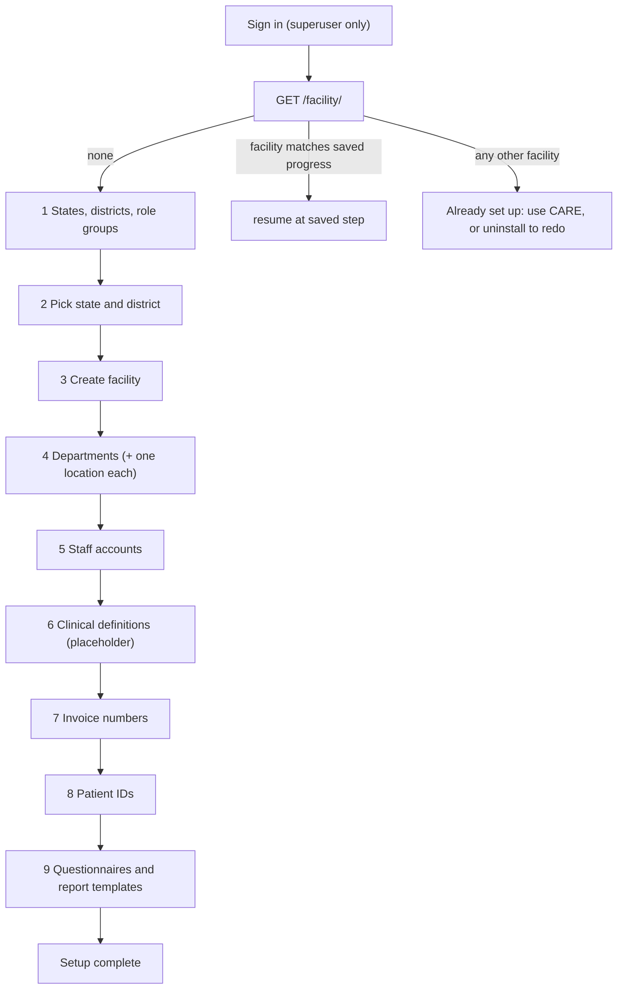

# Facility setup page (`/seed-data`)

[Documentation index](README.md)

After CARE Desktop has installed and started the clinic, the CARE database contains an `admin` login and nothing else. The facility setup page at `https://<clinic>.local/seed-data` walks the administrator through the first-time data a new instance needs: the government hierarchy, the facility, its departments and staff, numbering formats, and standard forms. It runs once; when a facility exists the page only says so.

Everything on the page happens in the browser against CARE's own REST API, with the administrator's JWT. There is no container, plugin, or desktop-app involvement beyond serving the static files. That keeps the source in one place (`data-loading/`) and means the page creates data exactly the way the CARE web application would.

## Where the pieces live

```text
data-loading/
|-- data/
|   |-- master-repo.xlsx                 hand-maintained clinical master sheet
|   |-- activity-definitions/*.json      generated from the sheet by the converter, committed
|   |-- states-and-districts.json        36 states and union territories with their districts
|   |-- questionnaire_fixtures.json      copied from the CARE backend at the pinned CARE_BE_REF
|   `-- template_fixtures.json           copied from the CARE backend at the pinned CARE_BE_REF
`-- frontend/                            Vite + React + Tailwind + shadcn page
    |-- scripts/convert-master-repo.mjs  xlsx -> data/activity-definitions
    |-- scripts/prune-fonts.mjs
    `-- src/
        |-- care/                        one module per CARE resource the page touches
        |-- lib/api.ts                   fetch wrapper: bearer token, refresh, error text, pagination
        |-- lib/batch.ts                 bounded-concurrency runner with created/skipped/failed counts
        |-- loaders/                     bulk loaders that are not (yet) wired into a step
        |-- state/wizard.tsx             step order and the progress record kept in localStorage
        |-- screens/                     login, facility gate, done
        `-- steps/                       one screen per step
```

`npm run build` in `data-loading/frontend` writes the page to `deployments/seed-data/` (ignored by git). `app/frontend/scripts/build-seed-page.mjs` runs that build as the first step of the desktop frontend's `npm run build`, so `stage-install.mjs` picks the page up with the rest of the kit and it ends up in the installed kit next to the Caddyfile. CI builds it in both the frontend job and the native build job. On the clinic computer `ensureInstallDir` deletes and re-copies `seed-data/` on every refresh so hashed assets from earlier releases do not accumulate.

Caddy serves the directory from the `(site)` group only, so the page is reachable over HTTPS and never over the plain-HTTP bootstrap listener. Its API calls go to `/api/v1/...` on the same origin and pass through the existing `/api/*` handler and WAF like the CARE web application's do.

## Flow



Steps 1–3 are required; 4–9 can be skipped. Each step writes to CARE when its button is pressed and only then unlocks the next one. Progress (current step, the ids created so far) is kept in the browser's `localStorage`. Reopening the page in the same browser resumes; a different browser sees the facility and gets the "already set up" screen, which is the intended guard against running the setup twice. There is no reset: to redo the setup, uninstall CARE Desktop and install again.

## What each step creates

| Step | CARE resources | Idempotency |
| --- | --- | --- |
| 1 | Role-type `Organization`s (Administrator, Facility Admin, Doctor, Nurse, Staff, Pharmacist, Volunteer); govt `Organization`s for every state (`metadata.govt_org_type = state`) and district (`= district`) from `states-and-districts.json` | existing names are skipped; CARE also rejects a duplicate name at the same level |
| 2 | nothing; records the chosen district | — |
| 3 | `Facility` under the district, `is_public = true`; CARE auto-creates its `Administration` organization | the facility gate prevents a second run |
| 4 | one `FacilityOrganization` (`org_type = dept`) per name and one `FacilityLocation` of the same name (`form = wa`, `mode = kind`); the department and Administration are added as the location's managing organizations through `organizations_add`, since the `organizations` field on create is validated but not stored | matched by name; missing links are added on re-run |
| 5 | `User`s with the shared starting password and a `role_orgs` entry in the matching role group; membership in each ticked department with the chosen role; when "facility admin" is ticked, an additional membership in Administration with the Facility Admin role (the chosen role is unchanged elsewhere) | matched by username; existing memberships are tolerated |
| 6 | placeholder; see below | — |
| 7 | `set_invoice_expression` on the facility: `f'<INITIALS>-INV-{invoice_count + 1}'` | overwrites |
| 8 | an instance-wide `PatientIdentifierConfig` (`facility = null`) with `default_value = f'<INITIALS>-{patient_count + 1:04d}'` | skipped when an active instance config with the same `system` exists |
| 9 | `Questionnaire`s shared with every role group and the district; report `Template`s scoped to the facility | matched by slug |

Roles and valuesets are not created here: the CARE image's `celery_beat.sh` runs `sync_permissions_roles` and `sync_valueset` every time the clinic starts.

CARE's expression variables are `invoice_count` / `patient_count` and `current_year_yy` / `current_year_yyyy`; there is no facility-initials variable, so the page bakes the initials into the expression as a literal. The administrator can edit both later in CARE's billing and patient-identifier settings.

## Clinical definitions and the master sheet

Step 6 is a placeholder. The loader behind it, `loaders/activity-definitions.ts`, is complete and can be tried by opening the page with `?clinical` in the URL. It reads a category's JSON, makes sure a `ResourceCategory` of type `activity_definition` exists for it, and posts each activity definition with `locations: []` and `healthcare_service: null`, referencing specimens, observations and charge items by their facility slugs. Those referenced definitions must already exist in the facility; rows whose references are missing are reported as failed without calling CARE. Loading lab categories therefore needs specimen, observation and charge-item loaders first, which is why the step is not switched on. Radiology and Procedures reference nothing and load on their own.

Two things to know before wiring the step on:

- CARE validates every `code`, `body_site` and `diagnostic_report_codes` entry against its valuesets, which look codes up on the SNOMED/LOINC terminology server configured in the backend. Loading definitions therefore needs internet access, and each row costs a lookup.
- Without locations or a healthcare service, service requests created from these definitions have no location and do not appear on any lab worklist. Mapping a category to a department (creating a `HealthcareService` with that department's location and setting it on the activities) is the piece that makes ordered tests fulfillable, and is deliberately left for a later decision.

The converter (`npm run convert` in `data-loading/frontend`) reads the `all_activity_definition` and `procedure_activity_definition` sheets of `data/master-repo.xlsx`, trims whitespace, strips `.0` from codes, lowercases classifications, and groups rows by `category_name` into `data/activity-definitions/<category>.json` plus an `index.json` with counts. It repairs a missing slug (derived from the title), a missing classification (inferred from the category) and a non-status value in the `status` column, printing a warning for each, and fails on a missing title or code or a duplicate slug. It also warns about references to specimen, observation or charge-item slugs that the sheet does not define. CI runs the converter and fails if the committed JSON is out of date, so edit the sheet, run the converter, and commit both.

## Development

```bash
cd data-loading/frontend
npm ci
npm run dev        # http://localhost:5173/seed-data/ with /api proxied to CARE_API_URL (default http://localhost:9000)
npm run build      # writes deployments/seed-data/
npm run convert    # regenerates data/activity-definitions from the sheet
```

The page authenticates with `POST /api/v1/auth/login/` and refuses non-superusers. Access tokens are refreshed through `/api/v1/auth/token/refresh/` when a request returns 401, so a long session does not stall. Tokens live in memory only.
