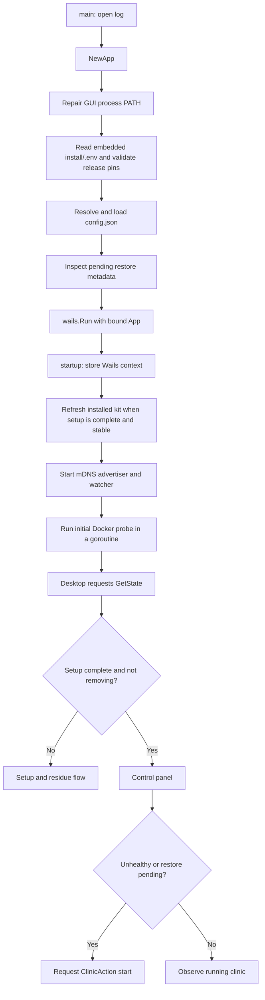
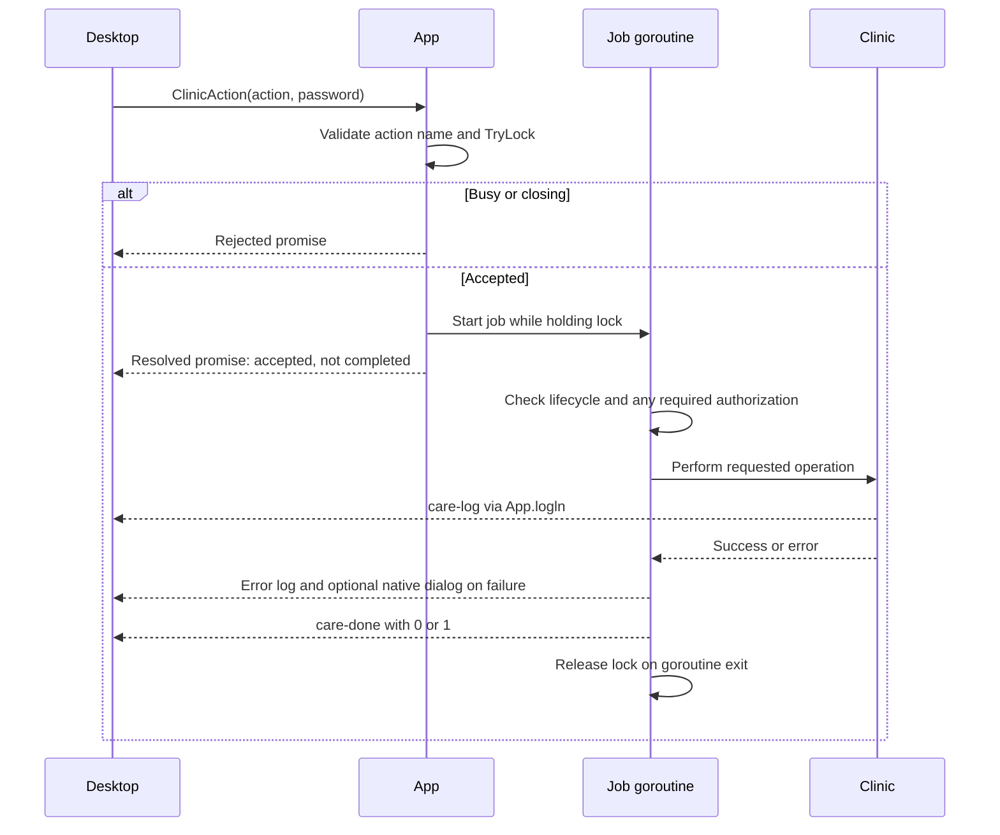

# Wails application and API

[Documentation index](README.md)

This guide covers `app/*.go` and the desktop-to-Go contract. Lower-level work is delegated to the [clinic engine](clinic-lifecycle.md), [backup store](backups-and-restore.md), and [native packages](native-integrations.md).

## Entry point and embedded resources

[`main.go`](../app/main.go) embeds two independent trees:

| Embedded filesystem | Source at compile time | Runtime use |
| --- | --- | --- |
| `assets` | `app/frontend/dist/` | Wails serves the desktop control panel from the executable. |
| `installFS` | `app/install/` | The application reads release pins and unpacks the deployment kit. |

The desktop UI is not served from the CARE frontend container. It must remain usable when the clinic stack is stopped or not installed.

`main()` opens the diagnostic log, installs its fatal-error callback, constructs `App`, records version/pin information, and calls `wails.Run`. Only the `App` instance is bound. Exported receiver methods become desktop-callable methods; helper functions and unexported methods do not.

The window title is `CARE Desktop`, with an initial size of 1100 by 700 and a minimum of 720 by 560. On macOS, `HideWindowOnClose` is enabled. The single-instance identifier is `ohc.care-desktop`; a second launch shows and unminimizes the existing window.

### The initial size has to fit the smallest supported screen

Wails centres the window on the work area, positioning it at the work area's midpoint minus half the window height. A window taller than the work area therefore gets a **negative** top coordinate, and the title bar — with the close and maximise buttons — is pushed above the top of the screen where it cannot be reached. Growing the default size is not a neutral change: it fails this way on any screen shorter than the value chosen, and a clinic computer is as likely to be a small laptop as a desktop.

The initial 700 clears the work area of a 1366×768 laptop, the smallest common panel. `fitWindowToScreen` in [app_lifecycle.go](../app/app_lifecycle.go) then covers anything smaller, shrinking to the current screen less `screenMargin` and re-centring, with the configured minimum as the floor.

Two constraints shape that helper. `Screen.Size` is the whole monitor in logical pixels, which is the unit `WindowSetSize` takes, but it does **not** exclude the taskbar; `screenMargin` is the allowance for that and for window chrome, not decoration. And `OnStartup` runs on its own goroutine while the window is being shown, so the helper cannot be the only thing keeping the window on screen — resizing there races the first paint. It narrows a window that already fits; it does not rescue a default that does not.

It also guards its context before calling the runtime. `wruntime` resolves the frontend from a `frontend` value carried by the lifecycle context, and when that value is absent it reports the problem with `log.Fatalf` — which exits the process rather than returning an error. Any test or future caller that reaches a runtime call with a plain `context.Background()` therefore terminates the binary mid-run instead of failing a case. Checking for the value first is what keeps that path inert outside a real window.

Startup failures are written to the log and stderr. `fatal()` attempts a native error dialog on macOS or Windows, then exits with status 1.

## Startup and shutdown

First run selects and saves a Server or Client role. Existing or partial
installations infer Server. Clients and unchosen installations do not perform
Docker/backup inspection or run the server startup path shown below; clients
instead use native certificate bootstrap and connection management.

`NewApp` does not treat a missing embedded release file, malformed saved configuration, or invalid restore journal as an ordinary first run. It returns an error rather than allowing initialization against uncertain state.

[`refreshInstallDir()`](../app/app_lifecycle.go) runs under the mutation gate. It does nothing for an unconfigured or removing installation. It also leaves the installed kit untouched when a restore is pending. Otherwise it refreshes kit files and reapplies the saved clinic domain. A refresh error is logged; the callback does not silently rewrite the configuration as uninstalled.

The backend starts name advertising, but the desktop state store makes the normal "start CARE on launch" request. In [`care-store.tsx`](../app/frontend/src/state/care-store.tsx), `bootPanel()` requests Start if health is inactive **or** `restore_pending` is true.

### Advertiser lifetime

`App` owns the mDNS advertiser. Its watcher wakes every 30 seconds, restarts advertising when LAN interfaces/addresses change or enumeration fails, and retries after two consecutive direct-hostname probe failures. Probe and network errors are logged. It can also recreate an absent advertiser. No name is advertised when the name is empty, removal is in progress, or application shutdown has begun.

`shutdown()` closes the watcher's stop channel and stops the advertiser. Stopping the desktop's advertisement is distinct from stopping Docker containers.

### Closing the application

`beforeClose()` first attempts the exclusive operation lock. If work is active, closing is prevented. Otherwise it asks about a running clinic.

There are three outcomes but only two buttons, because a platform message box cannot be relied on to offer more: Windows renders a question as a fixed two-button box regardless of what is requested (see [native dialog answers](#native-dialog-answers-are-not-the-button-labels)). `askBeforeQuit` therefore asks up to two plain yes/no questions instead of labelling one dialog with three choices:

| Answer or condition | `quitChoice` | Result |
| --- | --- | --- |
| "Quit CARE Desktop?" answered no | `quitStayOpen` | Prevent closing; the desktop remains open. |
| Quit yes, "Shut the clinic down as well?" yes | `quitStopClinic` | Attempt a bounded Compose stop, then allow closing if it succeeds. |
| Quit yes, shut down no | `quitLeaveClinicRunning` | Allow closing; containers keep serving. |
| No clinic detected, dialog error, or prompt timeout | `quitLeaveClinicRunning` | Allow closing without claiming that containers were stopped. |

Both questions default to the safe answer, so a stray Return neither quits a serving clinic nor shuts one down. `quitLeaveClinicRunning` is deliberately the zero value: an answer that never arrives should let the window close, matching the timeout, rather than wedging it open.

The prompt timeout is 30 seconds and covers both questions together; the explicit stop timeout is 90 seconds. The `closing` flag is set under the operation lock before an allowed exit. New protected jobs and reads reject it.

Shutting the clinic down is also available without quitting, from the panel's Stop control. The second question is a convenience on the way out, not the only route.

These semantics are separate from macOS window hiding: hiding a window is not necessarily process shutdown.

## Concurrency and job protocol

### Three execution helpers

| Helper | Lock | Completion contract |
| --- | --- | --- |
| `run(fn, markSetup, label)` | Exclusive `TryLock` held by the job goroutine | Method returns after acceptance; completion uses events. |
| `withJob(fn)` | Exclusive `TryLock` | Method returns the callback's result. |
| `withReadJob(fn)` | Shared `TryRLock` | Method returns the read result; other protected readers may run simultaneously. |

All three reject a closing application. Failed lock acquisition returns `something else is still running - wait for it to finish`. There is no queue or automatic retry.

The shared helper is used by `ReadEnv` and `ReadPlugins`. It prevents the two environment reads and plugin reads from rejecting one another, while still excluding setup, removal, and writes. It does not allow settings reads during an active exclusive job.

The final event is emitted by a deferred finalizer, before the outer deferred unlock. It is a completion notification, not a reservation for an immediately chained mutation. Callers must still handle a rejected subsequent request.

For setup, `markSetup=true` means the runner persists `SetupDone=true` only after the setup callback succeeds. It then emits `setup-done` and shows the installed-clinic dialog, which asks whether to open the clinic now and opens it in the browser on yes. If persisting the successful state fails, the job is still reported as failed.

A job can be waiting for a native confirmation or result dialog while holding the lock. An idle-looking terminal does not prove that the job has finished; both the work and its synchronous dialog handling must return before the lock is released.

A panic inside the job is converted to a logged stack trace and failure notification. This recovery is for the long-running job boundary; it is not a general transaction rollback.

### Lifecycle and authorization guards

| Guard | What it requires |
| --- | --- |
| `requireAdmin(password)` | The cached configuration has `SetupDone=true` and bcrypt accepts the password against `AdminPwHash`. |
| `requireSetup()` | Not removing, setup complete, and the installed `docker-compose.yml` exists as a regular file. |
| `requireStableClinic()` | `requireSetup()` plus no pending restore journal. |

Start and Stop can be requested during a pending restore; Start performs recovery. Restart, rebuilds, backup-now, settings writes, plugin writes, backup-directory changes, and new restores require a stable clinic.

Environment and plugin reads use `requireAdmin` plus `requireSetup`, allowing inspection after an interrupted restore. They still respect the shared/exclusive operation gate.

The desktop administrator password is a local authorization mechanism. The interface may check it to unlock controls, but protected Go methods check it again. There is no durable unlocked session or bearer token.

## Complete bound method reference

The following methods are declared in [`wails.d.ts`](../app/frontend/src/wails.d.ts). Types below use their JavaScript-facing names; every call returns a promise. An `error` return from a synchronous Go method rejects that promise.

Execution abbreviations: **query** means no `run`/`withJob` helper, **read** means shared read gate, **sync** means exclusive synchronous gate, and **job** means exclusive asynchronous job.

### State and prerequisite operations

| Method | Result | Execution and contract |
| --- | --- | --- |
| `GetState()` | `AppState` | Query. Returns embedded version, role and client URL. Only servers inspect Docker/restore state and expose server setup/name/status; journal errors propagate. Never exposes the pinned PEM or certificate ownership flag. |
| `DockerStatus()` | `DockerStatus` | Query. Checks actual Docker/Compose usability. |
| `GitStatus()` | `DockerStatus` | Query. Uses the same `{ok, message}` shape for Git. |
| `MDNSStatus()` | `NameStatus` | Query. Reports whether this process has an advertiser, not an end-to-end remote-device verdict. |
| `NetworkStatus()` | `NetworkStatus` | Query. Platform-specific networking inspection. |
| `FixNetwork()` | `void` | Sync. Runs the native networking repair. |
| `DockerPlan()` | `ToolPlan` | Query. Describes the available Docker install/open/manual action. |
| `GitPlan()` | `ToolPlan` | Query. Describes the available Git action. |
| `InstallDocker()` | `string` | Sync. Runs prerequisite provisioning and returns its result or error. |
| `InstallGit()` | `string` | Sync. Runs Git provisioning. |
| `OpenDocker()` | `void` | Sync. Attempts to launch the available Docker application: Rancher Desktop on macOS/Windows, the `docker` service on Linux. |
| `RestartPlan()` | `RestartPlan` | Query. Describes a detected prerequisite-related reboot requirement. |
| `RestartNow()` | `void` | Sync. Attempts to enable login startup, then requests an OS restart; autostart failure is logged. |
| `ClinicHealth()` | `Health` | Query. HTTP health probe, separate from name and certificate-trust checks. |
| `ClinicStatus()` | `string` | Query. Engine's formatted Compose service status. |

### Setup and lifecycle

#### Role and client connection

These methods return `error` in Go, resolving to `void` or rejecting the
JavaScript promise. Role selection lives in
[`app_config.go`](../app/app_config.go); client operations live in
[`app_client.go`](../app/app_client.go).

| Method | Execution and contract |
| --- | --- |
| `SelectRole(role string)` | Sync. Persists `server` or `client`; rejects ordinary role changes after selection. |
| `ClearRole()` | Sync. Undoes an unused choice from the setup or client screen's Back button: clears the file only when nothing beyond `role`/`mdns_name` is saved and the install directory is empty; otherwise errors and changes nothing. See [Persisted `Config`](configuration-and-settings.md#persisted-config). |
| `ConnectClient(address string)` | Sync. Client only. Normalizes a clinic address, rejects changing clinics until disconnected, validates bootstrap and TLS, journals URL/public pin/ownership before OS installation, retries using the saved pin, verifies TLS, and opens CARE. |
| `DisconnectClient()` | Sync. Client only. Removes only the exact certificate installed by this client, then clears connection/certificate fields and role. Errors retain retry state. |

The frontend refreshes `GetState` after connection or cleanup. A saved URL can
represent an incomplete installation, so **Disconnect** remains
available after a failed attempt. The confirmation explains that no server
data is removed. Pre-existing roots are preserved and may still allow browser
access. Successful uninstall returns to role selection. OS uninstall removes the
executable separately. See [client trust and removal](native-integrations.md#native-client-setup-and-trust-on-first-use).

#### Server setup and lifecycle

| Method | Result | Execution and contract |
| --- | --- | --- |
| `ValidatePassword(pw)` | `string` | Query. Empty string means valid; otherwise a policy message. |
| `ValidateDomain(name)` | `string` | Query. Empty string means a valid clinic label. |
| `ValidateBackupDir(dir)` | `string` | Query-like validation with filesystem inspection and a temporary write probe. Empty input selects the default destination for validation. |
| `SetMDNSName(name)` | `void` | Sync. Pre-setup only; rejects installed or removing state, saves the normalized `.local` name, restarts advertising. |
| `VerifyAdminPassword(pw)` | `boolean` | Query. Compares with the saved desktop bcrypt hash. |
| `RunSetup(mdnsName, adminPassword, backupPassword, backupDir)` | `void` | Job. Validates passwords/name, requires no installed/removing clinic, prepares configuration and kit, sets up and starts the engine. |
| `CleanupFailedInstall()` | `void` | Sync. Only for an incomplete setup; safely removes failed-install resources while retaining required recovery material. |
| `ClinicAction(action, adminPassword)` | `void` | Job. Allow-listed action dispatch; details below. |
| `RunUninstall(removeImages, removeBackups, adminPassword)` | `void` | Job. Requires local admin authorization; persists removal state before destructive work. |
| `CareUpdateStatus()` | `ChannelStatus` | Query. The tracked branch, running commits, and any staged commit, read from `channel.lock`. |
| `CheckCareUpdate()` | `void` | Returns at once and checks in the background: resolves the branch heads and builds a newer commit into the `-next` images. A network failure is logged, not surfaced. A check already in flight is joined rather than refused, so pressing "Check now" during the automatic check is not an error. |
| `DismissCareUpdate()` | `void` | Sync. Records the staged commits as declined so the banner stops. The staged build still applies at the next start. |
| `CheckAppUpdate()` | `AppUpdate` | Query. Newest published GitHub release compared with the running version. Drafts and prereleases are excluded. |
| `InstallAppUpdate()` | `void` | Job. Downloads this platform's installer, verifies it against the release `SHA256SUMS`, launches it, and quits. |

`InstallAppUpdate` cannot call `wruntime.Quit` directly. `beforeClose` takes the job lock before it checks the closing flag, so quitting from inside a running job is refused as "an operation is still running". `quitAfterJob` waits for the job lock to be released and quits then.

The download is capped and checksum-verified before it is launched: an installer arrives from the network and replaces the application, so an unbounded or unverified body is not something a clinic should be asked to run. Windows runs the downloaded installer, which needs this app closed. macOS opens the disk image and leaves the copy to the operator; in-place bundle replacement is not implemented.
| `ScanResidue()` | `ResidueReport` | Query. Inspects owned files, Docker resources, saved password presence, and native traces. Inspection errors propagate. |
| `PurgeResidue()` | `void` | Sync. Refuses a normal installed clinic; requires a native destructive confirmation when residue exists. Preserves backups. |

The password policy in [`password.go`](../app/password.go) is 8 through 20 Unicode characters, with at least one uppercase letter, lowercase letter, and digit. Setup checks both administrator and backup passwords.

`ClinicAction` accepts only:

| Action | Engine call | Additional rule |
| --- | --- | --- |
| `start` | `Start()` | Setup required; pending restore allowed for recovery. |
| `stop` | `Stop()` | Setup required; pending restore allowed. |
| `restart` | `Restart()` | Stable clinic required. |
| `rebuild-backend` | `RebuildBackend()` | Stable clinic and administrator password required. |
| `rebuild-frontend` | `RebuildFrontend()` | Stable clinic and administrator password required. |
| `backup-now` | `BackupNow()` | Stable clinic required. |
| `update` | `ApplyUpdate()` | Stable clinic required. No administrator password: the update was built from the configured branch, and a second prompt would only encourage postponing it. |

Every action except `stop` then passes `ensureDockerReady()`. A stopped container
engine would otherwise surface inside the engine as an unexplained subprocess
failure, such as `inspect local images: exit status 1` from the image freshness
check. The gate reuses `DockerPlan()`, so it names whichever engine the platform
uses rather than assuming one:

| Plan action | Behavior |
| --- | --- |
| `""` | Docker answers; the action proceeds. |
| `open` | Ask the operator for confirmation, then `OpenDocker()`, which launches the engine and waits up to three minutes. Declining returns the readiness message as the error. |
| anything else | Return the readiness message and point at the requirements check; the engine is missing, not merely stopped. |

`stop` is excluded deliberately: reporting that an unreachable clinic is not
running does not require starting a container engine first.

The API does not require the desktop admin password for every operational control. In particular, ordinary start/stop/restart, backup-now, and backup-directory changes have their lifecycle checks but not `requireAdmin`.

### Environment, plugins, and backups

| Method | Result | Execution and contract |
| --- | --- | --- |
| `ReadEnv(name, adminPassword)` | `string` | Read. Admin plus setup required; `name` is only `backend` or `frontend`. Returns installed file contents. |
| `WriteEnv(name, content, adminPassword)` | `void` | Sync. Admin plus stable clinic required; parse dotenv syntax, then atomically replace the selected file. |
| `ReadPlugins(adminPassword)` | `CarePlugin[]` | Read. Admin plus setup required; parse `ADDITIONAL_PLUGS` from installed `backend.env`. |
| `SavePlugins(plugins, adminPassword)` | `void` | Sync. Admin plus stable clinic required; update the plugin variable without rebuilding by itself. |
| `ListBackups()` | `Backup[]` | Query. Returns an empty list if the installed compose file is absent; other file/read errors are not treated as an empty list. |
| `GetBackupDir()` | `string` | Query. Effective backup directory, including the engine's default if unconfigured. |
| `SetBackupDir(dir)` | `string` | Sync. Stable clinic required. Takes a parent folder, appends `care-db-backups`, preserves the key and conditionally restarts the sidecar. |
| `ChooseBackupFile()` | `string` | Native dialog. Starts in the backup directory; empty string means canceled or dialog failure. |
| `InspectBackupFile(path)` | `ImportedBackup` | Query. Checks filename/regular-file metadata and matching neighboring archive/key; does not yet validate dump contents. |
| `RestoreFromFile(path, passphrase, adminPassword)` | `void` | Job. Admin plus stable clinic required; inspect chosen file, obtain saved password if needed, restore from its directory. |
| `RestoreBackup(dbDump, filesArchive, passphrase, adminPassword)` | `void` | Job. Admin plus stable clinic required; restore selected names from the configured backup directory. |

File selection is not restore authorization. Full validation and data replacement occur in the later protected restore job. See [backups and restore](backups-and-restore.md).

### Desktop utilities

| Method | Result | Execution and contract |
| --- | --- | --- |
| `OpenURL(url)` | `void` | Opens the URL through the native browser integration. |
| `ChooseFolder(title)` | `string` | Native directory dialog; empty string means canceled or dialog failure. |
| `LogPath()` | `string` | Current diagnostic log path; may be empty if file logging is unavailable. |
| `OpenLogFolder()` | `void` | Opens/reveals the log with the OS file browser; errors if no log file is available. |
| `WasAutostartLaunched()` | `boolean` | Whether process arguments contain `--autostart`. |
| `AutostartEnabled()` | `boolean` | Reads the platform's login-startup state. |
| `SetAutostart(on)` | `void` | Sync. Changes the platform login-startup entry. |

### Native dialog answers are not the button labels

`MessageDialogOptions.Buttons` is a request, not a contract. Windows ignores it
entirely and renders a fixed native message box per dialog type, so the answer
is drawn from a closed set rather than from the labels that were asked for:

| Dialog type | Windows box | Answers it can return |
| --- | --- | --- |
| `QuestionDialog` | `MB_YESNO` | `Yes`, `No` |
| `InfoDialog`, `ErrorDialog` | `MB_OK` | `Ok` |
| `WarningDialog` | `MB_OKCANCEL` | `Ok`, `Cancel` |

macOS and Linux do render the requested labels and return the one that was
clicked. Code that compares the answer against its own label therefore works
on those platforms and silently fails on Windows: the comparison never matches,
and whatever the dialog guarded is skipped with no error and no log line. Treat
a custom label and the platform answer as two spellings of the same choice.

`DefaultButton` is subject to the same rule. The Windows path only moves the
default off the first button when that field is literally `No`; any other
spelling, including `Cancel`, leaves the first button selected. A destructive
action must use `No` if it is not to arrive pre-armed.

`affirmative()` and `askToProceed()` in [app_ui.go](../app/app_ui.go) hold this
for confirmations, and `confirmDialog()` routes through `affirmative()` so its
labels can change without silently inverting its meaning. Every prompt that
reads an answer goes through one of them: `PurgeResidue` (see
[cleanup and uninstall](cleanup-and-uninstall.md)), `askBeforeQuit`, and
`notifyInstalled`.

Two consequences are worth keeping in mind when adding a prompt. A choice
between more than two outcomes cannot be a single message box, because the
Windows box has two buttons; ask a second question instead. And an offer whose
action only fires on a non-default answer must be a `QuestionDialog`: an
`InfoDialog` collapses to a lone `Ok` on Windows, which is not a choice at all.

## Events and result shapes

| Event | Payload | Meaning |
| --- | --- | --- |
| `care-log` | One string | A line already written by Go to the host log. Do not write it back to the host again. |
| `care-done` | Number `0` or `1` | An asynchronous App job succeeded or failed. Not a detailed subprocess exit code. |
| `setup-done` | `true` | Setup callback and persistence of `SetupDone` succeeded. |
| `uninstalled` | `true` | Normal uninstall completed its cleanup and local state removal. |
| `care-update` | `{backend, frontend}` | A newer CARE commit has finished building and is staged. Raises the panel banner. |
| `care-check` | `{running, found}` | An update check started or finished. `running` covers the whole check, including the build a found commit starts, which is why the panel says a check can take minutes. A finished check with `found` false is what lets the Updates panel say "up to date" rather than stay blank. |

There is no job identifier or structured progress event. The single-job model keeps completion unambiguous, and the desktop derives setup progress from log messages using [`run-steps.ts`](../app/frontend/src/lib/run-steps.ts). Changes to important setup messages can therefore affect displayed progress.

Lines such as `$ care start` in the desktop log are action labels written by the state store. They do not imply that this repository ships a separate `care` command-line program.

The core serialized shapes are:

| Shape | Fields |
| --- | --- |
| `AppState` | `version`, `role`, `client_url`, `setup_done`, `mdns_name`, `docker`, `restore_pending`. Client-specific state exposes neither PEM nor ownership. `setup_done` is false while removal is in progress. |
| `DockerStatus`, `NameStatus` | `ok`, `message`. |
| `Health` | `active`, `code`, `detail`. |
| `NetworkStatus` | `applicable`, `ok`, `message`, `how`, `fixable`. |
| `ToolPlan` | `action`, `label`, `detail`, `url`. |
| `RestartPlan` | `needed`, `title`, `detail`, `label`. |
| `ResidueReport` | `clean`, `traces`; each trace has `id`, `label`, `detail`. |
| `Backup` | `db_dump`, `files_archive`, `label`, `manual`, `encrypted`, `size_bytes`. |
| `ImportedBackup` | `path`, `dir`, `db_dump`, `files_archive`, `label`, `encrypted`, `has_key`. |
| `CarePlugin` | `name`, `package_name`, optional `version` and `configs`. |

Go structs and their JSON tags are authoritative. [`types.ts`](../app/frontend/src/types.ts) mirrors them for the desktop.

## JavaScript bridge behavior

[`bridge.ts`](../app/frontend/src/lib/bridge.ts) resolves `window.go.main.App` per call rather than at module import. It waits up to 10 seconds, polling every 25 milliseconds, for runtime injection; the resolved object is cached. Missing methods produce an error naming the method instead of an opaque JavaScript invocation error.

`onCareEvent()` also waits for runtime injection and returns a cancellation/unsubscription function. `logToHost()` is only for messages originating in the desktop interface; replaying `care-log` through it would duplicate output.

The state store subscribes to completion events, clears its local busy state, refreshes health/backups/pending-restore state, and returns to setup if the backend reports the installation unavailable. It polls panel health every five seconds, skipping refresh while an action is busy.

These are integration details, not an alternative source of backend truth. A stale React state value cannot override a Go lifecycle guard.

## Changing this boundary

When changing an exported `App` method, update its declaration in `wails.d.ts`, its call sites, and any changed data shape in `types.ts`. The existing binding check verifies method names and argument counts, not full semantic or return-type compatibility.

Use `run()` only when completion should be event-driven. Do not make a synchronous write start an untracked goroutine, or make a read take an exclusive job lock just because a write in the same file uses it. Keep authorization and lifecycle checks inside the protected operation to avoid check-then-act races.
