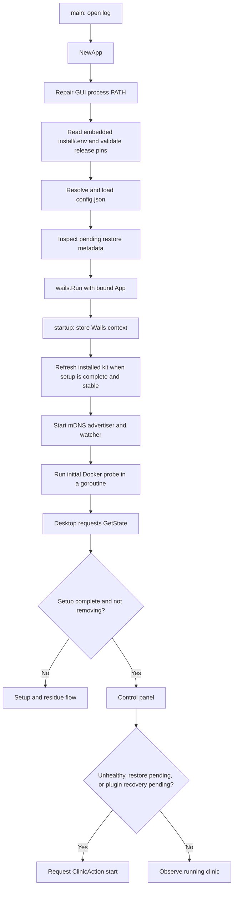
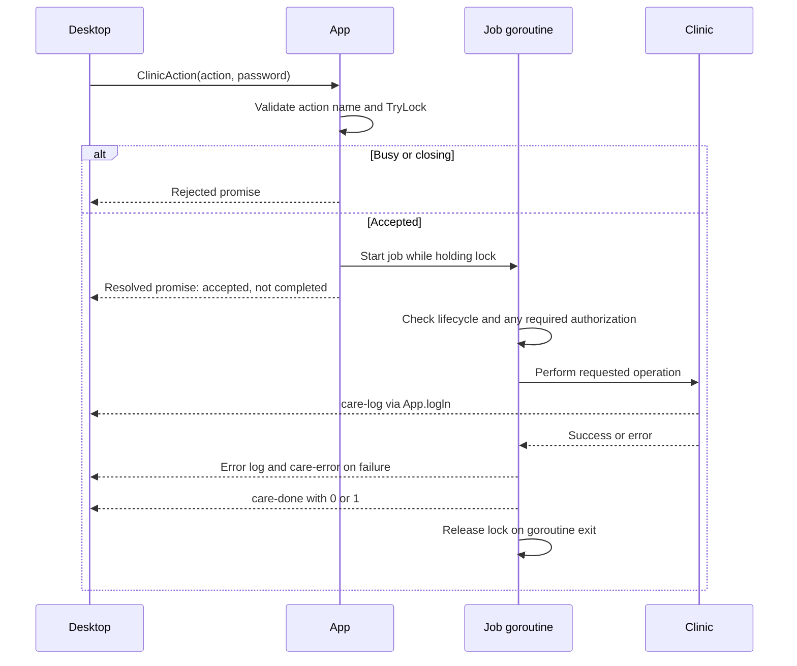

# Wails application and API

[Documentation index](README.md)

This guide covers `app/*.go` and the desktop-to-Go contract. Lower-level work is delegated to the [clinic engine](clinic-lifecycle.md), [backup store](backups-and-restore.md), and [native packages](native-integrations.md).

## Entry point and embedded resources

[`main.go`](../app/main.go) embeds two independent trees:

| Embedded filesystem | Source at compile time | Runtime use |
| --- | --- | --- |
| `assets` | `app/frontend/dist/` | Wails serves the desktop control panel from the executable. |
| `installFS` | `app/install/` | The application reads release pins and unpacks the deployment kit. |

The desktop UI is not served from the CARE frontend container. It must remain usable when the clinic stack is stopped or not installed.

`main()` opens the diagnostic log, installs its fatal-error callback, constructs `App`, records version/pin information, and calls `wails.Run`. Only the `App` instance is bound. Exported receiver methods become desktop-callable methods; helper functions and unexported methods do not.

The window title is `CARE Desktop`, with an initial size of 1100 by 700 and a minimum of 720 by 560. On macOS, `HideWindowOnClose` is enabled. The single-instance identifier is `ohc.care-desktop`; a second launch shows and unminimizes the existing window.

### The initial size has to fit the smallest supported screen

Wails centres the window on the work area, positioning it at the work area's midpoint minus half the window height. A window taller than the work area therefore gets a **negative** top coordinate, and the title bar — with the close and maximise buttons — is pushed above the top of the screen where it cannot be reached. Growing the default size is not a neutral change: it fails this way on any screen shorter than the value chosen, and a clinic computer is as likely to be a small laptop as a desktop.

The initial 700 clears the work area of a 1366×768 laptop, the smallest common panel. `fitWindowToScreen` in [app_lifecycle.go](../app/app_lifecycle.go) then covers anything smaller, shrinking to the current screen less `screenMargin` and re-centring, with the configured minimum as the floor.

Two constraints shape that helper. `Screen.Size` is the whole monitor in logical pixels, which is the unit `WindowSetSize` takes, but it does **not** exclude the taskbar; `screenMargin` is the allowance for that and for window chrome, not decoration. And `OnStartup` runs on its own goroutine while the window is being shown, so the helper cannot be the only thing keeping the window on screen — resizing there races the first paint. It narrows a window that already fits; it does not rescue a default that does not.

It also guards its context before calling the runtime. `wruntime` resolves the frontend from a `frontend` value carried by the lifecycle context, and when that value is absent it reports the problem with `log.Fatalf` — which exits the process rather than returning an error. Any test or future caller that reaches a runtime call with a plain `context.Background()` therefore terminates the binary mid-run instead of failing a case. Checking for the value first is what keeps that path inert outside a real window.

Startup failures are written to the log and stderr. `fatal()` attempts a native error dialog on macOS or Windows, then exits with status 1.

## Startup and shutdown

The first-run start screen only navigates; it does not save a role. On entry to
the server setup wizard, the UI waits for `BeginServerSetup` to succeed
before mounting the form or making its role-guarded reads and default-address
writes. A failed attempt can be retried on that screen. Client navigation does
not persist anything; `ConnectClient` records that role when connecting begins.
Existing or partial installations infer Server. Clients and unchosen installations do not perform
Docker/backup inspection or run the server startup path shown below; clients
instead use native certificate bootstrap and connection management.

```mermaid
flowchart TD
    Main["main: open log"] --> New["NewApp"]
    New --> Path["Repair GUI process PATH"]
    Path --> Pins["Read embedded install/.env and validate release pins"]
    Pins --> Config["Resolve and load config.json"]
    Config --> Journal["Inspect pending restore metadata"]
    Journal --> Wails["wails.Run with bound App"]
    Wails --> Startup["startup: store Wails context"]
    Startup --> Refresh["Refresh installed kit when setup is complete and stable"]
    Refresh --> Advertise["Start mDNS advertiser and watcher"]
    Advertise --> Probe["Run initial Docker probe in a goroutine"]
    Probe --> UI["Desktop requests GetState"]
    UI --> First{"Setup complete and not removing?"}
    First -->|No| Wizard["Setup and residue flow"]
    First -->|Yes| Panel["Control panel"]
    Panel --> Start{"Unhealthy, restore pending, or plugin recovery pending?"}
    Start -->|Yes| Run["Request ClinicAction start"]
    Start -->|No| Observe["Observe running clinic"]
```

`NewApp` does not treat a missing embedded release file, malformed saved configuration, or invalid restore journal as an ordinary first run. It returns an error rather than allowing initialization against uncertain state.

[`refreshInstallDir()`](../app/app_lifecycle.go) runs under the mutation gate. It does nothing for an unconfigured or removing installation. It also leaves the installed kit untouched when a restore or plugin rollback is pending. Otherwise it refreshes kit files and reapplies the saved clinic domain. A refresh error is logged; the callback does not silently rewrite the configuration as uninstalled.

The backend starts name advertising, but the desktop state store makes the normal "start CARE on launch" request. In [`care-store.tsx`](../app/frontend/src/state/care-store.tsx), `bootPanel()` requests Start if health is inactive, `restore_pending` is true, or `plugin_recovery_pending` is true. Overview also offers **Recover clinic** for unfinished plugin recovery.

### Advertiser lifetime

`App` owns the mDNS advertiser. Its watcher wakes every 30 seconds, restarts advertising when LAN interfaces/addresses change or enumeration fails, and retries after two consecutive direct-hostname probe failures. Live foreign-name checks run before advertising and on watcher ticks. A conflict withdraws advertising and shows an administrator warning; retries cannot advertise while the conflict is detected. Probe and network errors are logged. It can also recreate an absent advertiser. No name is advertised merely by choosing it in the setup wizard, when the name is empty, during removal, or after application shutdown has begun.

`shutdown()` cancels pending permission confirmations, closes the watcher's stop
channel and stops the advertiser. Stopping the desktop's advertisement is
distinct from stopping Docker containers.

### Closing the application

`beforeClose()` first attempts the exclusive operation lock. `run` and `withLabeledJob` record the label of the job they start (`activeJob`) and clear it when the job ends, so a refused lock tells `beforeClose` what is running. Any running job gets a Quit/No question (default No) worded for that job by `jobQuitPrompt`, so an operation that hangs (for example Rancher Desktop never answering during `start`) can always be quit:

| Running job | What the question says |
| --- | --- |
| `setup` | Setup stops where it is. `SetupDone` stays false, so the next launch returns to the setup screen, whose residue check blocks Continue and offers **Remove old installation**. |
| `prereq` | The computer check's fix buttons (installing or starting Rancher Desktop, git, WSL 2, the Windows network profile). The step stops where it is and the next launch runs the computer check again. |
| `start`, `restart` | Starting can take minutes while Docker comes up; open the app again to try once more. |
| `restore`, `uninstall`, `update`, rebuilds | Quitting can leave data or the installation half-changed; the message says which action to run again after reopening. |
| `apply-plugins` | Reopen Desktop and start CARE to recover the previous plugin configuration after an interrupted apply or rollback. |
| `app-update` | The current version keeps working. A bundle swap already handed to macOS finishes on its own. |
| `backup-now` | The unfinished backup is unusable; earlier backups are unaffected. |
| Anything else, including unlabeled synchronous jobs | Generic wording pointing at the log. |

The redesigned frontend registers with `SetQuitDialogReady(true)`. Running-job
questions then arrive as `quit-requested`, with an immutable request ID and the
same job-specific warning. **Keep waiting** is the focused primary action.
`RespondToQuit(id, quit)` consumes only the current request; stale or replayed
answers cannot close the app. Unmounting unregisters the UI and invalidates its
pending request. Until registration, the native confirmation remains available.

`beforeClose` returns "prevent" at once, so the main thread never waits on a
dialog. Confirming sets `quitConfirmed` and calls `wruntime.Quit`; the second
`beforeClose` sees the flag and allows closing even though the job still holds
the lock. Nothing is cancelled: Docker commands, installers, and elevated
scripts that already started are not killed and may finish in the background.

Only one of these dialogs is shown at a time (`busyShown`); repeated quit attempts while one is open are ignored. With no work active, `beforeClose` asks about a running clinic.

There are three outcomes but only two buttons, because a platform message box cannot be relied on to offer more: Windows renders a question as a fixed two-button box regardless of what is requested (see [native dialog answers](#native-dialog-answers-are-not-the-button-labels)). `askBeforeQuit` therefore asks up to two plain yes/no questions instead of labelling one dialog with three choices:

| Answer or condition | `quitChoice` | Result |
| --- | --- | --- |
| "Quit CARE Desktop?" answered no | `quitStayOpen` | Prevent closing; the desktop remains open. |
| Quit yes, "Shut the clinic down as well?" yes | `quitStopClinic` | Attempt a bounded Compose stop, then allow closing if it succeeds. |
| Quit yes, shut down no | `quitLeaveClinicRunning` | Allow closing; containers keep serving. |
| No clinic detected, dialog error, or prompt timeout | `quitLeaveClinicRunning` | Allow closing without claiming that containers were stopped. |

Both questions default to the safe answer, so a stray Return neither quits a serving clinic nor shuts one down. `quitLeaveClinicRunning` is deliberately the zero value: an answer that never arrives should let the window close, matching the timeout, rather than wedging it open.

The prompt timeout is 30 seconds and covers both questions together; the explicit stop timeout is 90 seconds. The `closing` flag is set under the operation lock before an allowed exit. New protected jobs and reads reject it.

Shutting the clinic down is also available without quitting, from the panel's Stop control. The second question is a convenience on the way out, not the only route.

These semantics are separate from macOS window hiding: hiding a window is not necessarily process shutdown.

### In-window permission confirmations

[`app_confirmation.go`](../app/app_confirmation.go) implements the engine's
`Confirm(title, message) bool` callback without coupling `internal/` to React
or Wails. [`confirmation-dialog.tsx`](../app/frontend/src/components/confirmation-dialog.tsx)
is mounted at the application root, alongside the running-job quit dialog.
It is available during installation and removal, not only in the panel.

1. The component subscribes to `confirmation-requested` and
   `confirmation-cancelled`, then calls `SetConfirmationDialogReady(true)`.
   Registration returns the current immutable request snapshot, or `null`.
2. A native caller queues `{id, title, message}` and waits on that request's
   answer channel. Only one request may be pending. The caller retains its
   operation lock; confirmation uses a separate mutex, so answering cannot
   deadlock on that lock.
3. The dialog presents the concise message with Continue and Cancel. Cancel has
   initial focus and Escape declines. The component sends
   `RespondToConfirmation(id, approved)` once while a response is pending.
4. Go consumes only the matching current ID. Wrong, stale and replayed IDs
   reject and are logged. A delayed response or registration snapshot cannot
   close a newer dialog or revive a cancelled request.
5. Unregistration, runtime-context cancellation or shutdown declines a pending
   request and emits its cancelled ID. Shutdown also prevents new requests.

Response failures remain visible with a recheck/retry path. An unavailable
frontend before registration uses the explicit native confirmation fallback;
missing runtime and dialog errors are not approval. The fallback follows the
platform behavior described in [native dialog answers](#native-dialog-answers-are-not-the-button-labels).

This protocol transports consent, not operating-system credentials. Password,
Touch ID, certificate-security and UAC prompts still come from native system
tools. Decline handling belongs to the caller: optional local-browser setup
can be skipped, whereas incomplete cleanup must remain reported. Client Connect
already provides its own explicit consent and does not add this extra question.

## Concurrency and job protocol

### Three execution helpers

| Helper | Lock | Completion contract |
| --- | --- | --- |
| `run(fn, markSetup, label)` | Exclusive `TryLock` held by the job goroutine | Method returns after acceptance; completion uses events. |
| `withJob(fn)` | Exclusive `TryLock` | Method returns the callback's result. |
| `withReadJob(fn)` | Shared `TryRLock` | Method returns the read result; other protected readers may run simultaneously. |

All three reject a closing application. Failed lock acquisition returns `something else is still running - wait for it to finish`. There is no queue or automatic retry.

The shared helper is used by `ReadEnv` and `ReadPlugins`. It prevents the two environment reads and plugin reads from rejecting one another, while still excluding setup, removal, and writes. It does not allow settings reads during an active exclusive job.

```mermaid
sequenceDiagram
    participant UI as Desktop
    participant A as App
    participant J as Job goroutine
    participant C as Clinic
    UI->>A: ClinicAction(action, password)
    A->>A: Validate action name and TryLock
    alt Busy or closing
        A-->>UI: Rejected promise
    else Accepted
        A->>J: Start job while holding lock
        A-->>UI: Resolved promise: accepted, not completed
        J->>J: Check lifecycle and any required authorization
        J->>C: Perform requested operation
        C-->>UI: care-log via App.logln
        C-->>J: Success or error
        J-->>UI: Error log and care-error on failure
        J-->>UI: care-done with 0 or 1
        J->>J: Release lock on goroutine exit
    end
```

The final event is emitted by a deferred finalizer, before the outer deferred unlock. It is a completion notification, not a reservation for an immediately chained mutation. Callers must still handle a rejected subsequent request.

For setup, `markSetup=true` means the runner persists `SetupDone=true` only after
the setup callback succeeds. It then emits `setup-done`; the frontend waits for
both this persisted-success signal and the matching successful `care-done`
before entering Overview directly. There is no intermediate ready screen. If
persisting successful state fails, the job is still reported as failed.

Failed setup emits `setup-failed` before `care-done`, with retry availability and
interrupted-download metadata. `RetrySetup` uses the same job lock and retained
setup attempt, rather than calling cleanup or accepting a second set of setup
parameters. A completed preparation phase is skipped when retrying startup.
The attempt and original credentials stay in memory only and are released after
successful setup, removal, or a setup panic. Retry rechecks the exact saved
configuration, exported recovery files and backup location before acceptance.
The frontend preserves failure metadata and both success signals even when
events arrive before the acceptance promise resolves.

A job can be waiting for an in-window confirmation, a native question or an OS
approval while holding the lock. An idle-looking terminal does not prove that
the job has finished; both the work and its synchronous confirmation handling
must return before the lock is released.

A panic inside the job is converted to a logged stack trace and failure notification. This recovery is for the long-running job boundary; it is not a general transaction rollback.

### Lifecycle and authorization guards

| Guard | What it requires |
| --- | --- |
| `requireAdmin(password)` | The cached configuration has `SetupDone=true` and bcrypt accepts the password against `AdminPwHash`. |
| `requireSetup()` | Not removing, setup complete, and the installed `docker-compose.yml` exists as a regular file. |
| `requireStableClinic()` | `requireSetup()` plus no pending restore or plugin-recovery journal. |
| `clientRoleAvailable()` | The saved role is not `server` and the install directory holds no earlier setup. It is what the client methods use instead of requiring `role == client`, so a computer that has chosen nothing can still look for a clinic and connect. |

Start and Stop can be requested during a pending restore or plugin rollback; Start performs recovery. Restart, rebuilds, backup-now, settings writes, plugin writes, backup-directory changes, and new restores require a stable clinic. Start and plugin apply also reserve the CARE update-check flag; an already running update check must finish first. Update checks are suppressed while plugin recovery is pending.

Environment reads require the admin password and setup; plugin reads require setup but no password. Both allow inspection after an interrupted restore or plugin rollback and respect the shared/exclusive operation gate.

The desktop administrator password is a local authorization mechanism. Advanced
retains it only for its current unlock and locks after a fixed 15 minutes or
when the tab is left. Protected Go methods check the supplied password again.
There is no backend 15-minute lease, durable unlocked session or bearer token.
Locking the UI does not cancel a native operation already accepted.

## Complete bound method reference

The following methods are declared in [`wails.d.ts`](../app/frontend/src/wails.d.ts). Types below use their JavaScript-facing names; every call returns a promise. An `error` return from a synchronous Go method rejects that promise.

Execution abbreviations: **query** means no `run`/`withJob` helper, **read** means shared read gate, **sync** means exclusive synchronous gate, and **job** means exclusive asynchronous job.

### State and prerequisite operations

| Method | Result | Execution and contract |
| --- | --- | --- |
| `GetState()` | `AppState` | Query. Returns embedded version, role and client URL. Only servers inspect Docker/recovery state and expose server setup/name/status. Restore-journal errors propagate; plugin-journal errors are logged and keep `plugin_recovery_pending=true` so recovery controls remain available. Never exposes the pinned PEM or certificate ownership flag. |
| `DockerStatus()` | `DockerStatus` | Query. Checks actual Docker/Compose usability. |
| `GitStatus()` | `DockerStatus` | Query. Uses the same `{ok, message}` shape for Git. |
| `MDNSStatus(name)` | `NameStatus` | Query. Checks the requested name for live foreign mDNS claims without using the system resolver. Installed clinics must also have a responding advertiser. Offline/isolated peers cannot be ruled out. |
| `NetworkStatus()` | `NetworkStatus` | Query. Platform-specific networking inspection. |
| `FixNetwork()` | `void` | Sync. Runs the native networking repair. |
| `WSLStatus()` | `WSLStatus` | Query. Windows-only; `applicable` is false elsewhere and the row is hidden. |
| `InstallWSL()` | `string` | Sync. Turns on WSL 2. A non-empty result is the restart instruction, not an error. |
| `DockerPlan()` | `ToolPlan` | Query. Describes the available Docker install/open/manual action. |
| `RancherDownloadInfo()` | `DownloadInfo` | Server-only metadata query. HEAD request for the pinned installer returns filename and byte size before the UI asks for download confirmation. |
| `GitPlan()` | `ToolPlan` | Query. Describes the available Git action. |
| `InstallDocker()` | `string` | Sync. Runs prerequisite provisioning and returns its result or error. |
| `InstallGit()` | `string` | Sync. Runs Git provisioning. |
| `OpenDocker()` | `void` | Sync. Attempts to launch the available Docker application: Rancher Desktop on macOS/Windows, the `docker` service on Linux. |
| `RestartPlan()` | `RestartPlan` | Query. Describes a detected prerequisite-related reboot requirement. |
| `RestartNow()` | `void` | Sync. Attempts to enable login startup, then requests an OS restart; autostart failure is logged. |
| `ClinicHealth()` | `Health` | Query. HTTP health probe, separate from name and certificate-trust checks. |
| `ClinicStatus()` | `string` | Query. Engine's formatted Compose service status. |
| `DiskStatus()` | `DiskStatus` | Query. Installation/running free-space assessment. Measurement problems are described in the result, not necessarily a rejected promise; do not infer measured free bytes from `ok` alone. |
| `StorageStatus()` | `StorageReport` | Query. Returns the cached storage report or performs the first check. |
| `RecheckStorage()` | `StorageReport` | Query. Refreshes drive/backup measurements, updates the cache and emits `care-storage`. |
| `BackupDirSpace(dir)` | `BackupSpace` | Query. Assesses the selected parent plus `care-db-backups`, or the effective default; an unmeasurable destination has an unknown level and explanatory message. |
| `RancherDesktopInstalled()` | `boolean` | Query. Reports whether optional Rancher Desktop removal is applicable. It does not remove it. |

#### What the wizard rows owe the operator

The wizard is used by people who will not open a terminal, so a red row without
a button is a dead end. Two rules follow, and both were learned by breaking
them.

A failing row must keep its action. A row that reports a problem and withdraws
its own fix leaves nothing to press: the WSL row once treated a pending restart
as terminal and dropped its button, and because an unrelated change had left the
restart flag set, the operator was stranded. Conditions like that belong in the
wording, not in whether the fix is offered.

A row must not offer an action that can only fail either. Where one requirement
depends on another, the dependent row reports the dependency in words and
returns no action until it is met — the Docker row does this while WSL 2 is off,
so the only button on screen is the one that helps. The host still refuses the
underlying call, because a stale interface can outlive the rule that hid the
button.

Failures reported by an action are held against the row that produced them and
cleared as soon as that row stops failing. A single shared failure string prints
one row's error under every other failing row, and survives the re-check that
fixed it, so "Check again" appears to succeed while the old warning stays on
screen.

### Setup and lifecycle

#### Role and client connection

These methods return `error` in Go, resolving to `void` or rejecting the
JavaScript promise. Role selection lives in
[`app_config.go`](../app/app_config.go); client operations live in
[`app_client.go`](../app/app_client.go).

| Method | Execution and contract |
| --- | --- |
| `SelectRole(role string)` | Sync. Retained entry point: persists `server` or `client` and rejects ordinary role changes after selection. It now delegates to the same work as `BeginServerSetup`. |
| `BeginServerSetup()` | Sync. Records the server role when the operator enters setup step 1, not when the first screen is drawn. The Server/Client question itself writes nothing, so a computer that was only looked at keeps an empty settings file. |
| `FindClinic(address string)` | Read. Available before choosing Client, but refuses a saved or on-disk server setup. Normalizes the address, fetches and validates the clinic's public root, and verifies TLS pinned to it. It installs nothing, does not touch the hosts file, saves no settings and opens no browser; the validated root is kept in memory so `ConnectClient` does not download it a second time. |
| `ClientPreflight()` | Read. Role-independent, read-only and privilege-free: what connecting would clean up on this computer. |
| `ClientReachable()` | Query. One verified HTTPS connection to the saved clinic, pinned to the saved certificate, with a three-second limit and no retry. Takes no job lock, so the connected screen can poll it on a timer without a running connection turning every poll into a busy error. Changes nothing and elevates nothing. A clinic that does not answer is `reachable: false` with a plain `detail`, not a rejected promise; only a computer with no saved clinic is an error. |
| `ClearRole()` | Sync. Undoes an unused choice from the setup or client screen's Back button when `setUp()` confirms no installation/connection is in use. Pre-install recovery metadata is allowed; exported files are not deleted. Otherwise errors and changes nothing. See [Persisted `Config`](configuration-and-settings.md#persisted-config). |
| `ConnectClient(address string)` | Sync. Works with no saved role and records `client` itself; refused only when this computer has a clinic setup of its own. Normalizes a clinic address, rejects changing clinics until disconnected, removes CARE's hosts entries, validates bootstrap and TLS, journals URL/public pin/ownership before OS installation, removes every other CARE root, installs and verifies this one, and opens CARE. |
| `DisconnectClient()` | Sync. Client only. Removes only the exact certificate installed by this client, then clears connection/certificate fields and role. Errors retain retry state. |

The frontend refreshes `GetState` after connection or cleanup. A saved URL can
represent an incomplete installation, so **Disconnect** remains
available after a failed attempt. The confirmation explains that no server
data is removed. Other CARE roots are removed by the connection that replaces
them; roots from anything else are preserved and may still allow browser access.
Successful uninstall returns to role selection unless **Also remove the CARE
Desktop app** was ticked; see [removing the desktop app](cleanup-and-uninstall.md#removing-the-desktop-app). See [client trust and removal](native-integrations.md#native-client-setup-and-trust-on-first-use).

The client's two steps are deliberately separate. `FindClinic` answers "is the
clinic there, and is it a CARE clinic?" without changing anything, so the
interface can describe the repair before asking for it, and a mistyped address
costs nothing. `ConnectClient` is the step that changes this computer, and it
reuses the root `FindClinic` already validated rather than downloading a second
one — the trust-on-first-use decision is made once per connection, not twice.

Errors are plain English and prefix-stable, because
[`client-errors.ts`](../app/frontend/src/lib/client-errors.ts) maps them to a
title, message and next steps. Two are specific to this pair:

| Error | When |
| --- | --- |
| `this computer has an unfinished clinic setup; remove it in Setup before connecting` | The saved role is `server`, or the install directory holds an earlier setup's files. Both `FindClinic` and `ConnectClient` refuse. |
| `this computer is sending the clinic address to itself; connect to fix it` | The hosts file maps the clinic name to this computer *and* no clinic answered the multicast probe, so `FindClinic` cannot see past it. `ConnectClient` repairs the file and continues, at the cost of a second administrator prompt. |
| `this computer is not connected to a clinic` | `ClientReachable` was called with no saved clinic. This is misuse of the binding, not a state the connected screen can be in. |

`ClientReachable`'s `detail` is a state for the screen to phrase, not an error
to map. There are three:

| Detail | Meaning |
| --- | --- |
| `the server did not answer` | Nothing accepted the connection: the clinic is off, asleep, or on another network. |
| `the connection could not be verified` | Something answered, but not with the certificate this computer pinned, or not for this clinic's name. |
| `the clinic's security certificate is no longer valid` | The pinned root has expired or is damaged. Reconnecting replaces it. |

`ConnectClient` does the hosts and certificate cleanup itself, with no
confirmation argument and no callback: by the time the operator presses
Connect, the decision has been made, and a second question in front of the
operating system's own password prompt is noise. The interface's job is to say
what will happen beforehand — `ClientPreflight` exists for exactly that — and
to warn that the computer will ask for permission.

#### Server setup and lifecycle

| Method | Result | Execution and contract |
| --- | --- | --- |
| `ValidatePassword(pw)` | `string` | Query. Empty string means valid; otherwise a policy message. |
| `ValidateDomain(name)` | `string` | Query. Empty string means a valid clinic label. |
| `ValidateBackupDir(dir)` | `string` | Query-like validation with filesystem inspection and a temporary write probe. Empty input selects the default destination for validation. |
| `SetMDNSName(name)` | `void` | Sync. Pre-setup only; rejects installed or removing state and saves the normalized `.local` name. The uninstalled wizard does not advertise it. |
| `VerifyAdminPassword(pw)` | `boolean` | Query. Compares with the saved desktop bcrypt hash. |
| `ValidateSetup(mdnsName, adminPassword, backupDir)` | `SetupIssue[]` | Read. Rechecks applicable computer requirements, address availability, backup location, physical recovery materials and password. Returns actionable step IDs/messages for Review. |
| `RunSetup(mdnsName, adminPassword, backupDir)` | `void` | Validates under the exclusive job lock before accepting the job. Preflight rejection stays on Review; only an accepted installation enters Installing. The worker retains its own lifecycle/recovery/address guards. Advertising rechecks conflicts after setup. |
| `RetrySetup()` | `void` | Job. Retries the original in-memory setup attempt without cleanup, new credentials or replacement settings. Requires the same configuration and available original recovery files/backup location; rejects installed/removing state. Available only in the original Desktop process. |
| `GetSetupRecoveryStatus()` | `SetupRecoveryStatus` | Reports saved/verified flags, paths and missing/unreadable/mismatching files, never key material or hashes. The exported sheet must contain all six distinct saved codes; symlinks/non-regular/oversized sheets are rejected. |
| `SaveSetupBackupRecovery(backupDir)` / `VerifySetupBackupRecovery(backupDir)` | `boolean` | Sync. Native export/reselection; false means cancellation. Export is locked after installation starts. |
| `ReplaceSetupBackupRecovery(backupDir)` | `boolean` | Explicitly generates a replacement for a lost pre-install private key. Requires a new export and verification; never silently replaces an existing key. |
| `OpenSetupRecoveryCodes()` | `void` | Pre-install only. Verifies the saved sheet and opens it in the OS-associated application for printing; it does not claim to print directly. |
| `OpenSetupRecoveryFolder(codes)` | `void` | Windows-only, pre-install read job. Reveals the saved backup recovery file (`false`) or admin-code sheet (`true`) in Explorer. Requires server setup and an existing saved path; unsupported platforms and missing files reject. Does not read or return private contents. |
| `ChooseRecoveryFile()` | `string` | Native picker and structural validation. Cancellation returns empty; errors propagate. |
| `SaveAdminRecoveryCodes(adminPassword, backupDir)` | `boolean` | Sync. Exports six printable single-use codes. Requires authentication once installed; successful replacement invalidates all prior codes. |
| `ChangeAdminPassword(currentPassword, newPassword)` | `void` | Sync. Authenticated Desktop-only password change. |
| `ResetAdminPassword(code, newPassword)` | `void` | Sync. Rate-limited offline recovery; atomically consumes one code and changes the Desktop password. No CARE web reset. |
| `CleanupFailedInstall()` | `void` | Sync. Only for incomplete setup. Keeps the clinic address and existing backups, but resets backup-folder/password/recovery configuration. The UI clears those choices only after cleanup succeeds. New setup needs fresh recovery material; old backup keys may still be needed for earlier archives. |
| `ClinicAction(action, adminPassword)` | `void` | Job. Allow-listed action dispatch; details below. |
| `RunUninstall(removeImages, removeBackups, removeRancher, adminPassword)` | `void` | Job. Requires local admin authorization; persists removal state before destructive work. The UI waits for both `uninstalled` and successful `care-done` before returning to Start or requesting desktop-app removal. |
| `CareUpdateStatus()` | `ChannelStatus` | Query. The tracked branch, running commits, and any staged commit, read from `channel.lock`. |
| `CheckCareUpdate()` | `void` | Returns at once and checks in the background: resolves branch heads and builds a newer commit into `-next` images. Failure is logged and reported through `care-check.error`, never as "up to date". A check already in flight is joined rather than refused. |
| `DismissCareUpdate()` | `void` | Sync, under the exclusive job gate with a stable-clinic check. Records staged commits as declined so the banner stops. The staged build still applies at the next normal start unless invalidated by changed plugin inputs. |
| `CheckAppUpdate()` | `AppUpdate` | Query. Newest published GitHub release compared with the running version. Drafts and prereleases are excluded. |
| `InstallAppUpdate()` | `void` | Role-independent job, available before setup and on clients. Downloads this platform's installer with `app-update-progress` events, verifies it against the release `SHA256SUMS` (retrying once), then on macOS replaces the app bundle in place and restarts, and on Windows launches the installer and quits. Retains the single-job and closing guards. |
| `ScanResidue()` | `ResidueReport` | Query. Role-independent. Inspects owned files, Docker resources, saved-password presence and native traces. No Docker executable means no Docker-side traces; an installed engine that cannot be inspected is an error. |
| `PurgeResidue(confirmed)` | `ResidueReport` | Sync. Server only. Requires explicit destructive confirmation, refuses a normal installed clinic, preserves backups and returns the post-cleanup report. |

`InstallAppUpdate` cannot call `wruntime.Quit` directly. `beforeClose` takes the job lock before it checks the closing flag, so quitting from inside a running job would ask the user whether to quit during the update. `quitAfterJob` waits for the job lock to be released and quits then.

The shared [CARE Desktop update controller](../app/frontend/src/hooks/use-app-update.ts)
drives the start/client cards, the pre-install wizard rail, failed-install offer
and installed server's Updates tab. It is absent while clinic installation runs.
Successful native completion in an `installer` or `restarting` phase keeps the
global busy state under **Finish the CARE Desktop update**. For an external
installer, OK (start/client/setup) or Done (Updates) becomes available only after
the matching successful `care-done(0, "app-update")`. That acknowledgement releases
the handoff; it does not claim installation finished or that the running
version changed. A `restarting` phase has no acknowledgement and remains locked
until reopening. Unrelated completion events cannot release either guard.
It checks automatically and supports manual retries, download progress, and
update installation without a Desktop admin password, Docker, Git, or a clinic
connection. The OS may still request permission to replace the application.
Check failures are shown without blocking role selection. While an update is
running, conflicting role, client connection, and installation-retry actions
are disabled. CARE backend/frontend updates remain server-only.

The panel shares a live update guard rather than relying only on disabled
buttons from the last render. Its revision changes on update progress so a
folder picker opened before an update cannot write after the update is
acknowledged. Restore file selection and preflight additionally invalidate
cancelled operations, preserve the prior file selection and clear credentials.
Cancellation and password-recovery navigation remain available before native
restore submission; they do not cancel an accepted restore.

The download is capped and checksum-verified before it is launched: an installer arrives from the network and replaces the application, so an unbounded or unverified body is not something a clinic should be asked to run. A download that fails or whose SHA-256 differs from `SHA256SUMS` is deleted and fetched once more, since a dropped connection is the usual cause; if the second attempt is also bad, the temporary folder is removed and the operator is told the update didn't download properly and to choose Update again. Nothing unverified is ever opened. Windows runs the downloaded installer, which needs this app closed.

macOS replaces the bundle in place (`app_selfupdate.go`), so the operator never drags anything:

1. The disk image is attached read-only and hidden (`-nobrowse`) inside the update's temporary folder, the single `.app` in it is copied out with `ditto`, and the image is detached.
2. The copy must pass `codesign --verify --deep --strict`, report the release's version as `CFBundleShortVersionString`, and carry the running app's `CFBundleIdentifier`. Anything else is refused and the running app is left untouched.
3. A shell step moves the installed bundle aside to a hidden `.<name>.previous` next to it, copies the new bundle into its place, restores the old one if the copy fails, keeps the old owner, clears `com.apple.quarantine`, and deletes the old copy. If the app's parent folder isn't writable by this user, the step runs through `elevate.Run` and macOS asks for an administrator password.
4. A detached `sh` waits for this process to exit, runs `open` on the bundle, and removes the temporary folder. The app then quits through `quitAfterJob` with `closing` set, so no quit prompt appears. The clinic's containers keep running throughout.

Replacing the bundle while the old binary is still running is safe on macOS: the process keeps its mapped executable, and the frontend is embedded in the binary. When the app runs from a location it can't replace (the mounted disk image or an App Translocation copy), `appremoval.Target` refuses and the update falls back to opening the disk image for a manual drag.

The password policy in [`password.go`](../app/password.go) is 8 through 20 Unicode characters, with at least one uppercase letter, lowercase letter, and digit. Setup, change and recovery enforce it for the Desktop admin password. There is no backup password.

`ClinicAction` accepts only:

| Action | Engine call | Additional rule |
| --- | --- | --- |
| `start` | `Start()` | Setup required; pending restore allowed for recovery. |
| `stop` | `Stop()` | Setup required; pending restore allowed. |
| `restart` | `Restart()` | Stable clinic required. |
| `rebuild-all` | `RebuildAll()` | Stable clinic and administrator password required. Before the engine call, the app recopies its bundled kit into the install directory and reapplies the domain, the same refresh it does at launch. This is the Advanced tab's **Rebuild everything** button. |
| `rebuild-backend` | `RebuildBackend()` | Stable clinic and administrator password required. |
| `rebuild-frontend` | `RebuildFrontend()` | Stable clinic and administrator password required. |
| `apply-plugins` | `ApplyPlugins()` | Healthy running clinic required; no Desktop admin password. Applies a staged draft with bounded readiness checks and durable configuration/image rollback on failure. |
| `backup-now` | `BackupNow()` | Stable clinic required. |
| `free-space` | `FreeSpace()` | Stable clinic required. No administrator password: it never touches clinic data. Runs from the separate Storage tab's cleanable drive row. |
| `update` | `ApplyUpdate()` | Stable clinic required. No administrator password: the update was built from the configured branch, and a second prompt would only encourage postponing it. |

Every action except `stop` then passes `ensureDockerReady()`. A stopped container
engine would otherwise surface inside the engine as an unexplained subprocess
failure, such as `inspect local images: exit status 1` from the image freshness
check. The gate reuses `DockerPlan()`, so it names whichever engine the platform
uses rather than assuming one:

| Plan action | Behavior |
| --- | --- |
| `""` | Docker answers; the action proceeds. |
| `open` | Ask the operator for confirmation, then `OpenDocker()`, which launches the engine and waits up to eight minutes. If Rancher exits during startup, retry its launch once and fail early if it does not stay running. Declining returns the readiness message as the error. |
| anything else | Return the readiness message and point at the requirements check; the engine is missing, not merely stopped. |

`stop` is excluded deliberately: reporting that an unreachable clinic is not
running does not require starting a container engine first.

The API does not require the desktop admin password for every operational control. In particular, ordinary start/stop/restart, backup-now, and backup-directory changes have their lifecycle checks but not `requireAdmin`.

### Environment, plugins, and backups

| Method | Result | Execution and contract |
| --- | --- | --- |
| `ReadEnv(name, adminPassword)` | `string` | Read. Admin plus setup required; `name` is only `backend` or `frontend`. Returns installed file contents. |
| `GetBackupPolicy()` | `BackupPolicy` | Query. Requires an installed server. Reports the 86,400-second interval and actual installed retention days; zero means forever. Missing/unreadable settings or invalid/negative retention reject rather than inventing a policy. |
| `WriteEnv(name, content, adminPassword)` | `void` | Sync. Admin plus stable clinic required; parse dotenv syntax, then atomically replace the selected file. |
| `ReadPlugins()` | `CarePlugin[]` | Read. Installed server required, no password; read `plugins.json`, or derive the list from `ADDITIONAL_PLUGS` when that file is absent. |
| `SavePlugins(plugins)` | `void` | Sync. Stable clinic required, no password; validate and stage `plugins-pending.json`, leaving active configuration untouched until apply. |
| `PluginCatalog()` | `PluginCatalogEntry[]` | Query. The bundled plugin catalog. |
| `ListBackups()` | `Backup[]` | Query. Returns an empty list if the installed compose file is absent; other file/read errors are not treated as an empty list. |
| `GetBackupDir()` | `string` | Query. Effective backup directory, including the engine's default if unconfigured. |
| `SetBackupDir(dir)` | `string` | Sync. Stable clinic required. Takes a parent folder, appends `care-db-backups`, preserves the key and conditionally restarts the sidecar. |
| `ChooseBackupFile()` | `string` | Native dialog. Starts in the backup directory; empty string means cancellation. Dialog errors reject and are logged. |
| `InspectBackupFile(path)` | `ImportedBackup` | Query. Checks filename/regular-file metadata and matching neighboring archive; does not yet validate dump contents. |
| `RestoreFromFile(path, recoveryFile, adminPassword)` | `void` | Job. Desktop admin plus stable clinic required; restore using the explicitly selected recovery file. |
| `RestoreBackup(dbDump, filesArchive, recoveryFile, adminPassword)` | `void` | Job. Desktop admin plus stable clinic required; restore selected names from the configured backup directory using the selected recovery file. |

File selection is not restore authorization. Full validation and data replacement occur in the later protected restore job. See [backups and restore](backups-and-restore.md).

### Desktop utilities

| Method | Result | Execution and contract |
| --- | --- | --- |
| `OpenURL(url)` | `void` | Opens the URL through the native browser integration. |
| `ChooseFolder(title)` | `string` | Native directory dialog; empty string means cancellation. Starts at Windows' Desktop known folder on Windows and the user home elsewhere. Windows known-folder lookup failures and dialog errors reject and are logged. |
| `LogPath()` | `string` | Current diagnostic log path; may be empty if file logging is unavailable. |
| `OpenLogFolder()` | `void` | Opens/reveals the log with the OS file browser; errors if no log file is available. |
| `WasAutostartLaunched()` | `boolean` | Whether process arguments contain `--autostart`. |
| `UninstallRequested()` | `boolean` | Whether the Windows uninstaller started this process with `--uninstall`. |
| `ExitUninstall()` | `void` | Waits for any running job, then quits. The process exit code tells the uninstaller whether the setup is gone. |
| `CanRemoveApp()` | `boolean` | Whether this copy can remove itself: a macOS app bundle outside the disk image, or a Windows install with `uninstall.exe`. Always false in `--uninstall` mode. |
| `RemoveApp()` | `void` | Waits for any running job, refuses while the computer is still set up, then quits and removes the app. |
| `AutostartEnabled()` | `boolean` | Reads the platform's login-startup state. |
| `SetAutostart(on)` | `void` | Sync. Changes the platform login-startup entry. |
| `SetQuitDialogReady(ready)` | `QuitRequest` or `null` | Registers/unregisters the running-job quit UI and returns a pending snapshot. Unregistration invalidates its current request. |
| `RespondToQuit(id, quit)` | `void` | Answers only the current running-job quit request; stale/replayed IDs reject. A positive answer requests application exit, not job rollback. |
| `SetConfirmationDialogReady(ready)` | `ConfirmationRequest` or `null` | Registers/unregisters the permission UI and returns a pending snapshot. Unregistration declines any waiting request. |
| `RespondToConfirmation(id, approved)` | `void` | Consumes only the current permission request ID, using its independent mutex/channel rather than the job lock. |

### Native dialog answers are not the button labels

`MessageDialogOptions.Buttons` is a request, not a contract. Windows ignores it
entirely and renders a fixed native message box per dialog type, so the answer
is drawn from a closed set rather than from the labels that were asked for:

| Dialog type | Windows box | Answers it can return |
| --- | --- | --- |
| `QuestionDialog` | `MB_YESNO` | `Yes`, `No` |
| `InfoDialog`, `ErrorDialog` | `MB_OK` | `Ok` |
| `WarningDialog` | `MB_OKCANCEL` | `Ok`, `Cancel` |

macOS and Linux do render the requested labels and return the one that was
clicked. Code that compares the answer against its own label therefore works
on those platforms and silently fails on Windows: the comparison never matches,
and whatever the dialog guarded is skipped with no error and no log line. Treat
a custom label and the platform answer as two spellings of the same choice.

`DefaultButton` is subject to the same rule. The Windows path only moves the
default off the first button when that field is literally `No`; any other
spelling, including `Cancel`, leaves the first button selected. A destructive
action must use `No` if it is not to arrive pre-armed.

`affirmative()` and `askToProceed()` in [app_ui.go](../app/app_ui.go) hold this
for native confirmations. The fallback in `confirmDialog()` also interprets
answers through `affirmative()`; the registered in-window dialog instead sends
an explicit boolean with its request ID.

Which is why the native dialogs are now down to the ones that have no
alternative. Questions and failures belong in the window, where the operator can
read them next to what they were doing, keep them on screen, and copy them.
`PurgeResidue` takes its confirmation as an argument and returns the report;
`notifyInstalled` is gone, replaced by the `setup-done` event; and a failed job
emits `care-error` instead of an error box. What stays native is `askBeforeQuit`
and the stop failure that follows it, because the window is already closing and
there is nothing left to render into, and `ensureDockerReady`'s offer to start
the container engine, which is asked from inside a job.

Two consequences are worth keeping in mind when adding a prompt. A choice
between more than two outcomes cannot be a single message box, because the
Windows box has two buttons; ask a second question instead. And an offer whose
action only fires on a non-default answer must be a `QuestionDialog`: an
`InfoDialog` collapses to a lone `Ok` on Windows, which is not a choice at all.

## Every returned error is in the log

An error that reaches the interface is shown in plain language, and the panel
tells the operator that the details are in the log file. That promise is kept
centrally rather than per method. `withJob`, `withReadJob` and `run` write
whatever they return through `App.logged`, which names the bound method by
walking out to the first exported `(*App)` frame on the stack, so the log reads
`ConnectClient: could not reach the clinic ...`. Bound methods that take no job
lock — the queries — carry `defer a.logError(&err)` instead.

A logged error is wrapped in an internal `loggedError` marker, so a bound method
that calls another one produces a single line rather than the same failure under
two names. The marker changes nothing the interface sees: `Error()` is the
original text.

## Events and result shapes

| Event | Payload | Meaning |
| --- | --- | --- |
| `care-log` | One string | A line already written by Go to the host log. Do not write it back to the host again. |
| `prereq-download-progress` | `name`, `phase`, `done`, `total` | Installer download byte progress; phases are connecting, downloading, verifying, complete and failed. A zero total means unknown. |
| `care-done` | Number `0` or `1`, followed by a job label for asynchronous jobs | An App job succeeded or failed. Not a detailed subprocess exit code. `app-update` ends the native job without treating an update failure as a clinic-installation failure; unresolved installer/restart handoff remains guarded by the update controller. |
| `care-error` | A short title and the technical detail | A job failed, or mDNS gave up a contested clinic address. Replaces the native error dialog; the same detail is already in the log. |
| `setup-done` | `true` | Setup callback and persistence of `SetupDone` succeeded. Paired with matching job completion, opens Overview without a ready screen. |
| `setup-failed` | `SetupFailure` | Sent before failed setup completion. Reports whether the current attempt can be retried without cleanup and whether the failed command reported a recent network/download interruption. Only the active setup consumes it; raw command diagnostics stay in the log. |
| `uninstalled` | `true` | Normal uninstall completed its cleanup and local state removal. |
| `care-update` | `{backend, frontend}` | A newer CARE commit has finished building and is staged. Raises the panel banner. |
| `app-update-progress` | `{phase, done, total}` | `InstallAppUpdate` progress. `phase` is `downloading` (with bytes `done` of `total`, throttled to every 200 ms), `verifying`, `installing`, `restarting`, or `installer` (the Windows installer or the fallback disk image was opened). Drives the shared CARE Desktop update card; the controller and native job state guard conflicting actions. |
| `care-check` | `{running, found, error?}` | Check/build activity. Only a completed, error-free check with `found=false` means up to date. |
| `client-connect-progress` | `finding`, `connecting`, `checking`, or `opening` | Real boundaries of client connection work. Trust/cleanup is not marked complete before administrator operations finish. |
| `quit-requested` | `{id, title, message}` | A running-job close request for the registered frontend dialog. Only its current ID can be answered. |
| `confirmation-requested` | `{id, title, message}` | A CARE-owned permission question for the registered root dialog. Its caller is still waiting and retains its job lock. |
| `confirmation-cancelled` | Request ID | Invalidates a permission question after frontend unregistration, runtime cancellation or shutdown. |
| `care-storage` | `StorageReport` | Refreshed drive, backup-space and last-run information. Unknown measurements must not be displayed as confirmed free space. |

There is no unique job identifier or measured clinic-installation percentage.
The single-job model and completion label distinguish operations. Installation
uses an indeterminate bar and log-backed stage names from
[`run-steps.ts`](../app/frontend/src/lib/run-steps.ts), not a numeric estimate.
The legacy `pct` weights in that file order milestones; they are not percentages
to display. Visible earlier/now/latest tags are omitted, while accessible
current/completed stage descriptions remain.
The amber long-running note is based on fifteen minutes without a new `care-log`
line. Parallel build milestones use the builder's own phase lines rather than
per-image output, which could otherwise advance while other builds still run.

Lines such as `$ care start` in the desktop log are action labels written by the state store. They do not imply that this repository ships a separate `care` command-line program.

The core serialized shapes are:

| Shape | Fields |
| --- | --- |
| `AppState` | `version`, `platform`, `role`, `client_url`, `setup_done`, `mdns_name`, `docker`, `restore_pending`, `plugin_recovery_pending`. Client-specific state exposes neither PEM nor ownership. `setup_done` is false while removal is in progress. |
| `SetupIssue` | `step`, `message`; step is one of the wizard's requirement/configuration IDs. |
| `SetupFailure` | `can_retry`, `download_interrupted`. Retry availability is checked again natively before acceptance; it is not permission to change setup settings. |
| `SetupRecoveryStatus` | `backup_saved`, `backup_verified`, `codes_saved`, `backup_path`, `codes_path`, `backup_problem`, `codes_problem`. |
| `BackupPolicy` | `interval_seconds`, `retention_days`. |
| `ConfirmationRequest`, `QuitRequest` | `id`, `title`, `message`. IDs identify requests within the current native process, not jobs or authorization sessions. |
| `DockerStatus`, `NameStatus` | `ok`, `message`. |
| `Health` | `active`, `code`, `detail`. |
| `NetworkStatus`, `WSLStatus` | `applicable`, `ok`, `message`, `how`, `fixable`. |
| `ToolPlan` | `action`, `label`, `detail`, `url`, `download_preview`. |
| `RestartPlan` | `needed`, `title`, `detail`, `label`. |
| `ResidueReport` | `clean`, `traces`; each trace has `id`, `label`, `detail`. |
| `ClinicInfo` | `url`, `host`, `fingerprint`, `already_trusted`. The fingerprint is for support, not an operator comparison step. |
| `ClientPreflight` | `hosts_entry`, `old_certificate`, `unfinished_server_setup`, `engine_leftovers`. |
| `ClientReachability` | `reachable`, `checked_at` (Unix seconds, always set), `detail`. |
| `Backup` | `db_dump`, `files_archive`, `label`, `manual`, `encrypted`, `size_bytes`. |
| `ImportedBackup` | `path`, `dir`, `db_dump`, `files_archive`, `label`, `encrypted`. |
| `CarePlugin` | `id`, optional `label`, `catalog`, `backend` (`name`, `package_name`, optional `version`, `configs`) and `frontend` (`slug`, `url`, optional `meta`). |
| `PluginCatalogEntry` | `plugin` (`CarePlugin`), optional `description`. |

Go structs and their JSON tags are authoritative. [`types.ts`](../app/frontend/src/types.ts) mirrors them for the desktop.

## JavaScript bridge behavior

[`bridge.ts`](../app/frontend/src/lib/bridge.ts) resolves `window.go.main.App` per call rather than at module import. It waits up to 10 seconds, polling every 25 milliseconds, for runtime injection; the resolved object is cached. Missing methods produce an error naming the method instead of an opaque JavaScript invocation error.

`onCareEvent()` also waits for runtime injection and returns a cancellation/unsubscription function. `logToHost()` is only for messages originating in the desktop interface; replaying `care-log` through it would duplicate output.

The state store subscribes to labelled completion events, retains busy state
until the matching operation ends, and refreshes health/backups/pending-restore
state. Its `runAction` and `uninstall` booleans mean job acceptance, not success.
Failed reads remain visible rather than turning stale data into a healthy state.
Panel health polling runs every five seconds without overlapping probes or
applying a probe result from before a newly started operation.

These are integration details, not an alternative source of backend truth. A stale React state value cannot override a Go lifecycle guard.

## Changing this boundary

When changing an exported `App` method, update its declaration in `wails.d.ts`, its call sites, and any changed data shape in `types.ts`. The existing binding check verifies method names and argument counts, not full semantic or return-type compatibility.

Use `run()` only when completion should be event-driven. Do not make a synchronous write start an untracked goroutine, or make a read take an exclusive job lock just because a write in the same file uses it. Keep authorization and lifecycle checks inside the protected operation to avoid check-then-act races.
